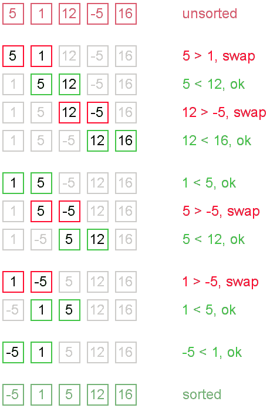

# 冒泡排序 Java 示例

> 原文： [https://howtodoinjava.com/algorithm/bubble-sort-java-example/](https://howtodoinjava.com/algorithm/bubble-sort-java-example/)

**冒泡排序**是一种简单而缓慢的排序算法，它会反复浏览整个集合，比较每对相邻元素，并以错误的顺序交换它们。 在排序算法中，如果您观察元素以较高顺序（即较大的值）移动，它们就像水中的气泡，从底部到顶部（从数组的一侧/中间到另一侧）缓慢漂浮。

您可以想象在每一步上都有大气泡漂浮并停留在表面。 在该步骤中，当没有气泡移动时，排序停止。

## 冒泡排序算法

冒泡排序算法的基本思想可以描述为以下步骤：

1.  数据元素分为两部分：已排序部分和未排序部分。
2.  遍历未排序部分中的每个元素，并与相邻元素重新排列其位置，以将具有较高顺序的元素放在较高位置。 最后，顺序最高的元素将位于未排序部分的顶部，并移至已排序部分的底部。
3.  重复步骤 2，直到未排序的部分中没有剩余的元素。



冒泡排序算法


## 冒泡排序 Java 示例

```java
public class BubbleSortExample 
{
	public static void main(String[] args) 
	{
		// This is unsorted array
		Integer[] array = new Integer[] { 12, 13, 24, 10, 3, 6, 90, 70 };

		// Let's sort using bubble sort
		bubbleSort(array, 0, array.length);

		// Verify sorted array
		System.out.println(Arrays.toString(array));
	}

	@SuppressWarnings({ "rawtypes", "unchecked" })
	public static void bubbleSort(Object[] array, int fromIndex, int toIndex) 
	{
		Object d;
		for (int i = toIndex - 1; i > fromIndex; i--) 
		{
			boolean isSorted = true;
			for (int j = fromIndex; j < i; j++) 
			{
				//If elements in wrong order then swap them
				if (((Comparable) array[j]).compareTo(array[j + 1]) > 0) 
				{
					isSorted = false;
					d = array[j + 1];
					array[j + 1] = array[j];
					array[j] = d;
				}
			}
			//If no swapping then array is already sorted
			if (isSorted)
				break;
		}
	}
}

Output: [3, 6, 10, 12, 13, 24, 70, 90]
```

## 冒泡排序性能和复杂性

1.  冒泡排序属于` O(n^2)`排序算法，这使得排序大型数据量效率很低。
2.  冒泡排序既是[**稳定的**](https://en.wikipedia.org/wiki/Sorting_algorithm#Stability)，又是[**自适应**](https://en.wikipedia.org/wiki/Adaptive_sort)。
3.  对于几乎排序的数据，冒泡排序需要`O(n)`时间，但至少需要 2 次通过数据。
4.  如果输入通常是按排序顺序，但偶尔可能有一些乱序的元素几乎在适当的位置，则这是可行的。
5.  在大型集合的情况下，应避免冒泡排序。
6.  在逆序集合的情况下，效率不高。

学习愉快！