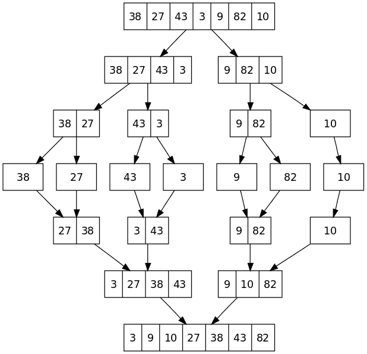

# 归并排序 Java 示例

> 原文： [https://howtodoinjava.com/algorithm/merge-sort-java-example/](https://howtodoinjava.com/algorithm/merge-sort-java-example/)

在计算机科学中，**归并排序**（也通常称为拼写归并排序）是一种基于`O(n log n)`比较的排序算法。 大多数实现都会产生[稳定排序](https://en.wikipedia.org/wiki/Sorting_algorithm#Stability)，这意味着该实现会在排序后的输出中保留相等元素的输入顺序。 **归并排序是一种分而治之的算法。** 分而治之算法将原始数据分为较小的数据集以解决该问题。

在归并排序过程中，集合中的对象分为两个集合。 要拆分集合，归并排序将采用集合的中间部分并将其拆分为左侧和右侧。 通过归并排序算法将生成的集合再次递归拆分，直到将其分解为每个集合中的单个元素为止。

分割每个集合后，归并排序算法开始组合通过上述过程获得的所有集合。 为了合并两个集合，归并排序从每个集合的开头开始。 它选择较小的对象，然后将该对象插入新集合中。 对于此集合，它现在通过一次比较每个集合中的一个元素，来选择下一个元素，并从两个集合中选择较小的元素。

此过程将创建一个已排序元素的集合（所有需要排序的元素的子集）。 对于在第一步中获得的所有可用集合，即对集合进行拆分，将以递归方式完成此过程。

将两个集合中的所有元素都插入新集合后，归并排序已成功对集合进行了排序。

为了避免创建太多集合，通常只创建一个新集合，而将新集合和现有集合视为不同的集合。

为了更好地理解，请看下面遵循上述方法的图表。



归并排序算法


从概念上讲，归并排序以递归方式进行如下工作：

1.  将未排序的列表分为两个大小约为一半的子列表
2.  对两个子列表中的每个列表进行排序
3.  将两个已排序的子列表合并回一个已排序的列表

## 归并排序示例

在下面的示例中，我们以表达方式实现了归并排序算法，以使其更易于理解。 在给定**归并排序代码**的情况下，遵循下面每个步骤/语句上方写的注释。

```java
import java.util.*;

public class MergerSort 
{
	public static void main(String[] args) 
	{
		//Unsorted array
		Integer[] a = { 2, 6, 3, 5, 1 };

		//Call merge sort
		mergeSort(a);

		//Check the output which is sorted array
		System.out.println(Arrays.toString(a));
	}

	@SuppressWarnings("rawtypes") 
	public static Comparable[] mergeSort(Comparable[] list) 
	{
		//If list is empty; no need to do anything
        if (list.length <= 1) {
            return list;
        }

        //Split the array in half in two parts
        Comparable[] first = new Comparable[list.length / 2];
        Comparable[] second = new Comparable[list.length - first.length];
        System.arraycopy(list, 0, first, 0, first.length);
        System.arraycopy(list, first.length, second, 0, second.length);

        //Sort each half recursively
        mergeSort(first);
        mergeSort(second);

        //Merge both halves together, overwriting to original array
        merge(first, second, list);
        return list;
    }

	@SuppressWarnings({ "rawtypes", "unchecked" }) 
    private static void merge(Comparable[] first, Comparable[] second, Comparable[] result) 
	{
        //Index Position in first array - starting with first element
        int iFirst = 0;

        //Index Position in second array - starting with first element
        int iSecond = 0;

        //Index Position in merged array - starting with first position
        int iMerged = 0;

        //Compare elements at iFirst and iSecond, 
        //and move smaller element at iMerged
        while (iFirst < first.length && iSecond < second.length) 
        {
            if (first[iFirst].compareTo(second[iSecond]) < 0) 
            {
                result[iMerged] = first[iFirst];
                iFirst++;
            } 
            else 
            {
                result[iMerged] = second[iSecond];
                iSecond++;
            }
            iMerged++;
        }
        //copy remaining elements from both halves - each half will have already sorted elements
        System.arraycopy(first, iFirst, result, iMerged, first.length - iFirst);
        System.arraycopy(second, iSecond, result, iMerged, second.length - iSecond);
    }
}

```

```java
Output:

Input Array :  [ 2, 6, 3, 5, 1, 1, 8 ]
Output Array : [ 1, 1, 2, 3, 5, 6, 8 ]

Input Array :  [ 12, 16, 333, 50, 1000, 5, 897, 1, 3, 66, 13 ]
Output Array : [ 1, 3, 5, 12, 13, 16, 50, 66, 333, 897, 1000 ]
```

## 何时使用归并排序

1.  当数据结构不支持随机访问时使用归并排序，因为它可以与纯顺序访问（正向迭代器，而不是随机访问迭代器）一起使用。 它也广泛用于外部排序，与顺序访问相比，随机访问的费用非常高。

    例如，当对不适合内存的文件进行排序时，您可以将其分成适合内存的块，单独使用对它们进行排序，将每个数据写入文件，然后合并对生成的文件进行排序。

2.  另外，当您需要稳定排序时，可以使用归并排序。 这是归并排序的非常重要的功能。
3.  当处理链接列表时，归并排序更快。 这是因为合并列表时可以轻松更改指针。 它只需要遍历列表一次（O（n））。
4.  如果发生大量并行化，则归并排序并行化要比其他排序算法简单。

这就是关于归并排序 Java 教程的全部内容。 在下面的评论部分中将您的问题/疑问交给我。

**祝您学习愉快！**