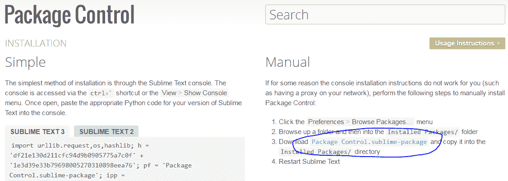
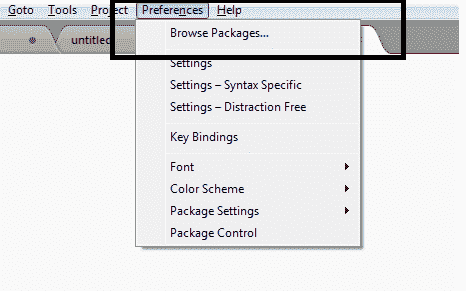
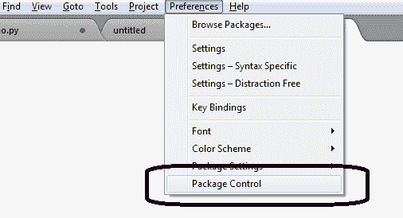
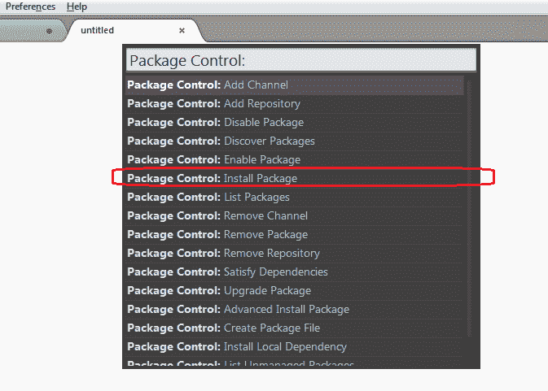
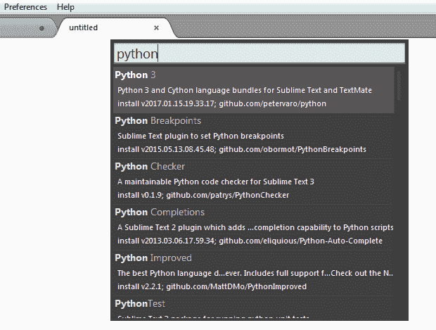
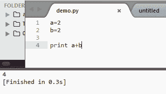

# 如何在 Sublime 编辑器中安装 Python 包

> 原文： [https://howtodoinjava.com/python/install-python-sublime-editor/](https://howtodoinjava.com/python/install-python-sublime-editor/)

了解**在 Sublime 编辑器**中安装 python 包的功能，例如自动完成功能，以及在 Sublime 编辑器本身中运行 build。

```java
Table of Contents

Install Sublime Package Control
Install Package Python 3
Verify Python Autocomplete and Build
```

## 安装 Sublime 包控制

首先下载用于 sublime 编辑器的包控件。

1.  Go to URL: [https://packagecontrol.io/installation#st3](https://packagecontrol.io/installation#st3)

    

    Sublime 封装控件

    

2.  Now note down the location of folder where packages are installed in sublime editor. You can find the location by clicking on **Preferences > Browse Packages**.

    

    浏览包

    

3.  **单击“ Package Control.sublime-package”链接，保存从包控制网站下载的文件**，并将其**放在第二步**的文件夹中。
4.  现在，**通过关闭升华编辑器**来重新启动，然后再次将其打开。
5.  To verify the package control is installed correctly, click on **Preferences > Package Control** menu item. It should open up the package control window.

    

    包控制菜单

    

## 安装包 Python 3

1.  Now to install any package support, including Python package, go to **Preferences > Package Control** and choose **Install Package**.

    

    安装包窗口

    

2.  In opened window, **type ‘python’ to filter the list of packages** related to python only.

    

    选择 Python 包以安装

    

等待几秒钟，Python 包将安装到编辑器中。

## 验证 Python 自动完成和构建

要验证 python 支持，再次**重新启动 IDE** 。 创建一个名称为`demo.py`的文件。 键入一些简单的命令，例如`print`。 **应该打开自动完成**窗口。

现在，键入简单的 hello world 代码，然后在 keyborad 中输入`CTRL + B`。 它将在底部窗格中打开输出输出窗口，并且**将在`demo.py`文件中显示命令**的构建输出。



Sublime Build Output


现在，您可以使用 sublime 编辑器创建和构建 python 程序了。

学习愉快！