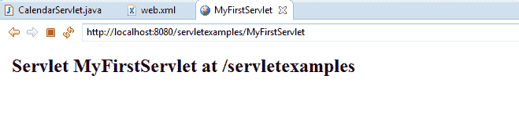
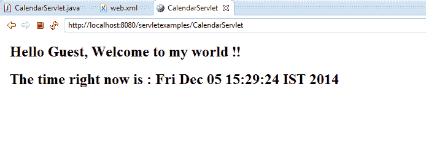

# 完整的 Java Servlet 教程

> 原文： [https://howtodoinjava.com/servlets/complete-java-servlets-tutorial/](https://howtodoinjava.com/servlets/complete-java-servlets-tutorial/)

Servlet 是符合 Java Servlet API 的 Java 类，该 Java Servlet API 允许 Java 类响应请求。 尽管 Servlet 可以响应任何类型的请求，但最常见的是将其编写为响应基于 Web 的请求。 必须将 servlet 部署到 Java servlet 容器中才能使用。 尽管许多开发人员都使用诸如 [**Java Server Pages（JSP）**](https://en.wikipedia.org/wiki/JavaServer_Pages "jsp")和 [**Java Server Faces（JSF）**](https://en.wikipedia.org/wiki/JavaServer_Faces "jsf")之类的 servlet 框架，但这两种技术通过 servlet 容器将页面编译为后台的 Java servlet。 也就是说，Java servlet 技术的**基础知识**对于任何 Java Web 开发人员都可能非常有用。

在本教程中，我们将涵盖以下主题，以全面了解 Java Servlet 技术。

```java
Table of Contents

Writing your first Servlet
Servlet Life Cycle Methods
Develop Servlet with @WebServlet Annotation
Packaging and Deploying Servlet into Tomcat Server
Writing dynamic content in Servlet response
Handling Servlet Request and Response
Listening for Servlet Container Events
Passing Servlet Initialization Parameters
Adding Servlet Filters for Specific URL Requests
Downloading a binary file using Servlet
Forward request to another servlet using RequestDispatcher.forward()
Redirect request to another servlet using HttpServletResponse.sendRedirect()
Writing and Reading Cookie using Servlets
```

让我们开始逐步了解 servlet。

## 编写您的第一个 Servlet

我们的第一个 servlet 是非常简单的 servlet，它具有很少的代码，因此您只能专注于重要的事情。

```java
package com.howtodoinjava.servlets;

import java.io.IOException;
import java.io.PrintWriter;

import javax.servlet.ServletException;
import javax.servlet.http.HttpServlet;
import javax.servlet.http.HttpServletRequest;
import javax.servlet.http.HttpServletResponse;

public class MyFirstServlet extends HttpServlet {

	private static final long serialVersionUID = -1915463532411657451L;

	@Override
	protected void doGet(HttpServletRequest request,
			HttpServletResponse response) throws ServletException, IOException 
	{
		response.setContentType("text/html;charset=UTF-8");
		PrintWriter out = response.getWriter();
		try {
			// Write some content
			out.println("<html>");
			out.println("<head>");
			out.println("<title>MyFirstServlet</title>");
			out.println("</head>");
			out.println("<body>");
			out.println("<h2>Servlet MyFirstServlet at " + request.getContextPath() + "</h2>");
			out.println("</body>");
			out.println("</html>");
		} finally {
			out.close();
		}
	}

	@Override
	protected void doPost(HttpServletRequest request,
			HttpServletResponse response) throws ServletException, IOException {
		//Do some other work
	}

	@Override
	public String getServletInfo() {
		return "MyFirstServlet";
	}
}

```

**要在 Web 容器上方注册上述 Servlet，您将为您的应用创建一个入口`web.xml`文件。**

```java
<?xml version="1.0"?>
<web-app 	xmlns="http://xmlns.jcp.org/xml/ns/javaee" 
			xmlns:xsi="http://www.w3.org/2001/XMLSchema-instance"
			xsi:schemaLocation="http://xmlns.jcp.org/xml/ns/javaee 
			http://xmlns.jcp.org/xml/ns/javaee/web-app_3_0.xsd"
			version="3.0">

	<welcome-file-list>
		<welcome-file>/MyFirstServlet</welcome-file>
	</welcome-file-list>

	<servlet>
		<servlet-name>MyFirstServlet</servlet-name>
		<servlet-class>com.howtodoinjava.servlets.MyFirstServlet</servlet-class>
	</servlet>
	<servlet-mapping>
		<servlet-name>MyFirstServlet</servlet-name>
		<url-pattern>/MyFirstServlet</url-pattern>
	</servlet-mapping>

</web-app>

```

Servlet 上面没有做一些重要的事情，您可能需要学习。

1.  `MyFirstServlet`扩展了`HttpServlet`。 这是强制性的，因为所有 servlet 必须是扩展`javax.servlet.GenericServlet`的通用 servlet 或扩展`javax.servlet.http.HttpServlet`的 HTTP servlet。
2.  覆盖`doGet()`和`doPost()`方法。 这些方法在`HttpServlet`类中定义。 每当 GET 或 POST 请求到来时，都会将其映射到其相应的方法，例如，如果您对此 Servlet 发出 HTTP GET 请求，然后调用`doGet()`方法。   
3.  还有一些其他有用的方法，您可以覆盖它们以在运行时控制应用，例如`getServletInfo()`。
4.  `HttpServletRequest`和`HttpServletResponse`是所有`doXXX()`方法的默认参数。 我们将在后面的部分中了解有关这些对象的更多信息。

这就是您应该知道的简单 servlet 的全部内容。

## Servlet 生命周期方法

无论何时在您的应用中，都会加载并使用一个 servlet。 在该 Servlet 的初始化和销毁​​过程中发生了一系列事件。 这些被称为 servlet 的**生命周期事件（或方法）**。 让我们详细了解它们。

三种方法对于 Servlet 的生命周期至关重要。 它们是`init()`，`service()`和`destroy()`。 它们由每个 servlet 实现，并在运行时在特定时间调用。

1）在 Servlet 生命周期的初始化阶段， **Web 容器通过调用`init()`方法**并传递实现`javax.servlet.ServletConfig`接口的对象来初始化 Servlet 实例。 此配置对象允许 Servlet 访问 Web 应用的`web.xml`文件中定义的名称 - 值初始化参数。 它**在该 Servlet 实例**的生存期内仅被调用一次。

初始化方法的定义如下所示：

```java
public void  init() throws ServletException {
	//custom initialization code
}

```

2）初始化后，Servlet 实例可以为客户端请求提供服务。 **Web 容器针对每个请求**调用 servlet 的`service()`方法。 `service()`方法确定发出的请求的类型，并将其分派给适当的方法以处理该请求。 Servlet 的开发人员必须提供这些方法的实现。 如果对不是由 Servlet 实现的方法提出了请求，则将调用父类的方法，通常会导致将错误返回给请求者。

几乎在所有情况下都无需覆盖此方法。

```java
protected void service(HttpServletRequest req, HttpServletResponse resp)
	throws ServletException, IOException
{
String method = req.getMethod();

if (method.equals(METHOD_GET)) {
	long lastModified = getLastModified(req);
	if (lastModified == -1) {
	// servlet doesn't support if-modified-since, no reason
	// to go through further expensive logic
	doGet(req, resp);
	} else {
	long ifModifiedSince = req.getDateHeader(HEADER_IFMODSINCE);
	if (ifModifiedSince < (lastModified / 1000 * 1000)) {
		// If the servlet mod time is later, call doGet()
				// Round down to the nearest second for a proper compare
				// A ifModifiedSince of -1 will always be less
		maybeSetLastModified(resp, lastModified);
		doGet(req, resp);
	} else {
		resp.setStatus(HttpServletResponse.SC_NOT_MODIFIED);
	}
	}

} else if (method.equals(METHOD_HEAD)) {
	long lastModified = getLastModified(req);
	maybeSetLastModified(resp, lastModified);
	doHead(req, resp);

} else if (method.equals(METHOD_POST)) {
	doPost(req, resp);

} else if (method.equals(METHOD_PUT)) {
	doPut(req, resp);	

} else if (method.equals(METHOD_DELETE)) {
	doDelete(req, resp);

} else if (method.equals(METHOD_OPTIONS)) {
	doOptions(req,resp);

} else if (method.equals(METHOD_TRACE)) {
	doTrace(req,resp);

} else {
	//
	// Note that this means NO servlet supports whatever
	// method was requested, anywhere on this server.
	//

	String errMsg = lStrings.getString("http.method_not_implemented");
	Object[] errArgs = new Object[1];
	errArgs[0] = method;
	errMsg = MessageFormat.format(errMsg, errArgs);

	resp.sendError(HttpServletResponse.SC_NOT_IMPLEMENTED, errMsg);
}
}

```

3）最后， **Web 容器调用`destroy()`方法，该方法使 Servlet 退出服务**。 如果要在 Servlet 超出范围之前关闭或销毁某些文件系统或网络资源，则应调用此方法。 像`init()`一样，`destroy()`方法在 Servlet 的生命周期中仅被调用一次。

```java
public void destroy() {
	//
}

```

通常，在大多数情况下，您不需要在 servlet 中覆盖它们中的任何一个。

> **阅读更多：** [Web 服务器如何工作？](//howtodoinjava.com/for-fun-only/a-birds-eye-view-on-how-web-servers-work/ "A birds-eye view on “how web servers work?”")

## 使用`@WebServlet`注释开发 Servlet

如果您不太喜欢 xml 配置，而是特别喜欢注释，那么 Servlets API 也可以。 您可以使用[`@WebServlet`](https://docs.oracle.com/javaee/6/api/javax/servlet/annotation/WebServlet.html "WebServlet")注释，如下例所示，然后您无需在`web.xml`中进行任何输入。 **容器将自动将您的 servlet 注册到运行时，并像往常一样处理它**。

```java
package com.howtodoinjava.servlets;

import java.io.IOException;
import java.io.PrintWriter;

import javax.servlet.ServletException;
import javax.servlet.annotation.WebServlet;
import javax.servlet.http.HttpServlet;
import javax.servlet.http.HttpServletRequest;
import javax.servlet.http.HttpServletResponse;

@WebServlet(name = "MyFirstServlet", urlPatterns = {"/MyFirstServlet"})
public class MyFirstServlet extends HttpServlet {

	private static final long serialVersionUID = -1915463532411657451L;

	@Override
	protected void doGet(HttpServletRequest request,
			HttpServletResponse response) throws ServletException, IOException 
	{
		//Do some work
	}

	@Override
	protected void doPost(HttpServletRequest request,
			HttpServletResponse response) throws ServletException, IOException {
		//Do some other work
	}
}

```

## 将 Servlet 打包和部署到 Tomcat 服务器

如果您使用的是任何 IDE（例如 eclipse），则打包和部署应用只是一个步骤。 `Right click on project > Run As > Run As Server`。 如果尚未配置服务器，则准备好进行滚动。

如果您不使用任何 IDE，那么您需要做一些额外的工作，例如从命令提示符下编译应用，使用 ANT 创建 WAR 文件等。但是我非常相信当今的每个人都使用一些 IDE 进行开发，因此我将 不要在本节中浪费更多时间。

当您在 tomcat 中部署我们的第一个 servlet 并在浏览器中访问 URL“`http://localhost:8080/servletexamples/MyFirstServlet`”时，您将获得以下响应。



## 在 Servlet 响应中编写动态内容

Java servlet 之所以如此有用的原因之一是因为它们允许将动态内容显示在网页上。 内容可以取自服务器本身，数据库，另一个网站或许多其他可从 Web 访问的资源。 Servlet 不是静态网页。 他们充满活力，可以说是他们最大的优势。

让我们以一个 servlet 为例，该 servlet 负责向用户显示当前日期和时间，以及其名称和一些自定义消息。 让我们为其编写代码。

```java
package com.howtodoinjava.servlets;

import java.io.IOException;
import java.io.PrintWriter;
import java.util.Date;
import java.util.HashMap;
import java.util.Map;

import javax.servlet.ServletException;
import javax.servlet.annotation.WebServlet;
import javax.servlet.http.HttpServlet;
import javax.servlet.http.HttpServletRequest;
import javax.servlet.http.HttpServletResponse;

@WebServlet(name = "CalendarServlet", urlPatterns = {"/CalendarServlet"})
public class CalendarServlet extends HttpServlet {

	private static final long serialVersionUID = -1915463532411657451L;

	@Override
	protected void doGet(HttpServletRequest request,
			HttpServletResponse response) throws ServletException, IOException 
	{

		Map<String,String> data = getData();

		response.setContentType("text/html;charset=UTF-8");
		PrintWriter out = response.getWriter();
		try {
			// Write some content
			out.println("<html>");
			out.println("<head>");
			out.println("<title>CalendarServlet</title>");
			out.println("</head>");
			out.println("<body>");
			out.println("<h2>Hello " + data.get("username") + ", " + data.get("message") + "</h2>");
			out.println("<h2>The time right now is : " + new Date() + "</h2>");
			out.println("</body>");
			out.println("</html>");
		} finally {
			out.close();
		}
	}

	//This method will access some external system as database to get user name, and his personalized message
	private Map<String, String> getData() 
	{
		Map<String, String> data = new HashMap<String, String>();
		data.put("username", "Guest");
		data.put("message",  "Welcome to my world !!");
		return data;
	}
}

```

当您在 tomcat 中的 servlet 上方运行并在浏览器中访问 URL“`http://localhost:8080/servletexamples/CalendarServlet`”时，将得到以下响应。



## 处理 Servlet 请求和响应

Servlet 使创建符合请求和响应生命周期的 Web 应用变得容易。 它们具有提供 HTTP 响应的能力，并且还可以在同一代码体内处理业务逻辑。 处理业务逻辑的能力使 servlet 比标准 HTML 代码强大得多。

在实际的应用中，HTML Web 表单包含发送到 Servlet 的参数。 然后，该 Servlet 以某种方式处理这些参数，并发布客户端可以看到的响应。 对于`HttpServlet`对象，客户端是 Web 浏览器，响应是 Web 页面。 `<form>`动作属性指出应使用该属性来处理表单中包含的值。

要获取请求参数，请调用`HttpServletRequest`对象的`getParameter()`方法，并传递您要获取的输入参数的 ID。

```java
String value1 = req.getParameter("param1");
String value1 = req.getParameter("param2");

```

一旦获得值，就可以根据需要对其进行处理。 然后，如上节所述，为客户准备响应。 使用`HttpServletResponse`对象将该响应发送回客户端。

请求和响应处理的基本用法可以这样完成：

```java
@Override
protected void doGet(HttpServletRequest request,
		HttpServletResponse response) throws ServletException, IOException 
{

	response.setContentType("text/html;charset=UTF-8");
	PrintWriter out = response.getWriter();

	String username = request.getParameter("username");
	String password = request.getParameter("password");

	boolean success = validateUser(username, password);

	try {
		// Write some content
		out.println("<html>");
		out.println("<head>");
		out.println("<title>LoginServlet</title>");
		out.println("</head>");
		out.println("<body>");

		if(success) {
			out.println("<h2>Welcome Friend</h2>");
		}else{
			out.println("<h2>Validate your self again.</h2>");
		}

		out.println("</body>");
		out.println("</html>");
	} finally {
		out.close();
	}
}

```

为了发送内容，您将必须使用从`HttpServletResponse`获得的`PrintWriter`对象。 写入其中的任何内容都将写入输出流，并且数据将发送回客户端。

## 监听 Servlet 容器事件

有时了解某些事件在应用服务器容器中何时发生很有用。 此概念在许多不同的情况下都可能有用，但是最常用于启动时初始化应用或关闭后清除应用。 Servlet 监听器可以向应用注册，以指示何时启动或关闭它。 因此，通过监听此类事件，servlet 可以有机会在它们发生时执行某些操作。

要创建一个基于容器事件执行操作的监听器，必须开发一个实现`ServletContextListener`接口的类。 需要实现的方法是`contextInitialized()`和`contextDestroyed()`。 这两种方法都接受`ServletContextEvent`作为参数，并且分别在每次初始化或关闭 servlet 容器时自动调用它们。

若要向容器注册监听器，可以使用以下技术之一：

1）使用`@WebListener`注解。

2）在`web.xml`应用部署描述符中注册监听器。

3）使用在`ServletContext`上定义的`addListener()`方法。

请注意，`ServletContextListener`不是 servlet API 中的唯一列表器。 还有更多例如：

*   `javax.servlet.ServletRequestListener`
*   `javax.servlet.ServletRequestAttrbiteListener`
*   `javax.servlet.ServletContextListener`
*   `javax.servlet.ServletContextAttributeListener`
*   `javax.servlet.HttpSessionListener`
*   `javax.servlet.HttpSessionAttributeListener`

可以由您的列表器类根据您想听所有事件的选择来实现它们； 例如，每当创建或销毁新的用户会话时，都会通知`HttpSessionListener`。

## 传递 Servlet 初始化参数

当今大多数应用都需要设置一些配置参数，您可以在应用/控制器启动时将其传递给他们。 Servlet 还可以接收初始化参数，在为第一个请求提供服务之前，它们可以用来完全构造它们。

显然，您可以在 servlet 本身中对配置值进行硬编码，但是更改其中的任何一个将需要您重新重新编译整个应用，而且没人愿意这样做。

```java
<web-app>
    <servlet>
        <servlet-name>SimpleServlet</servlet-name>
        <servlet-class>com.howtodoinjava.servlets.SimpleServlet</servlet-class>

		<!-- Servlet init param -->
        <init-param>
            <param-name>name</param-name>
            <param-value>value</param-value>
        </init-param>

    </servlet>

</web-app>

```

设置后，可以通过调用`getServletConfig().getInitializationParameter()`并传递参数名称在代码内使用该参数，如以下代码行所示：

```java
String value = getServletConfig().getInitParameter("name");

```

## 为特定的 URL 请求添加 Servlet 过滤器

Web 过滤器对于预处理请求和访问给定 URL 时调用某些功能很有用。 与其直接调用在给定 URL 上存在的 servlet，否则将在 servlet 之前调用任何包含相同 URL 模式的过滤器。 这在许多情况下可能是有用的，这对于执行日志记录，认证或在没有用户交互的情况下在后台进行的其他服务而言可能是最有用的。

过滤器必须实现`javax.servlet.Filter`接口。 此接口中包含的方法包括`init()`，`destroy()`和`doFilter()`。 容器调用`init()`和`destroy()`方法。 `doFilter()`方法用于实现过滤器类的任务。 如果要链接过滤器，或者给定 URL 模式存在多个过滤器，则将按照在`web.xml`部署描述符中对其进行配置的顺序来调用它们。

要将`web.xml`文件配置为包含过滤器，请使用`<filter>`和`<filter-mapping>` XML 元素及其关联的子元素标签。

```java
<filter>
    <filter-name>LoggingFilter</filter-name>
    <filter-class>LoggingFilter</filter-class>
</filter>
<filter-mapping>
    <filter-name>LogingFilter</filter-name>
    <url-pattern>/*</url-pattern>
</filter-mapping>

```

如果要使用注释为特定的 servlet 配置过滤器，则可以使用`@WebFilter`注释。

## 使用 Servlet 下载二进制文件

对于几乎所有 Web 应用来说，下载文件都是一项基本任务。 要下载文件，servlet 必须提供与要下载的文件相匹配的相同类型的响应。 它还必须在响应标头中指出要包含附件，如下所示。

```java
String mimeType = context.getMimeType( fileToDownload );
response.setContentType( mimeType != null ? mimeType : "text/plain" );
response.setHeader( "Content-Disposition", "attachment; filename=\"" + fileToDownload + "\"" );

```

您可以通过调用`ServletContext.getResourceAsStream()`方法并传递文件路径来获取对要下载（存储在文件系统中）文件的引用。 这将返回一个`InputStream`对象，该对象可用于读取文件的内容。 然后创建一个字节缓冲区，该缓冲区将在读取文件时用于从文件中获取数据块。 最后的实际任务是读取文件内容并将其复制到输出流。 这是使用`while`循环完成的，该循环将继续从`InputStream`读取，直到处理完所有内容为止。 使用循环将数据块读入并写入输出流。 之后，将调用`ServletOutputStream`对象的`flush`方法以清除内容并释放资源。

让我们看一下示例代码

```java
private void downloadFile(HttpServletRequest request, HttpServletResponse response, String fileToDownload) throws IOException
	{
		final int BYTES = 1024;
		int length = 0;

		ServletOutputStream outStream = response.getOutputStream();
		ServletContext context = getServletConfig().getServletContext();

		String mimeType = context.getMimeType( fileToDownload );
		response.setContentType( mimeType != null ? mimeType : "text/plain" );
		response.setHeader( "Content-Disposition", "attachment; filename=\"" + fileToDownload + "\"" );

		InputStream in = context.getResourceAsStream("/" + fileToDownload);

		byte[] bbuf = new byte[BYTES];

		while ((in != null) && ((length = in.read(bbuf)) != -1)) {
			outStream.write(bbuf, 0, length);
		}

		outStream.flush();
		outStream.close();
	}

```

## 使用`RequestDispatcher.forward()`将请求转发到另一个 servlet

有时，您的应用要求 servlet 应该将请求移交给其他 servlet，以完成需要完成的任务。 此外，应在不将客户端重定向到另一个 URL 的情况下移交请求，即浏览器中的 URL 不应更改。

这样做的功能直接内置在`ServletContext`中，因此一旦获得对`ServletContext`的引用，就可以简单地调用`getRequestDispatcher()`方法来获取一个`RequestDispatcher`对象，该对象可用于分派请求。 调用`getRequestDispatcher()`方法时，传递一个字符串，其中包含要将您的请求传递到的 servlet 的名称。 获得`RequestDispatcher`对象后，通过将`HttpServletRequest`和`HttpServletResponse`对象传递给它来调用其前向方法。 转发方法执行移交请求的任务。

```java
RequestDispatcher rd = servletContext.getRequestDispatcher("/NextServlet");
rd.forward(request, response);

```

## 使用`HttpServletResponse.sendRedirect()`将请求重定向到另一个 servlet

尽管在某些情况下，您不希望像上一节中所看到的那样通知用户 servlet 重定向已发生，但是在某些情况下，我们实际上希望发生这种情况。 当您访问应用中的特定 URL 时，您想将浏览器重定向到另一个 URL。

为此，您将需要调用`HttpServletResponse`对象的`sendRedirect()`方法。

```java
httpServletResponse.sendRedirect("/anotherURL");

```

与 servlet 链接相反，这种简单的重定向不会将`HttpRequest`对象传递到目标地址。

## 使用 Servlet 编写和读取 Cookie

许多应用都希望将用户浏览历史记录的当前状态存储在客户端计算机中，以便当用户再次返回到应用时，他从离开的地方开始。 通常为此要求使用 cookie。 您可以将 Cookie 视为存储在客户计算机上的基于键值对的数据。 当在浏览器中访问应用时，应用将能够读取或写入这些值。

要创建 cookie，只需实例化一个新的`javax.servlet.http.Cookie`对象并为其分配名称和值。 一旦实例化了 cookie，就可以设置将有助于配置 cookie 的属性。 在此食谱的示例中，调用了 cookie 的`setMaxAge()`和`setHttpOnly()`方法，设置了 cookie 的生存时间，并确保防止客户端脚本编写。

从 Servlet 3.0 API 开始，将 cookie 标记为仅 HTTP 的功能已变得可用。 这样可以保护 cookie 免受客户端脚本攻击，从而使 cookie 更加安全。

```java
Cookie cookie = new Cookie("sessionId","123456789");
cookie.setHttpOnly(true);
cookie.setMaxAge(-30);
response.addCookie(cookie);

```

这里的响应是传递给`doXXX()`方法的`HttpServletResponse`的实例。

要回读服务器父项上的 cookie 信息，请使用以下代码：

```java
Cookie[] cookies = request.getCookies();
for(Cookie cookie : cookies)
{
	//cookie.getName();
	//cookie.getValue()
}

```

以上就是有关 Servlet 技术的本教程。 随意删除评论/反馈。

**祝您学习愉快！**