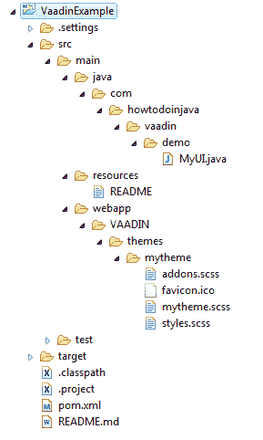
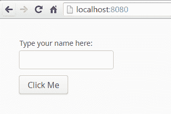
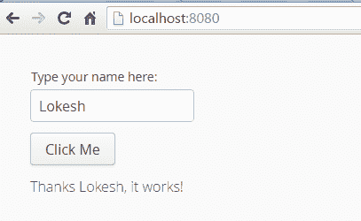

# 我用 Maven 呼叫 Hello World Web 应用

> 原文： [https://howtodoinjava.com/vaadin/hello-world-web-application-maven/](https://howtodoinjava.com/vaadin/hello-world-web-application-maven/)

在此示例中，我们将学习使用 maven 创建 **vaadin hello world 应用**，然后在内置码头服务器中运行部署该应用。

## 使用 Maven 原型创建 vaadin 项目

在工作区中使用下面的 maven 命令创建最简单的 vaadin Web 应用。

```java
$ mvn archetype:generate 
	-DarchetypeGroupId=com.vaadin 
	-DarchetypeArtifactId=vaadin-archetype-application 
	-DarchetypeVersion=LATEST 
	-DgroupId=com.howtodoinjava.vaadin.demo 
	-DartifactId=VaadinExample 
	-Dversion=1.0 
	-Dpackaging=war

```

请根据需要更新`-DgroupId`和`-DartifactId`。

## 生成的项目结构

现在，将生成的项目作为现有的 maven 项目导入到您的 IDE（在我的情况下为 eclipse）中。



Vaadin Hello World Application Project Structure


生成的项目包含任何 Maven Web 应用的标准文件夹结构。

## 生成的文件

连同文件夹结构一起，我们将获得这些生成的文件以及 **vaadin hello world 项目**。

#### pom.xml

```java
<?xml version="1.0" encoding="UTF-8"?>
<project xmlns="http://maven.apache.org/POM/4.0.0" xmlns:xsi="http://www.w3.org/2001/XMLSchema-instance"
	xsi:schemaLocation="http://maven.apache.org/POM/4.0.0 http://maven.apache.org/xsd/maven-4.0.0.xsd;
	<modelVersion>4.0.0</modelVersion>

	<groupId>com.howtodoinjava.vaadin.demo</groupId>
	<artifactId>VaadinExample</artifactId>
	<packaging>war</packaging>
	<version>1.0</version>
	<name>VaadinExample</name>

	<prerequisites>
		<maven>3</maven>
	</prerequisites>

	<properties>
		<vaadin.version>7.7.0</vaadin.version>
		<vaadin.plugin.version>7.7.0</vaadin.plugin.version>
		<jetty.plugin.version>9.3.9.v20160517</jetty.plugin.version>
		<project.build.sourceEncoding>UTF-8</project.build.sourceEncoding>
		<maven.compiler.source>1.8</maven.compiler.source>
		<maven.compiler.target>1.8</maven.compiler.target>
		<!-- If there are no local customisations, this can also be "fetch" or "cdn" -->
		<vaadin.widgetset.mode>local</vaadin.widgetset.mode>
	</properties>

	<repositories>
		<repository>
			<id>vaadin-addons</id>
			<url>http://maven.vaadin.com/vaadin-addons</url>
		</repository>
		<repository>
			<id>vaadin-snapshots</id>
			<url>https://oss.sonatype.org/content/repositories/vaadin-snapshots/</url>
			<releases>
				<enabled>false</enabled>
			</releases>
			<snapshots>
				<enabled>true</enabled>
			</snapshots>
		</repository>
	</repositories>

	<dependencyManagement>
		<dependencies>
			<dependency>
				<groupId>com.vaadin</groupId>
				<artifactId>vaadin-bom</artifactId>
				<version>${vaadin.version}</version>
				<type>pom</type>
				<scope>import</scope>
			</dependency>
		</dependencies>
	</dependencyManagement>

	<dependencies>
		<dependency>
			<groupId>javax.servlet</groupId>
			<artifactId>javax.servlet-api</artifactId>
			<version>3.0.1</version>
			<scope>provided</scope>
		</dependency>
		<dependency>
			<groupId>com.vaadin</groupId>
			<artifactId>vaadin-server</artifactId>
		</dependency>
		<dependency>
			<groupId>com.vaadin</groupId>
			<artifactId>vaadin-push</artifactId>
		</dependency>
		<dependency>
			<groupId>com.vaadin</groupId>
			<artifactId>vaadin-client-compiled</artifactId>
		</dependency>
		<dependency>
			<groupId>com.vaadin</groupId>
			<artifactId>vaadin-themes</artifactId>
		</dependency>
	</dependencies>

	<build>
		<plugins>
			<plugin>
				<groupId>org.apache.maven.plugins</groupId>
				<artifactId>maven-war-plugin</artifactId>
				<version>2.6</version>
				<configuration>
					<failOnMissingWebXml>false</failOnMissingWebXml>
					<!-- Exclude an unnecessary file generated by the GWT compiler. -->
					<packagingExcludes>WEB-INF/classes/VAADIN/widgetsets/WEB-INF/**</packagingExcludes>
				</configuration>
			</plugin>
			<plugin>
				<groupId>com.vaadin</groupId>
				<artifactId>vaadin-maven-plugin</artifactId>
				<version>${vaadin.plugin.version}</version>
				<executions>
					<execution>
						<goals>
							<goal>update-theme</goal>
							<goal>update-widgetset</goal>
							<goal>compile</goal>
							<!-- Comment out compile-theme goal to use on-the-fly theme compilation -->
							<goal>compile-theme</goal>
						</goals>
					</execution>
				</executions>
			</plugin>
			<plugin>
				<groupId>org.apache.maven.plugins</groupId>
				<artifactId>maven-clean-plugin</artifactId>
				<version>3.0.0</version>
				<!-- Clean up also any pre-compiled themes -->
				<configuration>
					<filesets>
						<fileset>
							<directory>src/main/webapp/VAADIN/themes</directory>
							<includes>
								<include>**/styles.css</include>
								<include>**/styles.scss.cache</include>
							</includes>
						</fileset>
					</filesets>
				</configuration>
			</plugin>

			<!-- The Jetty plugin allows us to easily test the development build by
				running jetty:run on the command line. -->
			<plugin>
				<groupId>org.eclipse.jetty</groupId>
				<artifactId>jetty-maven-plugin</artifactId>
				<version>${jetty.plugin.version}</version>
				<configuration>
					<scanIntervalSeconds>2</scanIntervalSeconds>
				</configuration>
			</plugin>
		</plugins>
	</build>

	<profiles>
		<profile>
			<!-- Vaadin pre-release repositories -->
			<id>vaadin-prerelease</id>
			<activation>
				<activeByDefault>false</activeByDefault>
			</activation>

			<repositories>
				<repository>
					<id>vaadin-prereleases</id>
					<url>http://maven.vaadin.com/vaadin-prereleases</url>
				</repository>
			</repositories>
			<pluginRepositories>
				<pluginRepository>
					<id>vaadin-prereleases</id>
					<url>http://maven.vaadin.com/vaadin-prereleases</url>
				</pluginRepository>
			</pluginRepositories>
		</profile>
	</profiles>

</project>

```

#### MyUI.java

```java
package com.howtodoinjava.vaadin.demo;

import javax.servlet.annotation.WebServlet;

import com.vaadin.annotations.Theme;
import com.vaadin.annotations.VaadinServletConfiguration;
import com.vaadin.server.VaadinRequest;
import com.vaadin.server.VaadinServlet;
import com.vaadin.ui.Button;
import com.vaadin.ui.Label;
import com.vaadin.ui.TextField;
import com.vaadin.ui.UI;
import com.vaadin.ui.VerticalLayout;

/**
 * This UI is the application entry point. A UI may either represent a browser window 
 * (or tab) or some part of a html page where a Vaadin application is embedded.
 * <p>
 * The UI is initialized using {@link #init(VaadinRequest)}. This method is intended to be 
 * overridden to add component to the user interface and initialize non-component functionality.
 */
@Theme("mytheme")
public class MyUI extends UI {

    @Override
    protected void init(VaadinRequest vaadinRequest) {
        final VerticalLayout layout = new VerticalLayout();

        final TextField name = new TextField();
        name.setCaption("Type your name here:");

        Button button = new Button("Click Me");
        button.addClickListener( e -> {
            layout.addComponent(new Label("Thanks " + name.getValue() 
                    + ", it works!"));
        });

        layout.addComponents(name, button);
        layout.setMargin(true);
        layout.setSpacing(true);

        setContent(layout);
    }

    @WebServlet(urlPatterns = "/*", name = "MyUIServlet", asyncSupported = true)
    @VaadinServletConfiguration(ui = MyUI.class, productionMode = false)
    public static class MyUIServlet extends VaadinServlet {
    }
}

```

如果要使用`web.xml`文件，因为您的服务器不支持`servlet 3.0`规范，则可以在`web.xml`文件中使用此配置。

```java
<?xml version="1.0" encoding="UTF-8"?>
<web-app id="WebApp_ID" version="2.4"
	xmlns="http://java.sun.com/xml/ns/j2ee" xmlns:xsi="http://www.w3.org/2001/XMLSchema-instance"
	xsi:schemaLocation="http://java.sun.com/xml/ns/j2ee
     http://java.sun.com/xml/ns/j2ee/web-app_2_4.xsd">

	<servlet>
		<servlet-name>myservlet</servlet-name>
		<servlet-class>com.vaadin.server.VaadinServlet</servlet-class>
		<init-param>
			<param-name>UI</param-name>
			<param-value>com.howtodoinjava.vaadin.demo.MyUI</param-value>
		</init-param>
	</servlet>

	<servlet-mapping>
		<servlet-name>myservlet</servlet-name>
		<url-pattern>/*</url-pattern>
	</servlet-mapping>
</web-app>

```

如果您正在使用`web.xml`文件，请不要忘记删除`@WebServlet(urlPatterns = "/*", name = "MyUIServlet", asyncSupported = true)`。

## 生成生成的项目

现在该构建项目，以便它可以下载所有依赖项并将其包含在项目的运行时中。

```java
$ mvn clean install

```

上面的 maven 命令将下载依赖项（需要一些时间），并构建 war 文件`VaadinExample-1.0.war`。

## 运行并测试，我将呼叫 Hello World 应用

现在该运行该应用了。 在命令提示符下，运行以下命令以启动随附的码头服务器。

```java
$mvn jetty:run
```

这将启动内置的码头服务器，您可以通过`http://localhost:8080/`访问该应用。



Vaadin Hello World Screen


现在在文本框中填写您的姓名或任何字符串，然后单击按钮。 它将在按钮下方打印消息。



Vaadin Hello World Screen -2


[下载源码](//howtodoinjava.com/wp-content/downloads/VaadinExample.zip)

学习愉快！

资源：

[称为原型](https://vaadin.com/docs/-/part/framework/getting-started/getting-started-archetypes.html)
[称为 Maven 设置](https://vaadin.com/docs/-/part/framework/getting-started/getting-started-maven.html)