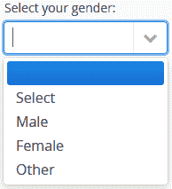
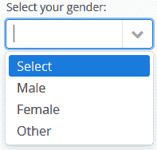
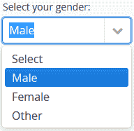
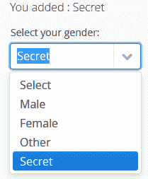

# 请参阅 ComboBox 示例

> 原文： [https://howtodoinjava.com/vaadin/vaadin-combobox-examples/](https://howtodoinjava.com/vaadin/vaadin-combobox-examples/)

在本教程中，我们将学习与 Vaadin ComboBox UI 组件一起使用，包括设置值，过滤，添加新值和事件处理。

```java
Table of Contents

Set ComboBox Values List
Disable Empty/Null Selection
Pre-selecting value
Enable/Disable Values Filtering
Editable Vaadin ComboBox
Add Custom CSS Style
Complete Example
```

## 设置组合框值列表

要将项目添加到 vaadin 组合框组件，请使用`ComboBox.addItem()`或`ComboBox.addItems()`方法。



Vaadin ComboBox Items


```java
ComboBox combobox = new ComboBox("Select your gender:");

//Add multiple items
combobox.addItems("Select", "Male", "Female", "Other");

layout.addComponent(combobox);

```

如果您想一次添加一项：

```java
ComboBox combobox = new ComboBox("Select your gender:");

//Add one item at a time
combobox.addItem("Select");
combobox.addItem("Male");
combobox.addItem("Female");
combobox.addItem("Other");

layout.addComponent(combobox);

```

同样，您可以使用其他数据结构来填充组合框项目。 例如。 我已经使用 e **num 类型来填充 vaadin 组合框项目**。

```java
enum Genders {
	MALE("Male"), FEMALE("Female"), OTHERS("Others");

	private String name;

	private Genders(String name) {
		this.name = name;
	}

	@Override
	public String toString() {
		return name;
	}
}

ComboBox combobox = new ComboBox("Select your gender:");

//Add enum values
combobox.addItems("Select", Genders.MALE, Genders.FEMALE, Genders.OTHERS);

layout.addComponent(combobox);

```

## 禁用空/空选择

您在第一个屏幕截图中注意到第一个选项为空。 如果要删除此空选项，请使用`combobox.setNullSelectionAllowed(false);`方法。



Empty Option Removed from Vaadin Combobox


```java
ComboBox combobox = new ComboBox("Select your gender:");
combobox.addItems("Select", "Male", "Female", "Other");

//Remove empty option
combobox.setNullSelectionAllowed(false);

layout.addComponent(combobox);

```

## 预选值

很多时候您想预选一些值，例如 如果您正在显示一个带有预先存储在数据库中的值的编辑表单。 在这种情况下，请使用`setValue()`方法。


Preselect value in vaadin combobox


```java
ComboBox combobox = new ComboBox("Select your gender:");
combobox.addItems("Select", "Male", "Female", "Other");

//Remove empty option
combobox.setNullSelectionAllowed(false);

//Pre-set some value
combobox.setValue("Male");

layout.addComponent(combobox);

```

## 启用/禁用值过滤

默认情况下，vaadin 组合框组件支持过滤，即您可以通过键入文本框来过滤值。 如果要控制启用/禁用此功能，请使用`combobox.setFilteringMode()`方法。



Filtering in vaadin combobox


共有 3 种过滤模式：

1.  #### FilteringMode.CONTAINS

    与包含组件文本字段部分中给出的字符串的任何项目匹配。

2.  #### FilteringMode.OFF

    它可以过滤掉并始终显示所有项目。

3.  #### FilteringMode.STARTSWITH

    仅匹配以给定字符串开头的项目。 这是 vaadin 7 中的默认模式。

```java
ComboBox combobox = new ComboBox("Select your gender:");
combobox.addItems("Select", "Male", "Female", "Other");

combobox.setNullSelectionAllowed(false);

//Add Filtering
combobox.setFilteringMode(FilteringMode.CONTAINS);

layout.addComponent(combobox);

```

## 可编辑我叫 ComboBox

在**可编辑组合框**中，您也可以从 UI 添加新项目。 要添加新项目，只需键入新项目标题，然后按 Enter。

添加一个`NewItemHandler`实例来处理新添加的项目。 例如。 添加后，我在组合框中选择它作为当前值。



Editable Combobox


```java
Label label = new Label();

ComboBox combobox = new ComboBox("Select your gender:");
combobox.addItems("Select", "Male", "Female", "Other");
combobox.setNullSelectionAllowed(false);

//Allow new Items
combobox.setNewItemsAllowed(true);
combobox.setImmediate(true);

combobox.setNewItemHandler(new NewItemHandler(){

	private static final long serialVersionUID = 1L;

	@Override
	public void addNewItem(String newItemCaption) {
		combobox.addItem(newItemCaption);
		combobox.setValue(newItemCaption);
		label.setValue("You added : " + newItemCaption);
	}
});

layout.addComponent(label);
layout.addComponent(combobox);

```

## 添加自定义 CSS 样式

*   整个组合框组件都包含在`v-filterselect`样式中。
*   输入字段为`v-filterselect-input`样式。
*   右端用于打开和关闭下拉结果列表的按钮为`v-filterselect-button`样式。
*   下拉结果列表具有整体`v-filterselect-suggestpopup`样式。
*   它包含`v-filterselect-suggestmenu`样式的建议列表。

修改以上 CSS 类以更改组合框的显示。

## 完整的例子

```java
package com.howtodoinjava.vaadin.demo;

import com.vaadin.annotations.Theme;
import com.vaadin.annotations.VaadinServletConfiguration;
import com.vaadin.server.VaadinRequest;
import com.vaadin.server.VaadinServlet;
import com.vaadin.shared.ui.combobox.FilteringMode;
import com.vaadin.ui.AbstractSelect.NewItemHandler;
import com.vaadin.ui.ComboBox;
import com.vaadin.ui.Label;
import com.vaadin.ui.UI;
import com.vaadin.ui.VerticalLayout;

@Theme("mytheme")
public class MyUI extends UI {

	private static final long serialVersionUID = 1387172685749279538L;

	enum Genders {
		MALE("Male"), FEMALE("Female"), OTHERS("Others");

		private String name;

		private Genders(String name) {
			this.name = name;
		}

		@Override
		public String toString() {
			return name;
		}
	}

	@Override
	protected void init(VaadinRequest vaadinRequest) {
		final VerticalLayout layout = new VerticalLayout();

		addListItems(layout);
		removeEmptySelection(layout);
		preSelectValue(layout);
		addFiltering(layout);
		editableCombobox(layout);

		layout.setMargin(true);
		layout.setSpacing(true);

		setContent(layout);
	}

	private void addListItems(VerticalLayout layout) {
		ComboBox combobox = new ComboBox("Select your gender:");

		/*
		 * combobox.addItem("Select"); combobox.addItem("Male");
		 * combobox.addItem("Female"); combobox.addItem("Other");
		 */

		// combobox.addItems("Select", "Male", "Female", "Other");

		combobox.addItems("Select", Genders.MALE, Genders.FEMALE, Genders.OTHERS);

		layout.addComponent(combobox);
	}

	private void removeEmptySelection(VerticalLayout layout) {
		ComboBox combobox = new ComboBox("Select your gender:");
		combobox.addItems("Select", "Male", "Female", "Other");

		//Remove empty option
		combobox.setNullSelectionAllowed(false);

		layout.addComponent(combobox);
	}

	private void preSelectValue(VerticalLayout layout) {
		ComboBox combobox = new ComboBox("Select your gender:");
		combobox.addItems("Select", "Male", "Female", "Other");

		//Remove empty option
		combobox.setNullSelectionAllowed(false);

		//Pre-set some value
		combobox.setValue("Male");

		layout.addComponent(combobox);
	}

	private void addFiltering(VerticalLayout layout) {
		ComboBox combobox = new ComboBox("Select your gender:");
		combobox.addItems("Select", "Male", "Female", "Other");

		combobox.setNullSelectionAllowed(false);

		//Add Filtering
		combobox.setFilteringMode(FilteringMode.CONTAINS);

		layout.addComponent(combobox);
	}

	private void editableCombobox(VerticalLayout layout) 
	{
		Label label = new Label();

		ComboBox combobox = new ComboBox("Select your gender:");
		combobox.addItems("Select", "Male", "Female", "Other");
		combobox.setNullSelectionAllowed(false);

		//Allow new Items
		combobox.setNewItemsAllowed(true);
		combobox.setImmediate(true);

		combobox.setNewItemHandler(new NewItemHandler(){

			private static final long serialVersionUID = 1L;

			@Override
			public void addNewItem(String newItemCaption) {
				combobox.addItem(newItemCaption);
				combobox.setValue(newItemCaption);
				label.setValue("You added : " + newItemCaption);
			}
		});

		layout.addComponent(label);
		layout.addComponent(combobox);
	}

	@VaadinServletConfiguration(ui = MyUI.class, productionMode = false)
	public static class MyUIServlet extends VaadinServlet {
		private static final long serialVersionUID = -2718268186398688122L;
	}
}

```

[Sourcecode Download](//howtodoinjava.com/wp-content/downloads/Vaadin-Combobox-Examples.zip)

学习愉快！

参考文献：

[查看 ComboBox 类](https://vaadin.com/api/com/vaadin/ui/ComboBox.html)
[查看图书示例](https://vaadin.com/docs/-/part/framework/components/components-combobox.html)
[查看 Wiki](https://vaadin.com/wiki/-/wiki/Main/Configure+ComboBoxes+wisely)