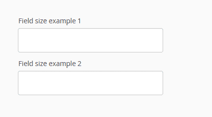
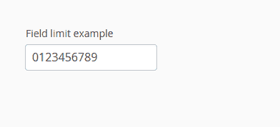
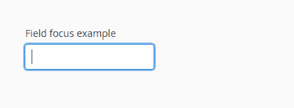
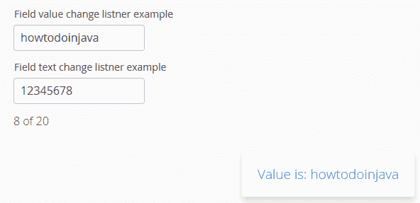
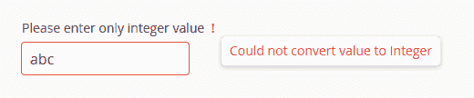

# vaadin 文本字段示例

> 原文： [https://howtodoinjava.com/vaadin/vaadin-text-field-examples/](https://howtodoinjava.com/vaadin/vaadin-text-field-examples/)

学习这些简单易懂的代码示例，以设置，设置样式和验证 vaadin 文本字段控件。

```java
Table of Contents

Vaadin text field label
Vaadin text field width and height
Vaadin text field size limit
Vaadin text field focus
Vaadin text field change event listener
Vaadin text field empty validation
Vaadin text field number validation
Vaadin text field CSS styling
Source Code Download Link
```

## Vaadin 文本字段标签


Vaadin 文本字段标签


您可以通过两种方式为文本字段设置标签。

1.  #### 将文本字段标签设置为构造器参数

    ```java
    final TextField txtFldOne = new TextField("Type your name here:");
    ```

2.  #### 使用`setCaption()`方法设置文本字段标签

    ```java
    final TextField txtFldOne = new TextField();

    //Set Text Field Label
    txtFldOne.setCaption("Type your name here:");

    ```

## Vaadin 文本字段的宽度和高度



Vaadin 文本字段大小


要设置文本字段的宽度和高度，请使用`setXXX`方法。

```java
final TextField txtFldOne = new TextField();
txtFldOne.setCaption("Field size example 1");

//Set width and height
txtFldOne.setWidth(300, Unit.PIXELS);
txtFldOne.setHeight(50, Unit.PIXELS);

layout.addComponents(txtFldOne);

```

或者

```java
final TextField txtFldTwo = new TextField();
txtFldTwo.setCaption("Field size example 2");

txtFldTwo.setWidth("300px");
txtFldTwo.setHeight("50px");

layout.addComponents(txtFldTwo);

```

## Vaadin 文本字段大小限制



Vaadin 文本字段限制


要在文本字段中设置最大字符数限制，请使用`setMaxLength(int length)`方法。

```java
final TextField txtFldOne = new TextField();
txtFldOne.setCaption("Field limit example");

txtFldOne.setMaxLength(10);

layout.addComponents(txtFldOne);

```

## Vaadin 文本字段焦点



Vaadin 文本字段焦点


要使焦点集中在文本字段上，请使用`focus()`方法。

```java
final TextField txtFldOne = new TextField();
txtFldOne.setCaption("Field focus example");

txtFldOne.focus();

layout.addComponents(txtFldOne);

```

## Vaadin 文本字段更改事件监听器



Vaadin 文本字段更改事件


要处理文本字段中的任何值更改事件，您可以附加两个事件监听器。

1.  #### 值更改事件监听器

    当文本字段中发生值更改时，或在编辑后失去焦点时，将触发值更改事件。 使用`ValueChangeListener`处理值更改事件。

    ```java
    final TextField txtFld = new TextField();
    txtFld.setCaption("Field value change listner example");

    txtFld.focus();
    txtFld.setInputPrompt("Enter any text");

    txtFld.addValueChangeListener(new Property.ValueChangeListener() 
    {
    	private static final long serialVersionUID = 5678485350989070188L;

    	public void valueChange(ValueChangeEvent event) 
    	{
            String value = (String) event.getProperty().getValue();
            // Do something with the value. I am showing a tray notification
            Notification.show("Value is: " + value, Type.TRAY_NOTIFICATION);
        }
    });
    //Fire value changes immediately when the field loses focus
    txtFld.setImmediate(true);

    layout.addComponents(txtFld);

    ```

2.  #### 文本更改事件监听器

    有时，您可能希望尽快处理文本字段中的每个文本更改事件。 您可以使用`TextChangeListener`处理这些文本更改。

    ```java
    final TextField txtFld = new TextField();
    txtFld.setCaption("Field text change listner example");

    txtFld.focus();
    txtFld.setMaxLength(20);
    txtFld.setInputPrompt("Enter any text");

    final Label counter = new Label();
    counter.setValue(txtFld.getValue().length() + " of " + txtFld.getMaxLength());

    txtFld.addTextChangeListener(new TextChangeListener() {
    	private static final long serialVersionUID = -8043238443902618783L;

    	public void textChange(TextChangeEvent event) {
            counter.setValue(event.getText().length() + " of " + txtFld.getMaxLength());
        }
    });

    txtFld.setTextChangeEventMode(TextChangeEventMode.EAGER);

    layout.addComponents(txtFld);
    layout.addComponents(counter);

    ```

## Vaadin 文本字段空验证


Vaadin 文本字段空验证


要在文本字段上添加空字段验证，请使用`setRequired()`，`setRequiredError()`和`setValidationVisible()`并添加`StringLengthValidator`。

```java
final TextField txtFld = new TextField();
txtFld.setCaption("Empty field validation example");

txtFld.setInputPrompt("Enter your name");

txtFld.setRequired(true);
txtFld.setRequiredError("Please enter your name to proceed !!");
txtFld.addValidator(new StringLengthValidator("Must be less than 20 chars", 1, 20, false));
txtFld.setValidationVisible(true);

txtFld.setTextChangeEventMode(TextChangeEventMode.LAZY);
txtFld.setNullRepresentation("");

txtFld.addTextChangeListener(new FieldEvents.TextChangeListener() {
	private static final long serialVersionUID = 1L;

	@Override
	public void textChange(FieldEvents.TextChangeEvent event) {
		try {
			txtFld.setValue(event.getText());

			txtFld.setCursorPosition(event.getCursorPosition());

			txtFld.validate();
		} catch (InvalidValueException e) {
			//Log error
		}
	}
});

layout.addComponents(txtFld);

```

在上面的示例中，我们在每个按键事件上验证文本字段。 如果您只想在对焦时验证该字段，请使用`ValueChangeEventListner`。

## Vaadin 文本字段数字验证


Vaadin 文本字段数字最大最小验证




Vaadin 文本字段数字格式验证


如果要强制文本字段仅接受整数值，则可以使用`IntegerRangeValidator`类并针对文本更改事件进行验证。

```java
final TextField txtFld = new TextField("Please enter only integer value");
layout.addComponent(txtFld);

//To convert string value to integer before validation
txtFld.setConverter(new StringToIntegerConverter());

//Add error message and min-max values allowed in field. If no limit than use null
txtFld.addValidator(new IntegerRangeValidator("The value has to be an integer", null, null));

//What if text field is empty - integer will be null in that case, so show blank when null
txtFld.setNullRepresentation("");

//Add validation hints in UI??
txtFld.setValidationVisible(true);

txtFld.setTextChangeEventMode(TextChangeEventMode.LAZY);

txtFld.addTextChangeListener(new FieldEvents.TextChangeListener() {
	private static final long serialVersionUID = 1L;

	@Override
	public void textChange(FieldEvents.TextChangeEvent event) {
		try {
			txtFld.setCursorPosition(event.getCursorPosition());
			txtFld.validate();
		} catch (InvalidValueException e) {
			//Log error
		}
	}
});

```

## Vaadin 文本字段 CSS 样式

所有文本字段均添加了样式名称`v-textfield`，因此，如果您希望将特定的 CSS 应用于所有文本字段，则将其添加到`v-textfield`类中。

```java
.v-textfield {
	//style to apply on all text fields
}

```

如果要在单个文本字段上应用某种样式，则可以将类名称（例如`darkBorder`）添加到文本字段，如下所示：

```java
final TextField txtFld = new TextField("Custom Styled Text Box");
layout.addComponent(txtFld);

layout.addStyleName("darkBorder");

```

现在，您可以在 css 文件中定义样式规则。 样式名称将为`{.v-textfield+添加到字段的自定义样式类}`。

```java
.v-textfield-darkBorder { 
	border: 5px solid gray;
}

```

## 完整的源代码

现在，让我们看看上面为本教程编写的所有示例。

```java
package com.howtodoinjava.vaadin.demo;

import com.vaadin.annotations.Theme;
import com.vaadin.annotations.VaadinServletConfiguration;
import com.vaadin.data.Property;
import com.vaadin.data.Property.ValueChangeEvent;
import com.vaadin.data.Validator.InvalidValueException;
import com.vaadin.data.util.converter.StringToIntegerConverter;
import com.vaadin.data.validator.IntegerRangeValidator;
import com.vaadin.data.validator.StringLengthValidator;
import com.vaadin.event.FieldEvents;
import com.vaadin.event.FieldEvents.TextChangeEvent;
import com.vaadin.event.FieldEvents.TextChangeListener;
import com.vaadin.server.VaadinRequest;
import com.vaadin.server.VaadinServlet;
import com.vaadin.ui.AbstractTextField.TextChangeEventMode;
import com.vaadin.ui.Label;
import com.vaadin.ui.Notification;
import com.vaadin.ui.Notification.Type;
import com.vaadin.ui.TextField;
import com.vaadin.ui.UI;
import com.vaadin.ui.VerticalLayout;

@Theme("mytheme")
public class MyUI extends UI {

	private static final long serialVersionUID = 1387172685749279538L;

	@Override
	protected void init(VaadinRequest vaadinRequest) {
		final VerticalLayout layout = new VerticalLayout();

		fieldLabelExample(layout);
		fieldSizeExample(layout);
		fieldLimitExample(layout);
		fieldFocusExample(layout);
		fieldValueChangeListenerExample(layout);
		fieldTextChangeListenerExample(layout);
		fieldNullValidationExample(layout);
		fieldNumberValidationExample(layout);
		customCSSExample(layout);

		layout.setMargin(true);
		layout.setSpacing(true);

		setContent(layout);
	}

	private void customCSSExample(VerticalLayout layout) {
		final TextField txtFld = new TextField("Custom Styled Text Box");
		layout.addComponent(txtFld);

		layout.addStyleName("darkBorder");
	}

	private void fieldNumberValidationExample(VerticalLayout layout) {

		final TextField txtFld = new TextField("Please enter only integer value");
		layout.addComponent(txtFld);

		//To convert string value to integer before validation
		txtFld.setConverter(new StringToIntegerConverter());

		//Add error message and min-max values allowed in field. If no limit than use null
		txtFld.addValidator(new IntegerRangeValidator("The value must be between 0 and 100", 0, 100));

		//What if text field is empty - integer will be null in that case, so show blank when null
		txtFld.setNullRepresentation("");

		//Add validation hints in UI??
		txtFld.setValidationVisible(true);

		txtFld.setTextChangeEventMode(TextChangeEventMode.LAZY);

		txtFld.addTextChangeListener(new FieldEvents.TextChangeListener() {
			private static final long serialVersionUID = 1L;

			@Override
			public void textChange(FieldEvents.TextChangeEvent event) {
				try {
					txtFld.setCursorPosition(event.getCursorPosition());
					txtFld.validate();
				} catch (InvalidValueException e) {
					//Log error
				}
			}
		});
	}

	private void fieldNullValidationExample(VerticalLayout layout) {

		final TextField txtFld = new TextField();
		txtFld.setCaption("Empty field validation example");

		txtFld.setInputPrompt("Enter your name");

		txtFld.setRequired(true);
		txtFld.setRequiredError("Please enter your name to proceed !!");
		txtFld.addValidator(new StringLengthValidator("Must be less than 20 chars", 1, 20, false));
		txtFld.setValidationVisible(true);

		txtFld.setTextChangeEventMode(TextChangeEventMode.LAZY);
		txtFld.setNullRepresentation("");

		txtFld.addTextChangeListener(new FieldEvents.TextChangeListener() {
			private static final long serialVersionUID = 1L;

			@Override
			public void textChange(FieldEvents.TextChangeEvent event) {
				try {
					txtFld.setValue(event.getText());

					txtFld.setCursorPosition(event.getCursorPosition());

					txtFld.validate();
				} catch (InvalidValueException e) {
					//Log error
				}
			}
		});

		layout.addComponents(txtFld);
	}

	private void fieldTextChangeListenerExample(VerticalLayout layout) {
		final TextField txtFld = new TextField();
		txtFld.setCaption("Field text change listner example");

		txtFld.focus();
		txtFld.setMaxLength(20);
		txtFld.setInputPrompt("Enter any text");

		final Label counter = new Label();
		counter.setValue(txtFld.getValue().length() + " of " + txtFld.getMaxLength());

		txtFld.addTextChangeListener(new TextChangeListener() {
			private static final long serialVersionUID = -8043238443902618783L;

			public void textChange(TextChangeEvent event) {
				counter.setValue(event.getText().length() + " of "
						+ txtFld.getMaxLength());
			}
		});

		txtFld.setTextChangeEventMode(TextChangeEventMode.EAGER);

		layout.addComponents(txtFld);
		layout.addComponents(counter);
	}

	private void fieldValueChangeListenerExample(VerticalLayout layout) {
		final TextField txtFld = new TextField();
		txtFld.setCaption("Field value change listner example");

		txtFld.focus();
		txtFld.setInputPrompt("Enter any text");

		txtFld.addValueChangeListener(new Property.ValueChangeListener() {
			private static final long serialVersionUID = 5678485350989070188L;

			public void valueChange(ValueChangeEvent event) {
				String value = (String) event.getProperty().getValue();
				// Do something with the value
				Notification.show("Value is: " + value, Type.TRAY_NOTIFICATION);
			}
		});
		// Fire value changes immediately when the field loses focus
		txtFld.setImmediate(true);

		layout.addComponents(txtFld);
	}

	private void fieldFocusExample(VerticalLayout layout) {
		final TextField txtFld = new TextField();
		txtFld.setCaption("Field focus example");

		txtFld.focus();

		layout.addComponents(txtFld);
	}

	private void fieldLimitExample(VerticalLayout layout) {
		final TextField txtFld = new TextField();
		txtFld.setCaption("Field limit example");

		txtFld.setMaxLength(10);

		layout.addComponents(txtFld);
	}

	private void fieldSizeExample(VerticalLayout layout) {
		final TextField txtFldOne = new TextField();
		txtFldOne.setCaption("Field size example 1");

		txtFldOne.setWidth(300, Unit.PIXELS);
		txtFldOne.setHeight(50, Unit.PIXELS);

		final TextField txtFldTwo = new TextField();
		txtFldTwo.setCaption("Field size example 2");

		txtFldTwo.setWidth("300px");
		txtFldTwo.setHeight("50px");

		layout.addComponents(txtFldOne);
		layout.addComponents(txtFldTwo);
	}

	private void fieldLabelExample(VerticalLayout layout) {
		final TextField txtFld = new TextField();
		// Set Text Field Label
		txtFld.setCaption("Type your name here:");
		layout.addComponents(txtFld);
	}

	@VaadinServletConfiguration(ui = MyUI.class, productionMode = false)
	public static class MyUIServlet extends VaadinServlet {
		private static final long serialVersionUID = -2718268186398688122L;
	}
}

```

## 源代码下载

单击下面的链接下载该项目的源代码。

[下载源码](//howtodoinjava.com/wp-content/downloads/VaadinExample-TextField.zip "源码下载")

资源：

[Vaadin 文本字段组件](https://vaadin.com/docs/-/part/framework/components/components-textfield.html)

[`TextChangeListener`](https://vaadin.com/api/7.6.8/com/vaadin/event/FieldEvents.TextChangeListener.html)

[`ValueChangeListener`](https://vaadin.com/api/com/vaadin/data/Property.ValueChangeListener.html)

[StackOverflow](https://stackoverflow.com/questions/27983569/how-to-create-a-real-time-validator-on-a-text-field-in-vaadin)