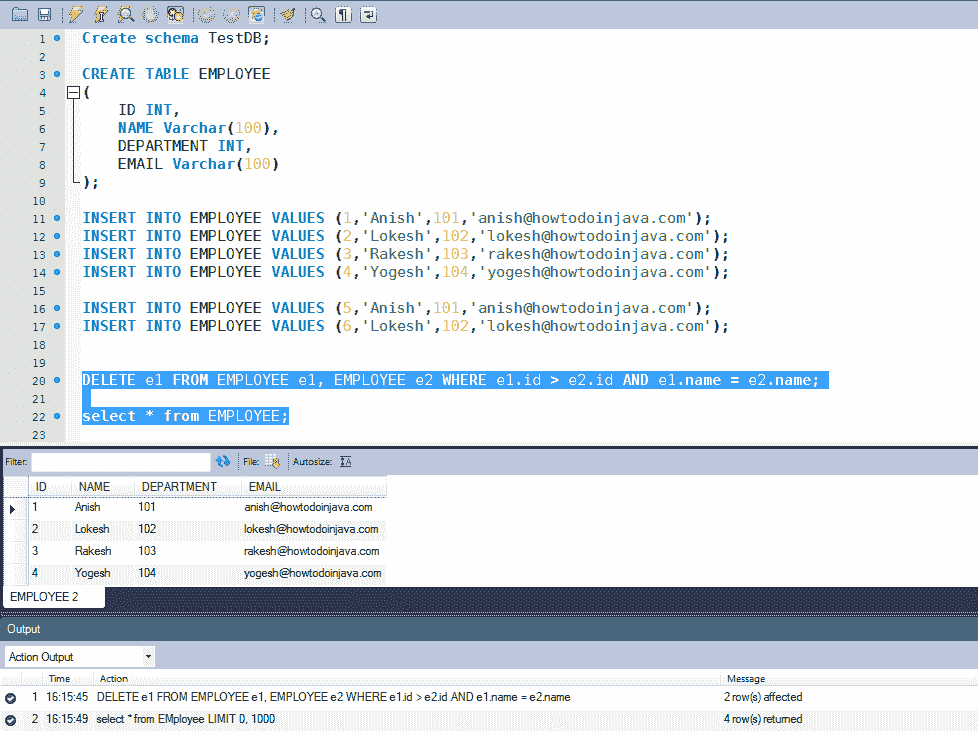

# SQL – 不使用临时表删除重复行

> 原文： [https://howtodoinjava.com/sql/how-to-remove-duplicate-rows-in-mysql-without-using-temporary-table/](https://howtodoinjava.com/sql/how-to-remove-duplicate-rows-in-mysql-without-using-temporary-table/)

作为开发人员，我们经常遇到必须处理数据库相关内容的情况。 通常，当客户端以 excel 工作表的形式向您发送其数据，并且在经过一些 excel 操作后将数据推送到数据库表时，便完成了该操作。 我也做了很多次。

这种方法面临的一个非常普遍的问题是，有时可能会导致重复行，因为发送的数据主要来自人力资源和财务等部门，而人们对这些数据标准化技术的了解并不充分 :-)。

我将使用`Employee`表，其中的列名称为 ID，名称，部门和电子邮件。

以下是用于生成测试数据的 SQL 脚本。

```java
Create schema TestDB;

CREATE TABLE EMPLOYEE
(
    ID INT,
    NAME Varchar(100),
    DEPARTMENT INT,
    EMAIL Varchar(100)
);

INSERT INTO EMPLOYEE VALUES (1,'Anish',101,'anish@howtodoinjava.com');
INSERT INTO EMPLOYEE VALUES (2,'Lokesh',102,'lokesh@howtodoinjava.com');
INSERT INTO EMPLOYEE VALUES (3,'Rakesh',103,'rakesh@howtodoinjava.com');
INSERT INTO EMPLOYEE VALUES (4,'Yogesh',104,'yogesh@howtodoinjava.com');

--These are the duplicate rows

INSERT INTO EMPLOYEE VALUES (5,'Anish',101,'anish@howtodoinjava.com');
INSERT INTO EMPLOYEE VALUES (6,'Lokesh',102,'lokesh@howtodoinjava.com');
```

## 解决方案：

```java
DELETE e1 FROM EMPLOYEE e1, EMPLOYEE e2 WHERE e1.name = e2.name AND e1.id > e2.id;
```

上面的 sql 查询将删除名称字段重复的行，并且仅保留**名称唯一且 ID 字段最低的**唯一行。 例如，ID 为 5 和 6 的行将被删除，而 ID 为 1 和 2 的行将被保留。



*如果要保留具有最新生成的 ID 值的行，则将`where`子句中的条件反转为`e1.id < e2.id`，如下所示：*

```java
DELETE e1 FROM EMPLOYEE e1, EMPLOYEE e2 WHERE e1.name = e2.name AND e1.id > e2.id;
```

如果要比较多个字段并添加适当的`where`子句。

***注意**：请始终首先对测试数据执行以上（或修改）查询，以确保其产生预期的输出。*

学习愉快！