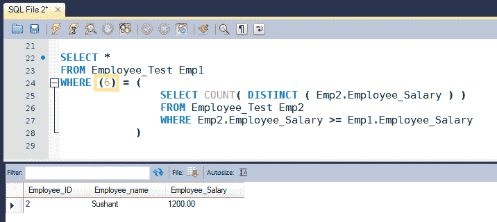

# SQL 查询以查找员工的第 N 高薪

> 原文： [https://howtodoinjava.com/sql/sql-query-find-nth-highest-salary/](https://howtodoinjava.com/sql/sql-query-find-nth-highest-salary/)

如果您想担任初级职位，要找到**的第 N 个最高薪水**是一个非常常见的面试问题。 大多数人逐个字符地学习它，但是很少有人了解此查询的工作方式。 它的性能好坏是多少？ 在这篇文章中，我们将学习这些东西。 我正在使用 MySQL 数据库进行演示。

```java
Table of Contents

1\. Create the schema and populate table
2\. Write the query and verify the result
3\. How the query works
4\. Performance analysis
```

## 1.创建数据库架构并填充表

让我们创建一个`Employee`表的简单示例。 我们将用 id 和雇员的工资填充此表。 我们将编写查询以在此表上找到第 n 个最高薪水。

创建一个新的数据库架构。

```java
Create schema TestSQL;
```

创建一个新表`Employee_Test`。

```java
CREATE TABLE Employee_Test
(
    Employee_ID INT,
    Employee_name Varchar(100),
    Employee_Salary Decimal (10,2)
);

```

用测试数据填充表。

```java
INSERT INTO Employee_Test VALUES (1,'Anish',1000);
INSERT INTO Employee_Test VALUES (2,'Sushant',1200);
INSERT INTO Employee_Test VALUES (3,'Rakesh',1100);
INSERT INTO Employee_Test VALUES (4,'Manoj',1300);
INSERT INTO Employee_Test VALUES (5,'Amit',1400);
INSERT INTO Employee_Test VALUES (6,'Lokesh',1600);
INSERT INTO Employee_Test VALUES (7,'Maneneder',1400);
INSERT INTO Employee_Test VALUES (8,'Narendra',400);
INSERT INTO Employee_Test VALUES (9,'Kaushal',1900);
INSERT INTO Employee_Test VALUES (10,'Vikas',3400);
INSERT INTO Employee_Test VALUES (11,'Sudhir',800);

```

## 2\. SQL 查询找到第 n 个最高薪水

因此，正如我们大多数人所知，查询是这样写的，以查找第**位最高薪水**。 在下面的查询中，我们看到如何在不使用 max 函数的情况下在 sql 中找到最高薪水。

```java
SELECT *
FROM Employee_Test Emp1
WHERE ( n ) = (
                SELECT COUNT( DISTINCT ( Emp2.Employee_Salary ) )
                FROM Employee_Test Emp2
                WHERE Emp2.Employee_Salary >= Emp1.Employee_Salary
            )

```

在此，将`'n'`替换为任何数字。 例如，如果您必须找到第六高的薪水，则将 n 替换为 6。

```java
SELECT *
FROM Employee_Test Emp1
WHERE (6) = (
SELECT COUNT( DISTINCT ( Emp2.Employee_Salary ) )
FROM Employee_Test Emp2
WHERE Emp2.Employee_Salary >= Emp1.Employee_Salary
)

```

上面的查询将产生下面的结果。



## 3.查询的工作方式

如我们所见，该查询涉及内部查询的使用。 内部查询可以有两种类型。 [**相关的**](https://en.wikipedia.org/wiki/Correlated_subquery "Correlated_subquery") 和**不相关的**查询。 不相关查询是内部查询可以独立于外部查询运行的地方，而相关查询是内部查询与外部查询一起运行的地方。 *我们的第 n 高薪是相关查询*的示例。

最好先了解一下内部查询每次都会执行，处理外部查询中的一行。 内部查询基本上不会做任何非常秘密的工作，它只会返回比当前处理行的薪水列高的不同薪水的计数。 任何时候，它都会发现外部查询中当前行的薪水列的值等于内部查询中较高薪水的计数，并返回结果。

## 4.绩效分析

正如我们从上面了解到的那样，每次执行内部查询都会处理一行外部查询，这会带来很多性能开销，特别是在行数太大的情况下。

为了避免这种情况，应该使用特定于数据库的关键字来更快地获得结果。 例如在 SQL Server 中，可以这样使用关键字 TOP。

如何在 SQL Server 中找到第 n 个最高薪水。

```java
SELECT TOP 1 EMPLOYEE_SALARY
FROM
(
    SELECT DISTINCT TOP N EMPLOYEE_SALARY
    FROM EMPLOYEE_TEST
    ORDER BY EMPLOYEE_SALARY DESC
) A
ORDER BY EMPLOYEE_SALARY
WHERE N > 1

```

学习愉快！