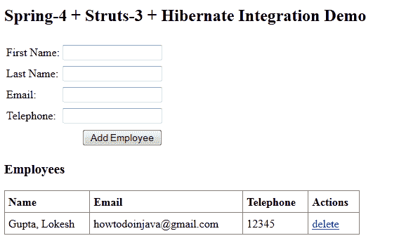

# Spring 4 + Struts 2 + Hibernate 集成教程

> 原文： [https://howtodoinjava.com/struts2/spring-4-struts-2-hibernate-integration-tutorial/](https://howtodoinjava.com/struts2/spring-4-struts-2-hibernate-integration-tutorial/)

以前，我已经介绍了 [**Spring3 +休眠集成**](//howtodoinjava.com/spring/spring-orm/spring-3-and-hibernate-integration-tutorial-with-example/ "Spring3 and hibernate integration tutorial with example") 示例和 [**struts 2 hello world**](//howtodoinjava.com/struts-2/struts-2-hello-world-example-application/ "Struts 2 hello world example application") 示例。 在本教程中，我将讨论将 spring 框架与 Struts 和 Hibernate 结合使用时要记住的所有重要点。 另外，请注意，本教程使用了其他次要但很重要的概念，例如日志记录，TLD 的使用和事​​务以及已集成到本教程中。 因此，请记住还要检查其详细信息。

在本教程中，我将使用简单的功能（例如全部获取，添加和删除）来构建员工管理屏幕。 它看起来像这样：



我将按照以下步骤讨论集成过程：

```java
1) Integration Overview 
2) Spring + Struts Integration
3) Spring + Hibernate Integration
4) Other Integrated Functionalities
    a) Log4j
    b) TLDs
    c) Transactions
5) Important Points to Keep Remember
6) Database Schema Used in Tutorial
7) Download Sourcecode

```

## 1）整合概述

在进入集成细节之前，让我们先确定一下 ***为什么我们需要此集成*** 本身。 像 Struts 一样，Spring 也可以充当 MVC 实现。 两种框架都有其优缺点，仍然有很多人会同意 **Spring 更好**，并且提供了更广泛的功能。 对我来说，只有两种情况，您需要本教程中提供的信息：

**i）**您有一个用 Struts 编写的旧应用，并且想要使用 spring 来提高应用的功能很多倍。
**ii）**您确实想根据自己的原因来学习它。

否则，我不知道为什么有人会在春季选择支柱。 如果您知道其他一些好的理由，请与我们所有人分享。 那挺棒的。

继续，在本教程中，我将**委托从 Struts 到 Spring** 进行动作管理。 进行委派的原因是，通过 Spring 上下文实例化 Action 类时，它可以使用 spring 在其自己的 MVC 实现中为其提供的 Controller 类的所有其他功能。 因此，您将获得所有 spring 功能以及 struts Action 类，以具有包括 ActionForm 概念在内的控制器逻辑。

## 2）Spring + Struts 集成

这是核心逻辑，从在 web.xml 中注册`ContextLoaderListener`和`StrutsPrepareAndExecuteFilter`开始。 `ContextLoaderListener`带有初始化参数 ***contextConfigLocation*** ，并负责设置和启动 Spring `WebApplicationContext`。 现在，struts 将在与 Spring 相关的服务中特别是在[依赖项注入](//howtodoinjava.com/spring/spring-core/inversion-of-control-ioc-and-dependency-injection-di-patterns-in-spring-framework-and-related-interview-questions/ "Inversion of control (IoC) and dependency injection (DI) patterns in spring framework and related interview questions")中利用此上下文。

`StrutsPrepareAndExecuteFilter`在类路径中查找 ***struts.xml*** 文件，并配置 strut 的特定内容，例如动作映射，全局转发和其他在 struts.xml 文件中定义的内容。

**web.xml**

```java
<?xml version="1.0" encoding="UTF-8"?>

<web-app xmlns:xsi="http://www.w3.org/2001/XMLSchema-instance"
    xmlns="http://java.sun.com/xml/ns/javaee"
    xmlns:web="http://java.sun.com/xml/ns/javaee/web-app_2_5.xsd"
    xsi:schemaLocation="http://java.sun.com/xml/ns/javaee http://www.oracle.com/technetwork/java/index.html; id="WebApp_ID" version="2.5">

  <display-name>Spring+Struts+Hibernate Integration Example</display-name>
  	<welcome-file-list>
  		<welcome-file>/WEB-INF/index.jsp</welcome-file>
  	</welcome-file-list>

  	<!-- Specify the spring context information location;
  	Default location is applicationContext.xml file in classpath
  	 -->
  	<context-param>
		<param-name>contextConfigLocation</param-name>
		<param-value>classpath:beans.xml</param-value>
	</context-param>
	<!-- Bootstrap listener to start up and shut down Spring's root WebApplicationContext. -->
  	<listener>  
  		<listener-class>org.springframework.web.context.ContextLoaderListener</listener-class>  
	</listener> 
	<!-- Handles both the preparation and execution phases of the Struts dispatching process. -->
	<filter>  
		<filter-name>struts2</filter-name>  
		<filter-class>org.apache.struts2.dispatcher.ng.filter.StrutsPrepareAndExecuteFilter</filter-class>  
		<init-param>
			<param-name>debug</param-name>
			<param-value>0</param-value>
		</init-param>
		<init-param>
			<param-name>detail</param-name>
			<param-value>0</param-value>
		</init-param>
	</filter>  
	<filter-mapping>  
		<filter-name>struts2</filter-name>  
		<url-pattern>/*</url-pattern>  
	</filter-mapping>  
	<!-- Struts Tag Library Descriptors -->
	<jsp-config>
		<taglib>
			<taglib-uri>/tags/struts-bean</taglib-uri>
			<taglib-location>/WEB-INF/struts-bean.tld</taglib-location>
		</taglib>
		<taglib>
			<taglib-uri>/tags/struts-html</taglib-uri>
			<taglib-location>/WEB-INF/struts-html.tld</taglib-location>
		</taglib>
		<taglib>
			<taglib-uri>/tags/struts-logic</taglib-uri>
			<taglib-location>/WEB-INF/struts-logic.tld</taglib-location>
		</taglib>
		<taglib>
			<taglib-uri>/tags/struts-nested</taglib-uri>
			<taglib-location>/WEB-INF/struts-nested.tld</taglib-location>
		</taglib>
	</jsp-config>
</web-app>

```

第二步，将在 **struts.xml** 文件中创建操作映射，如下所示：

**struts.xml**

```java
<?xml version="1.0" encoding="UTF-8" ?>
<!DOCTYPE struts PUBLIC
"-//Apache Software Foundation//DTD Struts Configuration 2.0//EN"
"http://struts.apache.org/dtds/struts-2.0.dtd">	

<struts>
    <!-- devMode is helpful when you want some extra logs for debugging -->
    <constant name="struts.devMode" value="false" />
    <!-- Global message resource; 
    	 Otherwise you will have seperate message resource for each Action 
    -->
    <constant name="struts.custom.i18n.resources" value="messages" /> 
    <!-- 
    	This is important if you are planning to have slashes in Action URLs
    	e.g. In this demo, employee is deleted using URL /delete/10
    	This this is set to false; then struts will try to find mapping for 
    	URL "/10" instaed of "/delete/10"
     -->
    <constant name="struts.enable.SlashesInActionNames" value="true"/>

    <!-- Normal Action mappings are defined here -->
	<package name="default" namespace="" extends="struts-default">
	    <!-- Two things to Notice: 
	    	 1) class is set to 'editEmployeeAction' which is bean defined by Spring context
	    	 2) We have given the method to be called here as well;
	   	-->
		<action name="list" class="editEmployeeAction" method="listEmployees">
			<result>/view/editEmployeeList.jsp</result>
		</action>
		<action name="add" class="editEmployeeAction" method="addEmployee">
			<result type="redirect">/list</result>
		</action>
		<action name="delete/*" class="editEmployeeAction" method="deleteEmployee">
		    <param name="employee.id">{1}</param>
			<result type="redirect">/list</result>
		</action>
		<action name="*" class="editEmployeeAction" method="listEmployees">
		  <result>/view/editEmployeeList.jsp</result>
		</action> 
	</package>

</struts>

```

In strut’s alone application we would have full Action Class with it’s package information in “class” attribute. Here we have given the class name as editEmployeeAction. Where is it defined? We will ask Spring to lookup for us.

Spring 上下文文件 **beans.xml** 是典型的 Spring 单独上下文文件，具有 Web 应用运行所需的所有内容，其中包括 struts 正在寻找的 bean 定义`editEmployeeAction`。

**beans.xml**

```java
<?xml  version="1.0" encoding="UTF-8"?>
<beans xmlns="http://www.springframework.org/schema/beans"
    xmlns:xsi="http://www.w3.org/2001/XMLSchema-instance"
    xmlns:aop="http://www.springframework.org/schema/aop"
    xmlns:context="http://www.springframework.org/schema/context"
    xmlns:jee="http://www.springframework.org/schema/jee"
    xmlns:lang="http://www.springframework.org/schema/lang"
    xmlns:p="http://www.springframework.org/schema/p"
    xmlns:tx="http://www.springframework.org/schema/tx"
    xmlns:util="http://www.springframework.org/schema/util"
    xsi:schemaLocation="http://www.springframework.org/schema/beans http://www.springframework.org/schema/beans/spring-beans.xsd
        http://www.springframework.org/schema/aop/ http://www.springframework.org/schema/aop/spring-aop.xsd
        http://www.springframework.org/schema/context/ http://www.springframework.org/schema/context/spring-context.xsd
        http://www.springframework.org/schema/jee/ http://www.springframework.org/schema/jee/spring-jee.xsd
        http://www.springframework.org/schema/lang/ http://www.springframework.org/schema/lang/spring-lang.xsd
        http://www.springframework.org/schema/tx/ http://www.springframework.org/schema/tx/spring-tx.xsd
        http://www.springframework.org/schema/util/ http://www.springframework.org/schema/util/spring-util.xsd">

    <!-- This bean has been referred fron struts.xml file; So type it correctly; -->
    <!-- Make scope prototype; This is really important. -->
    <bean name="editEmployeeAction" class="com.howtodoinjava.controller.EditEmployeeAction" scope="prototype">
	     <property name="employeeManager">
	        <ref bean="employeeManager"/>
	     </property>
    </bean>

    <!-- These beans are injected automatically by spring context -->
    <bean id="employeeDAO" class="com.howtodoinjava.dao.EmployeeDaoImpl">
        <property name="sessionFactory" ref="sessionFactory"/>
    </bean>

    <bean id="employeeManager" class="com.howtodoinjava.service.EmployeeManagerImpl">
        <property name="employeeDAO" ref="employeeDAO"/>
    </bean>

    <!-- Configure jdbc.properties -->
    <bean id="propertyConfigurer"
        class="org.springframework.beans.factory.config.PropertyPlaceholderConfigurer"
        p:location="/WEB-INF/jdbc.properties" />

    <!-- Data Source configuration -->
    <bean id="dataSource"
        class="org.apache.commons.dbcp.BasicDataSource" destroy-method="close"
        p:driverClassName="${jdbc.driverClassName}"
        p:url="${jdbc.databaseurl}" p:username="${jdbc.username}"
        p:password="${jdbc.password}" />

	<!-- Configure hibernate session factory -->    
    <bean id="sessionFactory"
        class="org.springframework.orm.hibernate3.LocalSessionFactoryBean">
        <property name="dataSource" ref="dataSource" />
        <property name="configLocation">
            <value>classpath:hibernate.cfg.xml</value>
        </property>
        <property name="configurationClass">
            <value>org.hibernate.cfg.AnnotationConfiguration</value>
        </property>
        <property name="hibernateProperties">
            <props>
                <prop key="hibernate.dialect">${jdbc.dialect}</prop>
                <prop key="hibernate.show_sql">true</prop>
            </props>
        </property>
    </bean>
    <!-- Run SQL queries in transactions -->
    <tx:annotation-driven />
    <bean id="transactionManager"
        class="org.springframework.orm.hibernate3.HibernateTransactionManager">
        <property name="sessionFactory" ref="sessionFactory" />
    </bean>

</beans>

```

这是我们要做的**将支撑架与 spring** 框架集成在一起的所有步骤。 现在，您的动作类如下所示：

**EditEmployeeAction.java**

```java
package com.howtodoinjava.controller;

import java.util.List;

import org.apache.log4j.Logger;

import com.howtodoinjava.entity.EmployeeEntity;
import com.howtodoinjava.service.EmployeeManager;
import com.opensymphony.xwork2.ActionSupport;
import com.opensymphony.xwork2.Preparable;

public class EditEmployeeAction extends ActionSupport implements Preparable	
{
	private static final long serialVersionUID = 1L;

	//Logger configured using log4j
	private static final Logger logger = Logger.getLogger(EditEmployeeAction.class);

	//List of employees; Setter and Getter are below
	private List<EmployeeEntity> employees;

	//Employee object to be added; Setter and Getter are below
	private EmployeeEntity employee;

	//Employee manager injected by spring context; This is cool !!
	private EmployeeManager employeeManager;

	//This method return list of employees in database
	public String listEmployees() {
		logger.info("listEmployees method called");
		employees = employeeManager.getAllEmployees();
		return SUCCESS;
	}

	//This method will be called when a employee object is added
	public String addEmployee() {
		logger.info("addEmployee method called");
		employeeManager.addEmployee(employee);
		return SUCCESS;
	}

	//Deletes a employee by it's id passed in path parameter
	public String deleteEmployee() {
		logger.info("deleteEmployee method called");
		employeeManager.deleteEmployee(employee.getId());
		return SUCCESS;
	}

	//This method will be called before any of Action method is invoked;
	//So some pre-processing if required.
	@Override
	public void prepare() throws Exception {
		employee = null;
	}

	//Getters and Setters hidden
}

```

Spring 还将 DAO 引用注入到 Manager 类。

**EmployeeManagerImpl.java**

```java
package com.howtodoinjava.service;

import java.util.List;

import org.springframework.transaction.annotation.Transactional;

import com.howtodoinjava.dao.EmployeeDAO;
import com.howtodoinjava.entity.EmployeeEntity;

public class EmployeeManagerImpl implements EmployeeManager 
{
	//Employee dao injected by Spring context
    private EmployeeDAO employeeDAO;

	//This method will be called when a employee object is added
	@Override
	@Transactional
	public void addEmployee(EmployeeEntity employee) {
		employeeDAO.addEmployee(employee);
	}

	//This method return list of employees in database
	@Override
	@Transactional
	public List<EmployeeEntity> getAllEmployees() {
		return employeeDAO.getAllEmployees();
	}
	//Deletes a employee by it's id
	@Override
	@Transactional
	public void deleteEmployee(Integer employeeId) {
		employeeDAO.deleteEmployee(employeeId);
	}

	//This setter will be used by Spring context to inject the dao's instance
	public void setEmployeeDAO(EmployeeDAO employeeDAO) {
		this.employeeDAO = employeeDAO;
	}
}

```

## 3）Spring + Hibernate 集成

现在我们必须将休眠集成到应用中。 最好的地方是利用 Spring 的强大功能进行集成，以充分利用依赖注入来与不同的 ORM 一起使用。

上面 **beans.xml** 文件中已经给出了 Spring 所需的休眠依赖关系。 您将需要的其他文件是：

**hibernate.cfg.xml**

```java
<?xml version='1.0' encoding='utf-8'?>
<!DOCTYPE hibernate-configuration PUBLIC
    "-//Hibernate/Hibernate Configuration DTD//EN"
    "http://hibernate.sourceforge.net/hibernate-configuration-3.0.dtd">

<hibernate-configuration>
    <session-factory>
        <mapping class="com.howtodoinjava.entity.EmployeeEntity" />
    </session-factory>
</hibernate-configuration>

```

**jdbc.properties**

```java
jdbc.driverClassName=com.mysql.jdbc.Driver
jdbc.dialect=org.hibernate.dialect.MySQLDialect
jdbc.databaseurl=jdbc:mysql://127.0.0.1:3306/test
jdbc.username=root
jdbc.password=password

```

**EmployeeDaoImpl.java**

```java
package com.howtodoinjava.dao;

import java.util.List;

import org.hibernate.SessionFactory;
import org.springframework.stereotype.Repository;

import com.howtodoinjava.entity.EmployeeEntity;

@Repository
public class EmployeeDaoImpl implements EmployeeDAO  
{
	//Session factory injected by spring context
    private SessionFactory sessionFactory;

    //This method will be called when a employee object is added
	@Override
	public void addEmployee(EmployeeEntity employee) {
		this.sessionFactory.getCurrentSession().save(employee);
	}

	//This method return list of employees in database
	@SuppressWarnings("unchecked")
	@Override
	public List<EmployeeEntity> getAllEmployees() {
		return this.sessionFactory.getCurrentSession().createQuery("from EmployeeEntity").list();
	}

	//Deletes a employee by it's id
	@Override
	public void deleteEmployee(Integer employeeId) {
		EmployeeEntity employee = (EmployeeEntity) sessionFactory.getCurrentSession()
										.load(EmployeeEntity.class, employeeId);
        if (null != employee) {
        	this.sessionFactory.getCurrentSession().delete(employee);
        }
	}

	//This setter will be used by Spring context to inject the sessionFactory instance
	public void setSessionFactory(SessionFactory sessionFactory) {
		this.sessionFactory = sessionFactory;
	}
}

```

供您参考，EmployeeEntity 类如下所示：

**EmployeeEntity.java**

```java
package com.howtodoinjava.entity;

import javax.persistence.Column;
import javax.persistence.Entity;
import javax.persistence.GeneratedValue;
import javax.persistence.Id;
import javax.persistence.Table;

@Entity
@Table(name="EMPLOYEE")
public class EmployeeEntity {

    @Id
    @Column(name="ID")
    @GeneratedValue
    private Integer id;

    @Column(name="FIRSTNAME")
    private String firstname;

    @Column(name="LASTNAME")
    private String lastname;

    @Column(name="EMAIL")
    private String email;

    @Column(name="TELEPHONE")
    private String telephone;

    //Setters and Getters
}

```

## 4）其他集成功能

除了 struts + spring + hibernate，我们还使用以下组件来构建应用。

#### a）Log4j

Spring 通过扫描类路径中的`log4j`自动配置日志记录。 我们使用`pom.xml`文件添加了 log4j 依赖项。 现在，您只需要在类路径中放置一个 log4j.xml 或 log4j.properties 文件。

**log4j.properties**

```java
log4j.rootLogger=info, stdout, R

log4j.appender.stdout=org.apache.log4j.ConsoleAppender
log4j.appender.stdout.layout=org.apache.log4j.PatternLayout
log4j.appender.stdout.layout.ConversionPattern=%d{ABSOLUTE} %5p %c{1}:%L - %m%n

log4j.appender.R=org.apache.log4j.RollingFileAppender
log4j.appender.R.File=c:/log/demo.log
log4j.appender.R.MaxFileSize=100KB
log4j.appender.R.MaxBackupIndex=1
log4j.appender.R.layout=org.apache.log4j.PatternLayout
log4j.appender.R.layout.ConversionPattern=%d{ABSOLUTE} %5p %c{1}:%L - %m%n

```

#### b）顶级域名

如果您查看`web.xml`文件，我们在其中包含了一些 TLD。 我们可以随时在视图层中使用它们，如下所示：

**editEmployeeList.jsp**

```java
<%@ taglib prefix="s" uri="/struts-tags"%> 
<%@taglib uri="http://java.sun.com/jsp/jstl/core" prefix="c"%>
<html>
<head>
    <title>Spring-4 + Struts-3 + Hibernate Integration Demo</title>
    <style>
	table.list
	{
		border-collapse:collapse;
		width: 40%;
	}
	table.list, table.list td, table.list th
	{
		border:1px solid gray;
		padding: 5px;
	}
	</style>
</head>
<body>

<h2>Spring-4 + Struts-3 + Hibernate Integration Demo</h2>

<s:form method="post" action="add">
    <table>
	    <tr>
	        <td><s:textfield key="label.firstname" name="employee.firstname"/></td> 
	    </tr>
	    <tr>
	        <td><s:textfield key="label.lastname" name="employee.lastname"/></td>
	    </tr>
	    <tr>
	        <td><s:textfield key="label.email" name="employee.email"/></td>
	    </tr>
	    <tr>
	        <td><s:textfield key="label.telephone" name="employee.telephone"/></td>
	    </tr>
	    <tr>
	        <td>
	        	<s:submit key="label.add"></s:submit>
	        </td>
	    </tr>
	</table> 
</s:form>

<h3>Employees</h3>
<c:if  test="${!empty employees}">
	<table class="list">
		<tr>
		    <th align="left">Name</th>
		    <th align="left">Email</th>
		    <th align="left">Telephone</th>
		    <th align="left">Actions</th>
		</tr>
		<c:forEach items="${employees}" var="emp">
		    <tr>
		        <td>${emp.lastname}, ${emp.firstname} </td>
		        <td>${emp.email}</td>
		        <td>${emp.telephone}</td>
		        <td><a href="delete/${emp.id}">delete</a></td>
		    </tr>
		</c:forEach>
	</table>
</c:if>

</body>
</html>

```

#### c）交易

EmployeeManagerImpl.java 在诸如 getAllEmployees（）和 deleteEmployee（）之类的方法中使用注解@Transactional。 这实际上是在单个事务中运行在此方法下执行的所有数据库查询。 像这样在`beans.xml`上下文文件中声明了事务依赖性。

```java
<!-- Run SQL queries in transactions -->
<tx:annotation-driven />

<bean id="transactionManager"
	class="org.springframework.orm.hibernate3.HibernateTransactionManager">
	<property name="sessionFactory" ref="sessionFactory" />
</bean>

```

## 5）要记住的要点

**a）** **如果运行时无法找到 lib 文件夹中存在的类，则将来自项目依赖项的 jar 文件添加到项目部署程序集**中。

**b）**使 bean.xml 中定义的 Action 类的**作用域为“原型”** 。 Spring 提供的 bean 的默认范围是单例，并且必须为每个请求创建新的 Struts Action 类，因为它包含特定于用户会话的数据。 为了容纳两者，请将 Action 类 bean 标记为原型。
 **c）**在运行此应用之前，请不要忘记**设置数据库**。 如果安装不正确，将导致您出现一些异常。

**d）**另外，请**在项目运行时依赖项中也包括** `struts2-spring-plugin`。

## 6）教程中使用的数据库架构

下表已在 MySQL 中的名为“ test”的数据库中创建。

```java
CREATE TABLE EMPLOYEE
(
    ID          INT PRIMARY KEY AUTO_INCREMENT,
    FIRSTNAME   VARCHAR(30),
    LASTNAME    VARCHAR(30),
    TELEPHONE   VARCHAR(15),
    EMAIL       VARCHAR(30),
    CREATED     TIMESTAMP DEFAULT NOW()
);

```

如果您打算自己构建应用，则在下面给定的**直接在此应用中使用的结构**将为您提供帮助。


Directory structure for spring struts hibernate integration


此项目中使用的`pom.xml`文件具有所有项目相关性（有些额外），如下所示：

**pom.xml**

```java
<project xmlns="http://maven.apache.org/POM/4.0.0" xmlns:xsi="http://www.w3.org/2001/XMLSchema-instance"
  xsi:schemaLocation="http://maven.apache.org/POM/4.0.0 http://maven.apache.org/maven-v4_0_0.xsd">
  <modelVersion>4.0.0</modelVersion>
  <groupId>com.howtodoinjava.app</groupId>
  <artifactId>Spring4Struts2HibernateIntegration</artifactId>
  <packaging>war</packaging>
  <version>1.0-SNAPSHOT</version>
  <name>Spring4Struts2HibernateIntegration Maven Webapp</name>
  <url>http://maven.apache.org</url>
  <!-- JBoss repository for Hibernate -->
  <repositories>
	<repository>
		<id>JBoss repository</id>
		<url>http://repository.jboss.org/nexus/content/groups/public/</url>
	</repository>
  </repositories>
  <properties>
    <org.springframework.version>4.0.3.RELEASE</org.springframework.version>
  </properties>
  <dependencies>

	<dependency>
      <groupId>junit</groupId>
      <artifactId>junit</artifactId>
      <version>4.11</version>
      <scope>test</scope>
    </dependency>

	<dependency>
		<groupId>org.apache.struts</groupId>
		<artifactId>struts2-core</artifactId>
		<version>2.3.16.2</version>
	</dependency>

   <dependency>
		<groupId>org.apache.struts</groupId>
		<artifactId>struts2-spring-plugin</artifactId>
		<version>2.3.16.2</version>
	</dependency>

     <!--
	    Core utilities used by other modules.
	    Define this if you use Spring Utility APIs (org.springframework.core.*/org.springframework.util.*)
	-->
	<dependency>
	  <groupId>org.springframework</groupId>
	  <artifactId>spring-core</artifactId>
	  <version>${org.springframework.version}</version>
	  <scope>runtime</scope>
	</dependency>
	<dependency>
		<groupId>org.springframework</groupId>
		<artifactId>spring-web</artifactId>
		<version>${org.springframework.version}</version>
		<scope>runtime</scope>
	</dependency>
	<dependency>
		<groupId>org.springframework</groupId>
		<artifactId>spring-webmvc</artifactId>
		<version>${org.springframework.version}</version>
		<scope>runtime</scope>
	</dependency>

	<!--
	    Bean Factory and JavaBeans utilities (depends on spring-core)
	    Define this if you use Spring Bean APIs (org.springframework.beans.*)
	-->
	<dependency>
	  <groupId>org.springframework</groupId>
	  <artifactId>spring-beans</artifactId>
	  <version>${org.springframework.version}</version>
	</dependency>
	<!--
	    Application Context (depends on spring-core, spring-expression, spring-aop, spring-beans)
	    This is the central artifact for Spring's Dependency Injection Container and is generally always defined
	-->
	<dependency>
	  <groupId>org.springframework</groupId>
	  <artifactId>spring-context</artifactId>
	  <version>${org.springframework.version}</version>
	</dependency>
	<!--
	    Aspect Oriented Programming (AOP) Framework (depends on spring-core, spring-beans)
	    Define this if you use Spring AOP APIs (org.springframework.aop.*)
	-->
	<dependency>
	  <groupId>org.springframework</groupId>
	  <artifactId>spring-aop</artifactId>
	  <version>${org.springframework.version}</version>
	</dependency>
	<dependency>
		<groupId>org.aspectj</groupId>
		<artifactId>aspectjtools</artifactId>
		<version>1.6.2</version>
	</dependency>
	<dependency>
		<groupId>cglib</groupId>
		<artifactId>cglib</artifactId>
		<version>3.1</version>
	</dependency>

	<!--
	    Transaction Management Abstraction (depends on spring-core, spring-beans, spring-aop, spring-context)
	    Define this if you use Spring Transactions or DAO Exception Hierarchy
	    (org.springframework.transaction.*/org.springframework.dao.*)
	-->
	<dependency>
	  <groupId>org.springframework</groupId>
	  <artifactId>spring-tx</artifactId>
	  <version>${org.springframework.version}</version>
	</dependency>
	<!--
	    JDBC Data Access Library (depends on spring-core, spring-beans, spring-context, spring-tx)
	    Define this if you use Spring's JdbcTemplate API (org.springframework.jdbc.*)
	-->
	<dependency>
	  <groupId>org.springframework</groupId>
	  <artifactId>spring-jdbc</artifactId>
	  <version>${org.springframework.version}</version>
	</dependency>

	<!--
	    Object-to-Relation-Mapping (ORM) integration with Hibernate, JPA, and iBatis.
	    (depends on spring-core, spring-beans, spring-context, spring-tx)
	    Define this if you need ORM (org.springframework.orm.*)
	-->
	<dependency>
	  <groupId>org.springframework</groupId>
	  <artifactId>spring-orm</artifactId>
	  <version>${org.springframework.version}</version>
	</dependency>

	<dependency>  
       <groupId>log4j</groupId>  
       <artifactId>log4j</artifactId>  
       <version>1.2.15</version>  
       <exclusions>  
         <exclusion>  
           <groupId>javax.mail</groupId>  
           <artifactId>mail</artifactId>  
         </exclusion>  
         <exclusion>  
           <groupId>javax.jms</groupId>  
           <artifactId>jms</artifactId>  
         </exclusion>  
         <exclusion>  
           <groupId>com.sun.jdmk</groupId>  
           <artifactId>jmxtools</artifactId>  
         </exclusion>  
         <exclusion>  
           <groupId>com.sun.jmx</groupId>  
           <artifactId>jmxri</artifactId>  
         </exclusion>  
       </exclusions>  
       <scope>runtime</scope>  
     </dependency>  

     <dependency>
		<groupId>org.hibernate</groupId>
		<artifactId>hibernate-core</artifactId>
		<version>3.6.3.Final</version>
	</dependency>

	<dependency>
		<groupId>javassist</groupId>
		<artifactId>javassist</artifactId>
		<version>3.12.1.GA</version>
	</dependency>

 	<dependency>
		<groupId>javax.servlet</groupId>
		<artifactId>jstl</artifactId>
		<version>1.2</version>
		<scope>runtime</scope>
	</dependency>

	<dependency>
		<groupId>taglibs</groupId>
		<artifactId>standard</artifactId>
		<version>1.1.2</version>
		<scope>runtime</scope>
	</dependency>

	<dependency>
	  <groupId>commons-dbcp</groupId>
	  <artifactId>commons-dbcp</artifactId>
	  <version>1.4</version>
	</dependency>

   <dependency>
	    <groupId>mysql</groupId>
	    <artifactId>mysql-connector-java</artifactId>
	    <version>5.1.9</version>
	</dependency>

  </dependencies>
  <build>
    <finalName>Spring3Struts2HibernateIntegration</finalName>
    <plugins>
		<plugin>
			<artifactId>maven-compiler-plugin</artifactId>
			<version>2.3.2</version>
			<configuration>
				<source>1.6</source>
				<target>1.6</target>
			</configuration>
		</plugin>
	</plugins>
  </build>
</project>

```

## 7）下载源代码

下载以上示例的源代码或获取.war 文件。

[Download Source Code](https://drive.google.com/file/d/0B7yo2HclmjI4S2c5YldiNk44aVE/edit?usp=sharing "spring + struts + hibernate tutorial source code link")

[Download .war File](https://drive.google.com/file/d/0B7yo2HclmjI4T2NrS19iRU5Hb3c/edit?usp=sharing "spring + struts + hibernate tutorial .war file link")

这是 **spring 4 + struts 2 + hibernate 集成**教程的全部内容。 让我知道您的想法和疑问。

**祝您学习愉快！**