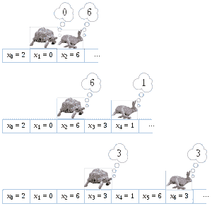

# 如何通过示例检测`LinkedList`中的无限循环

> 原文： [https://howtodoinjava.com/puzzles/how-to-detect-infinite-loop-in-linkedlist-in-java-with-example/](https://howtodoinjava.com/puzzles/how-to-detect-infinite-loop-in-linkedlist-in-java-with-example/)

这是一个非常常见的面试问题。 询问您是否有一个只能在一个方向上移动的链表，并且如果该链表中有一个循环，您将如何检测到它？

好吧，如果您不知道答案，那就不要灰心丧气。 我个人的观点是，这类问题无法评估候选人的逻辑思维，因为这样的问题具有非常具体的答案。 您或者知道，或者不知道。

对于这个特定问题，面试官寻找的最佳答案是“[**弗洛伊德循环发现算法**](https://en.wikipedia.org/wiki/Cycle_detection#Tortoise_and_hare "Floyd's Cycle-Finding Algorithm")”。 该算法提出了一种解决方案，建议您一次仅具有两个指针，而不是仅一个遍历列表的指针。 两个指针都将从链接列表的第一个节点开始，并使用`next`属性遍历。

不同之处在于它们在每个步骤中跳跃的节点数。 第一个节点每次跳到下一个节点，另一个节点一次跳两个节点。 第一个节点称为**较慢的节点**或**乌龟**，第二个节点**较快的节点**被称为**兔子**。



龟兔算法


这种遍历可确保如果链接链接中存在循环，则两个节点肯定会在其遍历路径中的某处相遇。 它具有`O(n)`复杂度。

让我们使用 Java 示例代码对此进行验证。

我已经写了一个最少可能的单链表代码，仅用于演示此示例。

```java
package com.howtodoinjava.demo.core;

public class SinglyLinkedList {

	private Node start;

	public void add(Integer i)
	{
		Node node = new Node(i);
		if(start == null)
			start = node;
		else
		{
			Node temp = start;
			while(temp.next != null)
			{
				temp = temp.next;
			}
			temp.next = node;
		}
	}

	public Node getStart()
	{
		return start;
	}

	static class Node
	{
		Node(Integer i)
		{
			this.value = i;
		}

		private Integer value;
		private Node next;
		public Integer getValue() {
			return value;
		}
		public void setValue(Integer value) {
			this.value = value;
		}
		public Node getNext() {
			return next;
		}
		public void setNext(Node next) {
			this.next = next;
		}
	}
}

```

现在，让我们先在链表上进行循环测试，然后再进行循环测试。

```java
package com.howtodoinjava.demo.core;

public class FindLoopsInLinkedList
{
	public static void main(String args[]) {

		FindLoopsInLinkedList finder = new FindLoopsInLinkedList();

		SinglyLinkedList sampleList = new SinglyLinkedList();
		// First Insert randomly ten elements in a linked list
		for (int i = 0; i < 10; i++) {
			sampleList.add(i);
		}

		System.out.println("Loop Existence : " + finder.doesLoopExist(sampleList));
		System.out.println("Loop Existence : " + finder.doesLoopExist(finder.createLoop(sampleList)));
	}

	public boolean doesLoopExist(SinglyLinkedList listToCheck) {
		SinglyLinkedList.Node tortoise = listToCheck.getStart();
		SinglyLinkedList.Node hare = listToCheck.getStart();

		try {
			while (true) {
				tortoise = tortoise.getNext();
				hare = hare.getNext().getNext();
				if (tortoise == hare) {
					return true;
				}
			}
		} catch (NullPointerException ne) {
			return false;
		}
	}

	private SinglyLinkedList createLoop(SinglyLinkedList sampleList) {
		sampleList.getStart().getNext().getNext().getNext().setNext(sampleList.getStart().getNext());
		return sampleList;
	}
}

```

在上面的程序中，我们创建了一个链接列表，并在该列表中插入了 10 个元素。 否，当我们检查行号中是否存在循环时。 15 这是错误的。

但是，当在第 167 行时，我们在链接列表内部创建了一个循环，结果如愿。

上面程序的输出是这样的：

```java
Loop Existence : false            [Line 15]
Loop Existence : true             [Line 16]

```

如您所见，只要我们在行号中插入循环。 16，我们的算法实现能够检测到它。

学习愉快！