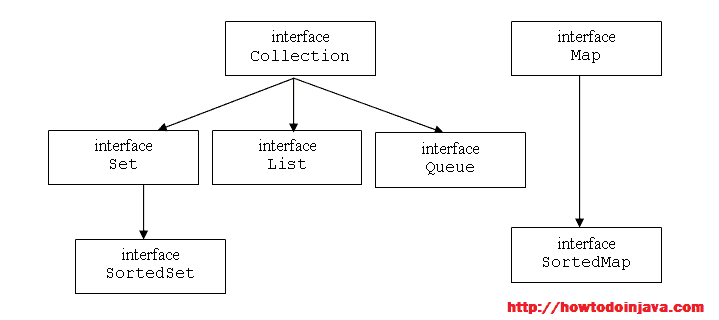

# Java 面试的 40 个热门问答集

> 原文： [https://howtodoinjava.com/interview-questions/useful-java-collection-interview-questions/](https://howtodoinjava.com/interview-questions/useful-java-collection-interview-questions/)

毫无疑问，java 集合是最重要的领域之一，无论您是初级还是高级，您都可以在任何位置对其进行测试。 范围如此之广，几乎不可能涵盖所有问题。 但是，根据我以前的面试，我尝试提出您必须知道的尽可能多的 GOOD **java 集合面试问题**。

我的目标是初学者和高级问题，所以如果您发现一些基本问题，请多多包涵，因为它们对某些初级开发人员可能有用。

```java
Java collection interview questions

General questions

1) What is the Java Collections API? List down its advantages?
2) Explain Collections hierarchy?
3) Why Collection interface does not extend Cloneable and Serializable interface?
4) Why Map interface does not extend Collection interface?

List interface related

5) Why we use List interface? What are main classes implementing List interface?
6) How to convert an array of String to ArrayList?
7) How to reverse the list?

Set interface related

8) Why we use Set interface? What are main classes implementing Set interface?
9) How HashSet store elements?
10) Can a null element added to a TreeSet or HashSet?

Map interface related

11) Why we use Map interface? What are main classes implementing Map interface?
12) What are IdentityHashMap and WeakHashMap?
13) Explain ConcurrentHashMap? How it works?
14) How hashmap works?
15) How to design a good key for hashmap?
16) What are different Collection views provided by Map interface?
17) When to use HashMap or TreeMap?

Tell the difference questions

18) Difference between Set and List?
19) Difference between List and Map?
20) Difference between HashMap and HashTable?
21) Difference between Vector and ArrayList?
22) Difference between Iterator and Enumeration?
23) Difference between HashMap and HashSet?
24) Difference between Iterator and ListIterator?
25) Difference between TreeSet and SortedSet?
26) Difference between ArrayList and LinkedList?

More questions

27) How to make a collection read only?
28) How to make a collection thread safe?
29) Why there is not method like Iterator.add() to add elements to the collection?
30) What are different ways to iterate over a list?
31) What do you understand by iterator fail-fast property?
32) What is difference between fail-fast and fail-safe?
33) How to avoid ConcurrentModificationException while iterating a collection?
34) What is UnsupportedOperationException?
35) Which collection classes provide random access of it’s elements?
36) What is BlockingQueue?
37) What is Queue and Stack, list their differences?
38) What is Comparable and Comparator interface?
39) What are Collections and Arrays class?
40) Recommended resources
```

不要浪费时间，让我们深入研究 Java 集合的概念。

## Java Collection 面试一般问题

#### 1）什么是 Java Collection 框架？ 列出其优势？

根据定义，集合是**代表一组对象**的对象。 像集合论一样，集合是一组元素。 很简单！

在 JDK 1.2 之前，JDK 具有一些工具类，例如 Vector 和 HashTable，但是没有 Collection 框架的概念。 从 JDK 1.2 以后，JDK 感到需要对可重用数据结构提供一致的支持。 最后，集合框架主要由 Joshua Bloch 设计和开发，并在 JDK 1.2 中引入了**。**

Java 集合的最明显的**优点可以列出为：**

*   随时可用的代码，减少了编程工作
*   由于数据结构和算法的高性能实现而提高了性能
*   通过建立公共语言来回传递集合，从而在不相关的 API 之间提供互操作性
*   通过仅学习一些顶级接口和受支持的操作，易于学习的 API

#### 2）解释馆藏的等级？



Java Collection Hierarchy


如上图所示，收集框架顶部有一个接口，即**收集**。 通过设置，列表和队列接口对其进行了扩展。 然后在这 3 个分支中还有其他类别的负载，我们将在以下问题中学习。

记住`Collection`接口的签名。 它会在很多问题上帮助您。

```java
public interface Collection extends Iterable {
//method definitions
}

```

框架还包含`Map`接口，它是收集框架的一部分。 但它不会扩展 Collection 接口。 我们将在此问题库中的第四个问题中看到原因。

#### 3）为什么 Collection 接口没有扩展 Cloneable 和 Serializable 接口？

好吧，最简单的答案是“ **不需要这样做**”。 扩展接口仅表示您正在创建接口的子类型，换句话说，不希望使用更专门的行为和 Collection 接口来实现 Cloneable 和 Serializable 接口。

另一个原因是并非每个人都有理由拥有 Cloneable 集合，因为如果它具有非常大的数据，那么每个**不必要的克隆操作都将消耗大量内存**。 初学者可能在不知道后果的情况下使用它。

另一个原因是 **Cloneable 和 Serializable 是非常专门的行为**，因此仅在需要时才应实现。 例如，集合中的许多具体类都实现了这些接口。 因此，如果您想要此功能。 使用这些收集类，否则使用其替代类。

#### 4）为什么 Map 接口没有扩展 Collection 接口？

这个采访问题的一个很好的答案是“ **，因为它们不兼容**”。 集合具有方法 add（Object o）。 Map 无法使用这种方法，因为它需要键值对。 还有其他原因，例如 Map 支持 keySet，valueSet 等。Collection 类没有此类视图。

由于存在如此大的差异，因此在 Map 界面中未使用 Collection 界面，而是在单独的层次结构中构建。

## Java 集合面试 – 列出接口问题

#### 5）为什么要使用 List 接口？ 什么是实现 List 接口的主要类？

Java 列表是元素的**“有序”集合。 该排序是基于**零的索引**。 它不关心重复项。 除了在 Collection 接口中定义的方法外，它**确实有自己的方法**，它们在很大程度上也要根据元素**的索引位置来操作集合**。 这些方法可以分为搜索，获取，迭代和范围视图。 以上所有操作均支持索引位置。**

实现 List 接口的主要类为： **Stack，Vector，ArrayList 和 LinkedList** 。 在 Java 文档中阅读有关它们的更多信息。

#### 6）如何将 String 数组转换为 arraylist？

这更多是一个程序性问题，在初学者水平上可以看到。 目的是检查收集工具类中申请人的知识。 现在，让我们了解 Collection 框架中有两个工具类，它们大多数在面试中看到，即 **Collections 和 Arrays** 。

集合类提供了一些静态函数来对集合类型执行特定操作。 数组提供了要在数组类型上执行的工具功能。

```java
//String array
String[] words = {"ace", "boom", "crew", "dog", "eon"};
//Use Arrays utility class
List wordList = Arrays.asList(words);
//Now you can iterate over the list

```

请注意，此函数并非特定于 String 类，它将返回数组属于任何类型的元素的 List。 例如：

```java
//String array
Integer[] nums = {1,2,3,4};
//Use Arrays utility class
List numsList = Arrays.asList(nums);

```

#### 7）如何反转列表？

这个问题就像上面的测试您对**集合**工具类的了解。 使用它 **reverse()**方法可以反转列表。

```java
   Collections.reverse(list);

```

## Java 集合面试 – 设置接口问题

#### 8）为什么要使用 Set 接口？ 什么是实现 Set 接口的主要类？

它**对集合论**中的数学集合进行建模。 Set 接口类似于 List 接口，但有一些区别。 首先，它是**未排序的集合**。 因此，添加或删除元素时不会保留任何顺序。 它提供的主要功能是“ **元素**的唯一性”。 它不支持重复元素。

Set 还对 equals 和 hashCode 操作的行为增加了更强的约定，从而即使它们的实现类型不同，也可以有意义地比较 Set 实例。 如果两个 Set 实例包含相同的元素，则它们相等。

基于上述原因，它**没有基于列表**之类的元素的索引进行的操作。 它只有由 Collection 接口继承的方法。

实现 Set 接口的主要类为： **EnumSet，HashSet，LinkedHashSet，TreeSet** 。 阅读更多有关 Java 文档的信息。

#### 9）HashSet 如何存储元素？

您必须知道 HashMap 存储具有一个条件的键值对，即键将是唯一的。 HashSet 使用映射的此功能来确保元素的唯一性。 在 HashSet 类中，映射声明如下：

```java
private transient HashMap<E,Object> map;

//This is added as value for each key
private static final Object PRESENT = new Object();

```

因此，**将元素存储在 HashSet 中时，会将元素存储为 map 中的键，将“ PRESENT”对象存储为值**。 （请参见上面的声明）。

```java
public boolean add(E e) {
return map.put(e, PRESENT)==null;
}

```

我强烈建议您阅读这篇文章： [**HashMap 如何在 Java 中工作？**](//howtodoinjava.com/java/collections/how-hashmap-works-in-java/ "How hashmap works in java") 这篇文章将帮助您轻松地回答所有与 HashMap 相关的问题。

#### 10）是否可以将 null 元素添加到 TreeSet 或 HashSet 中？

如您所见，上一个问题的 add()方法中没有 null 检查。 并且 HashMap 还允许一个 null 键，因此**在 HashSet** 中允许一个“ null”。

TreeSet 使用与 HashSet 相同的概念进行内部逻辑，但是使用 NavigableMap 来存储元素。

```java
private transient NavigableMap<E,Object> m;

// Dummy value to associate with an Object in the backing Map
private static final Object PRESENT = new Object();

```

NavigableMap 是 SortedMap 的子类型，不允许使用 null 键。 因此，本质上， **TreeSet 也不支持空键**。 如果您尝试在 TreeSet 中添加 null 元素，它将抛出 NullPointerException。

## Java 集合面试 – Map 接口问题

#### 11）为什么要使用 Map 界面？ 什么是实现 Map 接口的主要类？

Map 接口是一种特殊的集合类型，它是**，用于存储键值对**。 因此，它不会扩展 Collection 接口。 该界面提供了在映射的各种视图上添加，删除，搜索或迭代的方法。

实现 Map 接口的主要类有： **HashMap，Hashtable，EnumMap，IdentityHashMap，LinkedHashMap 和 Properties。**

#### 12）什么是 IdentityHashMap 和 WeakHashMap？

**IdentityHashMap** 与 HashMap 相似，不同之处在于**在比较元素**时使用引用相等性。 IdentityHashMap 类不是一种广泛使用的 Map 实现。 尽管此类实现了 Map 接口，但它有意违反 Map 的一般协定，该协定要求在比较对象时必须使用 equals()方法。 IdentityHashMap 设计为仅在少数情况下使用，其中需要引用相等语义。

**WeakHashMap** 是 Map 接口**的实现，该接口仅存储对其键**的弱引用。 当不再在 WeakHashMap 外部引用键值对时，仅存储弱引用将允许对键值对进行垃圾回收。 该类主要用于与 equals 方法使用==运算符测试对象标识的键对象一起使用。 一旦丢弃了这样的密钥，就永远无法重新创建它，因此以后不可能在 WeakHashMap 中对该密钥进行查找，并且会惊讶地发现它的条目已被删除。

#### 13）解释 ConcurrentHashMap 吗？ 怎么运行的？

*来自 Java 文档：*

**支持检索的完全并发和用于更新**的可调整预期并发的哈希表。 此类遵循与 Hashtable 相同的功能规范，并且包括与 Hashtable 的每个方法相对应的方法的版本。 但是，即使所有操作都是线程安全的，检索操作也不需要进行锁定，并且不支持以阻止所有访问的方式锁定整个表。 在依赖于其线程安全性但不依赖于其同步详细信息的程序中，此类可与 Hashtable 完全互操作。

阅读有关 [**ConcurrentHashMap 面试问题**](//howtodoinjava.com/java/collections/popular-hashmap-and-concurrenthashmap-interview-questions/ "Popular HashMap and ConcurrentHashMap interview questions") 的更多信息。

#### 14）`HashMap`如何工作？

**最重要的问题**在每个工作面试中最有可能出现。 您必须在这个主题上非常清楚。，不仅因为它是最常被问到的问题，而且会让您对与集合 API 相关的其他问题敞开心 mind。

这个问题的答案非常大，您应该阅读我的文章： [**HashMap 如何工作？**](//howtodoinjava.com/java/collections/how-hashmap-works-in-java/ "How hashmap works in java") 现在，让我们记住 HashMap 在[Hashing ]原理上工作**。 根据定义，映射是：“将键映射到值的对象”。 为了存储这种结构，**使用了内部类 Entry** ：**

```java
static class Entry implements Map.Entry
{
final K key;
V value;
Entry next;
final int hash;
...//More code goes here
}

```

此处，键和值变量用于存储键 - 值对。 整个条目对象存储在数组中。

```java
/**
* The table, re-sized as necessary. Length MUST Always be a power of two.
*/
transient Entry[] table;

```

数组的索引是根据 Key 对象的哈希码计算的。 阅读更多链接主题。

#### 15）如何为哈希表设计一个好的密钥？

在回答`HashMap`如何工作后，通常会跟进另一个好问题。 好吧，最重要的约束是**，您将来必须能够取回值对象**。 否则，没有使用这种数据结构。 如果您了解 hashmap 的工作原理，将会发现它很大程度上取决于 Key 对象的 hashCode()和 equals()方法。

因此，好的密钥对象**必须一次又一次提供相同的 hashCode()**，无论它被获取了多少次。 同样，与 equals()方法比较时，相同的键**必须返回 true，而不同的键必须返回 false** 。

因此，**不变类被认为是 HashMap 密钥**的最佳候选者。

阅读更多： [**如何为 HashMap 设计一个好的密钥？**](//howtodoinjava.com/java/collections/how-to-design-a-good-key-for-hashmap/ "How to design a good key for HashMap")

#### 16）Map 界面提供哪些不同的 Collection 视图？

Map 界面提供了 3 个存储在其中的键值对的视图：

*   键集视图
*   值集视图
*   条目集视图

可以使用迭代器浏览所有视图。

#### 17）什么时候使用 HashMap 或 TreeMap？

HashMap 是众所周知的类，我们所有人都知道。 因此，我将离开这部分，说它用于存储键值对，并允许对这样的对集合执行许多操作。

TreeMap 是 HashMap 的特殊形式。 **它维护 HashMap 类中缺少的键**的顺序。 默认情况下，此排序为**“自然排序”** 。 通过提供 Comparator 类的实例，可以覆盖默认顺序，该类的 compare 方法将用于维护键的顺序。

请注意，**所有插入映射的键都必须实现 Comparable 接口**（这是确定顺序的必要条件）。 此外，所有这些键必须相互可比较：k1.compareTo（k2）不得为映射中的任何键 k1 和 k2 抛出 ClassCastException。 如果用户尝试将键放入违反此约束的映射中（例如，用户尝试将字符串键放入其键为整数的映射中），则 put（Object key，Object value）调用将引发 ClassCastException 。

## Java 集合面试 – 讲述差异问题

#### 18）Set 和 List 之间的区别？

最明显的区别是：

*   Set 是无序集合，其中 List 是基于零索引的有序集合。
*   列表允许重复元素，但 Set 不允许重复。
*   List 不会阻止插入空元素（随您喜欢），但是 Set 将只允许一个空元素。

#### 19）列表和映射之间的区别？

也许是最简单的问题。 **列表是元素的集合，而 map 是键 - 值对**的集合。 实际上，有很多差异源自第一个陈述。 它们具有**单独的顶层接口，单独的一组通用方法，不同的受支持方法和不同的集合视图**。

我会花很多时间来回答这个问题，仅作为第一个区别就足够了。

#### 20）HashMap 和 HashTable 之间的区别？

Java 中的 HashMap 和 Hashtable 之间有一些区别：

*   Hashtable 是同步的，而 HashMap 不是同步的。
*   哈希表不允许使用空键或空值。 HashMap 允许一个空键和任意数量的空值。
*   HashMap 与 Hashtable 之间的第三个重要区别是 HashMap 中的 Iterator 是快速失​​败的迭代器，而 Hashtable 的枚举器则不是。

#### 21）Vector 和 ArrayList 之间的区别？

让我们记下差异：

*   Vector 的所有方法都是同步的。 但是，ArrayList 的方法不同步。
*   Vector 是在 JDK 的第一个版本中添加的旧类。 当在 Java 中引入收集框架时，ArrayList 是 JDK 1.2 的一部分。
*   默认情况下，Vector 在内部调整大小时会将其数组的大小加倍。 但是，重新调整大小时，ArrayList 的大小增加一半。

#### 22）迭代器和枚举之间的区别？

迭代器与枚举在以下三个方面有所不同：

*   迭代器允许调用方使用其 remove()方法在迭代过程中从基础集合中删除元素。 使用枚举器时，不能从集合中添加/删除元素。
*   枚举在旧类（例如 Vector / Stack 等）中可用，而 Iterator 在所有现代集合类中可用。
*   另一个小的区别是 Iterator 改进了方法名称，例如 Enumeration.hasMoreElement()变为 Iterator.hasNext()，Enumeration.nextElement()变为 Iterator.next()等。

#### 23）HashMap 和 HashSet 之间的区别？

HashMap 是键值对的集合，而 HashSet 是唯一元素的无序集合。 而已。 无需进一步描述。

#### 24）Iterator 和 ListIterator 之间的区别？

有三个区别：

*   我们可以使用 Iterator 遍历 Set 和 List 以及 Map 的 Object 类型。 但是列表迭代器可用于遍历列表类型的对象，但不能遍历对象的集合类型。
*   通过使用 Iterator，我们只能从正向检索 Collection 对象中的元素，而 List Iterator 则允许您使用 hasPrevious()和 previous()方法在任一方向上遍历。
*   ListIterator 允许您使用 add()remove()方法修改列表。 使用 Iterator 不能添加，只能删除元素。

#### 25）TreeSet 和 SortedSet 之间的区别？

SortedSet 是 TreeSet 实现的接口。 就是这样！

#### 26）ArrayList 和 LinkedList 之间的区别？

*   LinkedList 将元素存储在双链列表数据结构中。 ArrayList 将元素存储在动态调整大小的数组中。
*   LinkedList 允许进行固定时间的插入或删除，但只允许顺序访问元素。 换句话说，您可以向前或向后浏览列表，但是在中间抓取一个元素所花费的时间与列表的大小成正比。 另一方面，ArrayList 允许随机访问，因此您可以在固定时间内抓取任何元素。 但是，从末端开始的任何地方添加或删除，都需要将后面的所有元素移开，以形成开口或填补空白。
*   LinkedList 比 ArrayList 具有更多的内存开销，因为在 ArrayList 中，每个索引仅保存实际的对象（数据），但是在 LinkedList 的情况下，每个节点都保存下一个和上一个节点的数据以及地址。

## 更多采访面试问题

#### 27）如何使收藏集只读？

使用以下方法：

*   Collections.unmodifiableList（list）;
*   Collections.unmodifiableSet（set）;
*   Collections.unmodifiableMap（map）;

这些方法采用 collection 参数，并返回一个具有与原始 collection 中相同的元素的新的只读 collection。

#### 28）如何使收集线程安全？

使用以下方法：

*   Collections.synchronizedList（list）;
*   Collections.synchronizedSet（set）;
*   Collections.synchronizedMap（map）;

上面的方法将 collection 作为参数并返回相同类型的 collection，这些类型是同步的且线程安全的。

#### 29）为什么没有像 Iterator.add()这样的方法将元素添加到集合中？

迭代器的唯一目的是通过集合进行枚举。 所有集合都包含 add()方法以实现您的目的。 添加[Iterator]毫无意义，因为**集合可能有序，也可能没有排序。 而且 **add()方法对于有序和无序集合**不能具有相同的实现。**

#### 30）有哪些不同的方法可以遍历列表？

您可以使用以下方式遍历列表：

*   迭代器循环
*   对于循环
*   对于循环（高级）
*   While 循环

阅读更多： [http://www.mkyong.com/java/how-do-loop-iterate-a-list-in-java/](http://www.mkyong.com/java/how-do-loop-iterate-a-list-in-java/)

#### 31）通过迭代器快速失败属性您了解什么？

**失败快速迭代器一旦意识到自迭代开始以来就已更改 Collection 的结构，便会失败**。 结构更改意味着在一个线程迭代该集合时，从集合中添加，删除或更新任何元素。

通过保留修改计数来实现快速失败行为，如果迭代线程实现了修改计数的更改，则会引发 ConcurrentModificationException。

#### 32）快速故障和故障安全之间有什么区别？

您已经在上一个问题中理解了快速失败。 **故障安全迭代器**与快速故障相反。 **如果您修改要在其上进行迭代的基础集合**，它们将永远不会失败，因为它们在 Collection 的克隆而不是原始集合上起作用，这就是为什么将它们称为故障保护迭代器。

CopyOnWriteArrayList 的迭代器是故障安全迭代器的示例，而且 ConcurrentHashMap keySet 编写的迭代器也是故障安全迭代器，并且永远不会抛出 ConcurrentModificationException。

#### 33）如何在迭代集合时避免 ConcurrentModificationException？

您应该首先尝试**查找故障安全**的另一个替代迭代器。 例如，如果您正在使用 List，则可以使用 ListIterator。 如果它是旧式集合，则可以使用枚举。

如果上述选项不可行，则可以使用以下三种更改之一：

*   如果使用的是 JDK1.5 或更高版本，则可以使用 ConcurrentHashMap 和 CopyOnWriteArrayList 类。 这是推荐的方法。
*   您可以将列表转换为数组，然后在数组上进行迭代。
*   您可以通过将列表放在同步块中来在迭代时锁定列表。

请注意，最后两种方法会导致性能下降。

#### 34）什么是 UnsupportedOperationException？

实际的集合类型不支持的被调用方法抛出**异常。**

例如，如果您使用“ Collections.unmodifiableList（list）”创建一个只读列表列表，然后调用 add()或 remove()方法，那将会发生什么。 它应该明确抛出 UnsupportedOperationException。

#### 35）哪些收集类别可随机访问其元素？

ArrayList，HashMap，TreeMap，Hashtable 类提供对其元素的随机访问。

#### 36）什么是 BlockingQueue？

**一个队列，它另外支持以下操作：在检索元素时等待队列变为非空，并在存储元素时等待队列中的空间变为可用。**

BlockingQueue 方法有四种形式：一种抛出异常，第二种返回一个特殊值（根据操作的不同，返回 null 或 false），第三种无限期地阻塞当前线程，直到操作成功为止；第四种仅针对 a 在放弃之前给出最大时间限制。

阅读 post 中的阻塞队列示例用法： [**如何使用阻塞队列？**](//howtodoinjava.com/java-5/how-to-use-blockingqueue-and-threadpoolexecutor-in-java/ "How to use BlockingQueue and ThreadPoolExecutor in java") 

#### 37）什么是队列和堆栈，列出它们之间的差异？

**设计用于在处理之前保存元素的集合。** 除了基本的 Collection 操作之外，队列还提供其他插入，提取和检查操作。
**通常但不一定以 FIFO（先进先出）的方式对元素进行排序。**

**堆栈也是队列的一种形式，但有一个区别，那就是 LIFO（后进先出）。**

无论使用哪种顺序，队列的开头都是该元素，可以通过调用 remove()或 poll()将其删除。 另请注意，堆栈和向量都已同步。

**用法：**如果要按接收顺序处理传入流，请使用队列。适用于工作列表和处理请求。
如果只想从堆栈顶部推动并弹出，请使用堆栈。 适用于递归算法。

#### 38）什么是可比较和比较器界面？

在 Java 中。 所有具有自动排序功能的集合都使用比较方法来确保元素的正确排序。 例如，使用排序的类为 TreeSet，TreeMap 等。

**为了对一个类需要实现 Comparator 或 Comparable 接口**的数据元素进行排序。 这就是所有 Wrapper 类（例如 Integer，Double 和 String 类）都实现 Comparable 接口的原因。

**Comparable 帮助保留默认的自然排序，而 Comparator 帮助以某些特殊的必需排序模式对元素进行排序。** 比较器的实例，通常在支持集合时作为集合的构造器参数传递。

#### 39）什么是 Collections 和 Arrays 类？

**Collections 和 Arrays 类是支持收集框架核心类的特殊工具类。** 它们提供工具功能以获取只读/同步集合，以各种方式对集合进行排序等。

数组还帮助对象数组转换为集合对象。 数组还具有一些功能，有助于复制或处理部分数组对象。

#### 40）推荐资源

好吧，这不是面试的问题.. :-)。 这只是为了好玩。 但是您应该真正阅读我的博客，以获取有关收集框架知识的更多帖子。

希望这些 Java 集合面试问题对您的下一次面试有所帮助。 此外，除了本文之外，我建议您阅读更多有关上述问题的信息。 更多的知识只会帮助您。

学习愉快！