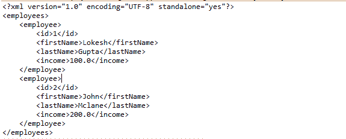

# JAXB –编组和解组列表或对象集

> 原文： [https://howtodoinjava.com/jaxb/jaxb-exmaple-marshalling-and-unmarshalling-list-or-set-of-objects/](https://howtodoinjava.com/jaxb/jaxb-exmaple-marshalling-and-unmarshalling-list-or-set-of-objects/)

我们知道 [JAXB（用于 XML 绑定的 Java 体系结构）](https://en.wikipedia.org/wiki/Java_Architecture_for_XML_Binding "jaxb")允许 Java 开发人员将 Java 类映射到 XML 表示形式。 JAXB 提供了两个主要功能：将 Java 对象编组为 XML 的能力和相反的功能，即将 XML 解组为 Java 对象的能力。 JAXB 主要用于实现 Web 服务或任何其他此类客户端接口的应用程序，在该应用程序中，数据需要以 XML 格式（而不是 HTML 格式）传输，而对于可视客户端（如 Web 浏览器）来说，HTML 格式是默认格式。

一个很好的例子是 facebook API。 Facebook 已通过 [RESTful Web 服务](//howtodoinjava.com/restful-web-service/ "resteasy tutorials")的形式通过一些开放的端点公开了其服务，您在其中单击 URL 并发布了一些参数，而 API 以 xml 格式返回数据。 现在由您决定如何使用这些数据。

在本文中，我以**编组和取消编组**对象的集合为例。 Java 中的这些[集合可以是：`List`和`Set`实现，例如 `ArrayList`或`HashSet`。](//howtodoinjava.com/category/java/collections/ "Java Collections")

## 1）JAXB Maven 依赖关系

要运行 JAXB 示例，我们需要添加运行时 [maven](//howtodoinjava.com/maven/ "maven tutorials") 依赖项，如下所示：

```java
<dependency>
	<groupId>com.sun.xml.bind</groupId>
	<artifactId>jaxb-core</artifactId>
	<version>2.2.8-b01</version>
</dependency>
<dependency>
	<groupId>com.sun.xml.bind</groupId>
	<artifactId>jaxb-impl</artifactId>
	<version>2.2-promoted-b65</version>
</dependency>

```

## 2）模型类别

我创建了一个模型类“ `Employee`”，它具有一些公共字段。 我想构建可以解析一组`employees`的代码。 请注意，JAXB 在最重要的类上需要 [`@XmlRootElement`](https://docs.oracle.com/javaee/5/api/javax/xml/bind/annotation/XmlRootElement.html "XmlRootElement") 批注，我们将对其进行封送或取消封送。

`ArrayList`类是集合框架的一部分，它没有任何 JAXB 批注。 因此，我们需要另外一个类别“ `Employees`”，该类别将代表一组雇员。 现在，在该类中，我们可以添加任何我们喜欢的注释。

```java
@XmlRootElement(name = "employee")
@XmlAccessorType (XmlAccessType.FIELD)
public class Employee 
{
	private Integer id;
	private String firstName;
	private String lastName;
	private double income;

	//Getters and Setters
}

```

```java
import java.util.List;

import javax.xml.bind.annotation.XmlAccessType;
import javax.xml.bind.annotation.XmlAccessorType;
import javax.xml.bind.annotation.XmlElement;
import javax.xml.bind.annotation.XmlRootElement;

@XmlRootElement(name = "employees")
@XmlAccessorType (XmlAccessType.FIELD)
public class Employees 
{
	@XmlElement(name = "employee")
	private List<Employee> employees = null;

	public List<Employee> getEmployees() {
		return employees;
	}

	public void setEmployees(List<Employee> employees) {
		this.employees = employees;
	}
}

```

## 3）将元帅列表转换为 XML 示例

编组是“将 Java 对象转换为 xml 表示形式”。 在下面的示例代码中，我首先在控制台中写入`employees`列表，然后在文件中写入。

```java
//Initialize the employees list
static Employees employees = new Employees();
static 
{
	employees.setEmployees(new ArrayList<Employee>());
	//Create two employees 
	Employee emp1 = new Employee();
	emp1.setId(1);
	emp1.setFirstName("Lokesh");
	emp1.setLastName("Gupta");
	emp1.setIncome(100.0);

	Employee emp2 = new Employee();
	emp2.setId(2);
	emp2.setFirstName("John");
	emp2.setLastName("Mclane");
	emp2.setIncome(200.0);

	//Add the employees in list
	employees.getEmployees().add(emp1);
	employees.getEmployees().add(emp2);
}

private static void marshalingExample() throws JAXBException
{
	JAXBContext jaxbContext = JAXBContext.newInstance(Employees.class);
	Marshaller jaxbMarshaller = jaxbContext.createMarshaller();

	jaxbMarshaller.setProperty(Marshaller.JAXB_FORMATTED_OUTPUT, true);

	//Marshal the employees list in console
	jaxbMarshaller.marshal(employees, System.out);

	//Marshal the employees list in file
	jaxbMarshaller.marshal(employees, new File("c:/temp/employees.xml"));
}

```

上面代码的输出是：



JAXB marshalling example output


## 4）解组 XML 以列出示例

解组是**将 xml 转换回 Java 对象**的过程。 让我们看一下`Employees`类的示例。

```java
private static void unMarshalingExample() throws JAXBException 
{
	JAXBContext jaxbContext = JAXBContext.newInstance(Employees.class);
	Unmarshaller jaxbUnmarshaller = jaxbContext.createUnmarshaller();

	//We had written this file in marshalling example
	Employees emps = (Employees) jaxbUnmarshaller.unmarshal( new File("c:/temp/employees.xml") );

	for(Employee emp : emps.getEmployees())
	{
		System.out.println(emp.getId());
		System.out.println(emp.getFirstName());
	}
}

Output:

1
Lokesh
2
John

```

## 5_ 源代码下载

要下载以上示例的源代码，请点击以下链接。

[Download Sourcecode](https://docs.google.com/file/d/0B7yo2HclmjI4Q0xnUmRNWV9WMjg/edit?usp=sharing "example source code jaxb arraylist")

学习愉快！