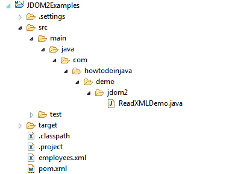

# Java JDOM2 –阅读 XML 示例

> 原文： [https://howtodoinjava.com/xml/jdom2-read-parse-xml-examples/](https://howtodoinjava.com/xml/jdom2-read-parse-xml-examples/)

**JDOM 解析器**可用于在更新 XML 内容后用于读取 XML，解析 XML 和写入 XML 文件。 它将 **JDOM2 文档**存储在内存中，以读取和修改其值。

将 XML 文档加载到内存中后，JDOM2 维护严格的父子类型关系。 父类型的 JDOM 实例（父）具有访问其内容的方法，子类型的 JDOM 实例（内容）具有访问其父对象的方法。

```java
Table of Contents

Project Structure
JDOM2 Maven Dependency
Create JDOM2 Document
Read and filter XML content
Read XML Content with XPath
Complete Example
Sourcecode Download
```

## 项目结构

请创建此文件夹结构以执行示例。 这是在 Eclipse 中创建的[简单 Maven 项目。](//howtodoinjava.com/maven/create-a-simple-java-project-using-maven/)



Project Structure


请注意，我已经使用了 [lambda 表达式](//howtodoinjava.com/java8/complete-lambda-expressions-tutorial-in-java/)和[方法引用](//howtodoinjava.com/java8/lambda-method-references-example/)，因此您需要配置为使用 JDK 1.8。

## JDOM2 Maven 依赖关系

```java
<dependency>
	<groupId>org.jdom</groupId>
	<artifactId>jdom2</artifactId>
	<version>2.0.6</version>
</dependency>

```

要执行 XPath，您还需要 jaxen。

```java
<dependency>
	<groupId>jaxen</groupId>
	<artifactId>jaxen</artifactId>
	<version>1.1.6</version>
</dependency>

```

## 创建 JDOM2 文档

您可以使用下面列出的任何解析器创建`org.jdom2.Document`实例。 它们都解析 XML 并返回**内存中的 JDOM 文档**。

1.  #### 使用 DOM 解析器

    ```java
    private static Document getDOMParsedDocument(final String fileName) 
    {
    	Document document = null;
    	try 
    	{
    		DocumentBuilderFactory factory = DocumentBuilderFactory.newInstance();
    		//If want to make namespace aware.
            //factory.setNamespaceAware(true);
    		DocumentBuilder documentBuilder = factory.newDocumentBuilder();
    		org.w3c.dom.Document w3cDocument = documentBuilder.parse(fileName);
    		document = new DOMBuilder().build(w3cDocument);
    	} 
    	catch (IOException | SAXException | ParserConfigurationException e) 
    	{
    		e.printStackTrace();
    	}
    	return document;
    }

    ```

2.  #### 使用 SAX 解析器

    ```java
    private static Document getSAXParsedDocument(final String fileName) 
    {
    	SAXBuilder builder = new SAXBuilder(); 
    	Document document = null;
    	try 
    	{
    		document = builder.build(fileName);
    	} 
    	catch (JDOMException | IOException e) 
    	{
    		e.printStackTrace();
    	}
    	return document;
    }

    ```

3.  #### 使用 StAX 解析器

    ```java
    private static Document getStAXParsedDocument(final String fileName) 
    {

    	Document document = null;
    	try 
    	{
    		XMLInputFactory factory = XMLInputFactory.newFactory();
    		XMLEventReader reader = factory.createXMLEventReader(new FileReader(fileName));
    		StAXEventBuilder builder = new StAXEventBuilder(); 
    		document = builder.build(reader);
    	} 
    	catch (JDOMException | IOException | XMLStreamException e) 
    	{
    		e.printStackTrace();
    	}
    	return document;
    }

    ```

## 读取和过滤 XML 内容

我将读取`employees.xml`文件。

```java
<employees>
	<employee id="101">
		<firstName>Lokesh</firstName>
		<lastName>Gupta</lastName>
		<country>India</country>
		<department id="25">
			<name>ITS</name>
		</department>
	</employee>
	<employee id="102">
		<firstName>Brian</firstName>
		<lastName>Schultz</lastName>
		<country>USA</country>
		<department id="26">
			<name>DEV</name>
		</department>
	</employee>
</employees>

```

#### 读取根节点

使用`document.getRootElement()`方法。

```java
public static void main(String[] args) 
{
	String xmlFile = "employees.xml";
	Document document = getSAXParsedDocument(xmlFile);

	Element rootNode = document.getRootElement();
	System.out.println("Root Element :: " + rootNode.getName());
}

```

输出：

```java
Root Element :: employees
```

#### 读取属性值

使用 Element.getAttributeValue（）方法。

```java
public static void main(String[] args) 
{
	String xmlFile = "employees.xml";
	Document document = getSAXParsedDocument(xmlFile);

	Element rootNode = document.getRootElement();

	rootNode.getChildren("employee").forEach( ReadXMLDemo::readEmployeeNode );
}

private static void readEmployeeNode(Element employeeNode) 
{
	//Employee Id
	System.out.println("Id : " + employeeNode.getAttributeValue("id"));
}

```

Output:

```java
Id : 101
Id : 102
```

#### 读取元素值

使用`Element.getChildText()`或`Element.getText()`方法。

```java
public static void main(String[] args) 
{
	String xmlFile = "employees.xml";
	Document document = getSAXParsedDocument(xmlFile);

	Element rootNode = document.getRootElement();

	rootNode.getChildren("employee").forEach( ReadXMLDemo::readEmployeeNode );
}

private static void readEmployeeNode(Element employeeNode) 
{
	//Employee Id
	System.out.println("Id : " + employeeNode.getAttributeValue("id"));

	//First Name
	System.out.println("FirstName : " + employeeNode.getChildText("firstName"));

	//Last Name
	System.out.println("LastName : " + employeeNode.getChildText("lastName"));

	//Country
	System.out.println("country : " + employeeNode.getChild("country").getText());

	/**Read Department Content*/
	employeeNode.getChildren("department").forEach( ReadXMLDemo::readDepartmentNode );
}

private static void readDepartmentNode(Element deptNode) 
{
	//Department Id
	System.out.println("Department Id : " + deptNode.getAttributeValue("id"));

	//Department Name
	System.out.println("Department Name : " + deptNode.getChildText("name"));
}

```

Output:

```java
FirstName : Lokesh
LastName : Gupta
country : India
Department Id : 25
Department Name : ITS

FirstName : Brian
LastName : Schultz
country : USA
Department Id : 26
Department Name : DEV
```

## 使用 XPath 读取 XML 内容

要使用 [xpath](//howtodoinjava.com/xml/how-to-work-with-xpaths-in-java-with-examples/) 读取任何元素的值集，您需要编译`XPathExpression`并使用其`evaluate()`方法。

```java
String xmlFile = "employees.xml";
Document document = getSAXParsedDocument(xmlFile);

XPathFactory xpfac = XPathFactory.instance();

//Read employee ids
XPathExpression<Attribute> xPathA = xpfac.compile("//employees/employee/@id", Filters.attribute());

for (Attribute att : xPathA.evaluate(document)) 
{
	System.out.println("Employee Ids :: " + att.getValue());
}

//Read employee first names
XPathExpression<Element> xPathN = xpfac.compile("//employees/employee/firstName", Filters.element());

for (Element element : xPathN.evaluate(document)) 
{
	System.out.println("Employee First Name :: " + element.getValue());
}

```

Output:

```java
Employee Ids :: 101
Employee Ids :: 102

Employee First Name :: Lokesh
Employee First Name :: Brian
```

## 完整的 JDOM2 Read XML 示例

这是在 Java 中使用 JDOM2 **读取 xml 的完整代码。**

```java
package com.howtodoinjava.demo.jdom2;

import java.io.FileReader;
import java.io.IOException;

import javax.xml.parsers.DocumentBuilder;
import javax.xml.parsers.DocumentBuilderFactory;
import javax.xml.parsers.ParserConfigurationException;
import javax.xml.stream.XMLEventReader;
import javax.xml.stream.XMLInputFactory;
import javax.xml.stream.XMLStreamException;

import org.jdom2.Attribute;
import org.jdom2.Document;
import org.jdom2.Element;
import org.jdom2.JDOMException;
import org.jdom2.filter.Filters;
import org.jdom2.input.DOMBuilder;
import org.jdom2.input.SAXBuilder;
import org.jdom2.input.StAXEventBuilder;
import org.jdom2.xpath.XPathExpression;
import org.jdom2.xpath.XPathFactory;
import org.xml.sax.SAXException;

@SuppressWarnings("unused")
public class ReadXMLDemo 
{	
	public static void main(String[] args) 
	{
		String xmlFile = "employees.xml";
		Document document = getSAXParsedDocument(xmlFile);

		/**Read Document Content*/

		Element rootNode = document.getRootElement();
		System.out.println("Root Element :: " + rootNode.getName());

		System.out.println("\n=================================\n");

		/**Read Employee Content*/

		rootNode.getChildren("employee").forEach( ReadXMLDemo::readEmployeeNode );

		System.out.println("\n=================================\n");

		readByXPath(document);
	}

	private static void readEmployeeNode(Element employeeNode) 
	{
		//Employee Id
		System.out.println("Id : " + employeeNode.getAttributeValue("id"));

		//First Name
		System.out.println("FirstName : " + employeeNode.getChildText("firstName"));

		//Last Name
		System.out.println("LastName : " + employeeNode.getChildText("lastName"));

		//Country
		System.out.println("country : " + employeeNode.getChild("country").getText());

		/**Read Department Content*/
		employeeNode.getChildren("department").forEach( ReadXMLDemo::readDepartmentNode );
	}

	private static void readDepartmentNode(Element deptNode) 
	{
		//Department Id
		System.out.println("Department Id : " + deptNode.getAttributeValue("id"));

		//Department Name
		System.out.println("Department Name : " + deptNode.getChildText("name"));
	}

	private static void readByXPath(Document document) 
	{
		//Read employee ids
		XPathFactory xpfac = XPathFactory.instance();
		XPathExpression<Attribute> xPathA = xpfac.compile("//employees/employee/@id", Filters.attribute());
		for (Attribute att : xPathA.evaluate(document)) 
		{
			System.out.println("Employee Ids :: " + att.getValue());
		}

		XPathExpression<Element> xPathN = xpfac.compile("//employees/employee/firstName", Filters.element());
		for (Element element : xPathN.evaluate(document)) 
		{
			System.out.println("Employee First Name :: " + element.getValue());
		}
	}

	private static Document getSAXParsedDocument(final String fileName) 
	{
		SAXBuilder builder = new SAXBuilder(); 
		Document document = null;
		try 
		{
			document = builder.build(fileName);
		} 
		catch (JDOMException | IOException e) 
		{
			e.printStackTrace();
		}
		return document;
	}

	private static Document getStAXParsedDocument(final String fileName) 
	{

		Document document = null;
		try 
		{
			XMLInputFactory factory = XMLInputFactory.newFactory();
			XMLEventReader reader = factory.createXMLEventReader(new FileReader(fileName));
			StAXEventBuilder builder = new StAXEventBuilder(); 
			document = builder.build(reader);
		} 
		catch (JDOMException | IOException | XMLStreamException e) 
		{
			e.printStackTrace();
		}
		return document;
	}

	private static Document getDOMParsedDocument(final String fileName) 
	{
		Document document = null;
		try 
		{
			DocumentBuilderFactory factory = DocumentBuilderFactory.newInstance();
			//If want to make namespace aware.
	        //factory.setNamespaceAware(true);
			DocumentBuilder documentBuilder = factory.newDocumentBuilder();
			org.w3c.dom.Document w3cDocument = documentBuilder.parse(fileName);
			document = new DOMBuilder().build(w3cDocument);
		} 
		catch (IOException | SAXException | ParserConfigurationException e) 
		{
			e.printStackTrace();
		}
		return document;
	}

	/*private static String readFileContent(String filePath) 
	{
	    StringBuilder contentBuilder = new StringBuilder();
	    try (Stream<String> stream = Files.lines( Paths.get(filePath), StandardCharsets.UTF_8)) 
	    {
	        stream.forEach(s -> contentBuilder.append(s).append("\n"));
	    }
	    catch (IOException e) 
	    {
	        e.printStackTrace();
	    }
	    return contentBuilder.toString();
	}*/
}

```

Output:

```java
Root Element :: employees

=================================

Id : 101
FirstName : Lokesh
LastName : Gupta
country : India
Department Id : 25
Department Name : ITS
Id : 102
FirstName : Brian
LastName : Schultz
country : USA
Department Id : 26
Department Name : DEV

=================================

Employee Ids :: 101
Employee Ids :: 102
Employee First Name :: Lokesh
Employee First Name :: Brian
```

## 源代码下载

[Download Sourcecode](//howtodoinjava.com/wp-content/downloads/JDOM2Examples.zip)

学习愉快！

参考文献：

[JDOM 网站](http://www.jdom.org/)
[JDOM2 入门](https://github.com/hunterhacker/jdom/wiki/JDOM2-A-Primer)