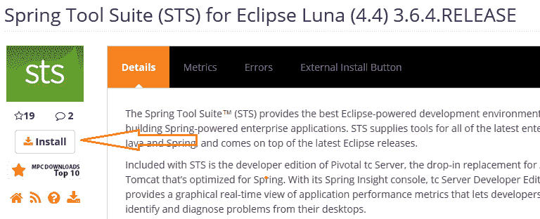
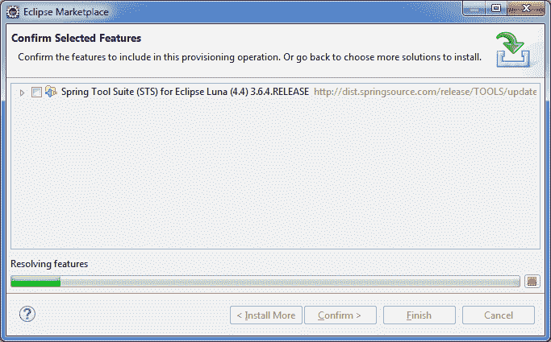
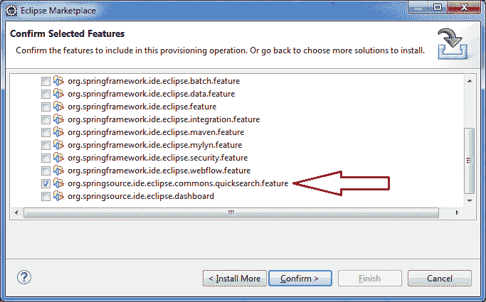
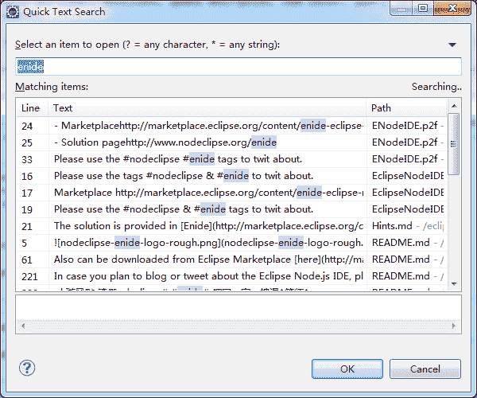

# 使用 Eclipse 快速搜索插件进行更快的文本搜索

> 原文： [https://howtodoinjava.com/eclipse/use-eclipse-quick-search-plugin-for-faster-text-searches/](https://howtodoinjava.com/eclipse/use-eclipse-quick-search-plugin-for-faster-text-searches/)

昨天，我遇到了很好的 **eclipse 插件，用于在 Eclipse** 工作区中进行文本搜索。 你们中的一些人可能已经意识到了这一点，但是对于那些尚不了解的人，请继续安装此插件，并提高您的开发技能的速度。

**eclipse 快速搜索插件**是 **Spring Tools Suite（STS）**的一部分。 因此，如果您在 Eclipse 中安装了 STS，那么很可能已经安装了它。

## 安装 Eclipse 快速搜索

1）要安装 eclipse 快速搜索，请转到您拥有的 Eclipse 版本的 STS 版本。 快速的 Google 搜索可以将您定向到那里。 例如，我的开发机器上已经使 Luna 黯然失色，所以我通过此链接使用 STS。

> [http://marketplace.eclipse.org/content/spring-tool-suite-sts-eclipse-luna-44](https://marketplace.eclipse.org/content/spring-tool-suite-sts-eclipse-luna-44 "sts")

2）现在，将安装按钮拖到 Eclipse 工作区，它将打开一个窗口，以帮助您进行进一步的安装。 （在某些版本中，安装可能从后端开始）。

3）现在，从可用功能列表中选择快速搜索功能并安装它。

4）您可能需要重新启动 Eclipse。 重新启动。 现在按命令 **`CTRL + SHIFT + L`** 打开快速搜索编辑器。

**祝您学习愉快！**