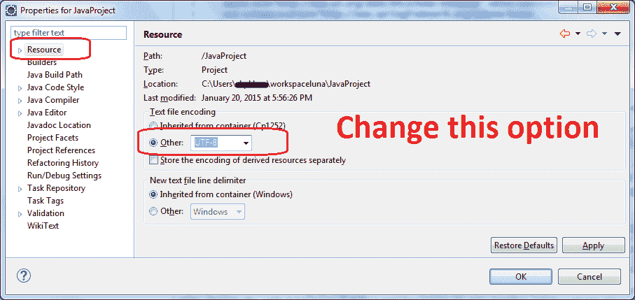
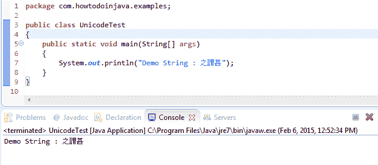
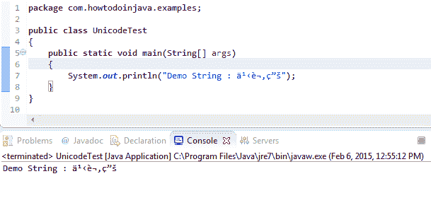

# 如何在日食中显示非英文 unicode（例如中文）字符

> 原文： [https://howtodoinjava.com/eclipse/how-to-display-non-english-unicode-e-g-chinese-characters-in-eclipse/](https://howtodoinjava.com/eclipse/how-to-display-non-english-unicode-e-g-chinese-characters-in-eclipse/)

如果您不是讲英语的国家/地区的原住民，并且正在针对您的语言环境测试应用，则可能会难以通过 Eclipse 控制台测试应用。 默认情况下，Eclipse 会将非英语字符转换为问号（？）或一些奇怪的字符，因为默认情况下 **eclipse 的控制台编码为 Cp1252 或 ASCII** ，它们无法显示其他非英语单词。

通过设置以下选项，您可以轻松地**将默认编码更改为 UTF-8** ，即 Unicode。

Eclipse change default encoding to unicode

现在，当您在 IDE 中使用任何非英语字符甚至在控制台中进行打印时，它都可以完美工作。

Successful Eclipse Unicode Translation

在这里，如果不添加 Unicode 支持，则上述程序将如下所示。

Incorrect Eclipse Unicode Translation

If you want to apply Unicode UTF-8 for all projects all the time, then you should set it in eclipse.ini file.

-Dfile.encoding = UTF-8

如果有不清楚的地方，请给我留言。

**祝您学习愉快！**