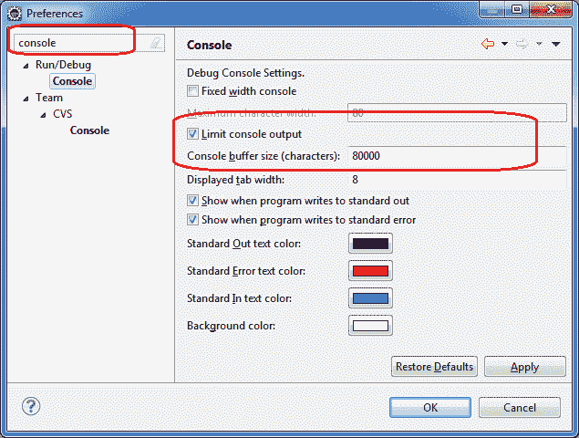

# 如何在 Eclipse 中增加控制台输出限制

> 原文： [https://howtodoinjava.com/eclipse/how-to-increase-console-output-limit-in-eclipse/](https://howtodoinjava.com/eclipse/how-to-increase-console-output-limit-in-eclipse/)

通常，当我们尝试使用 Eclipse 调试器调试关键问题时，我们需要查看控制台输出。 但是，如果您将日志记录级别设置为“调试”，则应用会将大量日志语句转储到控制台中。 很多时候，日志语句只是在此日志语句转储中丢失了。

您可以通过在控制台中通过**增加日志语句的限制来简单地解决此问题，或者简单地将所有限制都一起删除**。 可以在 Eclipse 中进行以下设置来完成此设置：

1）转到“窗口 -> 首选项 -> 运行/调试 -> 控制台”
2）增加控制台缓冲区的大小
2）或直接取消选中“限制控制台输出”

增加 Eclipse 中的控制台输出限制

就这样。 您将有更多的垃圾箱来调查您的问题。

**祝您学习愉快！**