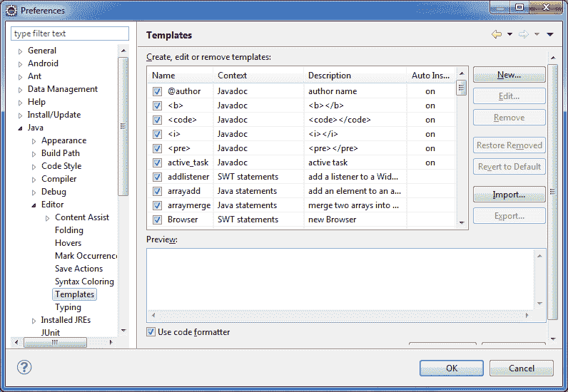
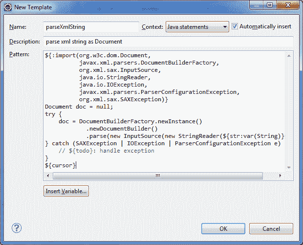
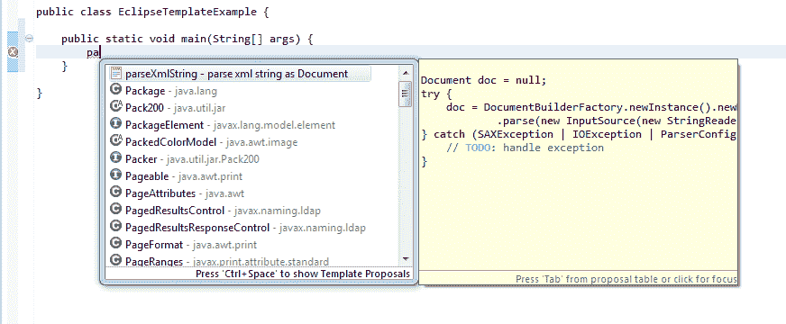
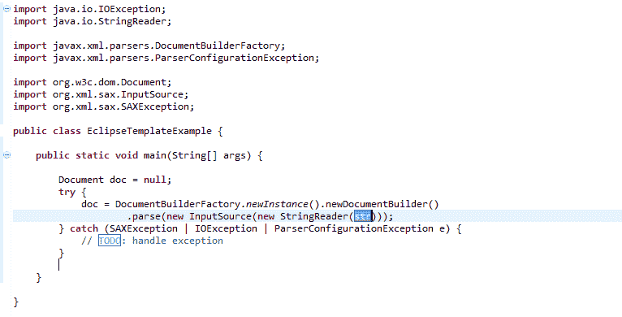

# 创建 Eclipse 模板以加快 Java 编码

> 原文： [https://howtodoinjava.com/eclipse/create-eclipse-templates-for-faster-java-coding/](https://howtodoinjava.com/eclipse/create-eclipse-templates-for-faster-java-coding/)

我们大多数使用 **Eclipse IDE** 编写代码的人，都必须使用`main`或`sysout`之类的快捷方式，然后点击`CTRL+SPACE`，它将快捷方式转换为公共*静态 void main （字符串[] args）{…}* 和 *System.out.println()*。 这是一项非常有用的功能，每当我为项目或教程编写代码时，我就一直使用它。

好消息是**，您也可以在此列表中添加自己的模板**，并利用此功能。 例如 解析作为参数传递的 XML 字符串是非常普遍的要求。 解析此类 XML 字符串的代码始终几乎相同。 我们可以为其创建模板，然后在需要时使用其快捷方式。

## 如何创建新的日食模板

要创建 XML 字符串解析的快捷方式，请按照以下步骤操作：
 ****1）**通过转到**打开“首选项”对话框 Windows->首选项
**2）**在左侧导航树上，转到 **Java->编辑器 ->模板**
**3）** 预定义模板



Eclipse Predefined Templates


**4）**按下“ New…”按钮添加新模板。
**5）**填写以下模板信息并保存



Create New Template


**6）**使用 CTRL + SPACE 在任何 Java 源文件中使用模板



Use template Shortcut


**7）**按下 Enter，它将生成下面的代码 a。 请享用 ！！



Code inserted in place of shortcut


您会看到它很有用。 现在，让我们记下一些可以直接使用的代码模板。

## 有用的 Eclipse 模板示例

## 1）IO 模板文件

以下模板对于读取或写入文件很有用。 他们使用 Java 7 功能（如 try-with-resources）自动关闭文件。 他们还使用 NIO2.0 中的方法来获取缓冲的读取器并读取文件。

**a）从文件**中读取文本

```java
${:import(java.nio.file.Files,
          java.nio.file.Paths,
          java.nio.charset.Charset,
          java.io.IOException,
          java.io.BufferedReader)}
try (BufferedReader in = Files.newBufferedReader(Paths.get(${fileName:var(String)}),
                                                 Charset.forName("UTF-8"))) {
    String line = null;
    while ((line = in.readLine()) != null) {
        ${cursor}
    }
} catch (IOException e) {
    // ${todo}: handle exception
}

```

**b）从列表中的文件中读取所有行**

```java
${:import(java.nio.file.Files,
          java.nio.file.Paths,
          java.nio.charset.Charset,
          java.util.List,
          java.util.ArrayList)}
Lis<String> lines = new ArrayList<>();
try{
    lines = Files.readAllLines(Paths.get(${fileName:var(String)}),
                                        Charset.forName("UTF-8"));
}catch (IOException e) {
    // ${todo}: handle exception
}
${cursor}

```

**c）写入文件**

```java
${:import(java.nio.file.Files,
          java.nio.file.Paths,
          java.nio.Charset,
          java.io.IOException,
          java.io.BufferedWriter)}
try (BufferedWriter out = Files.newBufferedWriter(Paths.get(${fileName:var(String)}),
                                                  Charset.forName("UTF-8"))) {
    out.write(${string:var(String)});
    out.newLine();
    ${cursor}
} catch (IOException e) {
    // ${todo}: handle exception
}

```

## 2）XML I / O 模板

以下模板用于读取 xml 文件或字符串并返回 DOM。

**a）将 XML 文件解析为文档**

```java
${:import(org.w3c.dom.Document,
          javax.xml.parsers.DocumentBuilderFactory,
          java.io.File,
          java.io.IOException,
          javax.xml.parsers.ParserConfigurationException,
          org.xml.sax.SAXException)}
Document doc = null;
try {
    doc = DocumentBuilderFactory.newInstance()
            .newDocumentBuilder()
            .parse(new File(${filename:var(String)}));
} catch (SAXException | IOException | ParserConfigurationException e) {
    // ${todo}: handle exception
}
${cursor}

```

**b）将 XML 字符串解析为文档**

```java
${:import(org.w3c.dom.Document,
          javax.xml.parsers.DocumentBuilderFactory,
          org.xml.sax.InputSource,
          java.io.StringReader,
          java.io.IOException,
          javax.xml.parsers.ParserConfigurationException,
          org.xml.sax.SAXException)}
Document doc = null;
try {
    doc = DocumentBuilderFactory.newInstance()
            .newDocumentBuilder()
            .parse(new InputSource(new StringReader(${str:var(String)})));
} catch (SAXException | IOException | ParserConfigurationException e) {
    // ${todo}: handle exception
}
${cursor}

```

## 3）记录模板

以下模板对于创建记录器和记录消息很有用。 我使用的是 SLF4J，但是可以很容易地对其进行调整，以使用任何其他日志记录框架。

**a）创建一个新的记录器**

```java
${:import(org.slf4j.Logger,
          org.slf4j.LoggerFactory)}
private static final Logger LOGGER = LoggerFactory.getLogger(${enclosing_type}.class);

```

**b）在放置调试日志**之前检查调试范围

```java
if(LOGGER.isDebugEnabled())
     LOGGER.debug(${word_selection}${});
${cursor}

```

**c）日志信息级别声明**

```java
LOGGER.info(${word_selection}${});
${cursor}

```

**d）记录错误**

```java
LOGGER.error(${word_selection}${}, ${exception_variable_name});

```

**e）记录错误并引发异常**

```java
LOGGER.error(${word_selection}${}, ${exception_variable_name});
throw ${exception_variable_name};
${cursor}

```

## 4）JUNIT 模板

**a）方法**之前的 Junit

```java
${:import (org.junit.Before)}

@Before
public void setUp() {
    ${cursor}
}

```

**b）方法**之后的 Junit

```java
${:import (org.junit.After)}

@After
public void tearDown() {
    ${cursor}
}

```

**c）**上课之前的 Junit

```java
${:import (org.junit.BeforeClass)}

@BeforeClass
public static void oneTimeSetUp() {
    // one-time initialization code
    ${cursor}
}

```

**d）下课后的**

```java
${:import (org.junit.AfterClass)}

@AfterClass
public static void oneTimeTearDown() {
    // one-time cleanup code
    ${cursor}
}

```

Please note that these templates can be defined for other file types such as XML, JSPs etc. More templates can be found here in given links:

[http://stackoverflow.com/questions/1028858/useful-eclipse-java-code-templates](https://stackoverflow.com/questions/1028858/useful-eclipse-java-code-templates)
[http://eclipse.dzone.com/news/effective-eclipse-custom -templ](http://eclipse.dzone.com/news/effective-eclipse-custom-templ)

**祝您学习愉快！**