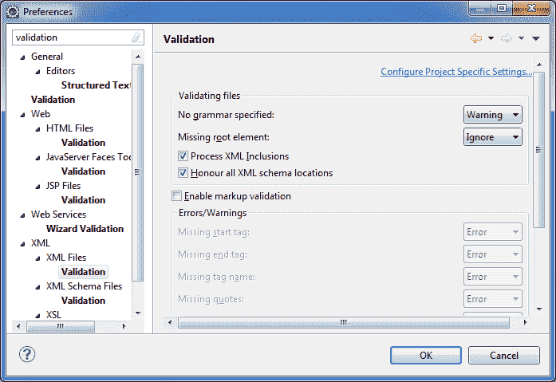

# 在 5 分钟内使 Eclipse 更快

> 原文： [https://howtodoinjava.com/eclipse/how-to-quickly-make-eclipse-faster/](https://howtodoinjava.com/eclipse/how-to-quickly-make-eclipse-faster/)

一旦我们开始进行 Eclipse 工作，它就会逐渐变慢。 为了提高性能并加快食蚀的速度，可以使用某些方法来查看明显的差异。 这些有效的方法如下：

```java
1) Clean up history and indexes
2) Remove structured text validation
3) Do not use subclipse plugin
4) Configure appropriate start-up arguments
```

让我们一一详细了解它们：

## 1）清理历史和索引

清理历史记录和索引可以减少 RAM 上的负载以及整体 HDD 的使用。 这会对性能产生很大的影响。 要删除索引和历史记录文件夹，请清除以下两个文件夹中的所有文件/文件夹：

**用于清理索引**

```
{workspace path}\.metadata\.plugins\org.eclipse.jdt.core
```

**用于清除历史记录**

```
{workspace path}\.metadata\.plugins\org.eclipse.core.resources\.history
```

这里`{workspace path}`是您在其中创建所有项目的 Eclipse 工作区的路径。

请注意，从两个文件夹上方删除文件不会以任何方式影响您的任何项目源代码。

## 2）删除结构化文本验证

这也产生了很大的影响。 这里的验证必定意味着 eclipse 在后台会对源代码文件执行多项操作以检查其有效性。 这些有时有时也不必要并且令人讨厌。 我参与了一些由许多 XML/XSLT 和 WSDL 文件组成的项目，并且其中一些文件总是显示一些危险信号。 但是他们实际上在大多数情况下在运行时都产生了问题，即使这实际上也是正确的处理方式。

您可以关闭这些验证（对于您认为不必要的所有类型），并享受 Eclipse。

要关闭这些文本验证，请打开“Windows -> 首选项”，然后在搜索栏中键入“验证”。 它将列出所有文件类型并对其进行验证。 禁用任何您认为不必要的东西。 然后单击“确定”。



## 3）不要使用 subclipse 插件

该技术确实有效，但难以遵循。 它说您应该只在 eclipse 中使用代码来编写/修改和执行。 与 SVN/perforce 或任何代码仓库相关的所有其他事情都应在 eclipse 之外完成。 这可以来自命令行工具或任何可视客户端。

Subversion 插件占用了过多的系统资源，严重影响了 Eclipse 的性能。

即使您确实想使用它，也可以通过子剪辑仅检出部分代码，并将其余代码导入为外部项目。 它也将为您提供帮助。

## 4）配置适当的启动参数

在您的`eclipse.ini`文件（位于 Eclipse 安装文件夹中）中，根据需要更改默认的`-Xms40m -Xmx256m`参数。 此选项定义传递给 Java 虚拟内存以管理 Eclipse 应用的内存分配容限的最小和最大内存使用范围。 您不应将它们设置为最大可用，因为您需要并行运行其他软件。

您应该尝试使用`-Xms`和`-Xmx`选项的不同组合，然后确定哪一种最适合您，并使 Eclipse 最快。

示例配置如下所示：

```java
-startup
plugins/org.eclipse.equinox.launcher_1.3.0.v20120522-1813.jar
--launcher.library
plugins/org.eclipse.equinox.launcher.win32.win32.x86_1.1.200.v20120522-1813
-product
org.eclipse.epp.package.jee.product
--launcher.defaultAction
openFile
--launcher.XXMaxPermSize
256M
-showsplash
org.eclipse.platform
--launcher.XXMaxPermSize
256m
--launcher.defaultAction
openFile
-vmargs
-Dosgi.requiredJavaVersion=1.5
-Dhelp.lucene.tokenizer=standard
-Xms256m
-Xmx1024m

```

## 温馨提示：在`eclipse.ini`中使用`-Xverify:none`，`-Xquickstart`和 `-server`或`-client`

##### `-Xquickstart`

您可以使用`-Xquickstart`进行初始编译，而优化级别要比默认模式低。 以后，根据采样结果，您可以在默认模式下重新编译为初始编译的级别。 对于早期中等速度比长期吞吐量更重要的应用，请使用`-Xquickstart`。 在某些调试方案，测试工具和短期运行的工具中，您可以将启动时间缩短 15% 至 20%。

##### `-Xverify:none`

如果要在类加载期间跳过类验证阶段，可以使用`-Xverify:none`。 使用`-Xverify:none`将禁用 Java 类验证，这可以将启动时间缩短 10-15%。 但是，指定此选项时，不会检测到损坏或无效的类数据。 如果加载了损坏的类数据，则 Java 虚拟机（JVM）可能会以意外的方式运行，或者 JVM 可能会失败。 但这只有在您自己修改字节码时才会发生。

##### `-server`或`-client`

基于 Sun 的 Java 开发工具包（JDK）1.4.2 版中的 Java HotSpot 技术引入了一种自适应 JVM，其中包含用于随着时间的推移优化字节代码执行的算法。 JVM 以两种模式运行`-server`和`-client`。 如果使用默认的`-client`模式，将有更快的启动时间和较小的内存占用，但扩展性能较低。 如果允许 HotSpot JVM 通过连续执行字节代码来预热足够的时间，则可以使用`-server`模式来提高性能。 在大多数情况下，请使用`-server`模式，该模式可在更长的时间内产生更有效的运行时执行。 您可以监视进程大小和服务器启动时间，以检查`-client`和`-server`之间的差异。

现在就这样。 如果您知道除上述技术以外的任何其他技术，请与我们分享。

**祝您学习愉快！**