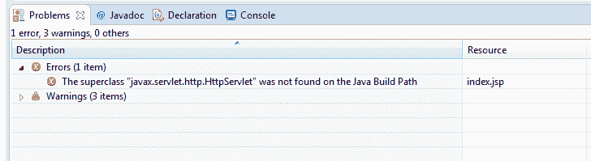
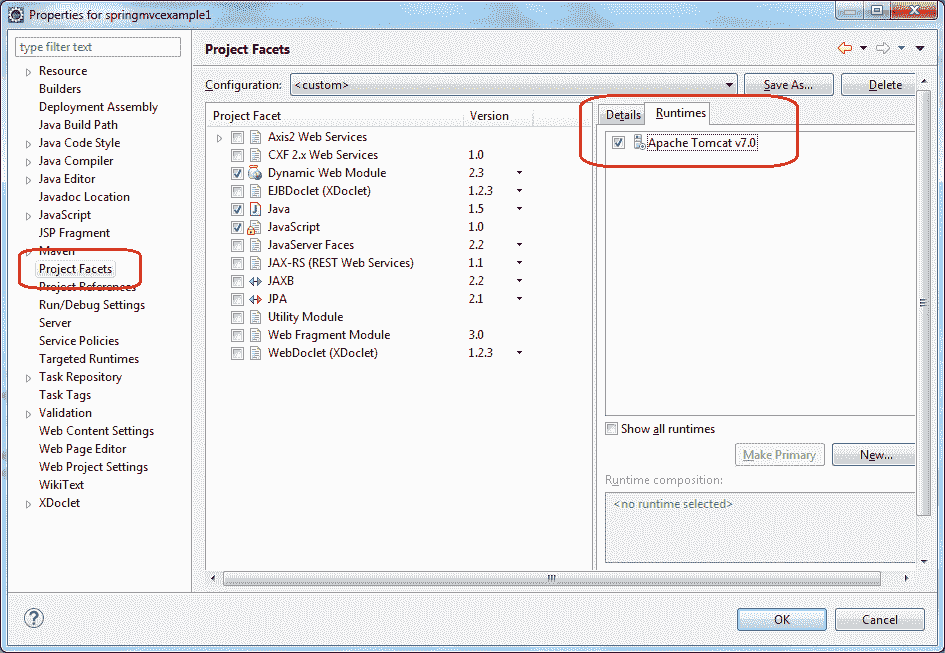

# [已解决]在 Eclipse 的 Java 构建路径中找不到超类“ javax.servlet.http.HttpServlet”

> 原文： [https://howtodoinjava.com/eclipse/solved-the-superclass-javax-servlet-http-httpservlet-was-not-found-on-the-java-build-path-in-eclipse/](https://howtodoinjava.com/eclipse/solved-the-superclass-javax-servlet-http-httpservlet-was-not-found-on-the-java-build-path-in-eclipse/)

如果将现有的 maven 项目导入 eclipse IDE 后遇到此错误，则表明该项目的类路径中没有 http-servlet，因此必须将其包括在内。

错误看起来像这样。



Java Build Path Error


## 解

要将 http-servlet 包含到类路径中，您有两个选择：

#### 1）添加目标运行时

在此解决方案中，您可以将所需的服务器运行时作为项目构面添加到您的应用程序中。 由于运行时服务器已经具有 servlet 运行时相关性，因此它们已包含在您的项目中，因此错误消失了。



#### 2）添加 Maven 依赖

另一个选择是通过 maven 本身包括 servlet 依赖关系。 这也将修复错误。

```java
<dependency>
	<groupId>javax.servlet</groupId>
	<artifactId>servlet-api</artifactId>
	<version>2.5</version>
</dependency>

```

**祝您学习愉快！**