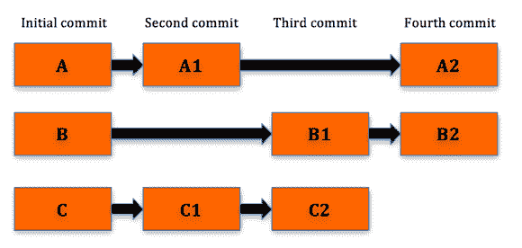

# 版本控制系统（VCS）如何工作？

> 原文： [https://howtodoinjava.com/vcs/how-version-control-system-vcs-works/](https://howtodoinjava.com/vcs/how-version-control-system-vcs-works/)

如果您是开发人员或正在测试，则必须使用源代码仓库（也称为**版本控制系统**）。 您可能使用过 **CVS** ， **SVN** 和 **Perforce** 等。在本文中，我将带您了解版本控制系统的**基础 ]，这将有助于我们了解传统版本控制系统的主要优缺点。**

## 传统 VCS 的工作原理

传统的 VCS 具有集中式服务器，该服务器充当源代码仓库。 除了存储代码外，这些工具还维护每次提交的修订历史记录。

在下图中，我们有 3 个文件 A，B 和 C。 项目更改以四个方面提交，即初始提交，第二，第三和第四次提交。

当在第二次提交中对文件 A 和 C 进行更改时，仅差异或增量更改将应用​​于初始文件并存储。 类似地，当在第三次提交中对 B 和 C 文件的顶部执行另一次更改时，仅将 B 和 C 的增量更改存储为提交的一部分。

请注意，在任何给定的时间点，如果我们要获取整个代码库的当前状态，将无法获得，因为对于给定的提交，我们只能获得与上次文件更改相比的增量变化。 承诺。

例如，当我们比较两个提交时，我们仅获得具有更改的文件，并且可以看到对文件所做的实际更改，我们将其称为增量。

您绝对可以要求一个文件的某些先前版本，但是您不能要求整个工作区在几次提交之前是什么。 如果要查看工作区如何查看给定的提交，则必须采用基本版本和路径，其中所有提交都已完成，直到达到所需的提交为止。 因此，您将只能获得最新版本。 或基本修订。 因此，VCS 仅存储差异。

## 传统 VCS 的优势

1.  所有源代码都安全地存储在中央服务器上的安全位置。
2.  如果由于系统或硬盘崩溃而导致本地计算机上的源代码丢失，那么从 VCS 中获取代码可以还原该源代码。
3.  可以在 VCS 上进行身份验证和授权。
4.  VCS 负责管理版本控制，并且如果存在任何冲突，将不允许提交。
5.  维护提交日志以获取开发人员的提交信息。

让我们也介绍一下这种方法的一些缺点。

## 传统 VCS 的缺点

由于 VCS 驻留在服务器上，并且在托管代码，对文件进行版本控制，维护提交日志信息方面承担了所有繁重的工作，因此客户端仅被限制为获取代码的最新副本并工作，最后将所做的更改提交给客户端。 VCS。 客户端计算机上的代码仅仅是工作副本，而不是整个仓库本身。 现在让我们看看这种方法的主要缺点。 让我借助示例进行解释。

1.  假设有 5 个开发人员正在使用 VCS，并且他们都使用功能并将更改提交到仓库。 不幸的是，VCS 崩溃，并且没有备份。 我们剩下的是使用最后一次稳定的提交来还原 VCS。 现在，由于修订历史记录和提交日志都保存在 VCS 服务器上，并且开发人员计算机上存在的代码库只是普通的工作副本，因此我们无法自信地将 VCS 置于上一个提交状态。
2.  这是我们遇到的常见情况。 我们执行的几乎所有操作（如检查文件差异，提交，合并等）都只能在 VCS 启动时执行。 由于某些原因，如果 VCS 暂时关闭，例如网络中断，服务器维护，则将阻止所有访问 VCS 的用户。 即使简单的操作（如将文件与以前的版本进行比较）也无法完成。
3.  这种集中式仓库的另一个缺点是与分支有关。 当我们在进行项目时，我们有主干或主分支，它们被认为是事实的来源，将被用于与诸如 Jenkins 之类的构建工具集成。 为了进行开发，我们从主干创建一个分支，在该分支上工作，然后在该分支上进行测试，最后将所做的更改合并回创建标记的主干，并最终将其推送进行部署。 请注意，分支是在服务器上创建的。 另外，如果两个开发人员希望使用某个功能并希望彼此合作而不影响其他人的代码，那么他们将不得不求助于分支机构，该分支机构又将位于服务器上。 因此，在一段时间内，服务器将充满许多分支。
4.  VCS 的另一个缺点是可伸缩性。 想象一下在一个开源项目中工作，在该项目中成千上万的开发人员需要工作，并且创建了成千上万的分支机构。 合并更改和管理分支机构是一场噩梦，而传统的版本控制系统是无法实现的。

集中版本控制工具在软件开发中扮演着重要的角色，并将继续发挥作用，但是当项目发展壮大时，对于高可用性和关键项目，这可能不是最佳解决方案，因为还有其他更好的选择。 了解集中式 VCS 的弊端有助于我们确定促使我们探索其他选项的因素，例如**分布式版本控制系统**，例如 **Git** ， **Mercurial** 等 。

**关于作者：**

以上文章由该博客的其中一位读者 Pradeep Kumar（ [**@pradeepkumarl**](https://twitter.com/pradeepkumarl) ）提供。 他是一位拥有 10 多年经验的软件开发人员，并且曾使用过各种版本控制工具，例如 SVN，Perforce，ClearCase 和 Git。 他对技术充满热情，并热爱教技术。 您可以在 [**Git – 专家新手**](http://prashdeep.usefedora.com) 上查看他的在线课程之一。

**祝您学习愉快！**