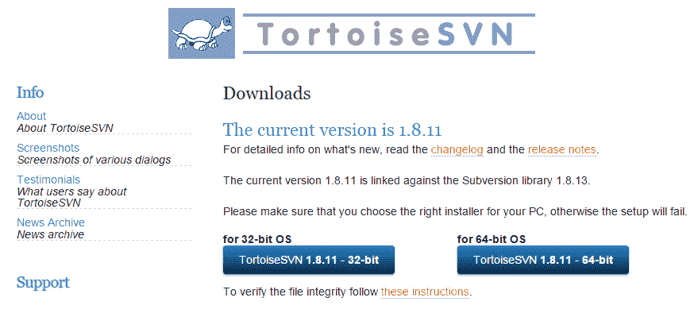
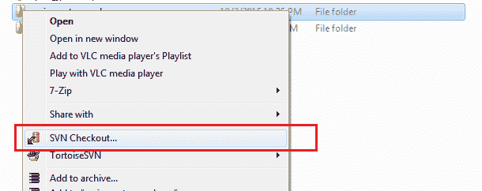
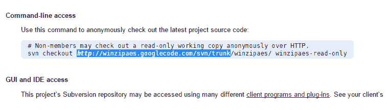
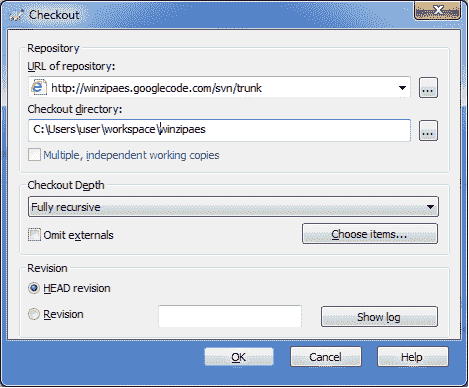

# 如何从 Google Code 项目中签出源代码

> 原文： [https://howtodoinjava.com/vcs/checkout-sourcecode-from-google-code-projects/](https://howtodoinjava.com/vcs/checkout-sourcecode-from-google-code-projects/)

如果您转到 [Github](https://github.com/) 项目，它们会为您提供一个链接，以 zip 文件的形式下载源代码（如果您不想配置任何 git 客户端）。 但是在 [Google 代码项目](https://code.google.com/)中，某些项目没有为您提供此选项，而是向您显示 **SVN URL 来检出**。 在本教程中，我提供了一个示例，该示例使用 [Tortoise SVN 客户端](http://tortoisesvn.net/downloads.html)从`code.google.com`检出源代码到本地计算机。

## 1）下载任何 SVN 客户端的安装文件（例如 Tortoise）

转到 [http://tortoisesvn.net/downloads.html](http://tortoisesvn.net/downloads.html) 并将其最新版本安装在开发计算机中。

Tortoise svn 下载页面

## 2）在文件系统中创建一个空白文件夹并签出源代码

现在**在您的工作区中创建一个空文件夹**。 然后**右键单击**。 单击“**SVN Checkout…**”选项。

SVN 检出截图

现在，将 google 代码项目中的 SVN 检出 URL 复制直到`trunk`。

复制源代码检出 URL 直到`trunk`

在工作区的签出对话框中复制路径，然后单击“确定”。

在检出对话框中复制 URL

现在，所有文件将从 Google Code 项目下载到本地工作区。 在合适的编辑器中导入代码并开始进行处理。

**祝您学习愉快！**