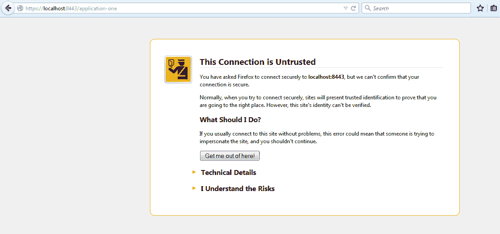
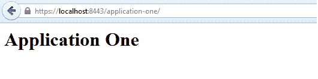
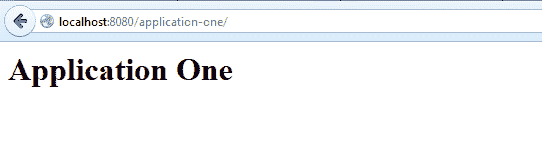

# Tomcat SSL 或 HTTPS 配置示例

> 原文： [https://howtodoinjava.com/tomcat/how-to-configure-tomcat-with-ssl-or-https/](https://howtodoinjava.com/tomcat/how-to-configure-tomcat-with-ssl-or-https/)

[**安全套接字层（SSL）**](https://www.digicert.com/ssl.htm "ssl") 是用于使用加密方法在互联网上进行通信的安全传输协议。 SSL 协议的主要目的是确保**不会有人篡改浏览器与部署 Web 应用的服务器**之间的通信。 安全通信的另一个目的是**根据 SSL 信息对服务器及其所有者进行身份验证的能力 – 这样，用户就可以确定它正在访问的服务器**。 在常见的 SSL 方案中，当用户首次访问 Web 服务器时，服务器会将其 SSL 证书或公共密钥发送给客户端。 SSL 证书包含有关服务器，其所有者，公司及其有效期的信息。 如果用户不信任证书的真实性，则可以拒绝该证书，从而有效地终止连接。 如果用户接受证书，则证书本身存储在浏览器中，并用于启动与发行服务器的安全连接。

通过 HTTP 协议进行的 SSL 协议通信称为 **HTTPS** （安全 HTTP）。 使用 SSL 加密连接的网站在浏览器的地址栏中显示 https 作为协议名称，例如。 名为[**证书颁发机构（CA）**](https://en.wikipedia.org/wiki/Certificate_authority "Certificate_authority")的组织可以对 SSL 证书的详细信息进行身份验证，因此，如果用户信任 CA，则可以确保安全网站及其证书已通过认证。 细节是正确的。 有许多可以颁发认证的 SSL 证书的 CA。 现代浏览器会自动识别最大和最知名的 CA，并允许自动连接到提供由这些组织认证的 SSL 证书的站点。 如果 SSL 证书未通过 CA 认证，或未通过 CA 认证但未被用户的浏览器识别，则将向用户显示警告屏幕，用户可以在该屏幕上决定是否信任该证书。

```java
Configuring tomcat with SSL is three step process.

1) Generating Keystore
2) Updating Connector in server.xml
3) Updating application's web.xml with secured URLs
```

## 1）生成密钥库

SSL 证书是 JKS 文件。 JKS 格式代表 JavaKeyStore，这是 Java 特定的 keystore 格式。 可以使用 **Keytool** 工具应用创建和操作 JKS 密钥库，该应用作为 1.4 版 Java SDK 的一部分分发。 我们将用于创建自签名 SSL 证书的 Keytool 位于`JAVA_HOME/bin/`目录中。

```java
//GOTO JAVA HOME
c:\ > cd %JAVA_HOME%/bin

//TYPE GENKEY COMMAND
C:\BAML\DFCCUI\installs\jdk1.6\bin>keytool -genkey -alias tomcat -keyalg RSA

Enter keystore password:
Re-enter new password:
What is your first and last name?
  [Unknown]:  lokesh
What is the name of your organizational unit?
  [Unknown]:  boa
What is the name of your organization?
  [Unknown]:  boa
What is the name of your City or Locality?
  [Unknown]:  delhi
What is the name of your State or Province?
  [Unknown]:  delhi
What is the two-letter country code for this unit?
  [Unknown]:  91
Is CN=lokesh, OU=boa, O=boa, L=delhi, ST=delhi, C=91 correct?
  [no]:  yes

Enter key password for <tomcat>
        (RETURN if same as keystore password):
Re-enter new password:

C:\installs\jdk1.6\bin>

```

它将在您的用户主目录中创建一个`.keystore`文件。 在 Windows 7 上，其`C:\Users\lokesh`下。

一个 IP 地址只能拥有一个 SSL 证书。 如果您在同一 IP 上托管多个域，则这些主机名中只有一个可以具有与其域名匹配的有效 SSL 证书。 如果您尝试对同一 IP 上的任何其他域名使用 SSL，浏览器将显示警告，提示该域名与证书不匹配。 这是 SSL 的已知限制，因为必须在从 HTTP 请求中提取主机名之前进行 SSL 协议握手。

## 2）更新`server.xml`中的连接器

打开您的 Tomcat 安装目录，然后打开`conf`文件夹。 在此文件夹中，您将找到`server.xml`文件。 打开它并找到以下声明：

```java
<!--
<Connector port="8443" protocol="HTTP/1.1" SSLEnabled="true"
		   maxThreads="150" scheme="https" secure="true"
		   clientAuth="false" sslProtocol="TLS" />
-->

```

并使用此信息进行更改。 **不要忘记使用您的密码和密钥库路径。**

```java
<Connector SSLEnabled="true" acceptCount="100" clientAuth="false"
    disableUploadTimeout="true" enableLookups="false" maxThreads="25"
    port="8443" keystoreFile="C:/Users/lokesh/.keystore" keystorePass="password"
    protocol="org.apache.coyote.http11.Http11NioProtocol" scheme="https"
    secure="true" sslProtocol="TLS" />

```

大功告成，现在查看应用更改。

## 3）使用安全的网址更新应用的`web.xml`

现在，使用以下更新您的应用的`web.xml`文件。

```java
<security-constraint>
	<web-resource-collection>
		<web-resource-name>application-one</web-resource-name>
		<url-pattern>/*</url-pattern>
	</web-resource-collection>
	<user-data-constraint>
		<transport-guarantee>NONE</transport-guarantee>
	</user-data-constraint>
</security-constraint>

```

url 模式设置为`/*`，因此来自应用的任何页面/资源都是安全的（只能使用 https 访问）。 `transport-guarantee`标签设置为`CONFIDENTIAL`，以确保您的应用可以在 SSL 上运行。

现在尝试使用`https://localhost:8443/application-one/`访问该应用。 这将在浏览器中显示证书信息。



仅在您接受证书后，它才会显示页面。



如果您没有将`web.xml`中的**安全约束**置于上方，则可以使用`http://localhost:8080/application-one/`直接访问您的应用。



这就是在 Tomcat 服务器中实现 SSL 支持这一简单而重要的概念。

学习愉快！