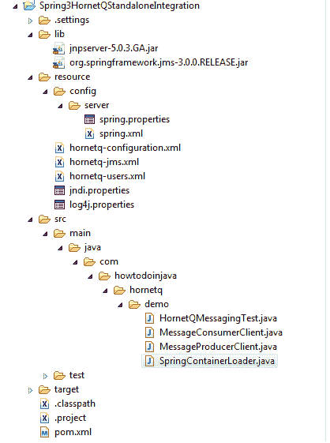

# Spring3 Hornetq 独立集成示例

> 原文： [https://howtodoinjava.com/hornetq/spring-3-hornetq-standalone-integration-example/](https://howtodoinjava.com/hornetq/spring-3-hornetq-standalone-integration-example/)

[**HornetQ**](http://hornetq.jboss.org "hornetq") 是一个开放源代码项目，旨在构建多协议，可嵌入，非常高性能的集群异步消息传递系统。 到目前为止，我们已经了解了[**配置 hornetq 独立服务器**](//howtodoinjava.com/hornetq/hornetq-stand-alone-server-example-using-maven/ "Hornetq stand alone server example using maven")和[**设置基本消息传递功能**](//howtodoinjava.com/hornetq/basic-jms-messaging-example-using-hornetq-stand-alone-server/ "Basic jms messaging example using hornetq stand alone server")的示例。 HornetQ 具有很大的灵活性，可以通过一些现有的应用框架进行配置。 在此序列中，我将展示 HornetQ 在 [**Spring3**](//howtodoinjava.com "Spring3 tutorials") 中的用法。

让我们逐步进行所有设置。

步骤 1）[创建一个 Maven 项目](//howtodoinjava.com/maven/create-a-simple-java-project-using-maven/ "Create a simple java project using maven")并将其转换为 Eclipse Java 项目。

步骤 2）使用 Spring3 和 hornetq 依赖项更新 maven 仓库。

```java
<project xmlns="http://maven.apache.org/POM/4.0.0" xmlns:xsi="http://www.w3.org/2001/XMLSchema-instance"
  xsi:schemaLocation="http://maven.apache.org/POM/4.0.0 http://maven.apache.org/maven-v4_0_0.xsd">
  <modelVersion>4.0.0</modelVersion>
  <groupId>com.howtodoinjava.app</groupId>
  <artifactId>Spring3HornetQStandaloneIntegration</artifactId>
  <packaging>jar</packaging>
  <version>1.0-SNAPSHOT</version>
  <name>Spring3HornetQStandaloneIntegration</name>
  <url>http://maven.apache.org</url>
   <properties>
	<org.springframework.version>3.0.5.RELEASE</org.springframework.version>
  </properties>
  <dependencies>

    <!-- User Application Lib -->
		<dependency>
			<groupId>commons-logging</groupId>
			<artifactId>commons-logging</artifactId>
			<version>1.1.1</version>
		</dependency>
		<dependency>
			<groupId>log4j</groupId>
			<artifactId>log4j</artifactId>
			<version>1.2.14</version>
		</dependency>

		<dependency>
			<groupId>junit</groupId>
			<artifactId>junit</artifactId>
			<version>4.7</version>
			<scope>test</scope>
		</dependency>

		<!-- HornetQ Embedded Server -->
		 <dependency>
		     <groupId>org.hornetq</groupId>
		     <artifactId>hornetq-core</artifactId>
		     <version>2.0.0.GA</version>
		     <scope>compile</scope>
		  </dependency>
		  <dependency>
		     <groupId>org.hornetq</groupId>
		     <artifactId>hornetq-jms</artifactId>
		     <version>2.0.0.GA</version>
		     <scope>compile</scope>
		  </dependency>
		  <dependency>
		     <groupId>org.hornetq</groupId>
		     <artifactId>hornetq-logging</artifactId>
		     <version>2.0.0.GA</version>
		     <scope>compile</scope>
		  </dependency>
		  <dependency>
		     <groupId>org.hornetq</groupId>
		     <artifactId>hornetq-transports</artifactId>
		     <version>2.0.0.GA</version>
		     <scope>compile</scope>
		  </dependency>
		  <dependency>
		     <groupId>org.jboss.netty</groupId>
		     <artifactId>netty</artifactId>
		     <version>3.1.0.GA</version>
		  </dependency>
		  <dependency>
		     <groupId>org.jboss.javaee</groupId>
		     <artifactId>jboss-jms-api</artifactId>
		     <version>1.1.0.GA</version>
		     <scope>compile</scope>
		  </dependency>

		 <dependency>
			<groupId>org.jboss</groupId>
			<artifactId>jboss-common-core</artifactId>
			<version>2.2.10.GA</version>
		</dependency>
		<dependency>
			<groupId>org.jboss.logging</groupId>
			<artifactId>jboss-logging-spi</artifactId>
			<version>2.0.5.GA</version>
		</dependency>

		<!--
	    Core utilities used by other modules.
	    Define this if you use Spring Utility APIs (org.springframework.core.*/org.springframework.util.*)
	-->
	<dependency>
	  <groupId>org.springframework</groupId>
	  <artifactId>spring-core</artifactId>
	  <version>${org.springframework.version}</version>
	</dependency>

	<!--
	    Expression Language (depends on spring-core)
	    Define this if you use Spring Expression APIs (org.springframework.expression.*)
	-->
	<dependency>
	  <groupId>org.springframework</groupId>
	  <artifactId>spring-expression</artifactId>
	  <version>${org.springframework.version}</version>
	</dependency>

	<!--
	    Bean Factory and JavaBeans utilities (depends on spring-core)
	    Define this if you use Spring Bean APIs (org.springframework.beans.*)
	-->
	<dependency>
	  <groupId>org.springframework</groupId>
	  <artifactId>spring-beans</artifactId>
	  <version>${org.springframework.version}</version>
	</dependency>

	<!--
	    Aspect Oriented Programming (AOP) Framework (depends on spring-core, spring-beans)
	    Define this if you use Spring AOP APIs (org.springframework.aop.*)
	-->
	<dependency>
	  <groupId>org.springframework</groupId>
	  <artifactId>spring-aop</artifactId>
	  <version>${org.springframework.version}</version>
	</dependency>

	<!--
	    Application Context (depends on spring-core, spring-expression, spring-aop, spring-beans)
	    This is the central artifact for Spring's Dependency Injection Container and is generally always defined
	-->
	<dependency>
	  <groupId>org.springframework</groupId>
	  <artifactId>spring-context</artifactId>
	  <version>${org.springframework.version}</version>
	</dependency>

	<!--
	    Various Application Context utilities, including EhCache, JavaMail, Quartz, and Freemarker integration
	    Define this if you need any of these integrations
	-->
	<dependency>
	  <groupId>org.springframework</groupId>
	  <artifactId>spring-context-support</artifactId>
	  <version>${org.springframework.version}</version>
	</dependency>

	<!--
	    Transaction Management Abstraction (depends on spring-core, spring-beans, spring-aop, spring-context)
	    Define this if you use Spring Transactions or DAO Exception Hierarchy
	    (org.springframework.transaction.*/org.springframework.dao.*)
	-->
	<dependency>
	  <groupId>org.springframework</groupId>
	  <artifactId>spring-tx</artifactId>
	  <version>${org.springframework.version}</version>
	</dependency>

	<!--
	    JDBC Data Access Library (depends on spring-core, spring-beans, spring-context, spring-tx)
	    Define this if you use Spring's JdbcTemplate API (org.springframework.jdbc.*)
	-->
	<dependency>
	  <groupId>org.springframework</groupId>
	  <artifactId>spring-jdbc</artifactId>
	  <version>${org.springframework.version}</version>
	</dependency>

	<!--
	    Object-to-Relation-Mapping (ORM) integration with Hibernate, JPA, and iBatis.
	    (depends on spring-core, spring-beans, spring-context, spring-tx)
	    Define this if you need ORM (org.springframework.orm.*)
	-->
	<dependency>
	  <groupId>org.springframework</groupId>
	  <artifactId>spring-orm</artifactId>
	  <version>${org.springframework.version}</version>
	</dependency>

	<!--
	    Object-to-XML Mapping (OXM) abstraction and integration with JAXB, JiBX, Castor, XStream, and XML Beans.
	    (depends on spring-core, spring-beans, spring-context)
	    Define this if you need OXM (org.springframework.oxm.*)
	-->
	<dependency>
	  <groupId>org.springframework</groupId>
	  <artifactId>spring-oxm</artifactId>
	  <version>${org.springframework.version}</version>
	</dependency>

	<!--
	    Web application development utilities applicable to both Servlet and Portlet Environments
	    (depends on spring-core, spring-beans, spring-context)
	    Define this if you use Spring MVC, or wish to use Struts, JSF, or another web framework with Spring (org.springframework.web.*)
	-->
	<dependency>
	  <groupId>org.springframework</groupId>
	  <artifactId>spring-web</artifactId>
	  <version>${org.springframework.version}</version>
	</dependency>

	<!--
	    Spring MVC for Servlet Environments (depends on spring-core, spring-beans, spring-context, spring-web)
	    Define this if you use Spring MVC with a Servlet Container such as Apache Tomcat (org.springframework.web.servlet.*)
	-->
	<dependency>
	  <groupId>org.springframework</groupId>
	  <artifactId>spring-webmvc</artifactId>
	  <version>${org.springframework.version}</version>
	</dependency>

	<!--
	    Spring MVC for Portlet Environments (depends on spring-core, spring-beans, spring-context, spring-web)
	    Define this if you use Spring MVC with a Portlet Container (org.springframework.web.portlet.*)
	-->
	<dependency>
	  <groupId>org.springframework</groupId>
	  <artifactId>spring-webmvc-portlet</artifactId>
	  <version>${org.springframework.version}</version>
	</dependency>

	<!--
	    Support for testing Spring applications with tools such as JUnit and TestNG
	    This artifact is generally always defined with a 'test' scope for the integration testing framework and unit testing stubs
	-->
	<dependency>
	  <groupId>org.springframework</groupId>
	  <artifactId>spring-test</artifactId>
	  <version>${org.springframework.version}</version>
	  <scope>test</scope>
	</dependency>
  </dependencies>
</project>

```

步骤 3）在`lib`文件夹中添加两个其他 jar。 如果时间允许，请找到它们的 Maven 依赖项并添加`pom.xml`。

*   `jnpserver-5.0.3.GA.jar`
*   `org.springframework.jms-3.0.5.RELEASE.jar`

步骤 4）从 jboss 发行版复制以下文件，并将其放在类路径中。 或者，只需复制下面给出的文件。

**`hornetq-configuration.xml`**

```java
<configuration xmlns="urn:hornetq"
               xmlns:xsi="http://www.w3.org/2001/XMLSchema-instance"
               xsi:schemaLocation="urn:hornetq /schema/hornetq-configuration.xsd">

   <connectors>
      <connector name="netty">
         <factory-class>org.hornetq.integration.transports.netty.NettyConnectorFactory</factory-class>
         <param key="host"  value="${hornetq.remoting.netty.host:localhost}"/>
         <param key="port"  value="${hornetq.remoting.netty.port:5445}"/>
      </connector>
   </connectors>

   <acceptors>
      <acceptor name="netty">
         <factory-class>org.hornetq.integration.transports.netty.NettyAcceptorFactory</factory-class>
         <param key="host"  value="${hornetq.remoting.netty.host:localhost}"/>
         <param key="port"  value="${hornetq.remoting.netty.port:5445}"/>
      </acceptor>
   </acceptors>

   <security-settings>
      <security-setting match="#">
         <permission type="createTempQueue" roles="guest"/>
         <permission type="deleteTempQueue" roles="guest"/>
         <permission type="consume" roles="guest"/>
         <permission type="send" roles="guest"/>
      </security-setting>
   </security-settings>

   <address-settings>
      <!--default for catch all-->
      <address-setting match="#">
         <dead-letter-address>jms.queue.DLQ</dead-letter-address>
         <expiry-address>jms.queue.ExpiryQueue</expiry-address>
         <redelivery-delay>0</redelivery-delay>
         <max-size-bytes>-1</max-size-bytes>
         <page-size-bytes>10485760</page-size-bytes>         
         <message-counter-history-day-limit>10</message-counter-history-day-limit>
      </address-setting>
   </address-settings>

   <paging-directory>${hornetq.data.dir}/paging</paging-directory>
   <bindings-directory>${hornetq.data.dir}/bindings</bindings-directory>
   <journal-directory>${hornetq.data.dir}/journal</journal-directory>
   <large-messages-directory>${hornetq.data.dir}/large-messages</large-messages-directory>
</configuration>

```

**`hornetq-jms.xml`**

```java
<configuration xmlns="urn:hornetq"
	       xmlns:xsi="http://www.w3.org/2001/XMLSchema-instance"
	       xsi:schemaLocation="urn:hornetq /schema/hornetq-jms.xsd">

	<connection-factory name="NettyConnectionFactory">
	   <connectors>
         <connector-ref connector-name="netty"/>
	   </connectors>
		<entries>
			<entry name="/ConnectionFactory"/>
			<entry name="/XAConnectionFactory"/>
		</entries>
	</connection-factory>

	<queue name="ExampleQueue">
		<entry name="/queue/ExampleQueue"/>
	</queue>

	<topic name="ExampleTopic">
		<entry name="/topic/ExampleTopic"/>
	</topic>	
</configuration>

```

**`hornetq-users.xml`**

```java
<configuration xmlns="urn:hornetq" xmlns:xsi="http://www.w3.org/2001/XMLSchema-instance"
            xsi:schemaLocation="urn:hornetq /schema/hornetq-users.xsd">
   <!-- the default user.  this is used where username is null-->
   <defaultuser name="guest" password="guest">
      <role name="guest"/>
   </defaultuser>
</configuration>

```

步骤 5）在类路径中复制`jndi.properties`。

```java
java.naming.factory.initial=org.jnp.interfaces.NamingContextFactory
java.naming.factory.url.pkgs=org.jboss.naming:org.jnp.interfaces
```

步骤 6）配置记录器，以更好地捕获信息。

```java
# Create a STDOUT appender
log4j.appender.STDOUT=org.apache.log4j.ConsoleAppender
log4j.appender.STDOUT.layout=org.apache.log4j.PatternLayout
log4j.appender.STDOUT.layout.ConversionPattern=%05p | %m%n

# Default everything to WARN
log4j.rootCategory=WARN, STDOUT

# Enable this application log level to the lowest.
log4j.category.com.howtodoinjava=TRACE
log4j.category.org.jnp.server=INFO
log4j.category.org.hornetq=INFO
log4j.category.org.springframework=INFO
```

步骤 7）到目前为止，已经配置了 hornetq 服务器和 jndi。 现在，将它们插入`spring.xml`和`spring.properties`中的 spring 框架。

**`spring.xml`**

```java
<?xml version="1.0" encoding="UTF-8" standalone="no"?>
<beans xmlns="http://www.springframework.org/schema/beans"
	xmlns:xsi="http://www.w3.org/2001/XMLSchema-instance" xmlns:context="http://www.springframework.org/schema/context"
	xsi:schemaLocation="http://www.springframework.org/schema/beans http://www.springframework.org/schema/beans/spring-beans-2.5.xsd
		http://www.springframework.org/schema/context http://www.springframework.org/schema/context/spring-context-2.5.xsd">

    <context:annotation-config />
	<context:property-placeholder location="classpath:config/server/spring.properties" />

	<bean name ="namingServerImpl" class="org.jnp.server.NamingBeanImpl" init-method="start" destroy-method="stop">
	</bean>

	<!-- JNDI server. Disable this if you don't want JNDI -->
	<bean name="namingServer" class="org.jnp.server.Main" init-method="start" destroy-method="stop">
		<property name="namingInfo" ref="namingServerImpl"></property>
		<property name="port" value="1099"></property>
		<property name="bindAddress" value="localhost"></property>
		<property name="rmiPort" value="1098"></property>
		<property name="rmiBindAddress" value="localhost"></property>
	</bean>

	<!-- MBean server -->
	<bean name="mbeanServer" class="java.lang.management.ManagementFactory" factory-method="getPlatformMBeanServer">
	</bean>

	<!-- The core configuration -->
	<bean name="fileConfiguration" class="org.hornetq.core.config.impl.FileConfiguration" init-method="start" destroy-method="stop">
	</bean>

	<!-- The security manager -->
	<bean name="hornetQSecurityManagerImpl" class="org.hornetq.spi.core.security.HornetQSecurityManagerImpl">
	</bean>

	<!-- The core server -->
	<bean name="hornetQServerImpl" class="org.hornetq.core.server.impl.HornetQServerImpl">
		<constructor-arg ref="fileConfiguration" />
		<constructor-arg ref="mbeanServer" />
		<constructor-arg ref="hornetQSecurityManagerImpl" />
	</bean>

	<!-- The JMS server -->
	<bean name="jmsServerManagerImpl" class="org.hornetq.jms.server.impl.JMSServerManagerImpl" init-method="start" destroy-method="stop">
		<constructor-arg ref="hornetQServerImpl" />
	</bean>	   

	<bean name="connectionFactory" class="org.hornetq.jms.client.HornetQConnectionFactory" >
		<constructor-arg>
			<bean class="org.hornetq.api.core.TransportConfiguration">
				<constructor-arg value="org.hornetq.integration.transports.netty.NettyConnectorFactory" />
				<constructor-arg>
					<map key-type="java.lang.String" value-type="java.lang.Object">
						<entry key="port" value="5445"></entry>
					</map>
				</constructor-arg>
			</bean>
		</constructor-arg>
	</bean>

	<bean name="jmsTemplate" class="org.springframework.jms.core.JmsTemplate">
		<property name="connectionFactory" ref="connectionFactory"></property>
	</bean>

	<bean name="messageProducerClient" class="com.howtodoinjava.hornetq.demo.MessageProducerClient">
		<property name="jmsTemplate" ref="jmsTemplate"></property>
	</bean>

	<bean name="messageConsumerClient" class="com.howtodoinjava.hornetq.demo.MessageConsumerClient">
		<property name="jmsTemplate" ref="jmsTemplate"></property>
	</bean>

</beans>

```

**`spring.properties`**

```java
hornetq.data.dir=${hornetq.spring.examples.home}/hornetq-data
org.hornetq.logger-delegate-factory-class-name=org.hornetq.integration.logging.Log4jLogDelegateFactory
```

步骤 8）首先加载 Spring 容器。 它还将验证我们所有的配置文件。

**`SpringContainerLoader.java`**

```java
package com.howtodoinjava.hornetq.demo;

import org.springframework.context.support.FileSystemXmlApplicationContext;

public class SpringContainerLoader
{
	public static FileSystemXmlApplicationContext loadEnvironment()
	{
		final FileSystemXmlApplicationContext context = new FileSystemXmlApplicationContext("classpath:config/server/spring.xml");
		context.registerShutdownHook();
		context.start();

		return context;
	}
}

```

步骤 8）现在，我将编写消息生产者和消息使用者客户端。

**`MessageProducerClient.java`**

```java
package com.howtodoinjava.hornetq.demo;

import javax.jms.JMSException;
import javax.jms.MessageProducer;
import javax.jms.Session;
import javax.jms.TextMessage;

import org.apache.commons.logging.Log;
import org.apache.commons.logging.LogFactory;
import org.springframework.jms.core.JmsTemplate;
import org.springframework.jms.core.ProducerCallback;

public class MessageProducerClient implements Runnable {

	private static Log log = LogFactory.getLog(MessageProducerClient.class);

	private static int counter = 1;

	private JmsTemplate jmsTemplate;

	public void setJmsTemplate(JmsTemplate jmsTemplate) {
		this.jmsTemplate = jmsTemplate;
	}

	@Override
	public void run() {
		jmsTemplate.execute("ExampleQueue", new ProducerCallback<Object>() {
			@Override
			public Object doInJms(Session session, MessageProducer producer)
					throws JMSException {
				while (true) {
					TextMessage msg = session.createTextMessage("Message number : " + counter++);
					log.trace("Sending msg: " + msg);
					producer.send(msg);

					try {
						Thread.sleep(2000);
					} catch (InterruptedException e) {
						e.printStackTrace();
					}
				}
			}
		});

	}
}

```

**`MessageConsumerClient.java`**

```java
package com.howtodoinjava.hornetq.demo;

import javax.jms.JMSException;
import javax.jms.Message;
import javax.jms.MessageConsumer;
import javax.jms.Queue;
import javax.jms.Session;

import org.apache.commons.logging.Log;
import org.apache.commons.logging.LogFactory;
import org.springframework.jms.core.JmsTemplate;
import org.springframework.jms.core.SessionCallback;

public class MessageConsumerClient implements Runnable {

	private static Log log = LogFactory.getLog(MessageConsumerClient.class);

	private JmsTemplate jmsTemplate;

	public void setJmsTemplate(JmsTemplate jmsTemplate) {
		this.jmsTemplate = jmsTemplate;
	}

	@Override
	public void run()
	{
		log.info("Message Consumer is just started !!");

		boolean startConn = true;
		jmsTemplate.execute(new SessionCallback<Object>() {
			@Override
			public Object doInJms(Session session) throws JMSException {
				Queue queue = session.createQueue("ExampleQueue");
				MessageConsumer consumer = session.createConsumer(queue);
				while (true) {
					Message msg = consumer.receive();
					log.trace("Received msg: " + msg);
				}
			}
		}, startConn);
	}
}

```

步骤 9）现在该测试整个代码和消息传递功能了。

**`HornetQMessagingTest.java`**

```java
package com.howtodoinjava.hornetq.demo;

import org.springframework.context.ApplicationContext;

public class HornetQMessagingTest
{
	public static void main(String[] args) throws InterruptedException
	{
		//Load configurations
		ApplicationContext context = SpringContainerLoader.loadEnvironment();

		//Start the message producer
		new Thread((Runnable)context.getBean("messageProducerClient")).start();

		//Start the message consumer
		new Thread((Runnable)context.getBean("messageConsumerClient")).start();

	}
}

```

在测试类之上运行会在下面生成日志，以验证 Spring3 和 hornetq 集成成功。

```java
 INFO | Refreshing org.springframework.context.support.FileSystemXmlApplicationContext@aa9835: startup date [Mon Mar 25 09:23:26 IST 2013]; root of context hierarchy
 INFO | Loading XML bean definitions from class path resource [config/server/spring.xml]
 INFO | Loading properties file from class path resource [config/server/spring.properties]
 INFO | Pre-instantiating singletons in org.springframework.beans.factory.support.DefaultListableBeanFactory@1b4fad5: defining beans [org.springframework.context.annotation.internalConfigurationAnnotationProcessor,org.springframework.context.annotation.internalAutowiredAnnotationProcessor,org.springframework.context.annotation.internalRequiredAnnotationProcessor,org.springframework.context.annotation.internalCommonAnnotationProcessor,org.springframework.beans.factory.config.PropertyPlaceholderConfigurer#0,namingServerImpl,namingServer,mbeanServer,fileConfiguration,hornetQSecurityManagerImpl,hornetQServerImpl,jmsServerManagerImpl,connectionFactory,jmsTemplate,messageProducerClient,messageConsumerClient]; root of factory hierarchy
25 Mar, 2013 9:23:28 AM org.hornetq.core.logging.impl.JULLogDelegate info
INFO: live server is starting..
25 Mar, 2013 9:23:28 AM org.hornetq.core.logging.impl.JULLogDelegate warn
WARNING: AIO wasn't located on this platform, it will fall back to using pure Java NIO. If your platform is Linux, install LibAIO to enable the AIO journal
25 Mar, 2013 9:23:28 AM org.hornetq.core.logging.impl.JULLogDelegate info
INFO: Using NIO Journal
25 Mar, 2013 9:23:28 AM org.hornetq.core.logging.impl.JULLogDelegate warn
WARNING: Security risk! It has been detected that the cluster admin user and password have not been changed from the installation default. Please see the HornetQ user guide, cluster chapter, for instructions on how to do this.
25 Mar, 2013 9:23:30 AM org.hornetq.core.logging.impl.JULLogDelegate info
INFO: Started Netty Acceptor version 3.1.5.GA-r1772
25 Mar, 2013 9:23:30 AM org.hornetq.core.logging.impl.JULLogDelegate info
INFO: HornetQ Server version 2.0.0.GA (Hornet Queen, 113) started
 INFO | Message Consumer is just started !!
TRACE | Sending msg: HornetQMessage[null]:PERSISTENT
TRACE | Received msg: HornetQMessage[ID:8e74da0e-94ff-11e2-bbba-002564ac1704:0000000000000000]:PERSISTENT
TRACE | Sending msg: HornetQMessage[null]:PERSISTENT
TRACE | Received msg: HornetQMessage[ID:8e74da0e-94ff-11e2-bbba-002564ac1704:1000000000000000]:PERSISTENT
TRACE | Sending msg: HornetQMessage[null]:PERSISTENT
TRACE | Received msg: HornetQMessage[ID:8e74da0e-94ff-11e2-bbba-002564ac1704:2000000000000000]:PERSISTENT
TRACE | Sending msg: HornetQMessage[null]:PERSISTENT
TRACE | Received msg: HornetQMessage[ID:8e74da0e-94ff-11e2-bbba-002564ac1704:3000000000000000]:PERSISTENT
```

如有任何问题，请先确认以下几点：

*   所有配置文件都在类路径中。
*   lib 文件夹中存在的两个 jar 文件包含在类路径中。

作为参考，我给出了目录结构的快照。



[**源代码下载**](https://docs.google.com/file/d/0B7yo2HclmjI4ME5IN3ZhNHU1Q1E/edit?usp=sharing "Spring3 hornetq integration source code download")

**祝您学习愉快！**