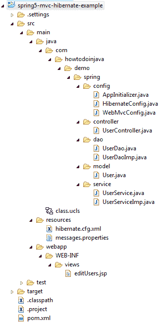
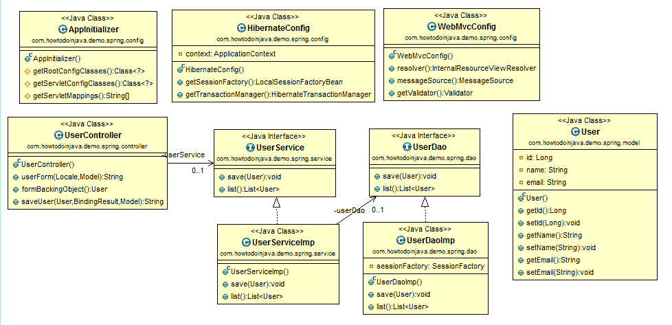
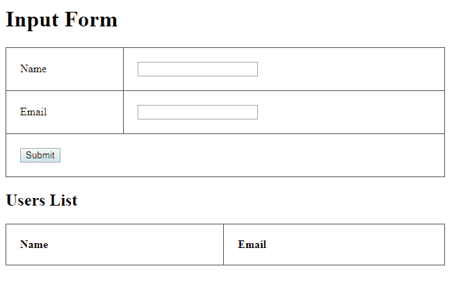
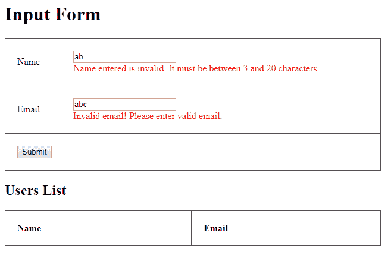

# Spring 5 MVC + Hibernate 5 示例

> 原文： [https://howtodoinjava.com/spring5/webmvc/spring5-mvc-hibernate5-example/](https://howtodoinjava.com/spring5/webmvc/spring5-mvc-hibernate5-example/)

在本 **spring 5 Hibernate 5 注解示例**教程中，学习**创建 Spring 5 MVC Web 应用程序**，**处理表单提交**，**集成 Hibernate 5** 连接到后端数据库并为输入表单[字段验证](https://howtodoinjava.com/resteasy/resteasy-bean-validation-using-hibernate-validator-provider/)添加**Hibernate 验证器**。

我们将创建一个简单的屏幕，可以在其中添加用户字段（名称和电子邮件）。 这些详细信息将首先通过 Hibernate 进行验证，然后存储在 [HSQL 数据库中。 该页面还将列出所有已存储的用户。](https://howtodoinjava.com/hibernate/hibernate-4-using-in-memory-database-with-hibernate/)

## 1\. 开发环境

*   Eclipse 霓虹灯 2
*   JDK 1.8
*   Spring 5.2.0.发布
*   Hibernate 5.2.11.Final
*   Hibernate 验证器 5.4.1.Final
*   Servlet 3.1.0
*   HSQLDB 1.8.0.10
*   Tomcat 7 Maven 插件 2.2

## 2\. 项目结构

该项目具有典型的 [Maven Web 应用程序](https://howtodoinjava.com/maven/how-to-create-a-eclipse-web-application-using-maven/)结构。



Spring5 WebMVC Project Structure

#### 2.1. 类图



Class Diagram

## 3\. Maven 依赖

在`pom.xml`文件中找到用于运行此示例的项目依赖项。

`pom.xml`

```java
<project xmlns="http://maven.apache.org/POM/4.0.0" xmlns:xsi="http://www.w3.org/2001/XMLSchema-instance"
	xsi:schemaLocation="http://maven.apache.org/POM/4.0.0 http://maven.apache.org/xsd/maven-4.0.0.xsd;
	<modelVersion>4.0.0</modelVersion>
	<groupId>com.howtodoinjava.spring5.demo</groupId>
	<artifactId>spring5-mvc-hibernate-example</artifactId>
	<version>0.0.1-SNAPSHOT</version>
	<packaging>war</packaging>
	<properties>
		<failOnMissingWebXml>false</failOnMissingWebXml>
		<spring.version>5.2.0.RELEASE</spring.version>
		<hibernate.version>5.2.11.Final</hibernate.version>
		<hibernate.validator>5.4.1.Final</hibernate.validator>
		<c3p0.version>0.9.5.2</c3p0.version>
		<jstl.version>1.2.1</jstl.version>
		<tld.version>1.1.2</tld.version>
		<servlets.version>3.1.0</servlets.version>
		<jsp.version>2.3.1</jsp.version>
		<hsqldb.version>1.8.0.10</hsqldb.version>
	</properties>
	<dependencies>
		<!-- Spring MVC Dependency -->
		<dependency>
			<groupId>org.springframework</groupId>
			<artifactId>spring-webmvc</artifactId>
			<version>${spring.version}</version>
		</dependency>

		<!-- Spring ORM -->
		<dependency>
			<groupId>org.springframework</groupId>
			<artifactId>spring-orm</artifactId>
			<version>${spring.version}</version>
		</dependency>

		<!-- Hibernate Core -->
		<dependency>
			<groupId>org.hibernate</groupId>
			<artifactId>hibernate-core</artifactId>
			<version>${hibernate.version}</version>
		</dependency>

		<!-- Hibernate-C3P0 Integration -->
		<dependency>
			<groupId>org.hibernate</groupId>
			<artifactId>hibernate-c3p0</artifactId>
			<version>${hibernate.version}</version>
		</dependency>

		<!-- c3p0 -->
		<dependency>
			<groupId>com.mchange</groupId>
			<artifactId>c3p0</artifactId>
			<version>${c3p0.version}</version>
		</dependency>

		<!-- Hibernate Validator -->
		<dependency>
			<groupId>org.hibernate</groupId>
			<artifactId>hibernate-validator</artifactId>
			<version>${hibernate.validator}</version>
		</dependency>

		<!-- JSTL Dependency -->
		<dependency>
			<groupId>javax.servlet.jsp.jstl</groupId>
			<artifactId>javax.servlet.jsp.jstl-api</artifactId>
			<version>${jstl.version}</version>
		</dependency>

		<dependency>
			<groupId>taglibs</groupId>
			<artifactId>standard</artifactId>
			<version>${tld.version}</version>
		</dependency>

		<!-- Servlet Dependency -->
		<dependency>
			<groupId>javax.servlet</groupId>
			<artifactId>javax.servlet-api</artifactId>
			<version>${servlets.version}</version>
			<scope>provided</scope>
		</dependency>

		<!-- JSP Dependency -->
		<dependency>
			<groupId>javax.servlet.jsp</groupId>
			<artifactId>javax.servlet.jsp-api</artifactId>
			<version>${jsp.version}</version>
			<scope>provided</scope>
		</dependency>

		<!-- HSQL Dependency -->
		<dependency>
			<groupId>hsqldb</groupId>
			<artifactId>hsqldb</artifactId>
			<version>${hsqldb.version}</version>
		</dependency>
	</dependencies>

	<build>
		<sourceDirectory>src/main/java</sourceDirectory>
		<resources>
			<resource>
				<directory>src/main/resources</directory>
			</resource>
		</resources>
		<plugins>
			<plugin>
				<artifactId>maven-compiler-plugin</artifactId>
				<version>3.5.1</version>
				<configuration>
					<source>1.8</source>
					<target>1.8</target>
				</configuration>
			</plugin>
			<plugin>
				<groupId>org.apache.tomcat.maven</groupId>
				<artifactId>tomcat7-maven-plugin</artifactId>
				<version>2.2</version>
				<configuration>
					<path>/</path>
				</configuration>
			</plugin>
		</plugins>
	</build>
</project>

```

## 4\. `DispatcherServlet`配置

随着 [Servlet 3.0 规范](https://download.oracle.com/otndocs/jcp/servlet-3.0-fr-oth-JSpec/)的发布，可以（几乎）没有 xml 配置 Servlet 容器。 为此，Servlet 规范中有[`ServletContainerInitializer`](https://docs.oracle.com/javaee/7/api/javax/servlet/ServletContainerInitializer.html)。 在该类中，您可以注册过滤器，监听器，servlet 等，就像您在`web.xml`中传统上所做的那样。

Spring 提供了[`SpringServletContainerInitializer`](https://docs.spring.io/spring/docs/current/javadoc-api/org/springframework/web/SpringServletContainerInitializer.html)，它知道如何处理`WebApplicationInitializer`类。 `AbstractAnnotationConfigDispatcherServletInitializer`类实现了`WebMvcConfigurer`，而该内部实现了`WebApplicationInitializer`。 它注册了`ContextLoaderlistener`（可选）和`DispatcherServlet`，并允许您轻松添加配置类以加载这两个类，并将过滤器应用于`DispatcherServlet`并提供 Servlet 映射。

`AppInitializer.java`

```java
package com.howtodoinjava.demo.spring.config;

public class AppInitializer extends 
		AbstractAnnotationConfigDispatcherServletInitializer {

   @Override
   protected Class<?>[] getRootConfigClasses() {
      return new Class[] { HibernateConfig.class };
   }

   @Override
   protected Class<?>[] getServletConfigClasses() {
      return new Class[] { WebMvcConfig.class };
   }

   @Override
   protected String[] getServletMappings() {
      return new String[] { "/" };
   }
}

```

## 5\. Spring WebMVC 配置

下面给出了使用**注解配置**的 Spring MVC 配置。

`WebMvcConfig.java`

```java
package com.howtodoinjava.demo.spring.config;

import org.springframework.context.MessageSource;
import org.springframework.context.annotation.Bean;
import org.springframework.context.annotation.ComponentScan;
import org.springframework.context.annotation.Configuration;
import org.springframework.context.support.ResourceBundleMessageSource;
import org.springframework.validation.Validator;
import org.springframework.validation.beanvalidation.LocalValidatorFactoryBean;
import org.springframework.web.servlet.config.annotation.EnableWebMvc;
import org.springframework.web.servlet.config.annotation.WebMvcConfigurer;
import org.springframework.web.servlet.view.InternalResourceViewResolver;
import org.springframework.web.servlet.view.JstlView;

@Configuration
@EnableWebMvc
@ComponentScan(basePackages = { "com.howtodoinjava.demo.spring"})
public class WebMvcConfig implements WebMvcConfigurer {

   @Bean
   public InternalResourceViewResolver resolver() {
      InternalResourceViewResolver resolver = new InternalResourceViewResolver();
      resolver.setViewClass(JstlView.class);
      resolver.setPrefix("/WEB-INF/views/");
      resolver.setSuffix(".jsp");
      return resolver;
   }

   @Bean
   public MessageSource messageSource() {
      ResourceBundleMessageSource source = new ResourceBundleMessageSource();
      source.setBasename("messages");
      return source;
   }

   @Override
   public Validator getValidator() {
      LocalValidatorFactoryBean validator = new LocalValidatorFactoryBean();
      validator.setValidationMessageSource(messageSource());
      return validator;
   }
}

```

1.  [`WebMvcConfigurer`](https://docs.spring.io/spring-framework/docs/current/javadoc-api/org/springframework/web/servlet/config/annotation/WebMvcConfigurer.html)定义用于自定义或添加到通过使用`@EnableWebMvc`启用的默认 Spring MVC 配置的选项。
2.  `@EnableWebMvc`启用默认的 Spring MVC 配置，并注册`DispatcherServlet`期望的 Spring MVC 基础结构组件。
3.  `@Configuration`指示一个类声明一个或多个`@Bean`方法，并且可以由 Spring 容器进行处理以在运行时为这些 bean 生成 bean 定义和服务请求。
4.  `@ComponentScan`注解用于指定要扫描的基本软件包。 任何用@Component 和@Configuration 注解的类都将被扫描。
5.  `InternalResourceViewResolver`有助于将逻辑视图名称映射为直接查看特定预配置目录下的文件。
6.  `ResourceBundleMessageSource`使用指定的基本名称（这里是消息）访问资源束。
7.  `LocalValidatorFactoryBean`引导`javax.validation.ValidationFactory`，并通过 Spring `Validator`接口以及 JSR-303 `Validator`接口和`ValidatorFactory`接口本身公开它。

## 6\. Hibernate 配置

该示例中使用的 Hibernate 配置基于**基于 Hibernate Java 的配置**。

`HibernateConfig.java`

```java
package com.howtodoinjava.demo.spring.config;

import org.springframework.beans.factory.annotation.Autowired;
import org.springframework.context.ApplicationContext;
import org.springframework.context.annotation.Bean;
import org.springframework.context.annotation.ComponentScan;
import org.springframework.context.annotation.ComponentScans;
import org.springframework.context.annotation.Configuration;
import org.springframework.orm.hibernate5.HibernateTransactionManager;
import org.springframework.orm.hibernate5.LocalSessionFactoryBean;
import org.springframework.transaction.annotation.EnableTransactionManagement;

import com.howtodoinjava.demo.spring.model.User;

@Configuration
@EnableTransactionManagement
public class HibernateConfig {

	@Autowired
	private ApplicationContext context;

	@Bean
	public LocalSessionFactoryBean getSessionFactory() {
		LocalSessionFactoryBean factoryBean = new LocalSessionFactoryBean();
		factoryBean.setConfigLocation(context.getResource("classpath:hibernate.cfg.xml"));
		factoryBean.setAnnotatedClasses(User.class);
		return factoryBean;
	}

	@Bean
	public HibernateTransactionManager getTransactionManager() {
		HibernateTransactionManager transactionManager = new HibernateTransactionManager();
		transactionManager.setSessionFactory(getSessionFactory().getObject());
		return transactionManager;
	}
}

```

*   `LocalSessionFactoryBean`创建一个 Hibernate`SessionFactory`。 这是在 Spring 应用程序上下文中设置共享的 Hibernate SessionFactory 的常用方法。
*   `EnableTransactionManagement`启用 Spring 的注解驱动的事务管理功能。
*   `HibernateTransactionManager`将来自指定工厂的 Hibernate 会话绑定到线程，可能每个工厂允许一个线程绑定的 Session。 该事务管理器适用于使用单个 Hibernate `SessionFactory`进行事务数据访问的应用程序，但它也支持事务内的直接`DataSource`访问，即纯 JDBC。

`hibernate.cfg.xml`

```java
<?xml version="1.0" encoding="utf-8"?>
<!DOCTYPE hibernate-configuration PUBLIC
"-//Hibernate/Hibernate Configuration DTD 3.0//EN"
"http://hibernate.sourceforge.net/hibernate-configuration-3.0.dtd">
<hibernate-configuration>
	<session-factory>
		<property name="hibernate.archive.autodetection">class,hbm</property>
		<property name="hibernate.dialect">org.hibernate.dialect.HSQLDialect</property>
		<property name="hibernate.show_sql">true</property>
		<property name="hibernate.connection.driver_class">org.hsqldb.jdbcDriver</property>
		<property name="hibernate.connection.username">sa</property>
		<property name="hibernate.connection.password"></property>
		<property name="hibernate.connection.url">jdbc:hsqldb:mem:howtodoinjava</property>
		<property name="hibernate.hbm2ddl.auto">create</property>

		<property name="hibernate.c3p0.min_size">5</property>
		<property name="hibernate.c3p0.max_size">20</property>
		<property name="hibernate.c3p0.acquire_increment">2</property>
		<property name="hibernate.c3p0.acquire_increment">1800</property>
		<property name="hibernate.c3p0.max_statements">150</property>
	</session-factory>
</hibernate-configuration>

```

## 7\. Spring 控制器和 REST 映射

控制器类具有用于`GET`和`POST`操作的两个简单的 [REST 映射](https://howtodoinjava.com/spring5/webmvc/controller-getmapping-postmapping/)。 如果输入字段未经验证，则返回相同的表单 bean 以显示错误消息。 否则返回刷新的视图。

`UserController.java`

```java
package com.howtodoinjava.demo.spring.controller;

import java.util.Locale;
import javax.validation.alid;
import org.springframework.beans.factory.annotation.Autowired;
import org.springframework.stereotype.Controller;
import org.springframework.ui.Model;
import org.springframework.validation.BindingResult;
import org.springframework.web.bind.annotation.GetMapping;
import org.springframework.web.bind.annotation.ModelAttribute;
import org.springframework.web.bind.annotation.PostMapping;

import com.howtodoinjava.demo.spring.model.User;
import com.howtodoinjava.demo.spring.service.UserService;

@Controller
public class UserController {

	@Autowired
	private UserService userService;

	@GetMapping("/")
	public String userForm(Locale locale, Model model) {
		model.addAttribute("users", userService.list());
		return "editUsers";
	}

	@ModelAttribute("user")
    public User formBackingObject() {
        return new User();
    }

	@PostMapping("/addUser")
	public String saveUser(@ModelAttribute("user") @Valid User user, 
							BindingResult result, Model model) {

		if (result.hasErrors()) {
			model.addAttribute("users", userService.list());
			return "editUsers";
		}

		userService.save(user);
		return "redirect:/";
	}
}

```

## 8\. 服务和 DAO 层

服务和 DAO 层是用`@Service`和`@Repository`注解注解的常规服务组件。 `@Transactional`注解在服务层应用，以支持事务。

> 阅读更多： [@Service 和@Repository 注解](https://howtodoinjava.com/spring/spring-core/how-to-use-spring-component-repository-service-and-controller-annotations/)

`UserService Interface amd Impl`

```java
public interface UserService {
   void save(User user);

   List<User> list();
}

@Service
public class UserServiceImp implements UserService {

   @Autowired
   private UserDao userDao;

   @Transactional
   public void save(User user) {
      userDao.save(user);
   }

   @Transactional(readOnly = true)
   public List<User> list() {
      return userDao.list();
   }
}

```

`UserDao Interface and Impl`

```java
public interface UserDao {
   void save(User user);
   List<User> list();
}

@Repository
public class UserDaoImp implements UserDao {

   @Autowired
   private SessionFactory sessionFactory;

   @Override
   public void save(User user) {
      sessionFactory.getCurrentSession().save(user);
   }

   @Override
   public List<User> list() {
      @SuppressWarnings("unchecked")
      TypedQuery<User> query = sessionFactory.getCurrentSession().createQuery("from User");
      return query.getResultList();
   }
}

```

`User.java`

```java
package com.howtodoinjava.demo.spring.model;

import javax.persistence.Column;
import javax.persistence.Entity;
import javax.persistence.GeneratedValue;
import javax.persistence.Id;
import javax.persistence.Table;
import javax.validation.constraints.Size;

import org.hibernate.validator.constraints.Email;
import org.hibernate.validator.constraints.NotEmpty;

@Entity
@Table(name = "TBL_USERS")
public class User {

   @Id
   @GeneratedValue
   @Column(name = "USER_ID")
   private Long id;

   @Column(name = "USER_NAME")
   @Size(max = 20, min = 3, message = "{user.name.invalid}")
   @NotEmpty(message="Please Enter your name")
   private String name;

   @Column(name = "USER_EMAIL", unique = true)
   @Email(message = "{user.email.invalid}")
   @NotEmpty(message="Please Enter your email")
   private String email;

   public Long getId() {
      return id;
   }

   public void setId(Long id) {
      this.id = id;
   }

   public String getName() {
      return name;
   }

   public void setName(String name) {
      this.name = name;
   }

   public String getEmail() {
      return email;
   }

   public void setEmail(String email) {
      this.email = email;
   }
}

```

## 9\. 视图和消息资源

最后，使用了 JSP 文件，并使用了[消息资源包](https://howtodoinjava.com/spring-core/resolving-text-messages-in-spring-resourcebundlemessagesource-example/)。

`editUsers.jsp`

```java
<%@ page language="java" contentType="text/html; charset=ISO-8859-1"
	pageEncoding="ISO-8859-1"%>
<%@taglib uri="http://www.springframework.org/tags/form" prefix="form"%>
<%@taglib uri="http://java.sun.com/jsp/jstl/core" prefix="c"%>
<!DOCTYPE html>
<html>
		<head>
		<meta http-equiv="Content-Type" content="text/html; charset=ISO-8859-1">
		<title>Spring5 MVC Hibernate Demo</title>
		<style type="text/css">
			.error {
				color: red;
			}
			table {
				width: 50%;
				border-collapse: collapse;
				border-spacing: 0px;
			}
			table td {
				border: 1px solid #565454;
				padding: 20px;
			}
		</style>
	</head>
	<body>
		<h1>Input Form</h1>
		<form:form action="addUser" method="post" modelAttribute="user">
			<table>
				<tr>
					<td>Name</td>
					<td>
						<form:input path="name" /> <br />
						<form:errors path="name" cssClass="error" />
					</td>
				</tr>
				<tr>
					<td>Email</td>
					<td>
						<form:input path="email" /> <br />
						<form:errors path="email" cssClass="error" />
					</td>
				</tr>
				<tr>
					<td colspan="2"><button type="submit">Submit</button></td>
				</tr>
			</table>
		</form:form>

		<h2>Users List</h2>
		<table>
			<tr>
				<td><strong>Name</strong></td>
				<td><strong>Email</strong></td>
			</tr>
			<c:forEach items="${users}" var="user">
				<tr>
					<td>${user.name}</td>
					<td>${user.email}</td>
				</tr>
			</c:forEach>
		</table>
	</body>
</html>

```

`messages.properties`

```java
user.name.invalid = Name must be between {2} and {1} characters.
user.email.invalid = Please enter valid email address.

```

## 10\. 演示

让我们使用 [**maven tomcat7 插件**](https://howtodoinjava.com/maven/tomcat-maven-plugin-example/) 运行应用程序。 执行 Maven 目标：`tomcat7:run`。

网址：`http://localhost:8080`



Initial Screen



Invalid Input Validation


Valid Form Submission

检查服务器日志。

`Console`

```java
Hibernate: call next value for hibernate_sequence
Hibernate: insert into TBL_USERS (USER_EMAIL, USER_NAME, USER_ID) values (?, ?, ?)
Hibernate: select user0_.USER_ID as USER_ID1_0_, user0_.USER_EMAIL as USER_EMA2_0_, 
			user0_.USER_NAME as USER_NAM3_0_ from TBL_USERS user0_

```

我希望您能找到这个 **Spring Hibernate Web 应用程序示例**，以开始开发自己的应用程序。 这主要是针对初学者的，但是它将帮助您构建带有注解的任何带有 Hibernate 集成示例的 **Spring MVC。**

学习愉快！

[Sourcecode Download](https://github.com/lokeshgupta1981/spring-webmvc)