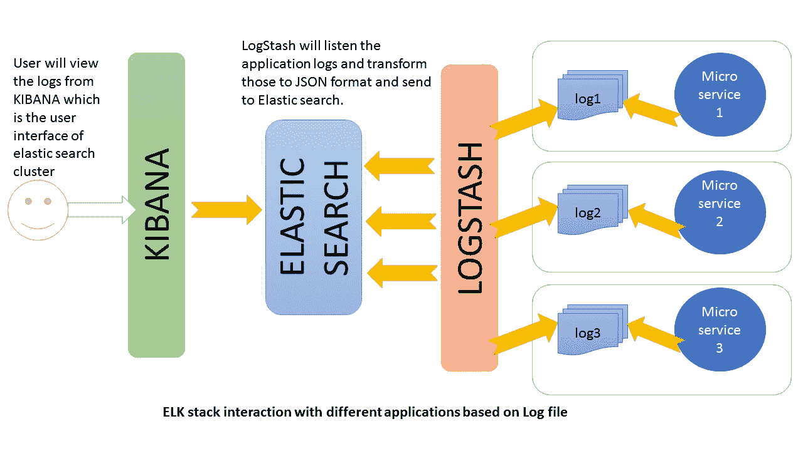
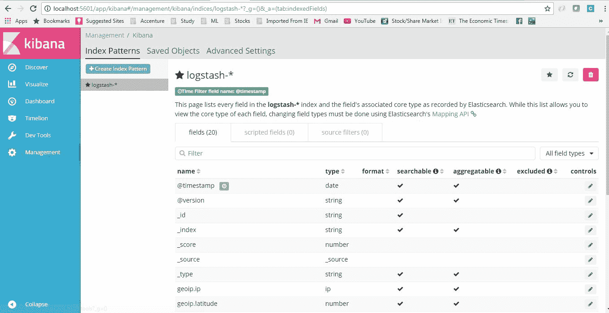
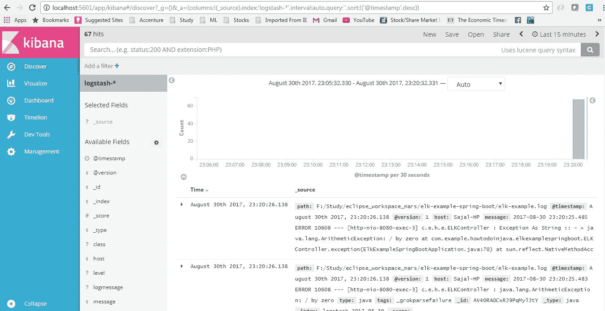
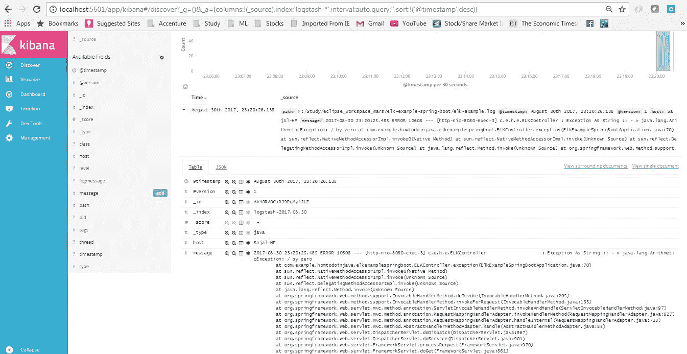

# ELK 堆栈示例教程

> 原文： [https://howtodoinjava.com/microservices/elk-stack-tutorial-example/](https://howtodoinjava.com/microservices/elk-stack-tutorial-example/)

通过使用[微服务](//howtodoinjava.com/microservices/microservices-definition-principles-benefits/)，我们已经能够克服许多遗留问题，它使我们能够创建稳定的分布式应用程序，并对代码，团队规模，维护，发布周期，云计算等切面进行所需的控制。 在其他领域也带来了一些挑战，例如 **分布式日志管理**并具有查看通常分布在许多服务之间的完整事务日志和分布式调试的功能。

实际上，挑战在于微服务之间是相互隔离的，它们不共享通用的数据库和日志文件。 随着微服务数量的增加以及我们使用自动连续集成工具启用云部署，当我们遇到任何问题时，非常有必要提供调试组件的准备。

感谢开源运动。 我们已经拥有捆绑在一起的工具，如果一起使用，它们可以起到神奇的作用。 这样的一组流行工具是 [**ElasticSearch**](https://www.elastic.co/)， [Logstash](https://www.elastic.co/products/logstash) 和 [Kibana](https://en.wikipedia.org/wiki/Kibana) – 一起称为 **ELK 堆栈**。 它们用于实时搜索，分析和可视化日志数据。

在本 **ELK 堆栈教程**中，学习**将 ELK 堆栈集成到微服务**生态系统中。

## 1\. 什么是 ELK 堆栈

1.  **Elasticsearch** 是基于 JSON 的分布式搜索和分析引擎，旨在实现水平可伸缩性，最大的可靠性和易于管理的功能。
2.  **Logstash** 是动态数据收集管道，具有可扩展的插件生态系统和强大的 Elasticsearch 协同作用。
3.  **Kibana** 通过 UI 提供了数据的可视化。

#### 1.1. ELK 堆栈架构

Logstash 根据我们设置的过滤条件处理应用程序日志文件，并将这些日志发送到 Elasticsearch。 通过 Kibana，我们可以在需要时查看和分析这些日志。

ELK In Action

## 2\. ELK 堆栈配置

所有这三个工具均基于 JVM，在开始安装它们之前，请验证是否已正确配置 JDK。 检查是否已完成标准 JDK 1.8 安装，`JAVA_HOME`和`PATH`的设置。

#### 2.1. 弹性搜索

*   从此[下载页面](https://www.elastic.co/downloads/elasticsearch)下载 Elasticsearch 的最新版本，并将其解压缩到任何文件夹。
*   在命令提示符下运行`bin\elasticsearch.bat`。
*   默认情况下，它将从 [http://localhost:9200](http://localhost:9200) 开始

#### 2.2. Kibana

*   从[下载页面](https://www.elastic.co/downloads/kibana)下载最新发行版，并将其解压缩到任何文件夹中。
*   在编辑器中打开`config/kibana.yml`，并将`elasticsearch.url`设置为指向您的 Elasticsearch 实例。 在我们的例子中，我们将使用本地实例，只是取消注解`elasticsearch.url: "http://localhost:9200"`
*   在命令提示符下运行`bin\kibana.bat`。
*   成功启动后，Kibana 将在默认端口`5601`上启动，并且 Kibana UI 将位于 [http://localhost:5601](http://localhost:5601)

#### 2.3. Logstash

*   从[下载页面](https://www.elastic.co/downloads/logstash)下载最新发行版，并将其解压缩到任何文件夹中。
*   Create one file `logstash.conf` as per [configuration instructions](https://www.elastic.co/guide/en/logstash/current/configuration.html). We will again come to this point during actual demo time for exact configuration.

    现在运行`bin/logstash -f logstash.conf`以启动 logstash

ELK 堆栈未启动并正在运行。 现在，我们需要创建一些微服务，并将 logstash 指向 API 日志路径。

## 3\. ELK 堆栈示例 – 创建微服务

#### 3.1. 创建 Spring Boot 项目

让我们[使用 Spring Boot](//howtodoinjava.com/spring/spring-boot/spring-boot-tutorial-with-hello-world-example/) 创建一个应用程序，以缩短开发时间。 请按照以下步骤启动此服务。

#### 3.2. 添加 REST 端点

添加一个`RestController`类，它将暴露一些端点，例如`/elk`，`/elkdemo`和`/exception`。 实际上，我们将仅测试少量日志语句，因此可以根据您的选择随意添加/修改日志。

[PRE0]

#### 3.3. 配置 Spring Boot 日志记录

打开`resources`文件夹下的`application.properties`并添加以下配置条目。

[PRE1]

> 阅读更多： [Spring Boot 日志记录示例](//howtodoinjava.com/spring/spring-boot/logging-application-properties/)

#### 3.4. 验证微服务生成的日志

使用`mvn clean install`进行最终的 Maven 构建，并使用`java -jar target\elk-example-spring-boot-0.0.1-SNAPSHOT.jar`命令启动应用程序，然后通过浏览 [http://localhost:8080/elk](http://localhost:8080/elk) 进行测试。

不必担心在屏幕上看到大堆栈痕迹，因为它是故意做的，以了解 ELK 如何处理异常消息。

转到应用程序根目录，并验证是否已创建日志文件（即`elk-example.log`），并多次访问端点，并验证日志已添加到日志文件中。

## 4\. Logstash 配置

我们需要创建一个 logstash 配置文件，以便它监听日志文件并将日志消息推送到弹性搜索中。 这是示例中使用的 logstash [配置](https://www.elastic.co/guide/en/logstash/current/configuration.html)，请根据您的设置更改日志路径。

[PRE2]

## 5\. Kibana 配置

在 Kibana 中查看日志之前，我们需要配置索引模式。 我们可以将`logstash-*`配置为默认配置。 我们总是可以在 logstash 端更改此索引模式，并在 Kibana 中进行配置。 为简单起见，我们将使用默认配置。

索引模式管理页面如下所示。 通过这种配置，我们将 Kibana 指向您选择的 Elasticsearch 索引。 Logstash 用`logstash-YYYY.MM.DD`的名称模式创建索引。我们可以在 Kibana 控制台 [http://localhost:5601/app/kibana](http://localhost:5601/app/kibana) 中进行所有这些配置，然后转到左侧面板中的“管理”链接。

Logstash configuration in Kibana

## 6\. 验证 ELK 堆栈

现在，当所有组件都启动并运行后，让我们验证整个生态系统。

转到应用程序并测试端点几次，以便生成日志，然后转到 Kibana 控制台，查看日志已正确堆叠在 Kibana 中，并具有许多额外功能，例如我们可以过滤，查看不同的图形等。

这是在 Kibana 中生成的日志的视图。

Kibana Logs Overview

Kibana Logs details screen

## 7\. ELK 堆栈教程 – 总结

在此 **ELK 示例**中，我们学习了**配置 ELK 堆栈**，并看到了如何将应用程序日志文件指向 ELK 并查看和分析 Kibana 中的日志。 我建议您使用配置并与我们分享您的经验。 例如

*   取而代之的是用 logstash 听我们的日志，我们可以使用 logback 配置来使用 TCP 附加程序通过 TCP 协议将日志发送到远程 Logstash 实例。
*   我们可以使用 Logstash 指向多个日志文件。
*   我们可以在 logstash 配置文件中使用更复杂的过滤器，根据需要执行更多操作。
*   当所有应用程序都将部署在云中时，基本上可以使用远程 ELK 群集来指向我们的日志文件或将日志推送到其中。
*   在 logstash 中创建不同的索引模式。

ELK stack require Java 1.8 to be configured properly. I faced difficulty starting up those tools due to older JDK in system path.[Download Source code for this Article](//howtodoinjava.com/wp-content/uploads/2017/08/elk-example-spring-boot.zip)

将我的问题放在评论部分。

学习愉快！