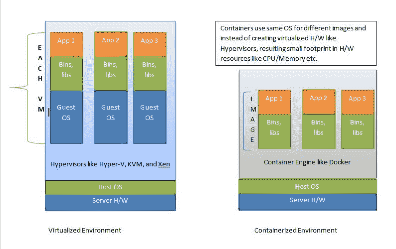
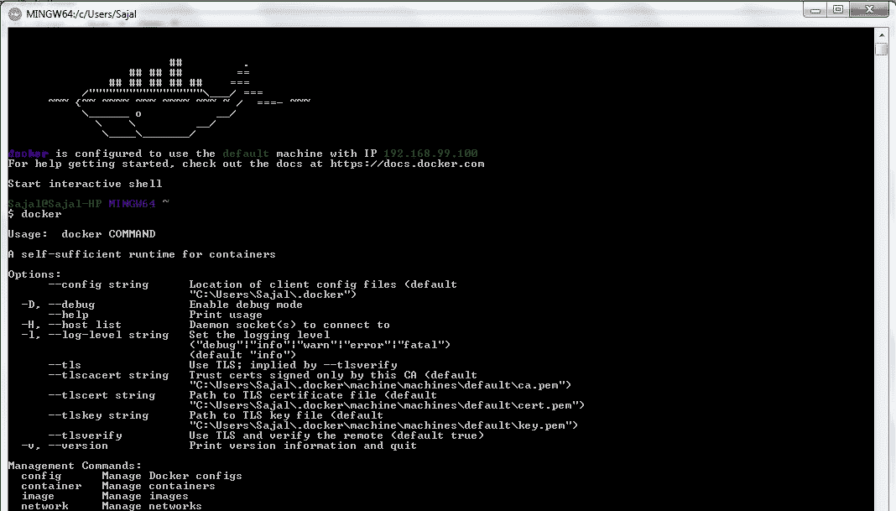
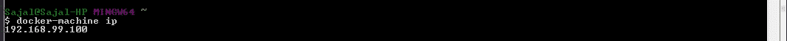
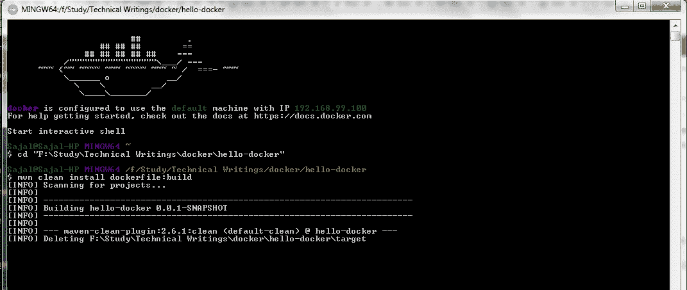
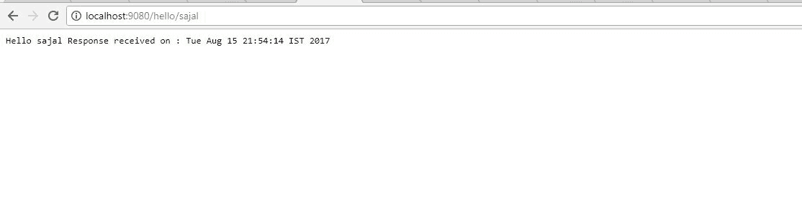
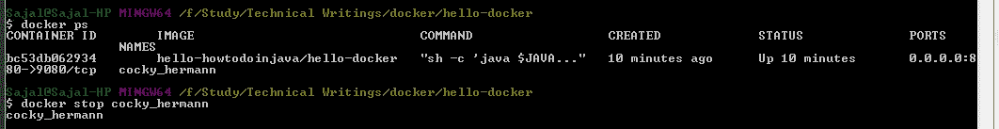

# 带有 Hello World 示例的 Docker 教程

> 原文： [https://howtodoinjava.com/library/docker-hello-world-example/](https://howtodoinjava.com/library/docker-hello-world-example/)

[Docker](https://www.docker.com/) 是用于将应用程序及其运行时环境打包在一起的开发人员工具，因此任何人都可以在任何其他计算机上部署和运行它们，而不会遇到运行时环境冲突。 它与虚拟机概念（[虚拟化](https://en.wikipedia.org/wiki/Virtualization)）非常相似，在虚拟机概念中，您可以获取 VM 映像并在任何支持的硬件上运行它。 VM 中的所有内部程序将按其原始打包的方式运行。

**VM 和 docker 映像之间的区别**是 docker 映像不打包整个虚拟操作系统。 就像开发人员计算机中的其他进程一样，它使用 OS 资源，仅打包应用程序，并且打包其特定于运行时的依赖项（[容器化](http://www.theserverside.com/discussions/thread/80994.html)）。



Virtualization V/S Containerization

Docker 允许用户发布 docker 映像并使用其他人在 [Docker Hub](https://hub.docker.com/) 等存储库中发布的映像。

在本教程中，学习在 Windows 中在 **Windows** 中安装 Docker 容器，**创建 Docker 映像**和**部署 Docker 映像**（作为一个简单的基于 spring boot 的微服务）。 开发人员机器。

## Docker 安装

要在 Windows 7 计算机上安装 docker，请按照以下步骤操作：

#### 为您的系统选择合适的 Docker 安装程序

在开始安装过程之前，我们需要了解适合您所使用 Windows 的确切 Docker 版本。 Docker 提供了以下两个版本的 Windows 发行版

*   对于 Windows 10，我们需要点击此链接 [https://docs.docker.com/docker-for-windows/](https://docs.docker.com/docker-for-windows/)
*   对于 Windows 7、8 和更早版本，我们需要使用 Docker Toolbox，这是该[的官方链接 https://docs.docker.com/toolbox/overview/](https://docs.docker.com/toolbox/overview/)

我们将按照本文的 Docker 工具箱安装步骤进行操作。

#### 下载 Docker 安装程序

我们首先需要从 [https://download.docker.com/win/stable/DockerToolbox.exe](https://download.docker.com/win/stable/DockerToolbox.exe) 下载 Docker 工具箱发行版，然后按照本地 Workstation 中的安装步骤进行操作。

#### 启用硬件虚拟化技术

为了使 Docker 工具箱正常工作，我们需要确保您的 Windows 系统支持硬件虚拟化技术并且已启用虚拟化。 Docker 在此处提供了详细的步骤： [https://docs.docker.com/toolbox/toolbox_install_windows/#step-1-check-your-version](https://docs.docker.com/toolbox/toolbox_install_windows/#step-1-check-your-version) 。 如果未启用此功能，则需要转到 BIOS 选项并启用“硬件虚拟化”。 对于不同型号的计算机，BIOS 有所不同，因此请按照官方指南启用它。

#### 运行 Docker 安装程序

一旦下载了安装程序并启用了硬件虚拟化，就可以启动安装程序。 就像安装向导指导下的另一个基于 Windows 的简单安装过程一样。

#### 验证您的安装

要[验证 docker 安装](https://docs.docker.com/toolbox/toolbox_install_windows/#step-3-verify-your-installation)，请从“桌面”或“开始”菜单中打开 Docker Quickstart Terminal 快捷方式。 验证 Docker 提示即将到来，然后需要测试一些基本命令。 Docker 提示和示例 docker 命令将如下所示。



Docker installation verification

#### 记下 Docker IP

现在，我们需要记下分配给该容器的 Docker IP。 我们将访问此 IP，以访问 Docker 内部安装的应用程序。 要从命令提示符处了解 IP，请使用命令`docker-machine ip`。 这是命令的示例输出。 请注意，此 IP 对于不同的 M / C 将有所不同。



docker-machine ip output

## 创建泊坞窗映像

我们将首先创建基于 Spring Boot 的 REST API，添加特定于 docker 的配置，然后创建 docker 映像。

#### 创建 Spring REST 项目

开发一个简单的 hello world [微服务](//howtodoinjava.com/microservices/microservices-definition-principles-benefits/)进行测试。 我们使用 [Spring Boot](//howtodoinjava.com/spring/spring-boot/spring-boot-jersey-example/) 和 [Maven](//howtodoinjava.com/maven/) 和 Eclipse 作为 IDE。 添加 [REST](http://restfulapi.net) 端点，以便将该应用程序部署到 Docker 之后，我们可以通过访问其余端点来对其进行测试。

```java
package com.example.howtodoinjava.hellodocker;

import java.util.Date;
import org.springframework.boot.SpringApplication;
import org.springframework.boot.autoconfigure.SpringBootApplication;
import org.springframework.web.bind.annotation.PathVariable;
import org.springframework.web.bind.annotation.RequestMapping;
import org.springframework.web.bind.annotation.RestController;

@SpringBootApplication
public class HelloDockerApplication {

	public static void main(String[] args) {
		SpringApplication.run(HelloDockerApplication.class, args);
	}
}

@RestController
class HelloDockerRestController {
	@RequestMapping("/hello/{name}")
	public String helloDocker(@PathVariable(value = "name") String name) {
		String response = "Hello " + name + " Response received on : " + new Date();
		System.out.println(response);
		return response;

	}
}

```

使用服务器端口信息更新`resources/application.properties`。

```java
server.port = 9080

```

现在，通过将项目作为 Spring Boot 应用程序运行来测试此微服务。

#### 添加 Docker 配置

现在在根目录中创建一个名为`Dockerfile`的文件，并将以下几行添加为 Docker 配置。

```java
FROM openjdk:8-jdk-alpine
VOLUME /tmp
ADD target/hello-docker-0.0.1-SNAPSHOT.jar hello-docker-app.jar
ENV JAVA_OPTS=""
ENTRYPOINT [ "sh", "-c", "java $JAVA_OPTS -Djava.security.egd=file:/dev/./urandom -jar /hello-docker-app.jar" ]

```

Docker 在创建映像时使用它。 基本上是在声明 Java 运行时信息和目标分发。 有关更多详细信息，请遵循 [docker 构建器参考](https://docs.docker.com/engine/reference/builder/)。

#### 添加 Maven Docker 插件

在`pom.xml`文件中添加两个 maven 插件，以便我们在创建实例时可以使用与 Docker 相关的 maven 命令。 这些插件是`dockerfile-maven-plugin`和`maven-dependency-plugin`。

我们使用了构建项目所需的最少配置。

```java
<plugin>
	<groupId>com.spotify</groupId>
	<artifactId>dockerfile-maven-plugin</artifactId>
	<version>1.3.4</version>
	<configuration>
		<repository>${docker.image.prefix}/${project.artifactId}</repository>
	</configuration>
</plugin>
<plugin>
	<groupId>org.apache.maven.plugins</groupId>
	<artifactId>maven-dependency-plugin</artifactId>
	<executions>
		<execution>
			<id>unpack</id>
			<phase>package</phase>
			<goals>
				<goal>unpack</goal>
			</goals>
			<configuration>
				<artifactItems>
					<artifactItem>
						<groupId>${project.groupId}</groupId>
						<artifactId>${project.artifactId}</artifactId>
						<version>${project.version}</version>
					</artifactItem>
				</artifactItems>
			</configuration>
		</execution>
	</executions>
</plugin>

```

#### 创建 Docker 映像

现在使用 maven 命令`mvn clean install dockerfile:build`创建 docker 镜像。



Docker Image build from Docker terminal

Please make sure your local application is not running while you are building the image, in that case you might get maven build failure, as in clean step it will not be able to delete the target folder as the jar is being used by java process.

这是 Maven 输出日志在其中构建映像的最后几行。

```java
[INFO] Image will be built as hello-howtodoinjava/hello-docker:latest
[INFO]
[INFO] Step 1/5 : FROM openjdk:8-jdk-alpine
[INFO] Pulling from library/openjdk
[INFO] Digest: sha256:2b1f15e04904dd44a2667a07e34c628ac4b239f92f413b587538f801a0a57c88
[INFO] Status: Image is up to date for openjdk:8-jdk-alpine
[INFO]  ---> 478bf389b75b
[INFO] Step 2/5 : VOLUME /tmp
[INFO]  ---> Using cache
[INFO]  ---> f4f6473b3c25
[INFO] Step 3/5 : ADD target/hello-docker-0.0.1-SNAPSHOT.jar hello-docker-app.jar
[INFO]  ---> ce7491518508
[INFO] Removing intermediate container c74867501651
[INFO] Step 4/5 : ENV JAVA_OPTS ""
[INFO]  ---> Running in f7cd27710bf3
[INFO]  ---> 086226135205
[INFO] Removing intermediate container f7cd27710bf3
[INFO] Step 5/5 : ENTRYPOINT sh -c java $JAVA_OPTS -Djava.security.egd=file:/dev/./urandom -jar /hello-docker-app.jar
[INFO]  ---> Running in 9ef14a442715
[INFO]  ---> bf14919a32e2
[INFO] Removing intermediate container 9ef14a442715
[INFO] Successfully built bf14919a32e2
[INFO] Successfully tagged hello-howtodoinjava/hello-docker:latest
[INFO]
[INFO] Detected build of image with id bf14919a32e2
[INFO] Building jar: F:\Study\Technical Writings\docker\hello-docker\target\hello-docker-0.0.1-SNAPSHOT-docker-info.jar
[INFO] Successfully built hello-howtodoinjava/hello-docker:latest
[INFO] ------------------------------------------------------------------------
[INFO] BUILD SUCCESS
[INFO] ------------------------------------------------------------------------

```

## 部署并运行 Docker 映像

因此，我们创建了 Docker 映像（即 hello-docker-0.0.1-SNAPSHOT-docker-info.jar）。 我们还在本地计算机上运行了一个已安装的 docker 容器。

现在，要在已安装的 Docker 容器中运行 docker 映像，我们将使用以下命令。

```java
docker run -p 8080:9080 -t hello-howtodoinjava/hello-docker  --name hello-docker-image
```

在这里，选项`-p 8080:9080`很重要。 它表示将端口`8080`暴露为内部端口`9080`。 请记住，我们的应用程序正在 Docker 映像内的端口`9080`中运行，我们将从 Docker 容器外部的端口`8080`中对其进行访问。

现在，使用 URL [http://192.168.99.100:8080/hello/sajal](http://192.168.99.100:8080/hello/sajal) 访问该应用程序。 请注意，浏览器输出与`localhost`上独立 REST API 的输出相同。



Docker Localhost Output

#### 停止 Docker 容器

我们可以在终端中通过命令`docker ps`列出所有 docker 容器，并且可以使用命令`docker stop <name>`



Stop Docker Container

## 总结

我们学会了在 Windows OS 中安装 Docker。 我们还学习了使用一个 REST 端点创建一个 spring boot 项目并为其构建 Docker 映像。 然后，我们学习了在 docker 容器中运行 docker 镜像，并在 docker 镜像中测试了 REST 端点。

Docker 是一个非常酷的工具，可以解决非常老的开发人员问题，“它可以在我的本地计算机上工作”。 现在，如果您的计算机可以正常运行，那么您当然也可以在其他计算机上运行它。

[Download Source Code](//howtodoinjava.com/wp-content/uploads/2017/08/hello-docker.zip)

学习愉快！