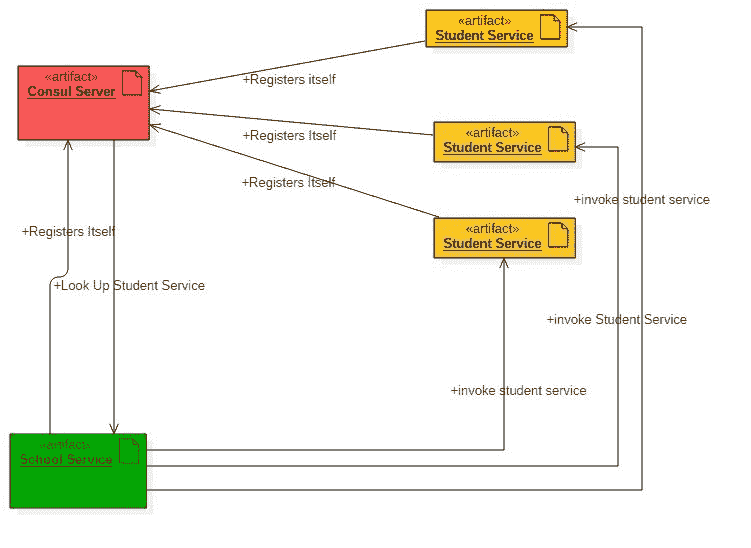
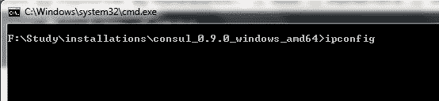
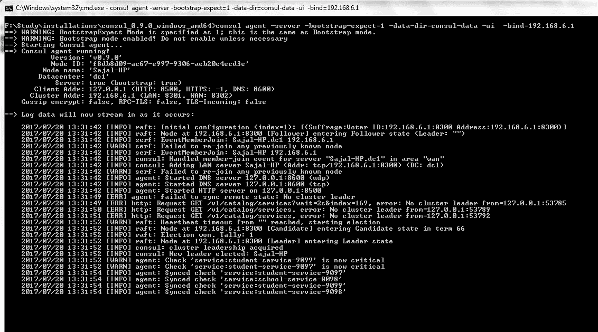
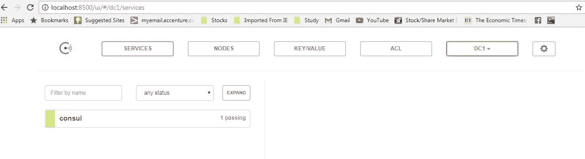
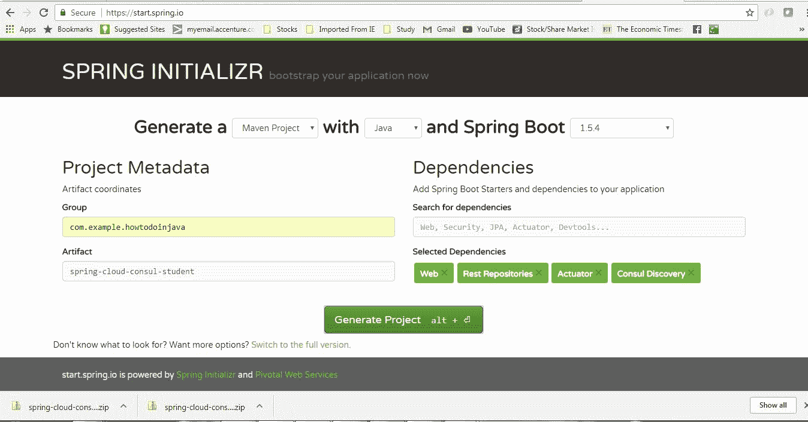
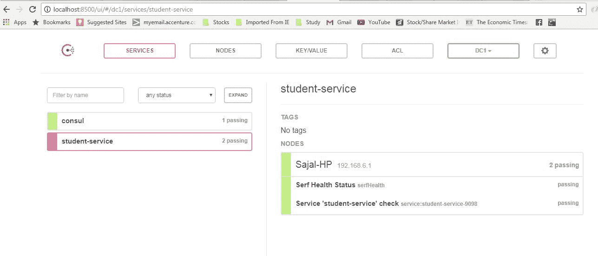
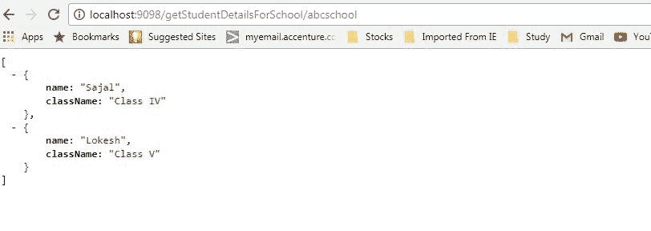
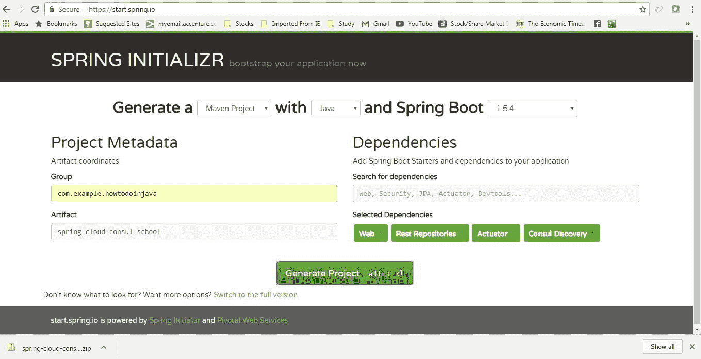
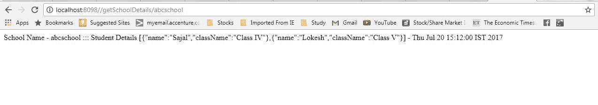
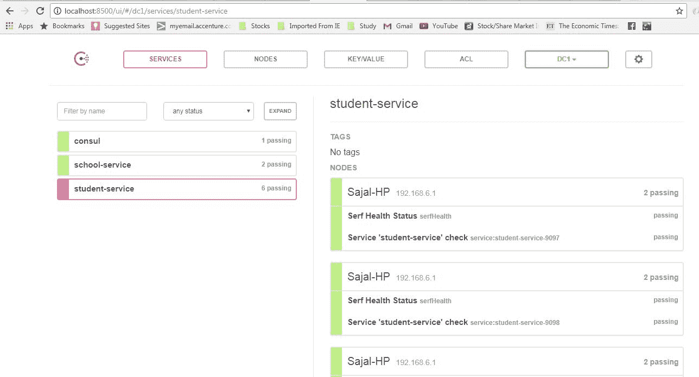

# Consul 服务注册和发现示例

> [https://howtodoinjava.com/spring-cloud/consul-service-registration-discovery/](https://howtodoinjava.com/spring-cloud/consul-service-registration-discovery/)

学习基于`Spring cloud`创建[微服务](//howtodoinjava.com/microservices/microservices-definition-principles-benefits/)，在[`HashiCorp Consul`](https://www.consul.io/)注册表服务器上注册以及其他微服务（发现客户端）如何使用它来注册和发现服务以调用其 API。

我们将使用基于 Spring Boot 的 Spring Cloud API。 我们将使用 Consul 注册表服务器来构建服务注册表服务器和通用发现客户端，后者将自行注册并发现其他服务以调用 REST API。

## 总览

Consul 提供服务发现，配置管理，运行状况检查和键值存储等多种功能。今天，我们将专注于服务注册和发现部分。 我们将开发以下组件来构建分布式生态系统，其中每个组件都相互依赖，但是它们之间的耦合非常松散，当然还有容错能力。

*   **Consul 代理** – 在充当发现/注册服务器功能的 localhost 上运行。
*   **学生微服务** – 将基于学生实体提供一些功能。 这将是一个基于 REST 的服务，最重要的是它将是一个发现服务客户端，该客户端将与 Consul Server / Agent 对话以在服务注册表中注册自己。
*   **学校微服务** – 与学生服务的类型相同 – 唯一增加的功能是它将通过服务查找机制调用学生服务。 我们不会使用学生服务的绝对 URL 与该服务进行交互。 我们将使用 Consul 发现功能，并在调用该功能之前先使用它查找学生服务实例。

这是相同组件的整体组件交互图。

[](//howtodoinjava.com/wp-content/uploads/2017/07/Main.jpg)

Component Diagram

#### 技术栈和运行时

*   Java 1.8
*   Eclipse IDE
*   Consul 即服务注册服务器
*   SpringCloud
*   SpringBoot
*   SpringRest
*   Maven

## 在本地工作站中配置 Consul

在开始练习之前，我们需要首先在 localhost 中下载，配置和运行 consul 代理。

*   从[Consul 门户网站](https://www.consul.io/downloads.html)下载。 根据操作系统选择特定的程序包。 下载压缩文件后，我们需要将其解压缩到所需位置。
*   **Start Consul Agent in local workstation** – The Zip file that we have unzipped, has only one exe file called `consul.exe`. We will start a command prompt here and use below command to start the agent.

    ```java
    consul agent -server -bootstrap-expect=1 -data-dir=consul-data -ui -bind=192.168.6.1
    ```

    确保输入正确的绑定地址，根据局域网设置的不同，绑定地址会有所不同。 在命令提示符下执行`ipconfig`以了解您的 **IpV4 地址**，并在此处使用它。

    [](//howtodoinjava.com/wp-content/uploads/2017/07/ipconfig.jpg)

    ipconfig command

    [](//howtodoinjava.com/wp-content/uploads/2017/07/AgentStart.jpg)

    Agent Start Command Log

*   **Test whether Consul Server is running** – Consul runs on default port and once agent started successfully, browse [http://localhost:8500/ui](http://localhost:8500/ui) and you should see a console screen like – 

    [](//howtodoinjava.com/wp-content/uploads/2017/07/Consul-console-Initial.jpg)

    Consul console – No service registered

因此，我们已经在本地计算机中配置了 consul，并且 consul 代理已成功运行。 现在，我们需要创建客户端并测试服务注册表和发现部分。

## 学生服务

请按照以下步骤创建和运行学生服务。 这将是一个发现客户端，将其注册到现在已经在我们的计算机中运行的 Consul 服务。

#### 创建学生项目

从具有四个依赖项的[初始化程序门户](https://start.spring.io/)创建一个 Spring Boot 项目。

*   执行器
*   网页
*   其余资料库
*   Consul 发现

给出其他 Maven GAV 坐标并下载项目。

[](//howtodoinjava.com/wp-content/uploads/2017/07/student_generation.jpg)

student service project generation

将项目解压缩并将其作为现有的 maven 项目导入 Eclipse。

现在，在`src`文件夹中的 Spring 运行应用程序类上添加`@org.springframework.cloud.client.discovery.EnableDiscoveryClient`注解。 有了此注解，此工件将像 Spring Discovery 客户端一样发挥作用，并在连接到此服务的 Consul 服务器中注册自己。

```java
package com.example.howtodoinjava.springcloudconsulstudent;

import org.springframework.boot.SpringApplication;
import org.springframework.boot.autoconfigure.SpringBootApplication;
import org.springframework.cloud.client.discovery.EnableDiscoveryClient;

@SpringBootApplication
@EnableDiscoveryClient
public class SpringCloudConsulStudentApplication {

	public static void main(String[] args) {
		SpringApplication.run(SpringCloudConsulStudentApplication.class, args);
	}
}

```

#### 服务配置

打开`application.properties`并添加以下属性

```java
server.port=9098
spring.application.name: student-service
management.security.enabled=false

```

这是每个属性的详细信息 – 

*   `server.port=9098` – 将在默认的 **9098** 端口中启动服务。
*   `spring.application.name: student-service` – 将使用`student-service`标签在 Consul 服务器中注册自己，其他服务也将使用此名称本身查找该服务。
*   `management.security.enabled=false` – 此练习实际上不是必需的，但是它将在执行器模块提供的管理端点中禁用 SpringSecurity。

#### 添加 REST API

现在添加一个`RestController`并公开一个剩余端点，以获取特定学校的所有学生详细信息。 在这里，我们公开`/getStudentDetailsForSchool/{schoolname}`端点来满足业务目的。 为简单起见，我们正在对学生详细信息进行硬编码。

```java
package com.example.howtodoinjava.springcloudconsulstudent.controller;

import java.util.ArrayList;
import java.util.HashMap;
import java.util.List;
import java.util.Map;

import org.springframework.web.bind.annotation.PathVariable;
import org.springframework.web.bind.annotation.RequestMapping;
import org.springframework.web.bind.annotation.RequestMethod;
import org.springframework.web.bind.annotation.RestController;

import com.example.howtodoinjava.springcloudconsulstudent.domain.Student;

@RestController
public class StudentServiceController {

	private static Map<String, List<Student>> schooDB = new HashMap<String, List<Student>>();

	static {
		schooDB = new HashMap<String, List<Student>>();

		List<Student> lst = new ArrayList<Student>();
		Student std = new Student("Sajal", "Class IV");
		lst.add(std);
		std = new Student("Lokesh", "Class V");
		lst.add(std);

		schooDB.put("abcschool", lst);

		lst = new ArrayList<Student>();
		std = new Student("Kajal", "Class III");
		lst.add(std);
		std = new Student("Sukesh", "Class VI");
		lst.add(std);

		schooDB.put("xyzschool", lst);

	}

	@RequestMapping(value = "/getStudentDetailsForSchool/{schoolname}", method = RequestMethod.GET)
	public List<Student> getStudents(@PathVariable String schoolname) {
		System.out.println("Getting Student details for " + schoolname);

		List<Student> studentList = schooDB.get(schoolname);
		if (studentList == null) {
			studentList = new ArrayList<Student>();
			Student std = new Student("Not Found", "N/A");
			studentList.add(std);
		}
		return studentList;
	}
}

```

**Student.java 模型**

```java
package com.example.howtodoinjava.springcloudconsulstudent.domain;

public class Student {
	private String name;
	private String className;

	public Student(String name, String className) {
		super();
		this.name = name;
		this.className = className;
	}

	public String getName() {
		return name;
	}

	public void setName(String name) {
		this.name = name;
	}

	public String getClassName() {
		return className;
	}

	public void setClassName(String className) {
		this.className = className;
	}
}

```

#### 验证学生服务

作为 spring boot 应用程序启动该项目。 现在，确认此服务已在 Consul 服务器中自动注册。 转到 Consul Agent 控制台并刷新页面。 现在，如果一切顺利，我们将在 Consul Agent 控制台中看到`student-service`的一项。

[](//howtodoinjava.com/wp-content/uploads/2017/07/Consul-console-Student-Servcie-registered1.jpg)

Consul console Student Service registered

这表明 Consul 服务器和客户端都相互了解，这是 Consul 服务器和学生服务之间发生的一种自动注册和发现。

现在，我们将验证`/getStudentDetailsForSchool/{schoolname}`端点是否已启动并正在运行。 转到浏览器并转到 [http://localhost:9098/getStudentDetailsForSchool/abcschool](http://localhost:9098/getStudentDetailsForSchool/abcschool) ，它将为特定学校`abcschool`提供学生详细信息。

[](//howtodoinjava.com/wp-content/uploads/2017/07/Student_Service_Response.jpg)

Student Service Response

## 学校服务 – 发现客户端

现在，我们将创建学校服务，该服务将在 Consul 服务器中进行注册-它将发现并调用没有硬编码 URL 路径的学生服务。

请按照相同的步骤创建和运行学校服务。 这将是一个发现客户端，将其注册到现在已经在我们的计算机中运行的 Consul 服务。

它将内部调用已开发的学生服务，并将使用 Consul 服务发现功能来发现学生实例。

#### 创建学校项目

从具有四个依赖项的[初始化程序门户](https://start.spring.io/)创建一个 Spring Boot 项目。

*   执行器
*   网页
*   其余资料库
*   Consul 发现

给出其他 Maven GAV 坐标并下载项目。

[](//howtodoinjava.com/wp-content/uploads/2017/07/School_generation.jpg)

School Generation

将项目解压缩并将其作为现有的 maven 项目导入 Eclipse。

现在，在`src`文件夹中的 Spring 运行应用程序类上添加`@org.springframework.cloud.client.discovery.EnableDiscoveryClient`注解。 有了此注解，此工件将像 Spring Discovery 客户端一样发挥作用，并在连接到此服务的 Consul 服务器中注册自己。

```java
package com.example.howtodoinjava.springcloudconsulschool;

import org.springframework.boot.SpringApplication;
import org.springframework.boot.autoconfigure.SpringBootApplication;
import org.springframework.cloud.client.discovery.EnableDiscoveryClient;

@EnableDiscoveryClient
@SpringBootApplication
public class SpringCloudConsulSchoolApplication {

	public static void main(String[] args) {
		SpringApplication.run(SpringCloudConsulSchoolApplication.class, args);
	}
}

```

#### 服务配置

打开`application.properties`并添加以下属性

```java
server.port=8098
spring.application.name: school-service
management.security.enabled=false

```

这是每个属性的详细信息 – 

*   `server.port=8098` – 将在默认的 **8098** 端口中启动服务
*   `spring.application.name: school-service` – 将使用`school-service`标签在 Consul 服务器中注册自己。
*   `management.security.enabled=false` – 将在执行器模块提供的管理端点中禁用 SpringSecurity。

#### 添加使用学生服务的 REST API 的 REST API

现在添加一个`RestController`，并公开一个 REST 点以获取学校详细信息。 该端点将使用带有应用程序名称的服务发现样式 URL，而不是带有 host：port 的完整 URL 约定。

`SchoolServiceController.java`

```java
package com.example.howtodoinjava.springcloudconsulschool.controller;

import org.springframework.beans.factory.annotation.Autowired;
import org.springframework.web.bind.annotation.PathVariable;
import org.springframework.web.bind.annotation.RequestMapping;
import org.springframework.web.bind.annotation.RequestMethod;
import org.springframework.web.bind.annotation.RestController;
import com.example.howtodoinjava.springcloudconsulschool.delegate.StudentServiceDelegate;

@RestController
public class SchoolServiceController {

	@Autowired
	StudentServiceDelegate studentServiceDelegate;

	@RequestMapping(value = "/getSchoolDetails/{schoolname}", method = RequestMethod.GET)
	public String getStudents(@PathVariable String schoolname) 
	{
		System.out.println("Going to call student service to get data!");
		return studentServiceDelegate.callStudentServiceAndGetData(schoolname);
	}
}

```

`StudentServiceDelegate.java`

```java
package com.example.howtodoinjava.springcloudconsulschool.delegate;

import java.util.Date;
import org.springframework.beans.factory.annotation.Autowired;
import org.springframework.cloud.client.loadbalancer.LoadBalanced;
import org.springframework.context.annotation.Bean;
import org.springframework.core.ParameterizedTypeReference;
import org.springframework.http.HttpMethod;
import org.springframework.stereotype.Service;
import org.springframework.web.client.RestTemplate;

@Service
public class StudentServiceDelegate 
{
	@Autowired
	RestTemplate restTemplate;

	public String callStudentServiceAndGetData(String schoolname) 
	{
		System.out.println("Consul Demo - Getting School details for " + schoolname);

		String response = restTemplate.exchange("http://student-service/getStudentDetailsForSchool/{schoolname}", 										HttpMethod.GET, null, new ParameterizedTypeReference<String>() {}, 												schoolname).getBody();

		System.out.println("Response Received as " + response + " -  " + new Date());

		return "School Name -  " + schoolname + " :::  Student Details " + response + " -  " + new Date();
	}

	@Bean
	@LoadBalanced
	public RestTemplate restTemplate() {
		return new RestTemplate();
	}
}

```

看上面的代码。 在`StudentServiceDelegate`中，我们使用`RestTemplate`调用学生服务，并将学生服务的 URL 用作`http://<font color="RED">student-service/getStudentDetailsForSchool/{schoolname}`。

这样，我们就可以摆脱特定的服务配置，并且可以将服务查找职责赋予`consul`服务器和此处提供的其余模板。 如果多个实例正在为同一服务运行，我们也可以在此处应用负载平衡（请参阅`@LoadBalanced`注解）。

## 示例

逐步执行以下步骤以了解整个过程 – 

*   **检查 Consul Agent 是否仍在运行** – 打开浏览器，然后浏览 [http://localhost:8500/ui](http://localhost:8500/ui) 。 它应该显示如上所述的 Consul 控制台。
*   **检查学生服务是否已运行** – 从 Consul 管理页面和浏览器中检查学生服务是否已启动并正在运行。 如果没有启动该服务，并验证它已在 Consul 服务器中注册。
*   **启动并检查学校服务** – 从命令提示符启动学校服务，并检查它是否已在 Consul 服务器中注册。
*   Open browser and test school REST service using URL [http://localhost:8098//getSchoolDetails/abcschool](http://localhost:8098//getSchoolDetails/abcschool). It will give below response and it will internally invoke student service using consul service.

    [](//howtodoinjava.com/wp-content/uploads/2017/07/studentService.jpg)

    School Service Response

*   Also Try starting multiple instance Student Service by changing port by `java -jar "-Dserver.port=9099 target\spring-cloud-consul-student-0.0.1-SNAPSHOT.jar`. Those will also be registered in consul and as we are using `@LoadBalanced` annotation in the `RestTemplate`, load balancing will also be done internally. Check the respective student service console to verify which instance got invoked in multi-instance scenario.

    一旦我们注册了多个服务和多个实例，Consul 服务器的外观将如此。

    [](//howtodoinjava.com/wp-content/uploads/2017/07/Consul_All_Services_running.jpg)

    Consul All Services Running 

## 检查是否遇到任何错误的内容

*   注解 [`@EnableDiscoveryClient`](https://github.com/spring-cloud/spring-cloud-commons/blob/master/spring-cloud-commons/src/main/java/org/springframework/cloud/client/discovery/EnableDiscoveryClient.java) 和 Consul 代理运行是应用程序生态系统的核心。 没有这两个东西将根本无法工作。
*   确保在开始学校服务，学生服务，Consul 服务器时，代理已在运行，否则可能要花一些时间进行注册，并且在测试时可能会造成混淆。

## 总结

我们看到了如何高效地部署 Consul 服务注册表和发现服务器以及客户端。 Spring 框架在内部维护着很多东西。 在这里，我们仅使用几个注解和非常少的配置即可快速完成所有操作。

这就是为 spring 服务创建微服务的服务。

如果您在执行本文时遇到任何困难，请添加注解。 我们将很乐意调查这个问题。

[Download Source code for this Article](//howtodoinjava.com/wp-content/uploads/2017/07/Consoul.zip)

祝您学习愉快！