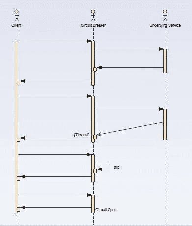
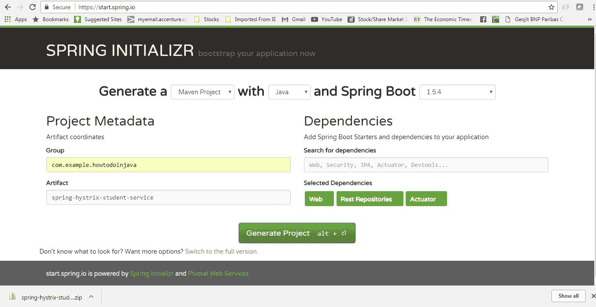
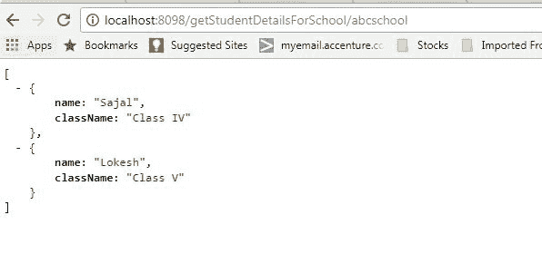
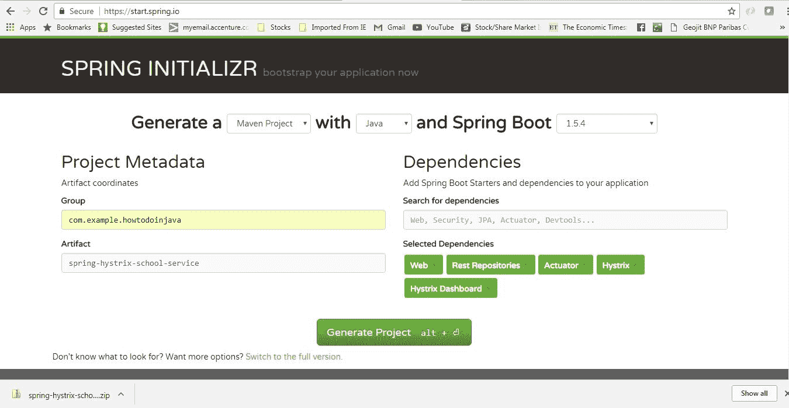
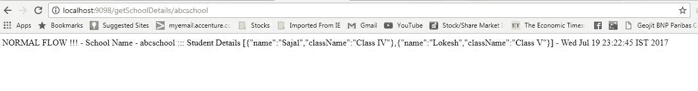
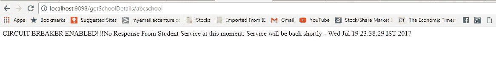
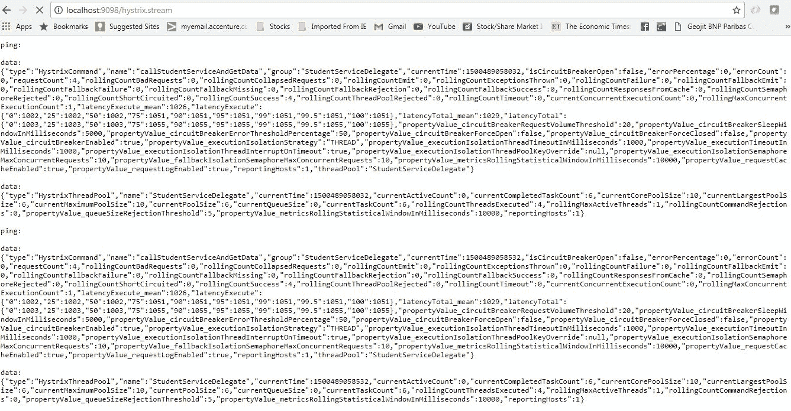
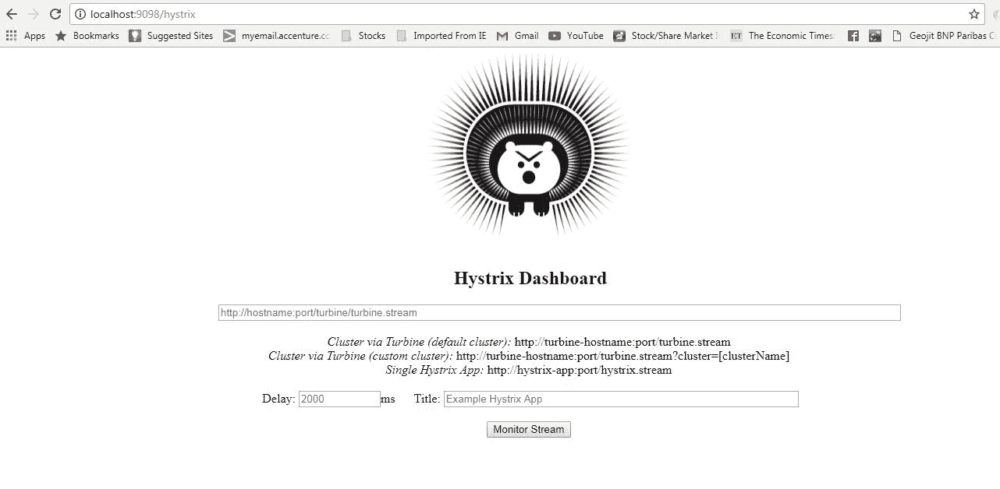
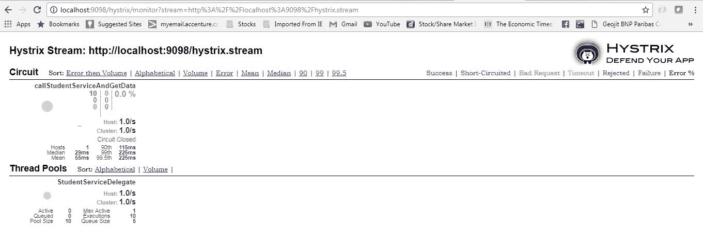

# Hystrix 断路器模式 – SpringCloud

> [https://howtodoinjava.com/spring-cloud/spring-hystrix-circuit-breaker-tutorial/](https://howtodoinjava.com/spring-cloud/spring-hystrix-circuit-breaker-tutorial/)

了解如何利用称为[`Hystrix`](https://github.com/Netflix/Hystrix)的 [Spring cloud Netflix](//howtodoinjava.com/spring/spring-cloud/spring-cloud-service-discovery-netflix-eureka/) 堆栈组件之一来实现**断路器**，同时调用基础[微服务](//howtodoinjava.com/microservices/microservices-definition-principles-benefits/)。 通常需要在某些基础服务永久关闭/抛出错误的应用程序中启用容错功能，我们需要自动退回到程序执行的不同路径。 这与使用大量底层微服务的生态系统的分布式计算风格有关。 这是断路器模式的帮助之处，`Hystrix`是构建此断路器的工具。

## Hystrix 例子，真正不耐烦

Hystrix 配置通过四个主要步骤完成。

1.  添加 Hystrix 启动器和仪表板依赖项。

    ```java
    <dependency>
    	<groupId>org.springframework.cloud</groupId>
    	<artifactId>spring-cloud-starter-hystrix</artifactId>
    </dependency>
    <dependency>
    	<groupId>org.springframework.cloud</groupId>
    	<artifactId>spring-cloud-starter-hystrix-dashboard</artifactId>
    </dependency>

    ```

2.  添加`@EnableCircuitBreaker`注解
3.  添加`@EnableHystrixDashboard`注解
4.  添加注解`@HystrixCommand(fallbackMethod = "myFallbackMethod")`

## Whay 是断路器模式吗？

如果我们在基于微服务的体系结构上设计系统，则通常会开发许多微服务，并且这些微服务会在实现某些业务目标时相互影响很大。 现在，我们所有人都可以假设，如果所有服务都已启动并且正在运行，并且每个服务的响应时间令人满意，那么这将给出预期的结果。

现在，如果当前生态系统的任何服务出现问题并停止为请求提供服务，将会发生什么。 这将导致超时/异常，并且由于此单点故障，整个生态系统将变得不稳定。

在这里，断路器模式非常方便，一旦发现任何此类情况，它将流量重定向到回退路径。 它还会密切监视有缺陷的服务，并在服务恢复正常后恢复流量。

因此，断路器是进行服务调用的方法的一种包装，它监视服务的运行状况，一旦出现问题，断路器将跳闸，所有进一步的调用都将返回到断路器，最后自动恢复一次 服务回来了！ 太酷了吧？

[](//howtodoinjava.com/wp-content/uploads/2017/07/CB_Sequence.jpg)

Circuit Breaker Sequence of Invocation

## Hystrix 断路器示例

为了演示断路器，我们将创建以下两个微服务，其中第一个微服务依赖于另一个。

*   **学生微服务** – 将提供`Student`实体的一些基本功能。 这将是一个基于 REST 的服务。 我们将从`School`服务中调用此服务，以了解断路器。 它将在本地主机的端口`8098`上运行。
*   **学校微服务** – 同样是一个简单的基于 REST 的微服务，我们将使用`Hystrix`实现断路器。 `Student`服务将从此处调用，一旦学生服务不可用，我们将测试后备路径。 它将在本地主机的端口 9098 上运行。

#### 技术堆栈和演示运行时

*   Java 1.8
*   Eclipse 作为 IDE
*   Maven 作为构建工具
*   Spring Cloud Hystrix 作为断路器框架
*   SpringBoot
*   SpringRest

## 创建学生服务

请按照以下步骤创建和运行学生服务-一个简单的 REST 服务，提供学生实体的一些基本功能。

#### 创建 spring boot 项目

从 [Spring Boot 初始化器门户](https://start.spring.io/)创建具有三个依赖项的 Spring Boot 项目，即`Web`，`Rest Repositories`和`Actuator`。 给出其他 Maven GAV 坐标并下载项目。

[](//howtodoinjava.com/wp-content/uploads/2017/07/studentservciegeneration.jpg)

Student Service Generation

将项目解压缩并将其作为现有的 maven 项目导入 Eclipse。 在此步骤中，将从 maven 存储库下载所有必需的依赖项。

#### 服务器端口设置

打开`application.properties`并添加端口信息。

```java
server.port = 8098
```

这将使该应用程序在默认端口 8098 上运行。通过在启动服务器时提供 `-Dserver.port = XXXX`参数，可以轻松地覆盖此应用程序。

#### 创建 REST API

现在添加一个称为`StudentServiceController`的 REST 控制器类，并公开一个其余端点，以获取特定学校的所有学生详细信息。 在这里，我们公开`/getStudentDetailsForSchool/{schoolname}`端点来满足业务目的。 为简单起见，我们正在对学生详细信息进行硬编码。

`StudentServiceController.java`

```java
package com.example.howtodoinjava.springhystrixstudentservice.controller;

import java.util.ArrayList;
import java.util.HashMap;
import java.util.List;
import java.util.Map;
import org.springframework.web.bind.annotation.PathVariable;
import org.springframework.web.bind.annotation.RequestMapping;
import org.springframework.web.bind.annotation.RequestMethod;
import org.springframework.web.bind.annotation.RestController;
import com.example.howtodoinjava.springhystrixstudentservice.domain.Student;

@RestController
public class StudentServiceController {

	private static Map<String, List<Student>> schooDB = new HashMap<String, List<Student>>();

	static {
		schooDB = new HashMap<String, List<Student>>();

		List<Student> lst = new ArrayList<Student>();
		Student std = new Student("Sajal", "Class IV");
		lst.add(std);
		std = new Student("Lokesh", "Class V");
		lst.add(std);

		schooDB.put("abcschool", lst);

		lst = new ArrayList<Student>();
		std = new Student("Kajal", "Class III");
		lst.add(std);
		std = new Student("Sukesh", "Class VI");
		lst.add(std);

		schooDB.put("xyzschool", lst);

	}

	@RequestMapping(value = "/getStudentDetailsForSchool/{schoolname}", method = RequestMethod.GET)
	public List<Student> getStudents(@PathVariable String schoolname) {
		System.out.println("Getting Student details for " + schoolname);

		List<Student> studentList = schooDB.get(schoolname);
		if (studentList == null) {
			studentList = new ArrayList<Student>();
			Student std = new Student("Not Found", "N/A");
			studentList.add(std);
		}
		return studentList;
	}
}

```

`Student.java`

```java
package com.example.howtodoinjava.springhystrixstudentservice.domain;

public class Student {

	private String name;
	private String className;

	public Student(String name, String className) {
		super();
		this.name = name;
		this.className = className;
	}

	public String getName() {
		return name;
	}

	public void setName(String name) {
		this.name = name;
	}

	public String getClassName() {
		return className;
	}

	public void setClassName(String className) {
		this.className = className;
	}
}

```

#### 建立并测试学生服务

现在，使用`mvn clean install`进行最终构建，并使用命令`java -jar target\spring-hystrix-student-service-0.0.1-SNAPSHOT.jar`运行服务器。 这将在默认端口`8098`中启动学生服务。

打开浏览器，然后输入`http://localhost:8098/getStudentDetailsForSchool/abcschool`。

它应在浏览器中显示以下输出 – 

[](//howtodoinjava.com/wp-content/uploads/2017/07/studentserviceresponse.jpg)

Student Service Response

## 创建学校服务-启用 Hystrix

与学生服务类似，为学校创建另一个微服务。 它将在内部调用已开发的学生服务。

#### 生成 Spring Boot 项目

从 [Spring Boot 初始化程序门户](https://start.spring.io/)主要使用那些依赖项创建一个 Spring Boot 项目。

*   **Web** – REST 端点
*   **执行器** – 提供基本管理 URL
*   **Hystrix** – 启用断路器
*   **Hystrix 仪表板** – 启用一个与断路器监控相关的仪表板屏幕

给出其他 Maven GAV 坐标并下载项目。

[](//howtodoinjava.com/wp-content/uploads/2017/07/schoolservicegeneration.jpg)

School Service Project

将项目解压缩并作为现有 maven 项目导入到 Eclipse 中。 在此步骤中，将从 maven 存储库下载所有必需的依赖项。

#### 服务器端口设置

打开`application.properties`并添加端口信息。

```java
server.port = 9098
```

这将使该应用程序在默认端口 9098 上运行。通过在启动服务器时提供 `-Dserver.port = XXXX`参数，可以轻松地覆盖此应用程序。

#### 启用 Hystrix 设置

打开`SpringHystrixSchoolServiceApplication`，即使用`@SpringBootApplication`生成的类，并添加`@EnableHystrixDashboard`和`@EnableCircuitBreaker`注解。

这将**在应用程序中启用 Hystrix 断路器**，还将添加一个在 Hystrix 提供的 localhost 上运行的有用仪表板。

```java
package com.example.howtodoinjava.springhystrixschoolservice;

import org.springframework.boot.SpringApplication;
import org.springframework.boot.autoconfigure.SpringBootApplication;
import org.springframework.cloud.client.circuitbreaker.EnableCircuitBreaker;
import org.springframework.cloud.netflix.hystrix.dashboard.EnableHystrixDashboard;

@SpringBootApplication
@EnableHystrixDashboard
@EnableCircuitBreaker
public class SpringHystrixSchoolServiceApplication {

	public static void main(String[] args) {
		SpringApplication.run(SpringHystrixSchoolServiceApplication.class, args);
	}
}

```

#### 添加 REST 控制器

在我们将公开`/getSchoolDetails/{schoolname}`端点的位置添加`SchoolServiceController` Rest Controller，该端点将仅返回学校详细信息及其学生详细信息。 对于学生详细信息，它将调用已经开发的学生服务端点。 我们将创建一个代表层`StudentServiceDelegate.java`来调用学生服务。 这个简单的代码看起来像

`SchoolServiceController.java`

```java
package com.example.howtodoinjava.springhystrixschoolservice.controller;

import org.springframework.beans.factory.annotation.Autowired;
import org.springframework.web.bind.annotation.PathVariable;
import org.springframework.web.bind.annotation.RequestMapping;
import org.springframework.web.bind.annotation.RequestMethod;
import org.springframework.web.bind.annotation.RestController;
import com.example.howtodoinjava.springhystrixschoolservice.delegate.StudentServiceDelegate;

@RestController
public class SchoolServiceController {

	@Autowired
	StudentServiceDelegate studentServiceDelegate;

	@RequestMapping(value = "/getSchoolDetails/{schoolname}", method = RequestMethod.GET)
	public String getStudents(@PathVariable String schoolname) {
		System.out.println("Going to call student service to get data!");
		return studentServiceDelegate.callStudentServiceAndGetData(schoolname);
	}
}

```

**StudentServiceDelegate**

我们将在此处执行以下操作以启用 Hystrix 断路器。

*   通过提供的 Spring 框架调用学生服务`RestTemplate`
*   添加 Hystrix 命令以启用回退方法 – `@HystrixCommand(fallbackMethod = "callStudentServiceAndGetData_Fallback")` – 这意味着我们将不得不添加另一个具有相同签名的方法`callStudentServiceAndGetData_Fallback`，当实际的学生服务关闭时将调用该方法。
*   添加后备方法 – `callStudentServiceAndGetData_Fallback`，它将仅返回一些默认值。

```java
package com.example.howtodoinjava.springhystrixschoolservice.delegate;

import java.util.Date;
import org.springframework.beans.factory.annotation.Autowired;
import org.springframework.context.annotation.Bean;
import org.springframework.core.ParameterizedTypeReference;
import org.springframework.http.HttpMethod;
import org.springframework.stereotype.Service;
import org.springframework.web.client.RestTemplate;
import com.netflix.hystrix.contrib.javanica.annotation.HystrixCommand;

@Service
public class StudentServiceDelegate {

	@Autowired
	RestTemplate restTemplate;

	@HystrixCommand(fallbackMethod = "callStudentServiceAndGetData_Fallback")
	public String callStudentServiceAndGetData(String schoolname) {

		System.out.println("Getting School details for " + schoolname);

		String response = restTemplate
				.exchange("http://localhost:8098/getStudentDetailsForSchool/{schoolname}"
				, HttpMethod.GET
				, null
				, new ParameterizedTypeReference<String>() {
			}, schoolname).getBody();

		System.out.println("Response Received as " + response + " -  " + new Date());

		return "NORMAL FLOW !!! - School Name -  " + schoolname + " :::  " +
					" Student Details " + response + " -  " + new Date();
	}

	@SuppressWarnings("unused")
	private String callStudentServiceAndGetData_Fallback(String schoolname) {

		System.out.println("Student Service is down!!! fallback route enabled...");

		return "CIRCUIT BREAKER ENABLED!!! No Response From Student Service at this moment. " +
					" Service will be back shortly - " + new Date();
	}

	@Bean
	public RestTemplate restTemplate() {
		return new RestTemplate();
	}
}

```

#### 建立和测试学校服务

现在，使用`mvn clean install`进行最终构建，并使用命令`java -jar target\spring-hystrix-school-service-0.0.1-SNAPSHOT.jar`运行服务器。 这将在默认端口 **9098** 中启动学校服务。

如上所述启动学生服务，然后通过打开浏览器并键入`http://localhost:9098/getSchoolDetails/abcschool`来测试学校服务。 它应该在浏览器中显示以下输出：

[](//howtodoinjava.com/wp-content/uploads/2017/07/schoolserviceresponse.jpg)

School Service Response

## 测试 Hystrix 断路器-演示

打开浏览器，然后输入`http://localhost:9098/getSchoolDetails/abcschool`。

它应在浏览器中显示以下输出 – 

[](//howtodoinjava.com/wp-content/uploads/2017/07/schoolserviceresponse.jpg)

School Service Response

现在我们已经知道，学校服务在内部调用学生服务，并且正在从该服务获取学生详细信息。 因此，如果两个服务都在运行，则学校服务将显示学生服务返回的数据，正如我们在上面的学校服务浏览器输出中所看到的那样。 这是**电路关闭状态**。

现在，让我们停止学生服务，只需在学生服务服务器控制台中按`CTRL + C`（停止服务器），然后从浏览器再次测试学校服务。 这次它将返回回退方法响应。 Hystrix 出现在这里，它会频繁地监视学生服务，并且在停机时，Hystrix 组件已打开电路并启用了后备路径。

这是浏览器中的回退输出。

[](//howtodoinjava.com/wp-content/uploads/2017/07/schoolserviceresponse_fallback.jpg)

School Service Response Fallback path

再次启动学生服务，等待片刻，然后返回学校服务，它将再次开始以正常流程进行响应。

## Hystrix 仪表板

当我们添加了 hystrix 仪表板依赖性时，hystrix 在以下 URL 中提供了一个不错的 Dashboard 和 Hystrix Stream：

*   [**http://localhost:9098/hystrix.stream**](http://localhost:9098/hystrix.stream) – It’s a continuous stream that Hystrix generates. It is just a health check result along with all the service calls that are being monitored by Hystrix. Sample output will look like in browser – 

    [](//howtodoinjava.com/wp-content/uploads/2017/07/HystrixStream.jpg)

    Hystrix Stream output

*   [**http://localhost:9098/hystrix**](http://localhost:9098/hystrix) – This is visual dashboard initial state.

    [](//howtodoinjava.com/wp-content/uploads/2017/07/Hystrix_initial.jpg)

    Hystrix Initial Dashboard

*   Now add [http://localhost:9098/hystrix.stream](http://localhost:9098/hystrix.stream) in dashboard to get a meaningful dynamic visual representation of the circuit being monitored by the Hystrix component. Visual Dashboard after providing the Stream input in the home page – 

    [](//howtodoinjava.com/wp-content/uploads/2017/07/HystrixDashboard.jpg)

    Hystrix visual Dashboard

## 总结

这就是**可以制造 Spring 开关 Hystrix 断路器**的全部内容，我们已经测试了**电路开放路径**和**电路闭合路径**。 自行进行设置，并使用不同的组合服务状态以更清楚地了解整个概念。

如果您在执行本文时遇到任何困难，请添加评论。 我们将很乐意调查这个问题。

[Download Source code](//howtodoinjava.com/wp-content/uploads/2017/07/Circuit-Breaker.zip)

学习愉快！