# 如何将 Spring Boot 应用程序部署到 Cloud Foundry 平台

> 原文： [https://howtodoinjava.com/spring-cloud/pivotal-cloud-foundry-spring-boot-example/](https://howtodoinjava.com/spring-cloud/pivotal-cloud-foundry-spring-boot-example/)

如今， [**云计算**](//howtodoinjava.com/cloud/java-cloud-development-introduction-and-tools/)和[**微服务**](//howtodoinjava.com/microservices/microservices-definition-principles-benefits/)已经成为非常流行的概念，几乎所有组织都在对其进行快速投资和调整。 当前市场上只有少数流行的云供应器，**Cloud Foundry** 是其中之一。这是[ PaaS 服务](https://en.wikipedia.org/wiki/Platform_as_a_service)，我们可以在其中轻松部署和管理应用程序，Cloud Foundry 将负责其余基于云的产品，例如可伸缩性，高可用性等。

今天，我们将学习从在本地工作站中设置 Cloud Foundry 开始在 Cloud Foundry 中部署 Spring Boot 应用程序。 当前有许多可用的 Cloud Foundry 发行版，在本文中，我们将主要集中在称为[ Pivotal Web 服务](https://run.pivotal.io/)的 **Pivotal Cloud Foundry** 平台上。

## 什么是 Cloud Foundry

Cloud Foundry 是一个开源平台即服务（PaaS），可为您提供选择的云，开发人员框架和应用程序服务。 它是开源的，由 Cloud Foundry 组织管理。 最初的 Cloud Foundry 由 VMware 开发，目前由 GE，EMC 和 VMware 的合资公司 Pivotal 管理。

现在，由于 Cloud Foundry 是开源产品，因此许多受欢迎的组织当前单独提供了该平台，以下是当前经过认证的供应器的列表。

*   Pivotal Cloud Foundry
*   IBM Bluemix
*   HPE Helion Stackato 4.0
*   Atos Canopy
*   CenturyLink App Fog
*   GE Predix
*   华为 FusionStage
*   SAP Cloud 平台
*   Swisscom 应用程序云

## Windows 上的 Cloud Foundry 安装

这是 Windows 的安装步骤，对于其他操作系统，Cloud Foundry 拥有非常好的文档，我们可以轻松地遵循。

Cloud Foundry 在命令提示符下运行良好，Cloud Foundry 提供了一个名为`cf`的命令行工具，几乎可以为我们完成所有活动。 因此，要使该工具（`cf`命令）在本地工作站中可用，首先我们需要安装并配置 Cloud Foundry 命令行（CLI）接口。

1.  下载[ CF Windows 安装程序](https://cli.run.pivotal.io/stable?release=windows64&source=github)。 它将提示您进行下载。 保存 zip 文件分发。
2.  将 zip 文件解压缩到工作站中合适的位置。

    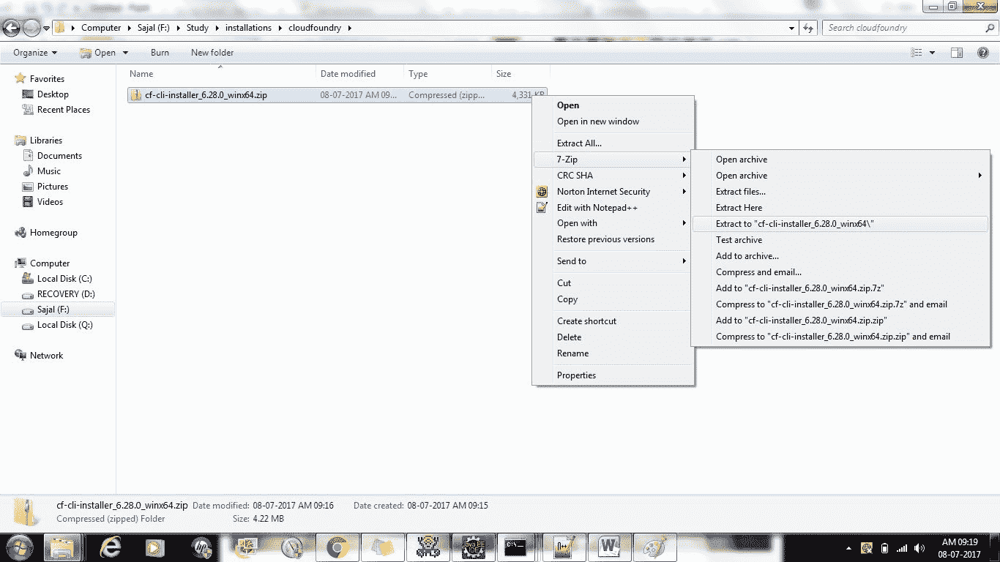

    解压安装器

3.  成功进行**解压缩**之后，双击`cf` CLI 可执行文件。

    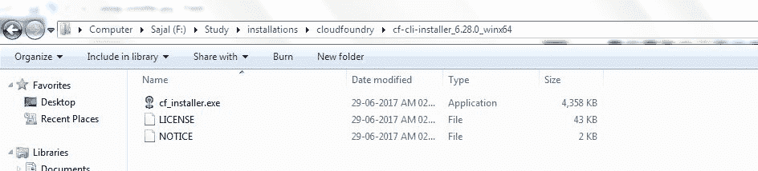

    CF 安装器的位置

4.  出现提示时，单击“安装”，然后单击“关闭”。 这是相同的示例步骤。 这是非常直接的，您可以选择默认值。

    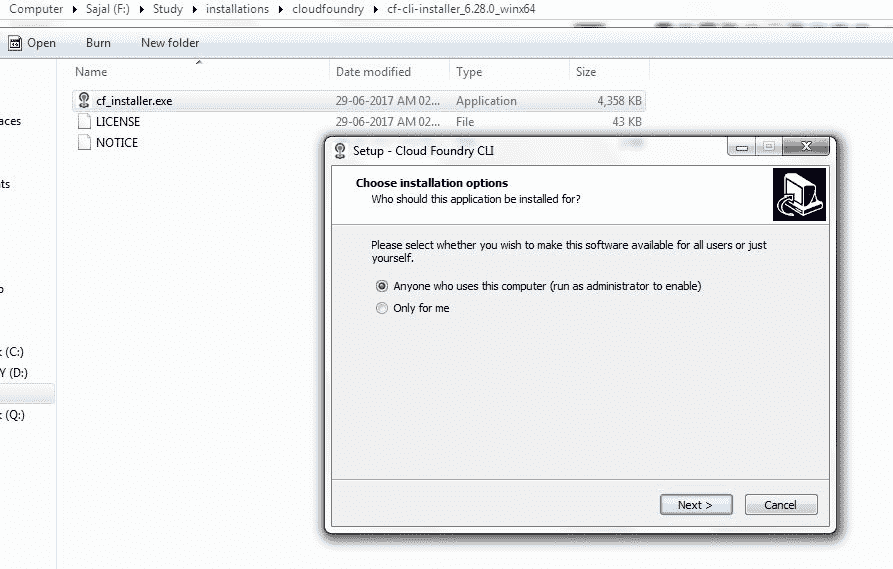

    第一步

    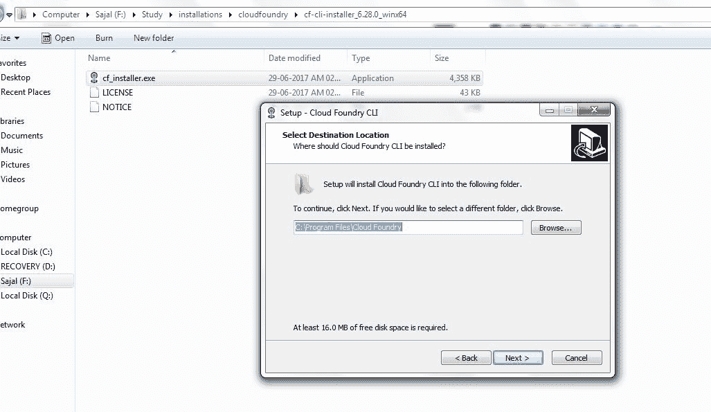

    第二步

    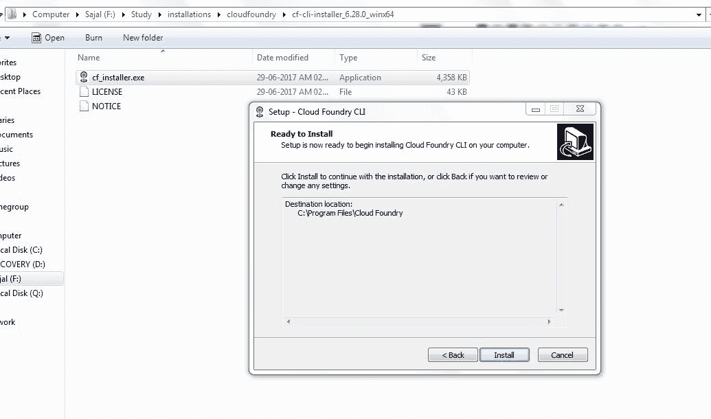

    第三步

    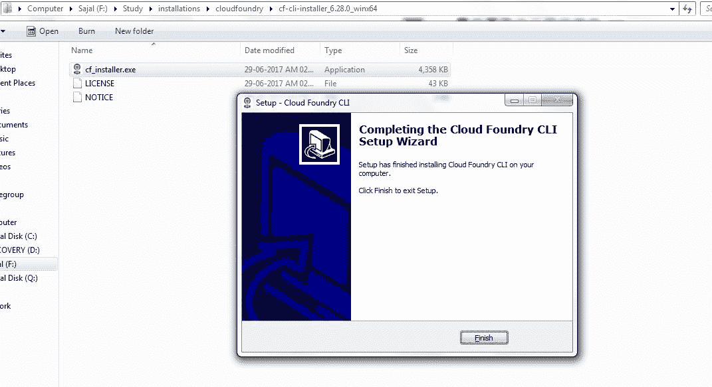

    第四步

5.  通过打开终端窗口并输入`cf`来验证安装。 如果安装成功，则显示`cf` CLI 帮助列表。 这表明您已准备好使用本地工作站上的任何 Cloud Foundry 平台。

    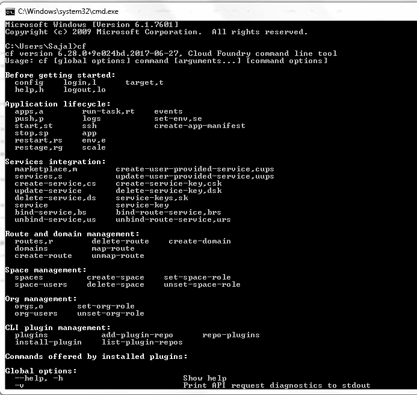

    Cloud Foundry 安装验证

现在，我们将继续进行 Pivotal Web 服务帐户注册，并开发一个示例应用程序，并推送到 Cloud Foundry。

## 设置 PWS 控制台

现在，我们需要在 Pivotal 中创建一个帐户，以便在 Pivotal Cloud Foundry 平台中部署我们的应用程序。 我们需要在下一页中[注册](https://account.run.pivotal.io/z/uaa/sign-up)才能开始注册过程。 它是免费的，它只会询问一些非常常见的问题，例如电子邮件地址，姓名等。

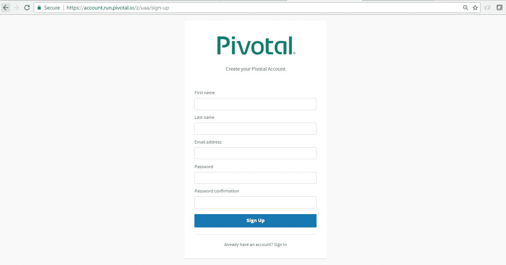

Pivotal web 服务控制台注册

注册完成后，我们可以通过枢纽 Web 服务控制台的[登录屏幕](https://login.run.pivotal.io/login)登录控制台。

成功提供登录凭据后，我们将进入 **CloudFoundry 控制台**，在其中我们可以查看所有已部署的应用程序，可以监视这些应用程序并进行更多活动。 在这里，我们需要[添加 org 和 space](https://docs.cloudfoundry.org/concepts/roles.html) 等，这是非常简单和自我描述的。 下面是登录后的一个示例控制台屏幕。

目前尚未部署任何应用程序，因为我们尚未推送任何应用程序。

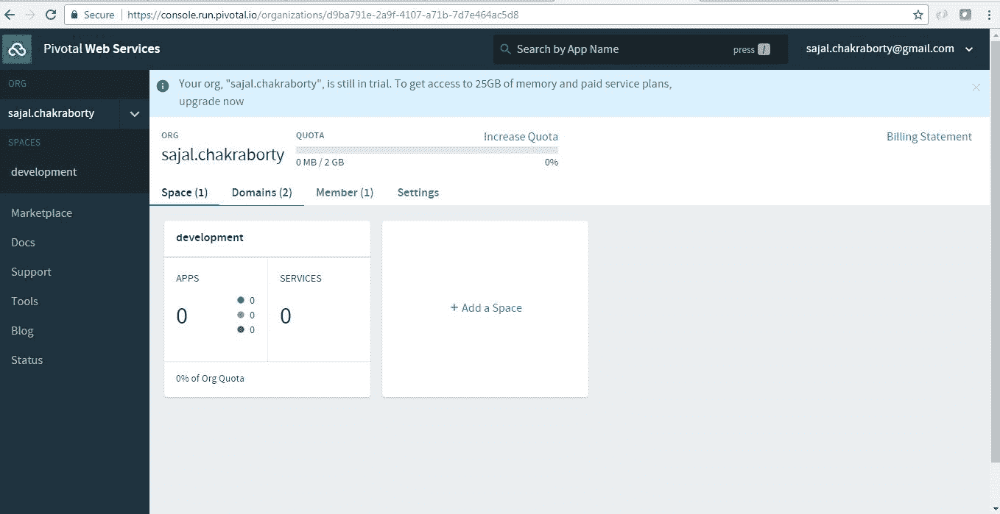

登录后的 PWS 控制台

#### 使用 CLI 从 PWS 控制台登录和注销

1.  **登录到 PWS** – 我们将使用`cf login -a api.run.pivotal.io`命令从本地工作站中安装的 CLI 工具登录到关键 Web 服务控制台。 它将 CLI 工具登录到 PWS 平台，以便我们可以从工作站部署和管理应用程序。 发出命令后，它将询问注册的电子邮件和密码，一旦成功提供，它将登录到平台。
2.  **从 PWS 控制台注销** – 一旦完成了该会话的所有工作，我们将使用命令`cf logout`从平台注销。

[PRE0]

这是从命令提示符登录和注销的样子。

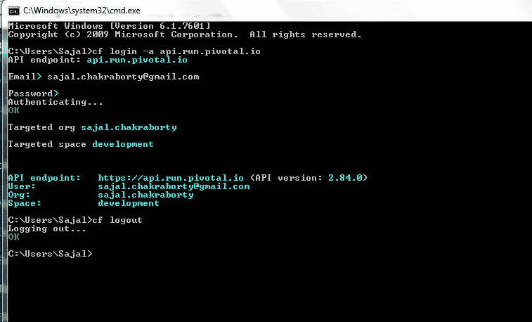

CF 的登录和注销

## 创建 Spring Boot 应用程序

现在，我们将创建一个 Spring Boot 应用程序，并将其部署到 PWS 控制台并从 Cloud Foundry 本身进行访问。 我们将创建一个应用程序，该应用程序将公开一个简单的 REST 端点，将其部署在 **Pivotal Web 服务平台**中后，将从我们的工作站进行测试。

#### 技术栈

我们将使用下面的技术栈进行 Spring Boot 应用程序的开发和测试。

*   SpringBoot
*   Spring REST
*   Maven
*   Eclipse
*   Cloud Foundry CLI
*   网页浏览器

#### 生成 Spring Boot 应用程序

从[ spring boot 初始化器页面](https://start.spring.io/)开始，这是创建任何基于 spring boot 的应用程序的一个很好的起点。 在这里，我们将仅选择配置服务器启动器 pom。 屏幕截图是这样的。 使用此配置，一旦我们生成了项目，便会下载一个 zip 文件，我们将其解压缩后直接导入 eclipse 中。

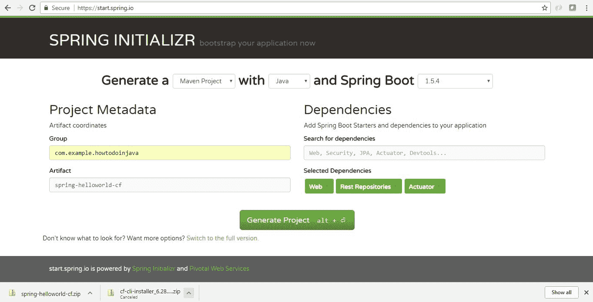

Spring Boot 项目生成

将项目导入 Eclipse 以将其作为现有 Maven 项目。 让 maven 为您下载依赖项和设置类路径条目。

#### 添加 REST 控制器和端点

我们需要添加简单的 REST 端点来测试从 Cloud Foundry 进行的部署。 自动化项目生成`SpringHelloworldCfApplication.java`已提供的开放启动应用程序类，并添加以下几行以添加一个简单的端点，该端点将根据输入内容进行回显。

最后一堂课如下。

[PRE1]

#### 项目配置

在`src\main\resources`目录的`bootstrap.properties`文件中添加上下文路径和必需的属性，并在其中添加两个属性。

[PRE2]

这将为应用程序设置一个上下文路径`/hello`，而`management.security.enabled=false`将禁用 Spring Boot 管理端点（如`/env, /refresh`等）的安全性。

#### 本地测试

最后，在嵌入式 tomcat 容器中的 Local 中构建和测试应用程序。 为此，将应用程序作为 spring boot 应用程序启动。

转到浏览器并输入`http://localhost:8080/hello?name=howtodoinjava`。 它应该回显该名称以及一些问候消息和响应过程时间。

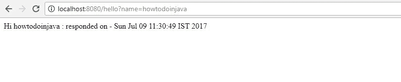

REST API 输出

现在，我们将在已注册的 Pivotal Cloud Foundry 中部署应用程序。

## 在 Cloud Foundry 平台中部署 Spring Boot 应用程序

由于我们已经配置了 Cloud Foundry CLI，因此我们将使用 CLI `cf push`命令在 Cloud Foundry 控制台中部署应用程序。

#### 登录到 PWS 控制台

为此，请打开命令提示符并转到 Maven 应用程序的主目录，然后使用`cf login -a api.run.pivotal.io`命令登录到重要的 Web 服务控制台。

它将要求提供注册的凭据，最后登录到控制台。

#### 将应用程序推送到控制台

现在我们需要使用命令`cf push`推送应用程序。

[PRE3]

这会将应用程序部署到上一步中已登录的 PWS 控制台中。

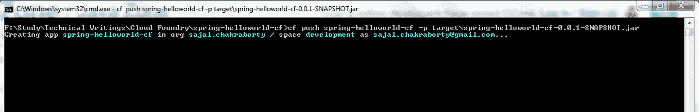

通过`cf push`来部署

在[随附的日志文件](//howtodoinjava.com/wp-content/uploads/2017/07/Cf_push_Command_log.txt)中阅读有关`push`命令的完整控制台日志。

#### 验证应用程序部署

验证进入 PWS 控制台以检查是否显示了新部署的应用程序。 如果在前面的步骤中一切正常，则屏幕将如下所示。

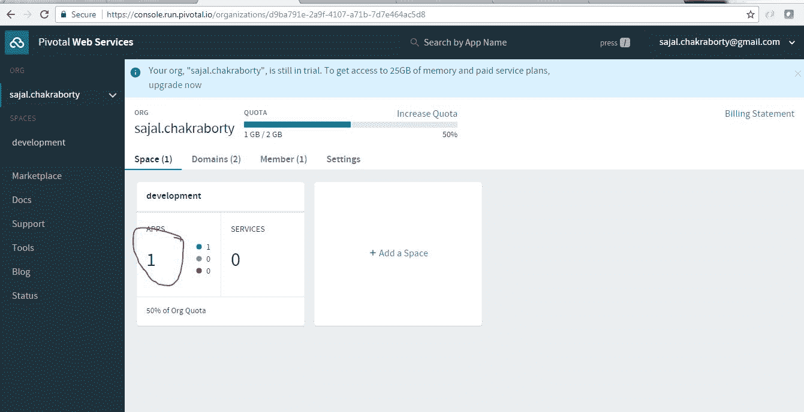

在 PWS 中部署的应用程序 – 数量增加。

现在，单击上一步中突出显示的“应用程序”部分，以转到应用程序详细信息屏幕。 下面的视图将显示，并将以高亮显示将应用程序部署到的 URL。 请注意该 URL，以从浏览器进行测试。 在这种情况下，它将类似于`https://spring-helloworld-cf.cfapps.io/`。 此 URL 将根据我们选择的应用程序名称而更改。

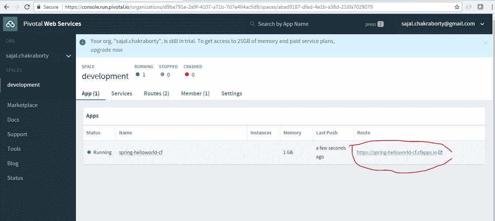

在 PWS 控制台中发布的应用程序 URL。

#### 测试 REST 端点

现在访问浏览器，并使用 cf 控制台中发布的 url 主机访问应用程序。 对于此应用程序，URL 为`https://spring-helloworld-cf.cfapps.io/hello?name=howtodoinjava`。

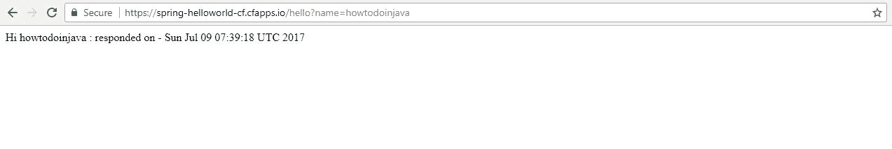

直接从 cf 访问应用程序

恭喜!! 您已成功将第一个 Spring Boot 应用程序部署到 Pivotal Cloud Foundry 平台中。

## 总结

因此，我们已经能够在 Pivotal Cloud Foundry 控制台中成功开发和部署一个 Spring Boot 应用程序，并能够从我们的本地工作站访问该应用程序。 此外，我们进行了 cf CLI 配置并在 PWS 试用帐户中注册。

就是这个话题了。 我建议您现在将自己的应用程序部署在 Cloud Foundry 上并进行测试。

将我的问题放在评论部分。

[下载源码](//howtodoinjava.com/wp-content/uploads/2017/07/spring-helloworld-cf.zip)

学习愉快！