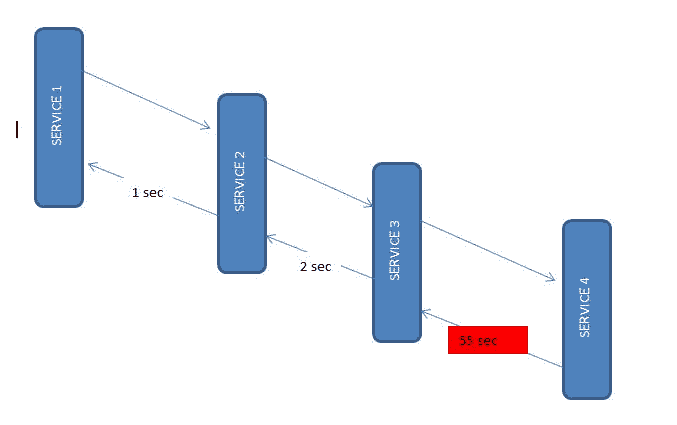
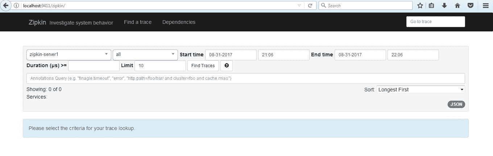
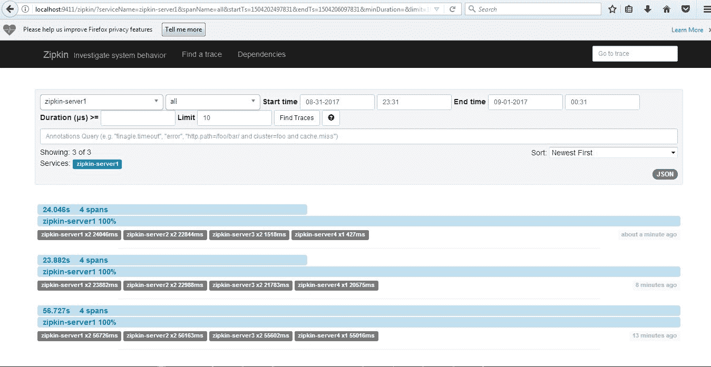
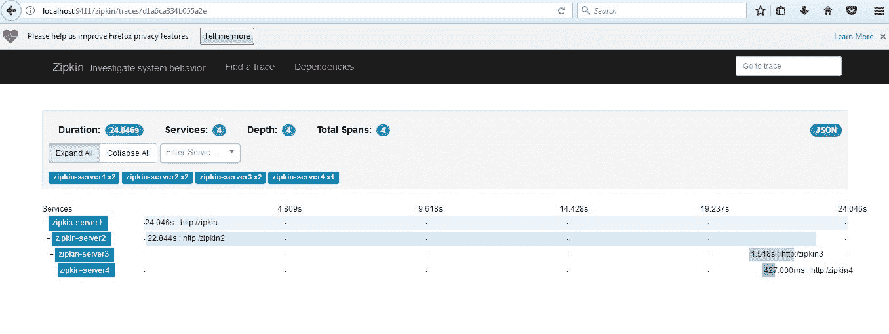
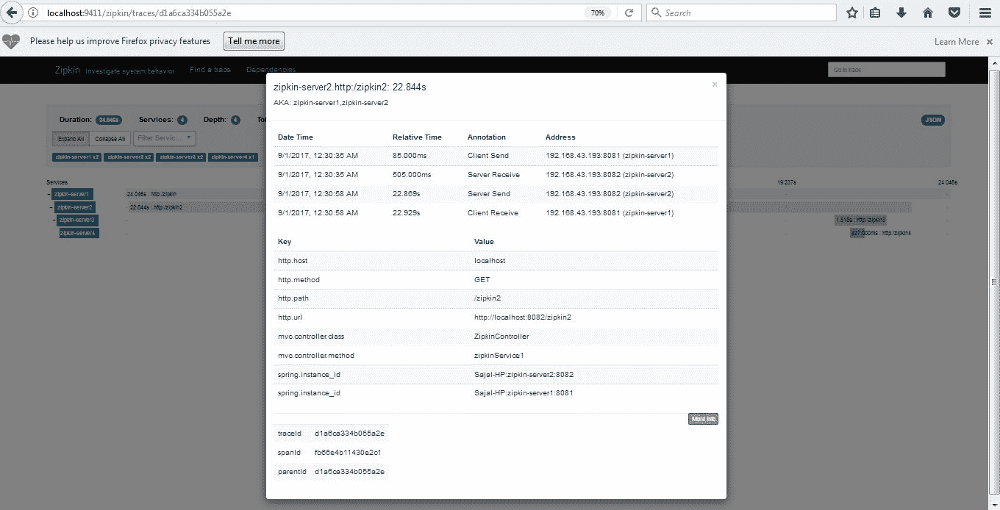

# Spring Cloud Zipkin 和 Sleuth 示例

> 原文： [https://howtodoinjava.com/spring-cloud/spring-cloud-zipkin-sleuth-tutorial/](https://howtodoinjava.com/spring-cloud/spring-cloud-zipkin-sleuth-tutorial/)

[Zipkin](http://zipkin.io/) 是用于[微服务](//howtodoinjava.com/microservices/microservices-definition-principles-benefits/)生态系统中**分布式跟踪**的非常有效的工具。 通常，分布式跟踪是对分布式事务中每个组件的延迟度量，其中调用多个微服务来为单个业务用例提供服务。 假设从我们的应用程序中，我们必须为事务调用 4 个不同的服务/组件。 在启用了分布式跟踪的情况下，我们可以测量哪个组件花费了多少时间。

这在调试过程中非常有用，当涉及大量基础系统并且应用程序在任何特定情况下变慢时。 在这种情况下，我们首先需要确定哪个底层服务实际上是缓慢的。 一旦发现服务缓慢，我们便可以解决该问题。 分布式跟踪有助于识别生态系统中的缓慢组件。

## Zipkin

Zipkin 最初是在 Twitter 上开发的，基于 Google 论文的概念，该论文描述了 Google 内部构建的分布式应用程序调试器 – [精简程序](http://research.google.com/pubs/pub36356.html)。 它管理此数据的收集和查找。 要使用 Zipkin，将对应用程序进行检测以向其报告计时数据。

如果要对生态系统中的延迟问题或错误进行故障排除，则可以根据应用程序，跟踪的长度，注解或时间戳来对所有跟踪进行过滤或排序。 通过分析这些跟踪，可以确定哪些组件未按预期执行，并可以对其进行修复。

内部有 4 个模块：

1.  **收集器** – 一旦任何组件将跟踪数据发送到 Zipkin 收集器守护程序，Zipkin 收集器就会对其进行验证，存储和索引以进行查找。
2.  **存储** – 此模块在后端存储和索引查找数据。 支持 [Cassandra](https://cassandra.apache.org/)，[ElasticSearch](https://www.elastic.co/) 和 [MySQL](//howtodoinjava.com/mysql/how-to-installuninstallexecute-mysql-as-windows-service/)。
3.  **搜索** – 此模块提供了一个简单的 JSON API，用于查找和检索存储在后端的跟踪。 该 API 的主要使用者是 Web UI。
4.  **Web UI** – 一个非常好的 UI 界面，用于查看轨迹。

#### 如何安装 Zipkin

可以在[快速入门页](http://zipkin.io/pages/quickstart.html)上找到适用于不同操作系统的详细安装步骤，包括 [Docker](//howtodoinjava.com/cloud/docker-hello-world-example/) 映像。 对于 Windows 安装，只需从[ maven 存储库](https://search.maven.org/remote_content?g=io.zipkin.java&a=zipkin-server&v=LATEST&c=exec)下载最新的 Zipkin 服务器，然后使用以下命令运行[可执行 jar ](//howtodoinjava.com/maven/maven-shade-plugin-create-uberfat-jar-example/)文件。

[PRE0]

Zipkin 启动后，我们可以在 [http://localhost:9411/zipkin/](http://localhost:9411/zipkin/) 上看到 Web UI。

上面的命令将使用默认配置启动 Zipkin 服务器。 对于高级配置，我们可以配置许多其他内容，例如存储，收集器监听器等。

要**在 Spring Boot 应用程序**中安装 Zipkin，我们需要在 Spring Boot 项目中添加 Zipkin 启动器依赖项。

[PRE1]

## Sleuth

[Sleuth](https://cloud.spring.io/spring-cloud-sleuth/) 是 Spring Cloud 系列的工具。 它用于生成跟踪 ID，span id，并将这些信息添加到标头和 MDC 中的服务调用中，以便诸如 Zipkin 和 [ELK](//howtodoinjava.com/microservices/elk-stack-tutorial-example/) 等用于存储，索引和处理日志文件之类的工具可以使用它。由于它来自 Spring Cloud 系列，因此一旦添加到`CLASSPATH`中，它就会自动集成到常见的通信渠道，例如：

*   使用[`RestTemplate`](//howtodoinjava.com/spring/spring-restful/spring-restful-client-resttemplate-example/)等发出的请求。
*   通过 [Netflix Zuul](//howtodoinjava.com/spring/spring-cloud/spring-cloud-api-gateway-zuul/) 微代理的请求
*   在 [Spring MVC](//howtodoinjava.com/spring-mvc-tutorial/) 控制器处收到的 HTTP 标头
*   通过诸如 Apache Kafka 或 RabbitMQ 等消息传递技术的请求。

使用侦探非常容易。 我们只需要在 spring boot 项目中添加它的启动 pom。 它将 Sleuth 添加到项目中，因此在其运行时也是如此。

[PRE2]

到目前为止，我们已经将 Zipkin 和 Sleuth 集成到微服务中并运行 Zipkin 服务器。 让我们看看如何利用此设置。

## Zipkin 和 Sleuth 集成示例

对于此演示，让我们创建 4 个基于 spring boot 的微服务。 它们都将同时具有 Zipkin 和 Sleuth 启动器依赖项。 在每个微服务中，我们将公开一个端点，从第一个服务中我们将调用第二个服务，从第二个服务中我们将调用第三个服务，以此类推，以此类推。

正如我们已经提到的，Sleuth 会自动与 rest 模板一起使用，因此它将将此检测到的服务调用信息发送到连接的 Zipkin 服务器。 然后 Zipkin 将开始进行延迟计算以及其他一些统计数据（如服务调用详细信息）的记账。

Microservices Interactions

#### 创建微服务

所有这四个服务将具有相同的配置，唯一的不同是端点更改的服务调用详细信息。 让我们[创建具有 Web，Rest Repository，Zipkin 和 Sleuth 依赖项的 Spring Boot 应用程序](//howtodoinjava.com/spring/spring-boot/spring-boot-tutorial-with-hello-world-example/)。

我将这些服务打包在一个父项目中，以便可以将这四个服务一起构建以节省时间。 如果愿意，可以继续进行个人设置。 另外，我还添加了有用的 Windows 脚本，因此只需一个命令即可启动/停止所有服务。

这是一个示例 rest 控制器，它公开一个端点并使用 rest 模板调用一个下游服务。

[PRE3]

#### 应用程序设置

由于所有服务都将在一台计算机上运行，​​因此我们需要在不同的端口上运行它们。 另外，要在 Zipkin 中进行标识，我们需要提供适当的名称。 因此，请在资源文件夹下的`application.properties`文件中配置应用程序名称和端口信息。

[PRE4]

同样，对于其他 3 个服务，我们将使用端口 **8082**，**8083**，**8084**，名称也将类似于`zipkin-server2`，`zipkin-server3`和`zipkin-server4`。

另外，我们有意在上次服务中引入了延迟，以便我们可以在 Zipkin 中进行查看。

## 示例

使用微服务中的命令`mvn clean install`进行最终的 Maven 构建，启动所有 4 个应用程序以及 zipkin 服务器。

对于快速启动和停止，使用批处理文件`Start-all.bat`和`Stop-all.bat`。

现在，从浏览器测试第一个服务端点几次 – [http://localhost:8081/zipkin](http://localhost:8081/zipkin)。 请注意，上述 4 种服务之一有意延迟。 因此，延迟是预期的最终响应，只是不要放弃。

API 调用成功后，我们可以在 zipkin UI [http://localhost:9411/zipkin/](http://localhost:9411/zipkin/) 上看到延迟统计信息。 在第一个下拉菜单中选择第一个服务，然后单击**查找跟踪**按钮。

Zipkin Home screen

您应该看到这种类型的 UI，可以在其中通过查看跟踪数据来进行性能分析。

Find Traces UI

One particular transaction overview

Details of a particular service call statistics

## 总结

在本教程中，我们学习了使用 Zipkin 分析服务调用中的延迟。 我们还了解了 Sleuth 如何帮助我们创建元数据并将其传递给 Zipkin。

希望这些信息对您使用 Zipkin 和 Sleuth 进行**分布式跟踪很有帮助**。

[Download Sourcecode](//howtodoinjava.com/wp-content/uploads/2017/08/zipkin.zip)

将我的问题放在评论部分。

学习愉快！