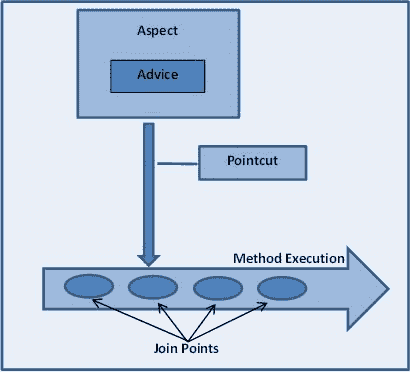

# Spring AOP 教程示例

> 原文： [https://howtodoinjava.com/spring-aop-tutorial/](https://howtodoinjava.com/spring-aop-tutorial/)

在本 **Spring AOP 教程**中，通过示例学习什么是面向方面的编程。 还通过示例了解什么是建议，连接点和切入点表达式以及如何在 Spring 应用程序中使用它们。

## 1\. Spring AOP –简介

Spring AOP 支持在 Spring 应用程序中进行面向方面的编程。 在 AOP 中，各个方面可以实现关注点的模块化，例如事务管理，日志记录或跨多个类型和对象的安全性（通常称为**跨切点关注点**）。

AOP 提供了一种使用简单的可插拔配置在实际逻辑之前，之后或周围动态添加横切关注点的方法。 现在和现在，维护代码都很容易。 您只需更改配置文件即可添加/删除关注点，而无需重新编译完整的源代码（如果您要使用要求 XML 配置的方面）。

## 2.什么是建议，连接点和切入点

1.  AOP 中的一个重要术语是**建议**。 它是**方面**在特定连接点处采取的操作。
2.  **连接点**是程序的执行点，例如方法的执行或异常的处理。 在 Spring AOP 中，连接点始终代表方法的执行。
3.  **切入点**是与连接点匹配的谓词或表达式。
4.  **建议**与切入点表达式关联，并在与该切入点匹配的任何连接点处运行。
5.  Spring 默认使用 AspectJ 切入点表达语言。



Spring AOP

## 3\. AOP 建议的类型

春季 AOP 中有五种建议。

1.  **建议之前**：在连接点之前执行的建议，但是它不能阻止执行流程前进到连接点（除非它引发异常）。
2.  **返回建议后**：在连接点正常完成后要执行的建议：例如，如果某个方法返回而没有引发异常。
3.  **引发建议后**：如果方法因引发异常而退出，则要执行的建议。
4.  **建议后**：无论连接点退出的方式如何（正常或特殊返回），都将执行建议。
5.  **围绕建议的建议：**围绕连接点的建议，例如方法调用。 这是最有力的建议。 周围建议可以在方法调用之前和之后执行自定义行为。 它还负责选择是返回连接点还是通过返回其自身的返回值或引发异常来捷径建议的方法执行。

## 4\. Spring AOP 示例

#### 4.1. Maven 依赖

在编写任何代码之前，您将需要将 Spring AOP 依赖项导入到您的项目中。

`pom.xml`

```java
<dependency>
    <groupId>org.springframework</groupId>
    <artifactId>spring-context</artifactId>
    <version>4.1.4.RELEASE</version>
</dependency>
<dependency>
    <groupId>org.springframework</groupId>
    <artifactId>spring-context-support</artifactId>
    <version>4.1.4.RELEASE</version>
</dependency>
<dependency>
    <groupId>org.springframework</groupId>
    <artifactId>spring-aop</artifactId>
    <version>4.1.4.RELEASE</version>
</dependency>
<dependency>
    <groupId>org.aspectj</groupId>
    <artifactId>aspectjrt</artifactId>
    <version>1.6.11</version>
</dependency>
<dependency>
    <groupId>org.aspectj</groupId>
    <artifactId>aspectjweaver</artifactId>
    <version>1.6.11</version>
</dependency>

```

#### 4.2. 方面和切入点表达

编写使用`@Aspect`注释注释的方面类，并编写切入点表达式以匹配联合点方法。

`EmployeeCRUDAspect.java`

```java
@Aspect
public class EmployeeCRUDAspect {

    @Before("execution(* EmployeeManager.getEmployeeById(..))")			//point-cut expression
    public void logBeforeV1(JoinPoint joinPoint)
    {
        System.out.println("EmployeeCRUDAspect.logBeforeV1() : " + joinPoint.getSignature().getName());
    }
}

```

#### 4.3. 方法（联合点）

编写要在其上执行建议并与切入点表达式匹配的方法。

`EmployeeManager.java`

```java
@Component
public class EmployeeManager
{
    public EmployeeDTO getEmployeeById(Integer employeeId) {
        System.out.println("Method getEmployeeById() called");
        return new EmployeeDTO();
    }
}

```

在上面的示例中，`logBeforeV1()`将在 `getEmployeeById()`方法之前执行**，因为它与连接点表达式匹配。**

#### 4.4. 运行应用程序

运行该应用程序并查看控制台。

`TestAOP.java`

```java
ublic class TestAOP
{
    @SuppressWarnings("resource")
    public static void main(String[] args) {

        ApplicationContext context = new ClassPathXmlApplicationContext
        					("com/howtodoinjava/demo/aop/applicationContext.xml");

        EmployeeManager manager = context.getBean(EmployeeManager.class);

        manager.getEmployeeById(1);
    }
}

```

程序输出：

`Console`

```java
EmployeeCRUDAspect.logBeforeV1() : getEmployeeById
Method getEmployeeById() called

```

Spring aop 初学者教程，并带有示例。

## 5\. Spring AOP XML 配置示例

1.  **[Spring AOP AspectJ XML Configuration Example](//howtodoinjava.com/spring/spring-aop/spring-aop-aspectj-xml-configuration-example/)**

    学习使用 XML 配置来配置 AOP 方面。

2.  **[Spring AOP Before Advice Example](//howtodoinjava.com/spring/spring-aop/aspectj-before-advice-example/)**

    在使用建议之前，请使用`<aop:before/>`配置来配置 aop。

3.  **[Spring AOP After Returning Advice Example](//howtodoinjava.com/spring/spring-aop/aspectj-after-returning-advice-example/)**

    在使用`<aop:after-returning/>`配置返回建议方面后，学习配置 aop。

4.  **[Spring AOP After Throwing Advice Example](//howtodoinjava.com/spring/spring-aop/aspectj-after-throwing-advice-example/)**

    在使用`<aop:after-throwing/>`配置提出建议方面之后，学习配置 aop。

5.  **[Spring AOP After Advice Example](//howtodoinjava.com/spring/spring-aop/aspectj-after-advice-example/)**

    建议您在使用`<aop:after/>`配置后根据建议方面配置 aop。

6.  **[Spring AOP Around Advice Example](//howtodoinjava.com/spring/spring-aop/aspectj-around-advice-example/)**

    学习使用`<aop:around/>`配置围绕建议方面配置 aop。

## 6\. Spring AOP AspectJ 注释示例

1.  **[Spring AOP AspectJ Annotation Config Example](//howtodoinjava.com/spring/spring-aop/spring-aop-aspectj-example-tutorial-using-annotation-config/)**

    学习使用 aspectj 批注配置来配置 AOP 方面。

2.  **[Spring AOP AspectJ @Before Example](//howtodoinjava.com/spring/spring-aop/aspectj-before-annotation-example/)**

    使用`@Before`批注学习在咨询之前配置 aop。

3.  **[Spring AOP AspectJ @After Example](//howtodoinjava.com/spring/spring-aop/aspectj-after-annotation-example/)**

    学习使用`@After`注释在建议方面配置 aop。

4.  **[Spring AOP AspectJ @Around Example](//howtodoinjava.com/spring/spring-aop/aspectj-around-annotation-example/)**

    学习使用`@Around`注释围绕建议方面配置 aop。

5.  **[Spring AOP AspectJ @AfterReturning Example](//howtodoinjava.com/spring/spring-aop/aspectj-after-returning-annotation-example/)**

    在使用`@AfterReturning`批注返回建议方面后，学习配置 aop。

6.  **[Spring AOP AspectJ @AfterThrowing Example](//howtodoinjava.com/spring/spring-aop/aspectj-afterthrowing-annotation-example)**

    在使用`@AfterThrowing`注释抛出建议方面后，学习配置 aop。

## 7.更多 Spring AOP 教程

1.  **[Spring AOP Aspects Ordering](//howtodoinjava.com/spring/spring-aop/spring-aop-specifying-aspects-ordering/)**

    在需要按特定顺序执行的多个方面中，学习对方面执行进行排序。

2.  **[Spring AOP AspectJ Pointcut Expressions With Examples](//howtodoinjava.com/spring/spring-aop/writing-spring-aop-aspectj-pointcut-expressions-with-examples/)**

    学习编写切点表达式以匹配各种连接点。

## 8.面试题

**[热门春季 AOP 面试问题与答案](//howtodoinjava.com/spring/spring-aop/top-spring-aop-interview-questions-with-answers/)**

Java 面试中一些最常问到的春季 AOP 面试问题。

## 9\. Spring AOP 资源：

[Spring AOP Doc](https://docs.spring.io/spring/docs/current/spring-framework-reference/html/aop.html)
[AspectJ](https://eclipse.org/aspectj/)

学习愉快！