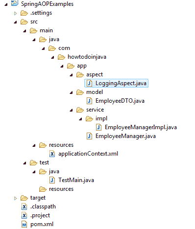

# Spring AOP 抛出后建议示例

> 原文： [https://howtodoinjava.com/spring-aop/aspectj-after-throwing-advice-example/](https://howtodoinjava.com/spring-aop/aspectj-after-throwing-advice-example/)

在这个春季 aop 示例中，我们将在使用`&lt;aop:after-throwing/&gt;`配置抛出建议之后，学习使用 **AOP。 配置为引发建议后的方法，将在这些方法之后立即运行，这些方法与作为参数传递的切入点表达式匹配，并终止于异常，即它们引发任何异常。**

在此示例中，我们将创建简单的 spring 应用程序，添加日志记录方面，然后基于在`&lt;aop:after-throwing/&gt;` xml 配置中传递的切入点信息来调用方面方法。

## 提出建议后创建 Spring AOP

要在使用 XML 配置抛出建议之后创建**，请按以下方式使用`&lt;aop:after-throwing/&gt;`。**

```java
<aop:config> 
    <aop:aspect ref="loggingAspect">
        <aop:pointcut expression="execution(* com.howtodoinjava.app.service.impl.EmployeeManagerImpl.*(..))" id="loggingPointcuts"/>
        <!-- after throwing advice -->
        <aop:after-throwing method="logAfterThrowingAllMethods" pointcut-ref="loggingPointcuts" throwing="ex" />
    </aop:aspect> 
</aop:config>

```

如果要检查异常，可以使用`throwing`属性从建议的方法捕获抛出的异常实例。 在这里，我传递了`ex`命名参数，该参数需要传递给通知方法。

## 项目结构



Spring AOP Project Structure

## Spring AOP AspectJ Maven 依赖关系

我添加了 spring 核心，spring aop 和 Aspectj 依赖项。

```java
<project xmlns="http://maven.apache.org/POM/4.0.0" xmlns:xsi="http://www.w3.org/2001/XMLSchema-instance"
    xsi:schemaLocation="http://maven.apache.org/POM/4.0.0 http://maven.apache.org/xsd/maven-4.0.0.xsd;
    <modelVersion>4.0.0</modelVersion>
    <groupId>com.howtodoinjava</groupId>
    <artifactId>SpringAOPExamples</artifactId>
    <version>0.0.1-SNAPSHOT</version>
    <name>Spring AOP Examples</name>
    <dependencies>
        <dependency>
            <groupId>org.springframework</groupId>
            <artifactId>spring-context</artifactId>
            <version>4.3.2.RELEASE</version>
        </dependency>
        <dependency>
            <groupId>org.springframework</groupId>
            <artifactId>spring-context-support</artifactId>
            <version>4.3.2.RELEASE</version>
        </dependency>
        <dependency>
            <groupId>org.springframework</groupId>
            <artifactId>spring-aop</artifactId>
            <version>4.3.2.RELEASE</version>
        </dependency>
        <dependency>
            <groupId>org.aspectj</groupId>
            <artifactId>aspectjrt</artifactId>
            <version>1.8.9</version>
        </dependency>
        <dependency>
            <groupId>org.aspectj</groupId>
            <artifactId>aspectjweaver</artifactId>
            <version>1.8.9</version>
        </dependency>
    </dependencies>
</project>
```

## 添加 Spring AOP 配置

在 XML 配置文件中，您可以添加`aop:config`元素以添加 AOP 支持。

```java
<beans xmlns="http://www.springframework.org/schema/beans"
    xmlns:xsi="http://www.w3.org/2001/XMLSchema-instance"
    xmlns:aop="http://www.springframework.org/schema/aop"
    xsi:schemaLocation="http://www.springframework.org/schema/beans
    http://www.springframework.org/schema/beans/spring-beans-3.0.xsd
    http://www.springframework.org/schema/aop
    http://www.springframework.org/schema/aop/spring-aop-3.0.xsd ">

    <aop:config> 
        <aop:aspect ref="loggingAspect">
            <aop:pointcut expression="execution(* com.howtodoinjava.app.service.impl.EmployeeManagerImpl.*(..))" id="loggingPointcuts"/>
            <!-- after throwing advice -->
            <aop:after-throwing method="logAfterThrowingAllMethods" pointcut-ref="loggingPointcuts" throwing="ex" />
        </aop:aspect> 
    </aop:config> 

    <!-- Employee manager -->
    <bean id="employeeManager" class="com.howtodoinjava.app.service.impl.EmployeeManagerImpl" />

    <!-- Logging Aspect -->
    <bean id="loggingAspect" class="com.howtodoinjava.app.aspect.LoggingAspect" />

</beans>

```

## 需要执行方面的服务方法

`EmployeeManager.java`和`EmployeeManagerImpl.java`

```java
public interface EmployeeManager 
{
    public EmployeeDTO getEmployeeById(Integer employeeId);

    public List<EmployeeDTO> getAllEmployee();

    public void createEmployee(EmployeeDTO employee);

    public void deleteEmployee(Integer employeeId);

    public void updateEmployee(EmployeeDTO employee);
}

public class EmployeeManagerImpl implements EmployeeManager 
{
    public EmployeeDTO getEmployeeById(Integer employeeId) 
    {
        System.out.println("Method getEmployeeById() called");
        return new EmployeeDTO();
    }

    public List<EmployeeDTO> getAllEmployee() 
    {
        System.out.println("Method getAllEmployee() called");
        return new ArrayList<EmployeeDTO>();
    }

    public void createEmployee(EmployeeDTO employee)
    {
        System.out.println("Method createEmployee() called");
        // Throw some exception from here
        throw new NullPointerException("Error while creating exception");
    }

    public void deleteEmployee(Integer employeeId) 
    {
        System.out.println("Method deleteEmployee() called");
    }

    public void updateEmployee(EmployeeDTO employee) 
    {
        System.out.println("Method updateEmployee() called");
    }
}

```

## 编写方面类和方法

编写方面类和要作为建议执行的方法。

```java
package com.howtodoinjava.app.aspect;

public class LoggingAspect {

    public void logAfterThrowingAllMethods(Exception ex) throws Throwable 
    {
        System.out.println("****LoggingAspect.logAfterThrowingAllMethods() " + ex);
    }
}

```

## 测试 Spring AspectJ 的配置和执行

现在，我们来测试以上配置的方面是否在给定的切入点信息上执行。

```java
import org.springframework.context.ApplicationContext;
import org.springframework.context.support.ClassPathXmlApplicationContext;

import com.howtodoinjava.app.model.EmployeeDTO;
import com.howtodoinjava.app.service.EmployeeManager;

public class TestMain 
{
    @SuppressWarnings("resource")
    public static void main(String[] args) {

        ApplicationContext context = new ClassPathXmlApplicationContext("applicationContext.xml");
        EmployeeManager manager = (EmployeeManager) context.getBean("employeeManager");

        manager.getEmployeeById(1);
        manager.createEmployee(new EmployeeDTO());
    }
}

```

```java
Method getEmployeeById() called

Method createEmployee() called

****LoggingAspect.logAfterThrowingAllMethods() java.lang.NullPointerException: Error while creating exception
Exception in thread "main" java.lang.NullPointerException: Error while creating exception

```

在抛出在相关联点上执行的外观建议之后，显然**。**

学习愉快！

参考文献：

[Spring AOP 参考](https://docs.spring.io/spring/docs/current/spring-framework-reference/html/aop.html)
[AspectJ 项目](https://eclipse.org/aspectj/)
[不同的切入点表达式以及示例](//howtodoinjava.com/spring/spring-aop/writing-spring-aop-aspectj-pointcut-expressions-with-examples/)