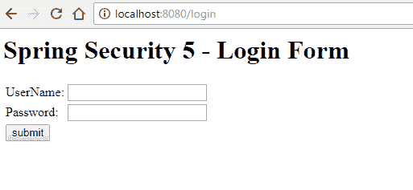
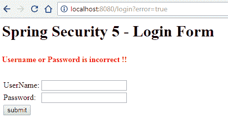
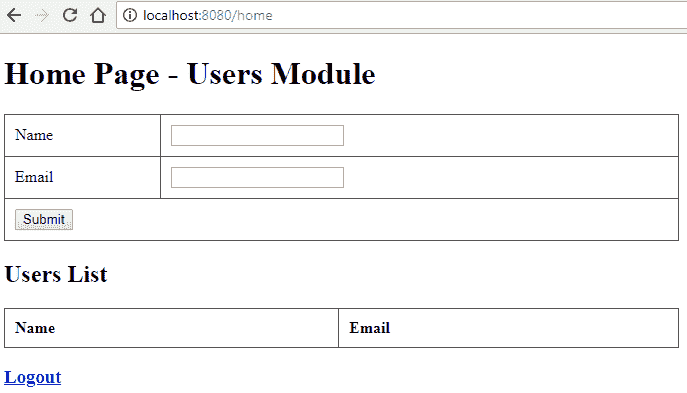
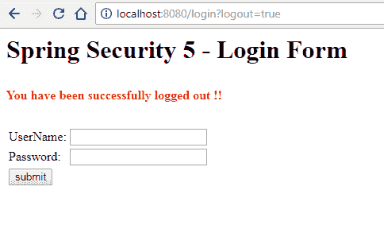

# Spring Security 5 登录表单示例

> 原文： [https://howtodoinjava.com/spring5/security5/login-form-example/](https://howtodoinjava.com/spring5/security5/login-form-example/)

在此 Spring Security 5 教程中，学习将基于**的自定义登录表单**的安全性添加到我们的 Spring WebMVC 应用程序中。 我正在使用 **Spring Security 5** 构建此示例。 本教程还讨论了从会话注销。

## 1\. 包含 Spring Security 5 依赖项

包括 SpringSecurity 罐。 我正在使用 maven，因此为 **spring security version 5.0.7.RELEASE** 添加了相应的依赖项。

`pom.xml`

[PRE0]

## 2\. 创建 Spring Security 配置

#### 2.1. 配置身份验证和 URL 安全

*   我创建了这个简单的安全配置，并添加了两个演示用户“ `user`”和“ `admin`”。
*   [`@EnableWebSecurity`](https://docs.spring.io/spring-security/site/docs/4.2.5.RELEASE/apidocs/org/springframework/security/config/annotation/web/configuration/EnableWebSecurity.html)启用 Spring Security 的网络安全支持，并提供 Spring MVC 集成。
*   [`WebSecurityConfigurerAdapter`](https://docs.spring.io/spring-security/site/docs/4.2.5.RELEASE/apidocs/org/springframework/security/config/annotation/web/configuration/WebSecurityConfigurerAdapter.html)提供了一组用于启用特定 Web 安全配置的方法。
*   `configure(HttpSecurity http)`用于保护需要安全性的不同 URL。
*   它**在 URL `/login`上配置自定义登录页面**。 如果用户名/密码匹配，则将请求重定向到`/home`，否则登录页面会刷新并显示相应的错误消息。
*   它还**配置从会话**注销。 注销后，用户将再次重定向到登录页面。

> 我已使用`auth.inMemoryAuthentication()`使用内存中身份验证。 您可以使用`auth.jdbcAuthentication()`配置 JDBC 身份验证，或使用`auth.ldapAuthentication()`配置 LDAP 身份验证。

`SecurityConfig.java`

[PRE1]

> 了解更多：[登录表单](https://howtodoinjava.com/spring-security/login-form-based-spring-3-security-example/)的 Spring Security XML Config

#### 2.2. 将 Spring Security 绑定到 Web 应用程序

在 Spring Web 应用程序中，使用`DelegatingFilterProxy`实现安全性。 要使用 Java 配置的 spring 容器注册它，您应该使用[`AbstractSecurityWebApplicationInitializer`](https://docs.spring.io/spring-security/site/docs/4.2.4.RELEASE/apidocs/org/springframework/security/web/context/AbstractSecurityWebApplicationInitializer.html)。

Spring 将在应用程序启动期间检测到此类的实例，并在其他已注册过滤器之前注册`DelegatingFilterProxy`以使用`springSecurityFilterChain`。 它还注册了`ContextLoaderListener`。

`SpringSecurityInitializer.java`

[PRE2]

另外，包括`SecurityConfig`至`AppInitializer`。

`AppInitializer.java`

[PRE3]

## 3\. 添加自定义登录表单

#### 3.1. `LoginController`

添加登录控制器方法来处理登录和注销请求。

`LoginController.java`

[PRE4]

#### 3.2. `login.jsp`

创建将接受`username`和`password`的`login.jsp`文件； 并将它们发布到 URL `/login`。

`login.jsp`

[PRE5]

## 4\. Spring Security 5 登录表单演示

1.  Start the application with maven run command `tomcat7:run`. Launch homepage `http://localhost:8080/home`. It will redirected to login page `http://localhost:8080/login`.

    

    Login Form

2.  Enter INCORRECT username or password. A login error message will be displayed.

    

    Incorrect username or password

3.  Enter CORRECT username and password combination. `user` and `123456`. Home page will be displayed.

    

    Home Page

4.  Click on logout button. The user will be logged out and redirected back to the login page.

    

    Logged Out

学习愉快！

[Sourcecode Download](https://github.com/lokeshgupta1981/spring-webmvc)