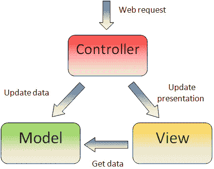
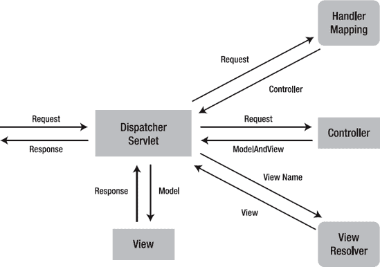
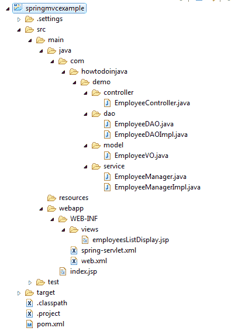
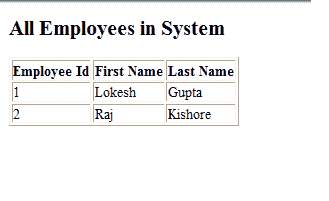

# Spring MVC Hello World 示例

> 原文： [https://howtodoinjava.com/spring-mvc/spring-mvc-hello-world-example/](https://howtodoinjava.com/spring-mvc/spring-mvc-hello-world-example/)

在此示例中，我们将使用 **[Spring MVC](//howtodoinjava.com/category/frameworks/java-spring-tutorials/spring-mvc/ "spring mvc")** 框架构建一个 Hello World Web 应用程序。 Spring MVC 是 **[Spring](//howtodoinjava.com/java-spring-framework-tutorials/ "spring")** 框架的最重要模块之一。 它基于功能强大的 Spring **[IoC 容器](//howtodoinjava.com/spring/spring-core/different-spring-3-ioc-containers-with-example/ "Different spring 3 IoC containers with example")** 构建，并广泛使用了容器功能以简化其配置。

```java
Table Of Contents

What is MVC Framework?
Dispatcher Servlet (Spring Controller)
Spring MVC Hello World Example
	Runtime Dependencies
	Configuration Files web.xml and spring-servlet.xml
	Request Handler EmployeeController.java
	View Model EmployeeVO.java
	Dao Classes
	Service layer Classes
	View employeesListDisplay.jsp

```

[Download Sourcecode](https://drive.google.com/file/d/0B7yo2HclmjI4WTk4NzVVenRHS2c/view?usp=sharing "download spring mvc source code")

## 什么是 MVC 框架？

**[模型视图控制器（MVC）](https://en.wikipedia.org/wiki/Model%E2%80%93view%E2%80%93controller "mvc")** 是众所周知的 **[设计模式](//howtodoinjava.com/category/design-patterns/ "design-patterns")** ，用于设计基于 UI 的应用程序。 它主要通过在应用程序中分离**模型，视图和控制器**的角色来将业务逻辑与 UI 分离。 通常，模型负责封装应用程序数据以呈现视图。 视图仅应显示此数据，而不包括任何业务逻辑。 控制器负责接收来自用户的请求并调用后端服务（管理器或 dao）进行业务逻辑处理。 处理后，后端服务可能会返回一些数据以供视图显示。 控制器收集这些数据并准备模型以供视图显示。 MVC 模式的核心思想是将业务逻辑与 UI 分开，以允许它们独立更改而不会互相影响。



在 Spring MVC 应用程序中，模型通常由 POJO 对象组成，这些对象由服务层处理并由持久层持久化。 视图通常是使用 [Java 标准标记库（JSTL）](https://jstl.java.net/ "Java Standard Tag Library (JSTL)")编写的 JSP 模板。 控制器部分由调度程序 servlet 扮演，我们将在本教程中详细了解。

Some developers consider the service layer and DAO layers classes as part of model component in MVC. I have a different opinion on this. I do not consider service and DAO layers classes the part of MVC framework. Usually a web application is 3-tier architecture i.e. data-service-presentation. MVC is actually part of presentation layer.


## 分派器 Servlet（Spring 控制器）

在最简单的 Spring MVC 应用程序中，控制器是您唯一需要在 Java Web 部署描述符（即 web.xml 文件）中配置的 servlet。 一个 Spring MVC 控制器（通常称为 [Dispatcher Servlet](https://docs.spring.io/spring/docs/current/javadoc-api/org/springframework/web/servlet/DispatcherServlet.html "DispatcherServlet") ）实现[前端控制器](https://en.wikipedia.org/wiki/Front_Controller_pattern "Front_Controller")设计模式，每个 Web 请求都必须经过它，以便它可以管理整个请求生命周期。

将 Web 请求发送到 Spring MVC 应用程序时，调度程序 Servlet 首先接收该请求。 然后，它会组织在 Spring 的 Web 应用程序上下文中配置的不同组件（例如，实际的请求处理程序控制器和视图解析器）或控制器本身中存在的注释，这些都是处理请求所需的。



Spring dispatcher servlet

要在 Spring 3.0 中定义控制器类，必须使用 [@Controller](https://docs.spring.io/spring/docs/current/javadoc-api/org/springframework/stereotype/Controller.html "Controller annotation") 批注标记一个类。 当带`@Controller`的带注释的控制器接收到请求时，它将寻找适当的处理程序方法来处理该请求。 这要求控制器类通过一个或多个处理程序映射将每个请求映射到一个处理程序方法。 为此，控制器类的方法用`[@RequestMapping](https://docs.spring.io/spring/docs/current/javadoc-api/org/springframework/web/bind/annotation/RequestMapping.html "RequestMapping")`批注修饰，使其成为处理程序方法。

处理程序方法处理完请求后，它将控制权委派给一个视图，该视图表示为处理程序方法的返回值。 为了提供一种灵活的方法，处理程序方法的返回值并不代表视图的实现，而是逻辑视图，即没有任何文件扩展名。 您可以将这些逻辑视图正确地映射到 applicationContext 文件中，这样就可以轻松更改视图层代码，甚至无需触摸请求处理程序类代码。

[视图解析器](https://docs.spring.io/spring/docs/current/javadoc-api/org/springframework/web/servlet/ViewResolver.html "ViewResolver")负责为逻辑名称解析正确的文件。 根据视图实现的设计，控制器类将视图名称解析为视图实现后，便会呈现对象。

## Spring MVC Hello World 示例

在此应用程序中，我将创建仅具有一项功能的最简单的**员工管理应用程序**演示，即列出系统中所有可用的员工。 让我们记下该应用程序的目录结构。



Spring mvc hello world directory structure

现在，将所有涉及的文件写入此 hello world 应用程序中。

**pom.xml**

在`pom.xml`下面的文件包含 spring mvc 的依赖项和用于编写 jsp 文件的 taglibs 支持。

```java
<project xmlns="http://maven.apache.org/POM/4.0.0" xmlns:xsi="http://www.w3.org/2001/XMLSchema-instance"
	xsi:schemaLocation="http://maven.apache.org/POM/4.0.0 http://maven.apache.org/maven-v4_0_0.xsd">
	<modelVersion>4.0.0</modelVersion>
	<groupId>com.howtodoinjava.demo</groupId>
	<artifactId>springmvcexample</artifactId>
	<packaging>war</packaging>
	<version>1.0-SNAPSHOT</version>
	<name>springmvcexample Maven Webapp</name>
	<url>http://maven.apache.org</url>
	<dependencies>

		<dependency>
			<groupId>junit</groupId>
			<artifactId>junit</artifactId>
			<version>4.12</version>
			<scope>test</scope>
		</dependency>

		<!-- Spring MVC support -->

		<dependency>
			<groupId>org.springframework</groupId>
			<artifactId>spring-webmvc</artifactId>
			<version>4.1.4.RELEASE</version>
		</dependency>

		<dependency>
			<groupId>org.springframework</groupId>
			<artifactId>spring-web</artifactId>
			<version>4.1.4.RELEASE</version>
		</dependency>

		<!-- Tag libs support for view layer -->

		<dependency>
			<groupId>javax.servlet</groupId>
			<artifactId>jstl</artifactId>
			<version>1.2</version>
			<scope>runtime</scope>
		</dependency>

		<dependency>
			<groupId>taglibs</groupId>
			<artifactId>standard</artifactId>
			<version>1.1.2</version>
			<scope>runtime</scope>
		</dependency>

	</dependencies>

	<build>
		<finalName>springmvcexample</finalName>
	</build>
</project>

```

**web.xml**

这个最小的`web.xml`文件声明了一个 servlet（即调度程序 servlet）来接收所有类型的请求。 调度程序 servlet 在这里充当前端控制器。

```java
<web-app id="WebApp_ID" version="2.4" 
	xmlns="http://java.sun.com/xml/ns/j2ee" 
	xmlns:xsi="http://www.w3.org/2001/XMLSchema-instance" 
	xsi:schemaLocation="http://java.sun.com/xml/ns/j2ee 
	http://java.sun.com/xml/ns/j2ee/web-app_2_4.xsd">

	<display-name>Spring Web MVC Hello World Application</display-name>

	<servlet>
		<servlet-name>spring</servlet-name>
			<servlet-class>
				org.springframework.web.servlet.DispatcherServlet
			</servlet-class>
		<load-on-startup>1</load-on-startup>
	</servlet>

	<servlet-mapping>
		<servlet-name>spring</servlet-name>
		<url-pattern>/</url-pattern>
	</servlet-mapping>

</web-app>

```

**spring-servlet.xml（也可以有 applicationContext.xml）**

我们在请求处理程序，服务和 dao 层上使用带注释的类，因此我已对基本包“ `com.howtodoinjava.demo`”中的所有类文件启用了注释处理。

```java
<beans xmlns="http://www.springframework.org/schema/beans"
	xmlns:xsi="http://www.w3.org/2001/XMLSchema-instance" 
	xmlns:context="http://www.springframework.org/schema/context"
	xsi:schemaLocation="http://www.springframework.org/schema/beans
        http://www.springframework.org/schema/beans/spring-beans-3.0.xsd
        http://www.springframework.org/schema/context/
        http://www.springframework.org/schema/context/spring-context-3.0.xsd">

	<context:component-scan base-package="com.howtodoinjava.demo" />

	<bean class="org.springframework.web.servlet.mvc.annotation.DefaultAnnotationHandlerMapping" />
	<bean class="org.springframework.web.servlet.mvc.annotation.AnnotationMethodHandlerAdapter" />

	<bean class="org.springframework.web.servlet.view.InternalResourceViewResolver">
	    <property name="prefix" value="/WEB-INF/views/" />
	    <property name="suffix" value=".jsp" />
	</bean>

</beans>

```

**EmployeeController.java**

类级别和方法级别的注释`@RequestMapping`确定将在其中调用方法的 URL。

```java
import org.springframework.beans.factory.annotation.Autowired;
import org.springframework.stereotype.Controller;
import org.springframework.ui.Model;
import org.springframework.web.bind.annotation.RequestMapping;
import org.springframework.web.bind.annotation.RequestMethod;

import com.howtodoinjava.demo.service.EmployeeManager;

@Controller
@RequestMapping("/employee-module")
public class EmployeeController 
{
	@Autowired
	EmployeeManager manager;

	@RequestMapping(value = "/getAllEmployees", method = RequestMethod.GET)
	public String getAllEmployees(Model model)
	{
		model.addAttribute("employees", manager.getAllEmployees());
		return "employeesListDisplay";
	}
}

```

> **阅读更多：[如何使用@ Component，@ Repository，@ Service 和@Controller 批注？](//howtodoinjava.com/spring/spring-core/how-to-use-spring-component-repository-service-and-controller-annotations/ "How to use Spring @Component, @Repository, @Service and @Controller Annotations?")**

**EmployeeVO.java**

此类充当 MVC 模式的模型。

```java
package com.howtodoinjava.demo.model;

import java.io.Serializable;

public class EmployeeVO implements Serializable 
{
	private static final long serialVersionUID = 1L;

	private Integer id;
	private String firstName;
	private String lastName;

	//Setters and Getters

	@Override
	public String toString() {
		return "EmployeeVO [id=" + id + ", firstName=" + firstName
				+ ", lastName=" + lastName + "]";
	}
}

```

**EmployeeDAO.java**

三层体系结构中第三层的类。 负责与基础数据库存储进行交互。

```java
import java.util.List;

import com.howtodoinjava.demo.model.EmployeeVO;

public interface EmployeeDAO 
{
	public List<EmployeeVO> getAllEmployees();
}

```

**EmployeeDAOImpl.java**

```java
import java.util.ArrayList;
import java.util.List;

import org.springframework.stereotype.Repository;

import com.howtodoinjava.demo.model.EmployeeVO;

@Repository
public class EmployeeDAOImpl implements EmployeeDAO {

	public List<EmployeeVO> getAllEmployees() 
	{
		List<EmployeeVO> employees = new ArrayList<EmployeeVO>();

		EmployeeVO vo1 = new EmployeeVO();
		vo1.setId(1);
		vo1.setFirstName("Lokesh");
		vo1.setLastName("Gupta");
		employees.add(vo1);

		EmployeeVO vo2 = new EmployeeVO();
		vo2.setId(2);
		vo2.setFirstName("Raj");
		vo2.setLastName("Kishore");
		employees.add(vo2);

		return employees;
	}
}

```

**EmployeeManager.java**

3 层体系结构中第二层的类。 负责与 DAO 层进行交互。

```java
import java.util.List;

import com.howtodoinjava.demo.model.EmployeeVO;

public interface EmployeeManager 
{
	public List<EmployeeVO> getAllEmployees();
}

```

**EmployeeManagerImpl.java**

```java
import java.util.List;

import org.springframework.beans.factory.annotation.Autowired;
import org.springframework.stereotype.Service;

import com.howtodoinjava.demo.dao.EmployeeDAO;
import com.howtodoinjava.demo.model.EmployeeVO;

@Service
public class EmployeeManagerImpl implements EmployeeManager {

	@Autowired
	EmployeeDAO dao;

	public List<EmployeeVO> getAllEmployees() 
	{
		return dao.getAllEmployees();
	}
}

```

**employeeListDisplay.jsp**

该 jsp 用于显示系统中的所有员工。 它循环遍历员工集合，并将其详细信息打印在表中。 这适合 MVC 模式的视图层。

```java
<%@ taglib prefix="c" uri="http://java.sun.com/jsp/jstl/core"%>
<%@ taglib prefix="fmt" uri="http://java.sun.com/jsp/jstl/fmt"%>

<html>
<head>
	<title>Spring MVC Hello World</title>
</head>

<body>
	<h2>All Employees in System</h2>

	<table border="1">
		<tr>
			<th>Employee Id</th>
			<th>First Name</th>
			<th>Last Name</th>
		</tr>
		<c:forEach items="${employees}" var="employee">
			<tr>
				<td>${employee.id}</td>
				<td>${employee.firstName}</td>
				<td>${employee.lastName}</td>
			</tr>
		</c:forEach>
	</table>

</body>
</html>

```

现在将应用程序部署到您的应用程序服务器中（我正在使用 tomcat 7）。 并点击 URL“ **http：// localhost：8080 / springmvcexample / employee-module / getAllEmployees** ”。 如果正确配置了所有内容，则会在下面的屏幕上看到。



Application front UI

[Download Sourcecode](https://drive.google.com/file/d/0B7yo2HclmjI4WTk4NzVVenRHS2c/view?usp=sharing "download spring mvc source code")

如果某些内容不适合您或在本教程中不清楚，请给我留言。

**祝您学习愉快！**