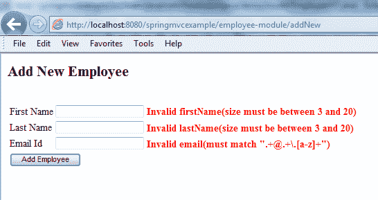

# Spring Bean 验证 – JSR-303 注释

> [https://howtodoinjava.com/spring-mvc/spring-bean-validation-example-with-jsr-303-annotations/](https://howtodoinjava.com/spring-mvc/spring-bean-validation-example-with-jsr-303-annotations/)

[**JSR-303**](http://beanvalidation.org/1.0/spec/) bean 验证是一个规范，其目的是通过注释标准化 Java bean 的验证。 JSR-303 标准的目的是在 Java bean 类中直接使用注释。 这允许直接在要验证的代码中指定验证规则，而不是在单独的类中创建验证规则。 到目前为止，我们了解了使用 [BindingResult.rejectValue（）](//howtodoinjava.com/spring/spring-mvc/spring-mvc-display-validate-and-submit-form-example/)和[自定义验证器实现](//howtodoinjava.com/spring/spring-mvc/spring-mvc-custom-validator-example/)在 spring mvc 中进行的验证。 在本示例中，我们将学习**使用基于 JSR-303 标准**的注释来验证 Spring 管理的 bean。

> **阅读更多：[提交表单示例](//howtodoinjava.com/spring/spring-mvc/spring-mvc-display-validate-and-submit-form-example/) & [自定义验证程序示例](//howtodoinjava.com/spring/spring-mvc/spring-mvc-custom-validator-example/)**

应用验证后，前端 UI 上的错误消息将如下所示：



Spring MVC JSR 303 Validation Annotations Example

## 添加 JSR-303 和 Hibernate Validator 依赖关系

要使**与 Spring** 一起使用 JSR-303 批注，您需要在`pom.xml`中添加以下依赖项。

```java
<dependency>
	<groupId>javax.validation</groupId>
	<artifactId>validation-api</artifactId>
	<version>1.0.0.GA</version>
</dependency>

```

为了使验证真正起作用，您还需要一个实现，例如 [**Hibernate Validator**](http://hibernate.org/validator/) 。

```java
<dependency>
	<groupId>org.hibernate</groupId>
	<artifactId>hibernate-validator</artifactId>
	<version>4.3.1.Final</version>
</dependency>

```

## 应用 JSR-303 批注

添加 JSR-303 依赖关系后，您需要做的第一件事是用必要的 JSR-303 批注装饰 Java bean。 参见下面的`EmployeeVO`类，其字段使用诸如`@Size`和`@Pattern`之类的注释进行注释。

```java
package com.howtodoinjava.demo.model;

import java.io.Serializable;

import javax.validation.constraints.Pattern;
import javax.validation.constraints.Size;

public class EmployeeVO implements Serializable 
{
	private static final long serialVersionUID = 1L;

	private Integer id;

	@Size(min = 3, max = 20)
	private String firstName;

	@Size(min = 3, max = 20)
	private String lastName;

	@Pattern(regexp=".+@.+\\.[a-z]+")
	private String email;

	//Setters and Getters

	@Override
	public String toString() {
		return "EmployeeVO [id=" + id + ", firstName=" + firstName
				+ ", lastName=" + lastName + ", email=" + email + "]";
	}
}

```

> **阅读更多：[所有受支持的 JSR-303 批注的列表](http://docs.jboss.org/hibernate/stable/validator/reference/en-US/html_single/#section-builtin-constraints)**

## 控制器变更

要应用此验证器，您需要对控制器执行以下修改。

1）包括对控制器类的验证器引用，以便您可以跨控制器中的所有方法访问它。

```java
private Validator validator;

```

2）下一个更改是在控制器的 post 方法中，该方法在用户提交表单时调用。

```java
@RequestMapping(method = RequestMethod.POST)
public String submitForm(@ModelAttribute("employee") EmployeeVO employeeVO,
		BindingResult result, SessionStatus status) {

	Set<ConstraintViolation<EmployeeVO>> violations = validator.validate(employeeVO);

	for (ConstraintViolation<EmployeeVO> violation : violations) 
	{
		String propertyPath = violation.getPropertyPath().toString();
		String message = violation.getMessage();
		// Add JSR-303 errors to BindingResult
		// This allows Spring to display them in view via a FieldError
		result.addError(new FieldError("employee",propertyPath,

							   "Invalid "+ propertyPath + "(" + message + ")"));
	}

	if (result.hasErrors()) {
		return "addEmployee";
	}
	// Store the employee information in database
	// manager.createNewRecord(employeeVO);

	// Mark Session Complete
	status.setComplete();
	return "redirect:addNew/success";
}

```

请注意，与早期的 Spring 特定验证方法不同，validator 字段未分配给任何 bean，而是分配了`javax.validation.ValidatorFactory`类型的工厂类。 这就是 JSR-303 验证的工作方式。 分配过程在控制器的构造函数中完成。

在`submitForm()`方法中，第一步包括创建`javax.validation.ConstraintViolation`类型的 Set，以保存从验证`EmployeeVO`对象的实例而检测到的所有错误。 分配给此 Set 的值来自执行`validator.validate(employeeVO)`的结果，该`validator.validate(employeeVO)`用于在作为`EmployeeVO`对象实例的`employeeVO`字段上运行验证过程。

验证过程完成后，将在违反集上声明一个循环，以提取`EmployeeVO`对象中遇到的任何可能的验证错误。 由于违规集包含特定于 JSR-303 的错误，因此有必要提取原始错误消息并将其以 Spring MVC 特定格式放置。 这样就可以将验证错误显示在 Spring 管理的视图中，就像它们是由 Spring 验证程序生成的一样。

## 测试应用

就这样。 JSR-303 验证配置已完成。 现在测试应用程序。

1）输入网址：`http://localhost:8080/springmvcexample/employee-module/addNew`它将显示空白表格。

[](//howtodoinjava.com/wp-content/uploads/2015/02/Spring-MVC-Form-Example-Blank-Form.png)

Spring MVC Form Example – Blank Form

2）在不填写任何字段的情况下，提交表格。 您将得到特定于每个字段的错误。

[](//howtodoinjava.com/wp-content/uploads/2015/02/Spring-MVC-JSR-303-Validation-Annotations-Example.png)

Spring MVC JSR 303 Validation Annotations Example

3）填写所有字段，然后按 Submit 按钮。 将显示成功页面。

[](//howtodoinjava.com/wp-content/uploads/2015/02/Spring-MVC-Form-Example-Success-Message.png)

Spring MVC Form Example – Success Message

作为参考，完整的`pom.xml`文件如下：

```java
<project xmlns="http://maven.apache.org/POM/4.0.0" xmlns:xsi="http://www.w3.org/2001/XMLSchema-instance"
	xsi:schemaLocation="http://maven.apache.org/POM/4.0.0 http://maven.apache.org/maven-v4_0_0.xsd">
	<modelVersion>4.0.0</modelVersion>
	<groupId>com.howtodoinjava.demo</groupId>
	<artifactId>springmvcexample</artifactId>
	<packaging>war</packaging>
	<version>1.0-SNAPSHOT</version>
	<name>springmvcexample Maven Webapp</name>
	<url>http://maven.apache.org</url>
	<dependencies>

		<dependency>
			<groupId>junit</groupId>
			<artifactId>junit</artifactId>
			<version>4.12</version>
			<scope>test</scope>
		</dependency>

		<!-- Spring MVC support -->

		<dependency>
			<groupId>org.springframework</groupId>
			<artifactId>spring-webmvc</artifactId>
			<version>4.1.4.RELEASE</version>
		</dependency>

		<dependency>
			<groupId>org.springframework</groupId>
			<artifactId>spring-web</artifactId>
			<version>4.1.4.RELEASE</version>
		</dependency>

		<!-- Tag libs support for view layer -->
		<dependency>
			<groupId>javax.servlet</groupId>
			<artifactId>jstl</artifactId>
			<version>1.2</version>
			<scope>runtime</scope>
		</dependency>

		<dependency>
			<groupId>taglibs</groupId>
			<artifactId>standard</artifactId>
			<version>1.1.2</version>
			<scope>runtime</scope>
		</dependency>

		<!-- JSR 303 Dependencies -->

		<dependency>
			<groupId>javax.validation</groupId>
			<artifactId>validation-api</artifactId>
			<version>1.0.0.GA</version>
		</dependency>

			<dependency>
				<groupId>org.hibernate</groupId>
				<artifactId>hibernate-validator</artifactId>
				<version>4.3.1.Final</version>
			</dependency>

	</dependencies>

	<build>
		<finalName>springmvcexample</finalName>
	</build>
</project>

```

而`EmployeeController`类如下：

```java
package com.howtodoinjava.demo.controller;

import java.util.Set;

import javax.validation.ConstraintViolation;
import javax.validation.Validation;
import javax.validation.Validator;
import javax.validation.ValidatorFactory;

import org.springframework.beans.factory.annotation.Autowired;
import org.springframework.stereotype.Controller;
import org.springframework.ui.Model;
import org.springframework.validation.BindingResult;
import org.springframework.validation.FieldError;
import org.springframework.web.bind.annotation.ModelAttribute;
import org.springframework.web.bind.annotation.RequestMapping;
import org.springframework.web.bind.annotation.RequestMethod;
import org.springframework.web.bind.annotation.SessionAttributes;
import org.springframework.web.bind.support.SessionStatus;

import com.howtodoinjava.demo.model.EmployeeVO;
import com.howtodoinjava.demo.service.EmployeeManager;

@Controller
@RequestMapping("/employee-module/addNew")
@SessionAttributes("employee")
public class EmployeeController {
	@Autowired
	EmployeeManager manager;

	private Validator validator;

	public EmployeeController()
	{
		ValidatorFactory validatorFactory = Validation.buildDefaultValidatorFactory();
		validator = validatorFactory.getValidator();
	}

	@RequestMapping(method = RequestMethod.GET)
	public String setupForm(Model model) {
		EmployeeVO employeeVO = new EmployeeVO();
		model.addAttribute("employee", employeeVO);
		return "addEmployee";
	}

	@RequestMapping(method = RequestMethod.POST)
	public String submitForm(@ModelAttribute("employee") EmployeeVO employeeVO,
			BindingResult result, SessionStatus status) {

		Set<ConstraintViolation<EmployeeVO>> violations = validator.validate(employeeVO);

		for (ConstraintViolation<EmployeeVO> violation : violations) 
		{
            String propertyPath = violation.getPropertyPath().toString();
            String message = violation.getMessage();
            // Add JSR-303 errors to BindingResult
            // This allows Spring to display them in view via a FieldError
            result.addError(new FieldError("employee",propertyPath,

                                   "Invalid "+ propertyPath + "(" + message + ")"));
        }

		if (result.hasErrors()) {
			return "addEmployee";
		}
		// Store the employee information in database
		// manager.createNewRecord(employeeVO);

		// Mark Session Complete
		status.setComplete();
		return "redirect:addNew/success";
	}

	@RequestMapping(value = "/success", method = RequestMethod.GET)
	public String success(Model model) {
		return "addSuccess";
	}
}

```

将我的询问放在评论部分。

**祝您学习愉快！**