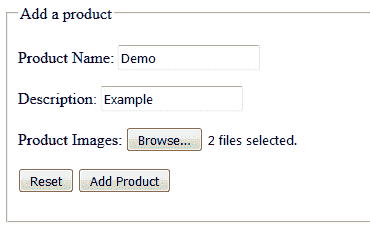
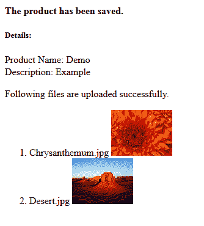

# Spring MVC 多文件上传示例

> 原文： [https://howtodoinjava.com/spring-mvc/spring-mvc-multi-file-upload-example/](https://howtodoinjava.com/spring-mvc/spring-mvc-multi-file-upload-example/)

Spring MVC 为任何应用程序中的**多文件上传**功能提供了开箱即用的支持。 本教程使用[`CommonsMultipartResolver`](https://docs.spring.io/autorepo/docs/spring-framework/4.2.6.RELEASE/javadoc-api/org/springframework/web/multipart/commons/CommonsMultipartResolver.html)，并且需要[ apache commons 文件上载](https://commons.apache.org/proper/commons-fileupload/)和 [apache commons io](https://commons.apache.org/proper/commons-io/) 依赖项。

`pom.xml`

```java
<dependency>
    <groupId>commons-fileupload</groupId>
    <artifactId>commons-fileupload</artifactId>
    <version>1.3.1</version>
</dependency>
<dependency>
    <groupId>commons-io</groupId>
    <artifactId>commons-io</artifactId>
    <version>2.6</version>
</dependency>

```

## 1\. Spring MVC `MultipartFile`接口

上传到 Spring MVC 应用程序的文件将包装在 [MultipartFile](https://docs.spring.io/spring/docs/current/javadoc-api/org/springframework/web/multipart/MultipartFile.html) 对象中。 我们需要做的就是编写一个属性类型为`MultipartFile`的域类。 该界面具有获取上传文件的名称和内容的方法，例如 `getBytes()`，`getInputStream()`，`getOriginalFilename()`， `getSize()`，`isEmpty()`和`tranferTo()`。

例如，要将上传的文件保存到文件系统，我们可以使用`transferTo`方法：

`File upload to filesystem`

```java
File file = new File(...);
multipartFile.transferTo(file);

```

## 2\. 用于文件上传的域类

您需要创建一个具有必要属性的简单域类，并创建一个用于存储`List<MultipartFile>`类型的文件的域类。

为了构建此示例，我编写了此域类。

`Product.java`

```java
public class Product implements Serializable 
{
    private static final long serialVersionUID = 74458L;

    @NotNull
    @Size(min=1, max=10)
    private String name;

    private String description;

    private List<MultipartFile> images;

	//getters and setters
}

```

## 3\. Spring MVC 多文件上传控制器

在控制器类中，我们将在域类中获取上载文件的预填充详细信息。 只需获取详细信息，然后根据应用程序设计将文件存储在文件系统或数据库中即可。

`DemoProductController.java`

```java
@Controller
public class DemoProductController 
{
	@RequestMapping("/save-product")
	public String uploadResources( HttpServletRequest servletRequest, 
								 @ModelAttribute Product product,
								 Model model) 
	{
		//Get the uploaded files and store them
		List<MultipartFile> files = product.getImages();
        List<String> fileNames = new ArrayList<String>();
        if (null != files && files.size() > 0) 
        {
            for (MultipartFile multipartFile : files) {

                String fileName = multipartFile.getOriginalFilename();
                fileNames.add(fileName);

                File imageFile = new File(servletRequest.getServletContext().getRealPath("/image"), fileName);
                try 
                {
                    multipartFile.transferTo(imageFile);
                } catch (IOException e) 
                {
                    e.printStackTrace();
                }
            }
        }

        // Here, you can save the product details in database

        model.addAttribute("product", product);
        return "viewProductDetail";
	}

	@RequestMapping(value = "/product-input-form")
    public String inputProduct(Model model) {
        model.addAttribute("product", new Product());
        return "productForm";
    }
}

```

## 4\. Spring MVC 配置更改

为了支持**多部分请求**，我们需要在配置文件中声明`multipartResolver` bean。

`beans.xml`

```java
<bean id="multipartResolver" class="org.springframework.web.multipart.commons.CommonsMultipartResolver">
	<property name="maxUploadSize" value="20848820" />
</bean>

```

等效的 Java **注解配置**为：

```java
@Bean(name = "multipartResolver")
public CommonsMultipartResolver multipartResolver() 
{
    CommonsMultipartResolver multipartResolver = new CommonsMultipartResolver();
    multipartResolver.setMaxUploadSize(20848820);
    return multipartResolver;
}

```

此外，我们可能希望将服务器上的文件存储路径映射为资源。 这将是 spring mvc 文件上传目录。

```java
<mvc:resources mapping="/image/**" location="/image/" /> 

```

本示例使用的完整配置文件为：

`beans.xml`

```java
<beans xmlns="http://www.springframework.org/schema/beans"
	xmlns:xsi="http://www.w3.org/2001/XMLSchema-instance" 
	xmlns:context="http://www.springframework.org/schema/context" 
	xmlns:mvc="http://www.springframework.org/schema/mvc"
	xsi:schemaLocation="http://www.springframework.org/schema/beans
        http://www.springframework.org/schema/beans/spring-beans-3.0.xsd
        http://www.springframework.org/schema/context/
        http://www.springframework.org/schema/context/spring-context-3.0.xsd
        http://www.springframework.org/schema/mvc
        http://www.springframework.org/schema/mvc/spring-mvc-3.0.xsd">

	<context:component-scan base-package="com.howtodoinjava.demo" />

	<mvc:resources mapping="/image/**" location="/image/" /> 

	<bean class="org.springframework.web.servlet.mvc.annotation.AnnotationMethodHandlerAdapter" />
	<bean class="org.springframework.web.servlet.mvc.annotation.DefaultAnnotationHandlerMapping" />

	<bean class="org.springframework.web.servlet.view.InternalResourceViewResolver">
		<property name="prefix" value="/WEB-INF/views/" />
		<property name="suffix" value=".jsp" />
	</bean>

	<bean id="messageSource" class="org.springframework.context.support.ResourceBundleMessageSource">
	    <property name="basename" value="messages" />
	</bean>

	<bean id="multipartResolver" class="org.springframework.web.multipart.commons.CommonsMultipartResolver">
		<property name="maxUploadSize" value="20848820" />
	</bean>

</beans>

```

## 5\. Spring MVC 视图上传文件

我已经写了两个 JSP 文件。 一个用于显示文件上传表单，用户将在其中填写其他详细信息并选择要上传的文件。 其次，我们将显示带有其他详细信息的上传文件。

`productForm.jsp`

```java
<%@ taglib prefix="form" uri="http://www.springframework.org/tags/form"%>
<%@ taglib uri="http://java.sun.com/jsp/jstl/core" prefix="c"%>
<!DOCTYPE html>
<html>
<head>
<title>Add Product Form</title>
</head>
<body>
	<div id="global">
		<form:form commandName="product" action="save-product" method="post" enctype="multipart/form-data">
			<fieldset>
				<legend>Add a product</legend>
				<p>
					<label for="name">Product Name: </label>
					<form:input id="name" path="name" cssErrorClass="error" />
					<form:errors path="name" cssClass="error" />
				</p>
				<p>
					<label for="description">Description: </label>
					<form:input id="description" path="description" />
				</p>
				<p>
					<label for="image">Product Images: </label> 
					<input type="file" name="images" multiple="multiple"/>
				</p>
				<p id="buttons">
					<input id="reset" type="reset" tabindex="4"> 
					<input id="submit" type="submit" tabindex="5" value="Add Product">
				</p>
			</fieldset>
		</form:form>
	</div>
</body>
</html>

```

`viewProductDetail.jsp`

```java
<%@ taglib uri="http://java.sun.com/jsp/jstl/core" prefix="c" %>
<!DOCTYPE html>
<html>
<head>
<title>Save Product</title>
</head>
<body>
<div id="global">
    <h4>The product has been saved.</h4>
        <h5>Details:</h5>
        Product Name: ${product.name}<br/>
        Description: ${product.description}<br/>
        <p>Following files are uploaded successfully.</p>
        <ol>
        <c:forEach items="${product.images}" var="image">
            <li>${image.originalFilename}
            ${image.originalFilename}"/>
            </li>
        </c:forEach>
        </ol>
</div>
</body>
</html>

```

## Spring MVC 多文件上传示例

当我们用`http://localhost:8080/springmvcexample/product-input-form`进入浏览器时，我们得到以下屏幕：



Spring MVC file upload form

我们填写详细信息并提交表格，我们将在其他页面中获取提交的详细信息和所有上传的文件：



file uploaded successfully

在与 **spring mvc multipart file upload example** 相关的评论部分中，向我提出您的问题和建议。

学习愉快！