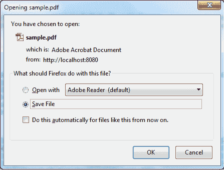
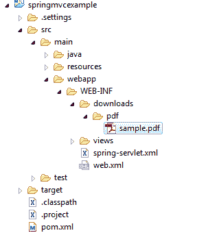

# Spring MVC 下载文件控制器示例

> 原文： [https://howtodoinjava.com/spring-mvc/spring-mvc-download-file-controller-example/](https://howtodoinjava.com/spring-mvc/spring-mvc-download-file-controller-example/)

在 [Spring MVC](//howtodoinjava.com/spring/spring-mvc/spring-mvc-hello-world-example/) 应用程序中，要将文件之类的资源下载到浏览器，您需要在控制器中执行以下操作。

1.  将`void`返回类型用于您的请求处理方法，然后将`HttpServletResponse`添加为该方法的参数。
2.  将响应的[内容类型](https://www.iana.org/assignments/media-types/media-types.xhtml)设置为文件的内容类型。 如果您不知道内容类型是什么，或者希望浏览器始终显示`Save As`对话框，请将其设置为`APPLICATION/OCTET-STREAM` （不区分大小写）。
3.  添加一个名为`Content-Disposition`的 HTTP 响应标头，并为其赋予值**附件； filename = fileName** ，其中`fileName`是应出现在“文件下载”对话框中的默认文件名。

## 1\. Sping MVC 文件下载控制器

让我们看一下文件下载控制器的示例实现。

```java
@Controller
@RequestMapping("/download")
public class FileDownloadController 
{
	@RequestMapping("/pdf/{fileName:.+}")
	public void downloadPDFResource( HttpServletRequest request, 
									 HttpServletResponse response, 
									 @PathVariable("fileName") String fileName) 
	{
		//If user is not authorized - he should be thrown out from here itself

		//Authorized user will download the file
		String dataDirectory = request.getServletContext().getRealPath("/WEB-INF/downloads/pdf/");
		Path file = Paths.get(dataDirectory, fileName);
		if (Files.exists(file)) 
		{
			response.setContentType("application/pdf");
			response.addHeader("Content-Disposition", "attachment; filename="+fileName);
			try 
			{
				Files.copy(file, response.getOutputStream());
				response.getOutputStream().flush();
			} 
			catch (IOException ex) {
				ex.printStackTrace();
			}
		}
	}
}

```

If you want to enable downloads for only authorized users then check the user’s logged in status first in the method, and then allow download otherwise redirect him to login screen.

现在，如果您点击应用程序 URL：`http://localhost:8080/springmvcexample/download/pdf/sample.pdf`，您将能够在浏览器中获得**另存为**对话框，如下所示：



File download window

该文件位于文件夹“ / WEB-INF / downloads / pdf”中。 您可以自由更改路径–确保同时更改控制器代码。



File download project structure

## 2\. 防止文件下载的交叉引用

很多时候，其他网站可能会[作为直接链接交叉引用](https://en.wikipedia.org/wiki/Cross-reference)您网站中的文件。 您可能不想允许它。 要禁止来自其他域的所有下载请求，您可以检查**引荐来源**标头中是否包含您的域名。

仅当**引用**标头不为 null 时，我们修改后的`FileDownloadController`才会将文件发送到浏览器。 这将防止通过在浏览器中键入图像的 URL 或来自其他域的请求来直接下载图像。

```java
@Controller
@RequestMapping("/download")
public class FileDownloadController 
{
	@RequestMapping("/pdf/{fileName:.+}")
	public void downloadPDFResource( HttpServletRequest request, 
									 HttpServletResponse response, 
									 @PathVariable("fileName") String fileName,
									 @RequestHeader String referer) 
	{
		//Check the renderer
		if(referer != null && !referer.isEmpty()) {
			//do nothing
			//or send error
		}
		//If user is not authorized - he should be thrown out from here itself

		//Authorized user will download the file
		String dataDirectory = request.getServletContext().getRealPath("/WEB-INF/downloads/pdf/");
		Path file = Paths.get(dataDirectory, fileName);
		if (Files.exists(file)) 
		{
			response.setContentType("application/pdf");
			response.addHeader("Content-Disposition", "attachment; filename="+fileName);
			try 
			{
				Files.copy(file, response.getOutputStream());
				response.getOutputStream().flush();
			} 
			catch (IOException ex) {
				ex.printStackTrace();
			}
		}
	}
}

```

现在，如果您尝试直接从浏览器中访问 URL，则会收到此错误：

```java
java.lang.IllegalStateException: Missing header 'referer' of type [java.lang.String]
at org.springframework.web.bind.annotation.support.HandlerMethodInvoker.raiseMissingHeaderException(HandlerMethodInvoker.java:797)
at org.springframework.web.bind.annotation.support.HandlerMethodInvoker.resolveRequestHeader(HandlerMethodInvoker.java:566)
at org.springframework.web.bind.annotation.support.HandlerMethodInvoker.resolveHandlerArguments(HandlerMethodInvoker.java:355)
at org.springframework.web.bind.annotation.support.HandlerMethodInvoker.invokeHandlerMethod(HandlerMethodInvoker.java:172)
at org.springframework.web.servlet.mvc.annotation.AnnotationMethodHandlerAdapter.invokeHandlerMethod(AnnotationMethodHandlerAdapter.java:446)
```

将我的问题放在评论部分。

学习愉快！