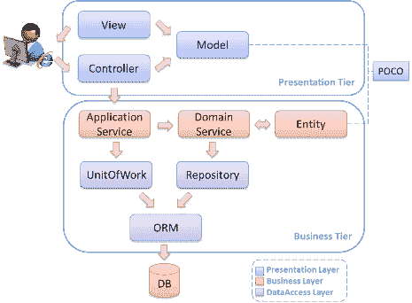

# 春季 MVC 面试问题与答案

> 原文： [https://howtodoinjava.com/interview-questions/spring-mvc-interview-questions-with-answers/](https://howtodoinjava.com/interview-questions/spring-mvc-interview-questions-with-answers/)

这些 **Spring MVC 面试问题**和答案均已编写，可帮助您为 **[面试](//howtodoinjava.com/java-interview-questions/ "Java Interview Questions")** 做好准备，并快速地对总体概念进行修订。 如果有多余的时间，我强烈建议您更深入地研究每个概念。 您知道的越多，您就会越有信心。

## 什么是 Spring MVC 框架？

Spring Web MVC 框架提供 [**MVC 架构**](https://en.wikipedia.org/wiki/Model%E2%80%93view%E2%80%93controller "mvc") （模型视图控制器）和现成的组件，这些组件可用于开发灵活且松散耦合的 Web 应用程序。 MVC 模式导致分离应用程序的不同方面（输入逻辑，业务逻辑和 UI 逻辑），同时在应用程序的模型，视图和控制器部分之间提供松散的耦合。

与其他 MVC 框架相比，Spring 框架具有许多优势。

1.  **角色明确分开** –控制器，验证器，命令对象，表单对象，模型对象，DispatcherServlet，处理程序映射，视图解析器等。每个角色都可以由专门的对象来实现。
2.  框架和应用程序类的功能强大且直接的**配置选项**作为 JavaBeans。
3.  **可重用的业务代码** –无需重复。 您可以将现有业务对象用作命令或表单对象，而不是对其进行镜像，以扩展特定的框架基类。
4.  可定制的绑定和验证
5.  可自定义的**处理程序映射**和视图分辨率
6.  可自定义的区域设置和主题解析
7.  在 Spring 2.0 中引入的 JSP 表单标记库（ **FTL** ）使在 JSP 页面中编写表单变得更加容易。 等等

## 什么是 DispatcherServlet 和 ContextLoaderListener？

与许多其他 Web MVC 框架一样，Spring 的 Web MVC 框架**请求驱动**围绕一个处理所有 HTTP 请求和响应的中央`Servlet`设计。 Spring 的 **DispatcherServlet** 所做的不只是这些。 它与 Spring **IoC 容器**完全集成在一起，因此您可以使用 Spring 拥有的所有功能。

收到 HTTP 请求后，DispatcherServlet 会参考 **HandlerMapping** （配置文件）来调用相应的 Controller。 Controller 接收请求并调用适当的服务方法并设置模型数据，然后将视图名称返回给 DispatcherServlet。

DispatcherServlet 将从 **ViewResolver** 获得帮助，以获取请求的已定义视图。 一旦视图完成，DispatcherServlet 将模型数据传递到视图，该视图最终在浏览器上呈现。

```java
<web-app>
  <display-name>Archetype Created Web Application</display-name>

  <servlet>
		<servlet-name>spring</servlet-name>
			<servlet-class>
				org.springframework.web.servlet.DispatcherServlet
			</servlet-class>
		<load-on-startup>1</load-on-startup>
	</servlet>

	<servlet-mapping>
		<servlet-name>spring</servlet-name>
		<url-pattern>/</url-pattern>
	</servlet-mapping>

</web-app>

```

默认情况下，DispatcherServlet 使用`<servlet_name&gt;-servlet.xml`加载其配置文件。 例如。 对于上面的`web.xml`文件，DispatcherServlet 将尝试在类路径中找到`spring-servlet.xml`文件。

**ContextLoaderListener** 读取 spring 配置文件（在 web.xml 中具有`contextConfigLocation`的值），对其进行解析并加载在该配置文件中定义的 bean。 例如

```java
<servlet>
	<servlet-name>spring</servlet-name>
	<servlet-class>
		org.springframework.web.servlet.DispatcherServlet
	</servlet-class>

	<init-param>
		<param-name>contextConfigLocation</param-name>
		<param-value>/WEB-INF/applicationContext.xml</param-value>
	</init-param>

	<load-on-startup>1</load-on-startup>
</servlet>

```

## Spring MVC 的前端控制器类是什么？

**前端控制器**定义为“处理 Web 应用程序所有请求的控制器。” DispatcherServlet（实际上是 Servlet）是 Spring MVC 中的前端控制器，它拦截每个请求，然后将请求分派/转发给 适当的控制器。

将 Web 请求发送到 Spring MVC 应用程序时，调度程序 Servlet 首先接收该请求。 然后，它会组织在 Spring 的 Web 应用程序上下文中配置的不同组件（例如，实际的请求处理程序控制器和视图解析器）或控制器本身中存在的注释，这些都是处理请求所需的。

## 如何使用基于 Java 的配置？

要配置基于 Java 的 MVC 应用程序，请首先添加所需的依赖项。

```java
<!-- Spring MVC support -->

<dependency>
	<groupId>org.springframework</groupId>
	<artifactId>spring-webmvc</artifactId>
	<version>4.1.4.RELEASE</version>
</dependency>

<dependency>
	<groupId>org.springframework</groupId>
	<artifactId>spring-web</artifactId>
	<version>4.1.4.RELEASE</version>
</dependency>

<!-- Tag libs support for view layer -->

<dependency>
	<groupId>javax.servlet</groupId>
	<artifactId>jstl</artifactId>
	<version>1.2</version>
	<scope>runtime</scope>
</dependency>

<dependency>
	<groupId>taglibs</groupId>
	<artifactId>standard</artifactId>
	<version>1.1.2</version>
	<scope>runtime</scope>
</dependency>

```

现在，在`web.xml`文件中添加 DispatcherServlet 条目，以便所有传入请求仅通过 DispatcherServlet 发出。

```java
<servlet>
	<servlet-name>spring</servlet-name>
		<servlet-class>
			org.springframework.web.servlet.DispatcherServlet
		</servlet-class>
	<load-on-startup>1</load-on-startup>
</servlet>

<servlet-mapping>
	<servlet-name>spring</servlet-name>
	<url-pattern>/</url-pattern>
</servlet-mapping>

```

现在，在 spring 配置文件中添加以下条目。

```java
<beans>
	<!-- Scan all classes in this path for spring specific annotations -->
    <context:component-scan base-package="com.howtodoinjava.demo" />

    <bean class="org.springframework.web.servlet.mvc.annotation.DefaultAnnotationHandlerMapping" />
    <bean class="org.springframework.web.servlet.mvc.annotation.AnnotationMethodHandlerAdapter" />

    <!-- Vierw resolver configuration -->
    <bean class="org.springframework.web.servlet.view.InternalResourceViewResolver">
        <property name="prefix" value="/WEB-INF/views/" />
        <property name="suffix" value=".jsp" />
    </bean>

</beans>

```

添加控制器代码。

```java
@Controller
@RequestMapping("/employee-module")
public class EmployeeController
{
    @Autowired
    EmployeeManager manager;

    @RequestMapping(value = "/getAllEmployees", method = RequestMethod.GET)
    public String getAllEmployees(Model model)
    {
        model.addAttribute("employees", manager.getAllEmployees());
        return "employeesListDisplay";
    }
}

```

另外，您还应该添加 manager 和 Dao 图层类。 最后，添加 JSP 文件以显示视图。

> **阅读更多： [Spring MVC Hello World 示例](//howtodoinjava.com/spring/spring-mvc/spring-mvc-hello-world-example/ "Spring MVC Hello World Example")**

## 我们如何使用 Spring 创建返回 JSON 响应的 Rest Web Service？

为了在您的 spring 应用程序中添加 **JSON** 支持，您需要在第一步中添加 **Jackson** 依赖项。

```java
<!-- Jackson JSON Processor -->
<dependency>
    <groupId>com.fasterxml.jackson.core</groupId>
    <artifactId>jackson-databind</artifactId>
    <version>2.4.1</version>
</dependency>

```

现在，您准备好从 MVC 控制器返回 JSON 响应。 您要做的就是从方法中返回带有 JAXB 注释的对象，并在此返回类型上使用`@ResponseBody`注释。

```java
@Controller
public class EmployeeRESTController
{
	@RequestMapping(value = "/employees")
	public @ResponseBody EmployeeListVO getAllEmployees()
	{
		EmployeeListVO employees = new EmployeeListVO();
		//Add employees
		return employees;
	}
}

```

或者，您可以使用`@RestController`注释代替`@Controller`注释。 这将消除使用`@ResponseBody`的需要。

> **@RestController = @Controller + @ResponseBody**

因此，您可以如下编写上述控制器。

```java
@RestController
public class EmployeeRESTController
{
	@RequestMapping(value = "/employees")
	public EmployeeListVO getAllEmployees()
	{
		EmployeeListVO employees = new EmployeeListVO();
		//Add employees
		return employees;
	}
}

```

> **阅读更多： [Spring REST Hello World JSON 示例](//howtodoinjava.com/spring/spring-restful/spring-rest-hello-world-json-example/ "Spring REST Hello World JSON Example")**

## 我们可以有多个 Spring 配置文件吗？

是。 您可以有多个 spring 上下文文件。 有两种方法可以读取和配置 spring。

*   使用 **contextConfigLocation** init 参数指定`web.xml`文件中的所有文件。

    ```java
    &lt;servlet&gt;
    		&lt;servlet-name&gt;spring&lt;/servlet-name&gt;
    		&lt;servlet-class&gt;
    			org.springframework.web.servlet.DispatcherServlet
    		&lt;/servlet-class&gt;
    		&lt;init-param&gt;
    			&lt;param-name&gt;contextConfigLocation&lt;/param-name&gt;
    			&lt;param-value&gt;
    				WEB-INF/spring-dao-hibernate.xml,
    				WEB-INF/spring-services.xml,
    				WEB-INF/spring-security.xml
    			&lt;/param-value&gt;
    		&lt;/init-param&gt;
    		&lt;load-on-startup&gt;1&lt;/load-on-startup&gt;
    	&lt;/servlet&gt;

    	&lt;servlet-mapping&gt;
    		&lt;servlet-name&gt;spring&lt;/servlet-name&gt;
    		&lt;url-pattern&gt;/&lt;/url-pattern&gt;
    	&lt;/servlet-mapping&gt;

    ```

*   或者，您可以**将它们导入到已经配置的现有配置文件**中。

    ```java
    &lt;beans&gt;
    	&lt;import resource="spring-dao-hibernate.xml"/&gt;
    	&lt;import resource="spring-services.xml"/&gt;
    	&lt;import resource="spring-security.xml"/&gt;

    	... //Other configuration stuff

    &lt;/beans&gt;

    ```

## &lt; context：annotation-config &gt;与&lt; context：component-scan &gt;之间的区别？

1.  这两个标签之间的第一个大区别是`<context:annotation-config>`用于在应用程序上下文中激活已注册 bean 中的应用注释。 请注意，bean 是否通过哪种机制注册都没有关系，例如 使用`<context:component-scan>`或在 application-context.xml 文件本身中定义。
2.  第二差异是由第一差异本身驱动的。 它**将在配置文件中定义的 bean 注册到上下文中，并且还扫描 bean 内部的注释并激活它们**。 因此，`<context:component-scan>`的作用与`<context:annotation-config>`的作用相同，但它还会扫描软件包并在应用程序上下文中注册 Bean。

**<context:annotation-config> = Scanning and activating annotations in “already registered beans”.**

**&lt;上下文：组件扫描&gt; = Bean 注册+扫描并激活注释**

> 阅读更多：[注解配置和组件扫描](//howtodoinjava.com/spring/spring-mvc/spring-mvc-difference-between-contextannotation-config-vs-contextcomponent-scan/)之间的区别

## @ Component，@ Controller，@ Repository & @Service 批注之间的区别？

1.  **@Component** 注释将 Java 类标记为 Bean，因此 spring 的组件扫描机制可以将其拾取并将其拉入应用程序上下文。 要使用此批注，请将其应用于类，如下所示：

    ```java
    @Component
    public class EmployeeDAOImpl implements EmployeeDAO {
        ...
    }

    ```

2.  **@Repository** 注释是`@Component`注释的特化，具有相似的用途和功能。 除了将 DAO 导入 DI 容器之外，它还使未经检查的异常（从 DAO 方法抛出）有资格转换为 Spring `DataAccessException`。
3.  **@Service** 注释也是组件注释的特化。 目前，它没有提供@Component 注释以外的任何其他行为，但是最好在服务层类中的`@Component`上使用@Service，因为它可以更好地指定意图。
4.  **@Controller** 注释将一个类标记为 Spring Web MVC 控制器。 它也是`@Component`专长，因此标有它的 bean 将自动导入 DI 容器中。 将`@Controller`注释添加到类时，可以使用另一个注释，即`@RequestMapping`； 将 URL 映射到类的实例方法。

> 阅读更多： [@ Component，@ Repository，@ Service 和@Controller 批注？](//howtodoinjava.com/spring/spring-core/how-to-use-spring-component-repository-service-and-controller-annotations/)

## ViewResolver 类是什么？

`ViewResolver`是要由可以通过名称解析视图的对象实现的接口。 有很多方法可以用来解析视图名称。 这些接口的各种内置实现都支持这些方式。 最常用的实现是 **InternalResourceViewResolver** 类。 它定义`prefix`和`suffix`属性来解析视图组件。

```java
<bean class="org.springframework.web.servlet.view.InternalResourceViewResolver">
	<property name="prefix" value="/WEB-INF/views/" />
	<property name="suffix" value=".jsp" />
</bean>

```

因此，使用上述视图解析器配置，如果控制器方法返回“ login ”字符串，则将搜索并呈现“ `/WEB-INF/views/login.jsp`”文件。

## 什么是 MultipartResolver？何时使用？

Spring 附带 **MultipartResolver** 来处理 Web 应用程序中的**文件上传**。 Spring 包含两个具体的实现：

1.  **CommonsMultipartResolver** for Jakarta Commons FileUpload
2.  **用于 Servlet 3.0 Part API 的 StandardServletMultipartResolver**

要定义实现，请在 DispatcherServlet 的应用程序上下文中创建一个 ID 为[ **multipartResolver** ）的 bean。 这样的解析器将应用于该 DispatcherServlet 处理的所有请求。

如果`DispatcherServlet`检测到多部分请求，它将通过配置的`MultipartResolver`解析该请求，并传递已包装的 HttpServletRequest。 然后，控制器可以将给定的请求投射到`MultipartHttpServletRequest`接口，该接口允许访问任何`MultipartFiles`。

## 如何在 Spring MVC 应用程序中上传文件？

假设我们要使用 **CommonsMultipartResolver** ，它使用 Apache Commons 上传库来处理表单中的文件上传。 因此，您将需要添加 **commons-fileupload.jar** 和 **commons-io.jar** 依赖项。

```java
<!-- Apache Commons Upload --> 
<dependency>
	<groupId>commons-fileupload</groupId>
	<artifactId>commons-fileupload</artifactId>
	<version>1.2.2</version>
</dependency>

<!-- Apache Commons Upload --> 
<dependency>
	<groupId>commons-io</groupId>
	<artifactId>commons-io</artifactId>
	<version>1.3.2</version>
</dependency>

```

需要在应用程序上下文文件中进行以下声明以启用 **MultipartResolver** （以及在应用程序中包括必要的 jar 文件）：

```java
<bean id="multipartResolver" class="org.springframework.web.multipart.commons.CommonsMultipartResolver">
	<!-- one of the properties available; the maximum file size in bytes -->
	<property name="maxUploadSize" value="100000"/>
</bean>

```

现在创建模型类 **FileUploadForm** ，它将保存从 HTML 表单提交的多部分数据。

```java
import org.springframework.web.multipart.MultipartFile;

public class FileUploadForm 
{
	private MultipartFile file;

	public MultipartFile getFile() {
		return file;
	}

	public void setFile(MultipartFile file) {
		this.file = file;
	}
}

```

现在创建`FileUploadController`类，它将实际处理上传逻辑。

```java
import org.springframework.stereotype.Controller;
import org.springframework.ui.Model;
import org.springframework.web.bind.annotation.ModelAttribute;
import org.springframework.web.bind.annotation.RequestMapping;
import org.springframework.web.bind.annotation.RequestMethod;
import org.springframework.web.multipart.MultipartFile;
import com.howtodoinjava.form.FileUploadForm;

@Controller
public class FileUploadController 
{
	@RequestMapping(value = "/upload", method = RequestMethod.POST)
	public String save(@ModelAttribute("uploadForm") FileUploadForm uploadForm,	Model map) {

		MultipartFile multipartFile = uploadForm.getFile();

		String fileName = "default.txt";

		if (multipartFile != null) {
			fileName = multipartFile.getOriginalFilename();
		}

		//read and store the file as you like

		map.addAttribute("files", fileName);
		return "file_upload_success";
	}
}

```

上传的 JSP 文件如下所示：

```java
<%@ taglib prefix="form" uri="http://www.springframework.org/tags/form"%>
<html>
<body>
	<h2>Spring MVC file upload example</h2>
 	<form:form method="post" action="save.html" modelAttribute="uploadForm" enctype="multipart/form-data">
 		Please select a file to upload : <input type="file" name="file" />
		<input type="submit" value="upload" />
		<span><form:errors path="file" cssClass="error" /></span>
	</form:form>
</body>
</html>

```

## Spring MVC 如何提供验证支持？

Spring 主要通过两种方式支持验证。

1.  使用 **JSR-303 注释**和任何参考实现，例如 **休眠验证器**
2.  使用 **org.springframework.validation.Validator** 接口的自定义实现

在下一个问题中，您将看到一个如何在 Spring MVC 应用程序中使用验证支持的示例。

## 如何在 Spring Web MVC Framework 中验证表单数据？

Spring MVC 通过实现`Validator`接口的验证器对象来支持验证。 您需要创建一个类并实现`Validator`接口。 在此定制验证器类中，您可以使用`ValidationUtils`类中的实用程序方法，例如`rejectIfEmptyOrWhitespace(`和`rejectIfEmpty()`来验证所需的表单字段。

```java
@Component
public class EmployeeValidator implements Validator
{
    public boolean supports(Class clazz) {
        return EmployeeVO.class.isAssignableFrom(clazz);
    }

    public void validate(Object target, Errors errors)
    {
        ValidationUtils.rejectIfEmptyOrWhitespace(errors, "firstName", "error.firstName", "First name is required.");
        ValidationUtils.rejectIfEmptyOrWhitespace(errors, "lastName", "error.lastName", "Last name is required.");
        ValidationUtils.rejectIfEmptyOrWhitespace(errors, "email", "error.email", "Email is required.");
    }
}

```

如果任何表单字段为空，则这些方法将创建一个字段错误并将其绑定到该字段。 这些方法的第二个参数是属性名称，而第三个和第四个是错误代码和默认错误消息。

要将此自定义验证器激活为 spring 托管 bean，您需要执行以下操作之一：

1.  将`@Component`注释添加到`EmployeeValidator`类，并在包含此类声明的包上激活注释扫描。

    ```java
    &lt;context:component-scan base-package="com.howtodoinjava.demo" /&gt;
    ```

2.  或者，您可以直接在上下文文件中注册验证器类 Bean。

    ```java
    &lt;bean id="employeeValidator" class="com.howtodoinjava.demo.validator.EmployeeValidator" /&gt;
    ```

> **阅读更多：Spring MVC [自定义验证器](//howtodoinjava.com/spring/spring-mvc/spring-mvc-custom-validator-example/ "Spring MVC Custom Validator Example")和 [JSR-303 批注](//howtodoinjava.com/spring/spring-mvc/spring-bean-validation-example-with-jsr-303-annotations/ "Spring Bean Validation Example with JSR-303 Annotations")示例**

## 什么是 Spring MVC 拦截器以及如何使用？

如您所知，Servlet 过滤器可以在它们处理的每个 Web 请求之前和之后对它进行预处理和后处理。 以类似的方式，您可以在 spring mvc 应用程序中使用 **HandlerInterceptor** 接口对由 Spring MVC 控制器处理的 Web 请求进行预处理和后处理。 这些处理程序通常用于操作返回/提交的模型属性，并将它们传递给视图/控制器。

可以为特定的 URL 映射注册处理程序拦截器，因此它仅拦截映射到某些 URL 的请求。 每个处理程序拦截器都必须实现`HandlerInterceptor`接口，该接口包含三种回调方法供您实现：`preHandle()`，`postHandle()`和`afterCompletion()`。

`HandlerInterceptor`接口的问题在于，无论是否需要，新类都必须实现所有三种方法。 为避免覆盖，可以使用`HandlerInterceptorAdapter`类。 此类实现`HandlerInterceptor`并提供默认的空白实现。

> **阅读更多： [Spring MVC 拦截器示例](//howtodoinjava.com/spring/spring-mvc/spring-intercepting-requests-using-handlerinterceptor-with-example/ "Spring Intercepting Requests using HandlerInterceptor with Example")**

## 如何在 Spring MVC Framework 中处理异常？

在 Spring MVC 应用程序中，可以在 Web 应用程序上下文中注册一个或多个**异常**解析器 bean，以解决未捕获的异常。 这些 Bean 必须为`DispatcherServlet`实现 **HandlerExceptionResolver** 接口才能自动检测它们。 Spring MVC 附带了一个简单的异常解析器，您可以将每种类别的异常映射到一个视图，即 **SimpleMappingExceptionResolver** 以一种可配置的方式将每种类别的异常映射到一个视图。

假设我们有一个异常类，即`AuthException`。 而且，我们希望每次将此异常从任何地方抛出到应用程序中时，我们都希望显示一个预定的视图页面`/WEB-INF/views/error/authExceptionView.jsp`。

这样配置就可以了。

```java
<bean class="org.springframework.web.servlet.handler.SimpleMappingExceptionResolver">
    <property name="exceptionMappings">
        <props>
            <prop key="com.howtodoinjava.demo.exception.AuthException">
                error/authExceptionView
            </prop>
        </props>
    </property>
    <property name="defaultErrorView" value="error/genericView"/>
</bean>

```

可以将`defaultErrorView`属性配置为显示所有未在`exceptionMappings`列表中配置的其他异常的通用消息 。

> **阅读更多： [Spring MVC SimpleMappingExceptionResolver 示例](//howtodoinjava.com/spring/spring-mvc/spring-mvc-simplemappingexceptionresolver-example/ "Spring MVC SimpleMappingExceptionResolver Example")**

## 如何在 Spring MVC 应用程序中实现本地化？

Spring 框架随 **LocaleResolver** 一起提供，以支持**国际化**，从而也支持**本地化**。 为了使 Spring MVC 应用程序支持国际化，您将需要注册两个 bean。

1.  `SessionLocaleResolver`：它通过检查用户会话中的预定义属性来解析语言环境。 如果 session 属性不存在，则此语言环境解析器从接受语言 HTTP 标头中确定默认语言环境。

    ```java
    &lt;bean id="localeResolver" class="org.springframework.web.servlet.i18n.SessionLocaleResolver"&gt;
        &lt;property name="defaultLocale" value="en" /&gt;
    &lt;/bean&gt;

    ```

2.  `LocaleChangeInterceptor`：此拦截器检测当前 HTTP 请求中是否存在特殊参数。 可以使用此拦截器的 **paramName** 属性自定义参数名称。 如果当前请求中存在此类参数，则此拦截器会根据参数值更改用户的语言环境。

    ```java
    &lt;bean id="localeChangeInterceptor" class="org.springframework.web.servlet.i18n.LocaleChangeInterceptor"&gt;
        &lt;property name="paramName" value="lang" /&gt;
    &lt;/bean&gt;

    &lt;!-- Enable the interceptor --&gt;
    &lt;bean class="org.springframework.web.servlet.mvc.annotation.DefaultAnnotationHandlerMapping"&gt;
        &lt;property name="interceptors"&gt;
            &lt;list&gt;
                &lt;ref bean="localeChangeInterceptor" /&gt;
            &lt;/list&gt;
        &lt;/property&gt;
    &lt;/bean&gt;

    ```

下一步是让每个特定于语言环境的属性文件都具有该特定于语言环境的语言的文本，例如 `messages.properties`和`messages_zh_CN.properties`等

> **阅读更多： [Spring MVC 本地化（i10n）示例](//howtodoinjava.com/spring/spring-mvc/spring-mvc-internationalization-i18n-and-localization-i10n-example/ "Spring MVC Internationalization (i18n) and Localization (i10n) Example")**

## 如何在 Spring Bean 中获取 ServletContext 和 ServletConfig 对象？

只需实现`ServletContextAware`和`ServletConfigAware`接口并覆盖以下方法。

```java
@Controller
@RequestMapping(value = "/magic")
public class SimpleController implements ServletContextAware, ServletConfigAware {

    private ServletContext context;
    private ServletConfig config;

    @Override
    public void setServletConfig(final ServletConfig servletConfig) {
        this.config = servletConfig;

    }

    @Override
    public void setServletContext(final ServletContext servletContext) {
        this.context = servletContext;
    }

	//other code
}

```

## 如何在 Spring Web Application 中使用 Tomcat JNDI 数据源？

对于使用已配置 **JNDI** DataSource 的 servlet 容器，我们需要在 spring bean 配置文件中对其进行配置，然后将其作为依赖项注入 spring bean。 然后，我们可以将其与`JdbcTemplate`一起使用来执行数据库操作。

```java
<bean id="dataSource" class="org.springframework.jndi.JndiObjectFactoryBean">
    <property name="jndiName" value="java:comp/env/jdbc/MySQLDB"/>
</bean>

```

## 您如何将 Spring MVC Framework 与三层架构联系起来？

> 3 层是体系结构样式，MVC 是设计模式。

[](//howtodoinjava.com/wp-content/uploads/2015/02/3-tier-architechture-with-mvc-part-of-it.png)

在较大的应用程序中，MVC 仅是 **3 层体系结构**的**表示层**。 模型，视图和控制器仅与表示有关，并利用中间层用来自数据层的数据填充模型。

请分享您可能遇到的其他其他 Spring MVC 面试问题。 因此，我可以在本文中包括那些 **Spring MVC 采访问题**，以使其他人受益。

学习愉快！