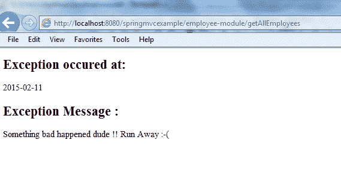
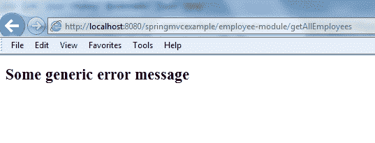

# Spring MVC `SimpleMappingExceptionResolver`示例

> [https://howtodoinjava.com/spring-mvc/spring-mvc-simplemappingexceptionresolver-example/](https://howtodoinjava.com/spring-mvc/spring-mvc-simplemappingexceptionresolver-example/)

在某些编码错误的应用程序中，当发生未知异常时，应用程序服务器通常会在网页本身中向用户显示恶意异常堆栈跟踪。 在这种情况下，用户与此堆栈跟踪无关，并抱怨您的应用程序对用户不友好。 此外，当您向用户公开内部方法调用层次结构时，它还可能证明存在潜在的安全风险。 尽管可以将 Web 应用程序的`web.xml`配置为在发生 HTTP 错误或类异常的情况下显示友好的 JSP 页面，但是 Spring MVC 支持一种更强大的方法来管理类异常的视图。

## `HandlerExceptionResolver`和`SimpleMappingExceptionResolver`

在 Spring MVC 应用程序中，可以在 Web 应用程序上下文中注册一个或多个异常解析器 bean，以解析未捕获的异常。 这些 Bean 必须实现`DispatcherServlet`的`HandlerExceptionResolver`接口才能自动检测它们。 Spring MVC 附带了一个简单的异常解析器，即`SimpleMappingExceptionResolver`，用于以可配置的方式将每个类别的异常映射到一个视图。

假设我们有一个异常类，即`AuthException`。 而且，我们希望每次将此异常从任何地方抛出到应用程序中时，我们都希望显示一个预定的视图页面`/WEB-INF/views/error/authExceptionView.jsp`。 这样配置就可以了。

**`SimpleMappingExceptionResolver`配置**

```java
<bean class="org.springframework.web.servlet.handler.SimpleMappingExceptionResolver">
	<property name="exceptionMappings">
		<props>
			<prop key="com.howtodoinjava.demo.exception.AuthException">
				error/authExceptionView
			</prop>
		</props>
	</property>
	<property name="defaultErrorView" value="error/genericView"/>
</bean>

```

完整的上下文配置为：

`applicationContext.xml`

```java
<beans xmlns="http://www.springframework.org/schema/beans"
	xmlns:xsi="http://www.w3.org/2001/XMLSchema-instance" xmlns:context="http://www.springframework.org/schema/context"
	xsi:schemaLocation="http://www.springframework.org/schema/beans
        http://www.springframework.org/schema/beans/spring-beans-3.0.xsd
        http://www.springframework.org/schema/context/
        http://www.springframework.org/schema/context/spring-context-3.0.xsd">

	<context:component-scan base-package="com.howtodoinjava.demo" />

	<bean class="org.springframework.web.servlet.mvc.annotation.AnnotationMethodHandlerAdapter" />
	<bean class="org.springframework.web.servlet.mvc.annotation.DefaultAnnotationHandlerMapping" />

	<bean class="org.springframework.web.servlet.view.InternalResourceViewResolver">
		<property name="prefix" value="/WEB-INF/views/" />
		<property name="suffix" value=".jsp" />
	</bean>

	<bean id="messageSource" class="org.springframework.context.support.ResourceBundleMessageSource">
	    <property name="basename" value="messages" />
	</bean>

	<bean class="org.springframework.web.servlet.handler.SimpleMappingExceptionResolver">
	    <property name="exceptionMappings">
	        <props>
	            <prop key="com.howtodoinjava.demo.exception.AuthException">
	                error/authExceptionView
	            </prop>
	        </props>
	    </property>
    	<property name="defaultErrorView" value="error/genericView"/>
	</bean>

</beans>

```

请注意最后的`defaultErrorView`属性。 如果 spring 上下文检测到未从应用程序抛出的任何异常，但未在`exceptionMappings`属性列表中列出，则它将呈现视图`/WEB-INF/views/error/genericView.jsp`。

## 测试`SimpleMappingExceptionResolver`配置的应用程序

为了测试目的，让我们创建`AuthException.java`。

`AuthException.java`

```java
package com.howtodoinjava.demo.exception;

import java.util.Date;

public class AuthException extends RuntimeException 
{
	private static final long serialVersionUID = 1L;

	private Date date;
	private String message;

	public AuthException(Date date, String message) {
		super();
		this.date = date;
		this.message = message;
	}

	public Date getDate() {
		return date;
	}

	public String getMessage() {
		return message;
	}

	@Override
	public String toString() {
		return "AuthException [date=" + date + ", message=" + message + "]";
	}
}

```

并从任何控制器抛出此异常。

`EmployeeController.java`

```java
@Controller
@RequestMapping("/employee-module")
public class EmployeeController 
{
	@RequestMapping(value="/getAllEmployees", method = RequestMethod.GET)
    public String welcome(Model model) 
	{
		throw new AuthException(new Date(), "Something bad happened dude !! Run Away :-(");
    }
}

```

并在路径`/WEB-INF/views/error/`中创建两个 jsp 文件

`authExceptionView.jsp`

```java
<%@ taglib prefix="fmt" uri="http://java.sun.com/jsp/jstl/fmt"%>
<%@ taglib prefix="c" uri="http://java.sun.com/jsp/jstl/core"%>
<html>
	<head>
		<title>Authentication Exception</title>
	</head>

	<body>

		<h2>Exception occured at: </h2><fmt:formatDate value="${exception.date}" pattern="yyyy-MM-dd" />
		<h2>Exception Message   : </h2>${exception.message}
	</body>
</html>

```

`genericView.jsp`

```java
<%@ taglib prefix="fmt" uri="http://java.sun.com/jsp/jstl/fmt"%>
<html>
	<head>
		<title>Generic Exception</title>
	</head>
	<body>
		<h2>Some generic error message</h2>
	</body>
</html>

```

**现在点击 URL：`http://localhost:8080/springmvcexample/employee-module/getAllEmployees`**



`SimpleMappingExceptionResolver`示例

**现在从控制器抛出任何其他异常**，例如`NullPointerException`，如下所示。

```java
@Controller
@RequestMapping("/employee-module")
public class EmployeeController 
{
	@RequestMapping(value="/getAllEmployees", method = RequestMethod.GET)
    public String welcome(Model model) 
	{
		throw new NullPointerException();
    }
}

```

**然后再次点击以下网址：`http://localhost:8080/springmvcexample/employee-module/getAllEmployees`**



`SimpleMappingExceptionResolver` 通用错误示例

显然，应用程序现在可以在出现异常的情况下找到正确的视图。 前视图中没有更多错误堆栈跟踪。

学习愉快！