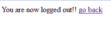

# Spring Security 登录表单示例

> 原文： [https://howtodoinjava.com/spring-security/login-form-b​​ased-spring-3-security-example/](https://howtodoinjava.com/spring-security/login-form-based-spring-3-security-example/)

学习使用 [spring 安全性教程](https://howtodoinjava.com/spring-security-tutorial/)中讨论的详细信息，将 **Spring 安全性登录表单**添加到任何 Spring Web 应用程序。

> 阅读更多： [Spring Security 5 登录表单示例[为 Spring 5 更新]](https://howtodoinjava.com/spring5/security5/login-form-example/)

## 1\. 背景资料

我们学会了在链接的帖子中集成 [**Spring 3 和休眠**](//howtodoinjava.com/spring/spring-orm/spring-3-and-hibernate-integration-tutorial-with-example/ "spring 3 hibernate integration") 之间。 该应用程序是简单的 Web 应用程序，它提供了一个视图，用户可以在其中添加/编辑员工。

使该应用程序安全。 本教程的**范围是：**

*   只有授权用户才能访问编辑员工屏幕。
*   未经授权的用户应显示登录屏幕。
*   成功的凭据应转发到编辑员工屏幕。
*   不成功的凭据应转发到拒绝访问屏幕。
*   应该有一个注销应用程序的链接。

## 2\. Spring 安全 Maven 依赖项

让我们从第一步开始，即更新项目依赖项。 由于以下原因，它将在演示中添加以下`four sub-modules`：

1.  `spring-security-core`：它包含核心身份验证以及访问控制类和接口。
2.  `spring-security-web`：包含过滤器和相关的 Web 安全基础结构代码。 它还启用了基于 URL 的安全性，我们将在此演示中使用它。
3.  `spring-security-config`：它包含安全名称空间解析代码。 如果您使用 Spring Security XML 文件进行配置，则需要它。
4.  `spring-security-taglibs`：它为访问安全信息和在 JSP 中应用安全约束提供基本支持。

`pom.xml`

```java
<properties>
    <org.springframework.version>3.0.5.RELEASE</org.springframework.version>
</properties>

<!-- Spring Security -->
<dependency>
	<groupid>org.springframework.security</groupid>
	<artifactid>spring-security-core</artifactid>
	<version>${org.springframework.version}</version>
	<type>jar</type>
	<scope>compile</scope>
</dependency>
<dependency>
	<groupid>org.springframework.security</groupid>
	<artifactid>spring-security-web</artifactid>
	<version>${org.springframework.version}</version>
	<type>jar</type>
	<scope>compile</scope>
</dependency>
<dependency>
	<groupid>org.springframework.security</groupid>
	<artifactid>spring-security-config</artifactid>
	<version>${org.springframework.version}</version>
	<type>jar</type>
	<scope>compile</scope>
</dependency>
<dependency>
	<groupid>org.springframework.security</groupid>
	<artifactid>spring-security-taglibs</artifactid>
	<version>${org.springframework.version}</version>
	<type>jar</type>
	<scope>compile</scope>
</dependency>

```

现在使用“ `mvn compile`”命令更新项目中的依赖项。

## 3\. 在 web.xml 中配置 DelegatingFilterProxy

Spring Security 的 Web 基础结构完全基于标准 Servlet 过滤器。 这些过滤器在`web.xml`文件中定义，否则 servlet 容器将忽略它们。

在 Spring Security 中，过滤器类也是在应用程序上下文中定义的 Spring Bean，因此能够利用 Spring 丰富的依赖注入机制和生命周期接口。 Spring 的 [`DelegatingFilterProxy`](http://static.springsource.org/spring/docs/2.0.8/api/org/springframework/web/filter/DelegatingFilterProxy.html "DelegatingFilterProxy docs") 提供了`web.xml`和应用上下文之间的链接。

`web.xml`

```java
<filter>
	<filter-name>springSecurityFilterChain</filter-name>
	<filter-class>org.springframework.web.filter.DelegatingFilterProxy</filter-class>
</filter>

<filter-mapping>
	<filter-name>springSecurityFilterChain</filter-name>
	<url-pattern>/*</url-pattern>
</filter-mapping>

```

如果您没有使用任何明确的过滤器定义，并且希望 spring 为您配置基本的基础架构，则如上例所示，将过滤器名称用作“ `springSecurityFilterChain`”。 请注意，您不应自己使用此 bean 名称。 将其添加到`web.xml`后，就可以开始编辑 spring 安全配置文件了。 Web 安全服务是使用元素配置的。

同样不要忘记将安全配置文件放在上下文配置位置设置中。

`web.xml`

```java
<context-param>
    <param-name>contextConfigLocation</param-name>
    <param-value>
    	/WEB-INF/employee-servlet.xml
    	/WEB-INF/application-security.xml
    </param-value>
</context-param>

```

完整的`web.xml`文件如下所示：

`web.xml`

```java
<?xml version="1.0" encoding="UTF-8"?>

<web-app xmlns:xsi="http://www.w3.org/2001/XMLSchema-instance"
    xmlns="http://java.sun.com/xml/ns/javaee"
    xmlns:web="http://java.sun.com/xml/ns/javaee/web-app_2_5.xsd"
    xsi:schemaLocation="http://java.sun.com/xml/ns/javaee http://java.sun.com/xml/ns/javaee/web-app_2_5.xsd"
    id="WebApp_ID" version="2.5">

  <display-name>Archetype Created Web Application</display-name>
  	<welcome-file-list>
  		<welcome-file>/WEB-INF/index.jsp</welcome-file>
  	</welcome-file-list>

  	<filter>
		<filter-name>springSecurityFilterChain</filter-name>
		<filter-class>org.springframework.web.filter.DelegatingFilterProxy</filter-class>
	</filter>

	<filter-mapping>
		<filter-name>springSecurityFilterChain</filter-name>
		<url-pattern>/*</url-pattern>
	</filter-mapping>
    <servlet>
        <servlet-name>employee</servlet-name>
        <servlet-class>
            org.springframework.web.servlet.DispatcherServlet
        </servlet-class>
        <load-on-startup>1</load-on-startup>
    </servlet>
    <servlet-mapping>
        <servlet-name>employee</servlet-name>
        <url-pattern>/</url-pattern>
    </servlet-mapping>
    <context-param>
	    <param-name>contextConfigLocation</param-name>
	    <param-value>
	    	/WEB-INF/employee-servlet.xml
	    	/WEB-INF/application-security.xml
	    </param-value>
	</context-param>
    <listener>
	    <listener-class>org.springframework.web.context.ContextLoaderListener</listener-class>
	</listener>
</web-app>

```

## 4\. 配置登录注销安全性

正如我们在上一节中了解到的那样，将过滤器名称用作`springSecurityFilterChain`可以帮助您使用 element 配置基本基础结构。 让我们先看看它是如何配置的？ 我已经为这个演示编写了一个基本配置：

`application-security.xml`

```java
<?xml version="1.0" encoding="UTF-8"?>
<beans:beans xmlns="http://www.springframework.org/schema/security"
	xmlns:beans="http://www.springframework.org/schema/beans" 
	xmlns:xsi="http://www.w3.org/2001/XMLSchema-instance"
	xsi:schemaLocation="http://www.springframework.org/schema/beans
	http://www.springframework.org/schema/beans/spring-beans-3.0.xsd
	http://www.springframework.org/schema/security
	http://www.springframework.org/schema/security/spring-security-3.0.3.xsd">

	<http auto-config="true"  use-expressions="true">
		<intercept-url pattern="/login" access="permitAll" />
		<intercept-url pattern="/logout" access="permitAll" />
		<intercept-url pattern="/accessdenied" access="permitAll" />
		<intercept-url pattern="/**" access="hasRole('ROLE_USER')" />
		<form-login login-page="/login" default-target-url="/list" authentication-failure-url="/accessdenied" />
		<logout logout-success-url="/logout" />
	</http>

	<authentication-manager alias="authenticationManager">
		<authentication-provider>
			<user-service>
				<user name="lokesh" password="password" authorities="ROLE_USER" />
			</user-service>
		</authentication-provider>
	</authentication-manager>

</beans:beans>

```

让我们看看这个配置的实际含义。

*   `http`：包括与配置相关的网址级别安全性。 此元素是所有与 Web 相关的名称空间功能的父级。
*   `auto-config`：包括一些基本服务。 它是

    ```java
    &lt;http&gt;
        &lt;form-login /&gt;
        &lt;http-basic /&gt;
        &lt;logout /&gt;
    &lt;/http&gt;

    ```

    的简写
*   `use-expressions`：这里使用表达式来保护单个 URL。 这些表达式可以是例如 `hasRole([role])`，`hasAnyRole([role1,role2])`，`permitAll`，`denyAll`等。
*   `intercept-url`：这将匹配请求中请求的网址格式，并根据访问值决定要采取的操作。
*   `form-login`: This will come into picture when user will try to access any secured URL. A login page mapped to “login-page” attribute will be served for authentication check. It is spring security login-processing-url.

    如果未提供，spring 将为用户提供内置的登录页面。 如果登录成功或由于无效的用户/密码匹配而导致登录失败，它也包含默认目标的属性。

*   `logout`：如果在应用程序中调用注销，这将有助于查找下一个视图。

我正在使用基于 XML 的用户服务，即我不会去数据库进行密码验证，而是将用户名/密码组合存储在配置文件本身中。 要使用此设置王，请使用内置的内置用户详细信息服务来设置`authentication-manager`。 在更实时的应用程序中，这将是一些从远程数据库中获取数据的用户服务。

## 5\. 弹簧控制器

我将重用控制器，并将在控制器中添加其他映射和处理程序方法。 这些其他 URL 是`/login`，`/logout`和`/accessdenied`。 具有所有方法处理程序的更新后的控制器如下所示：

`EditEmployeeController.java`

```java
package com.howtodoinjava.controller;

import org.springframework.beans.factory.annotation.Autowired;
import org.springframework.stereotype.Controller;
import org.springframework.ui.ModelMap;
import org.springframework.validation.BindingResult;
import org.springframework.web.bind.annotation.ModelAttribute;
import org.springframework.web.bind.annotation.PathVariable;
import org.springframework.web.bind.annotation.RequestMapping;
import org.springframework.web.bind.annotation.RequestMethod;

import com.howtodoinjava.entity.EmployeeEntity;
import com.howtodoinjava.service.EmployeeManager;

@Controller
public class EditEmployeeController {

	@Autowired
	private EmployeeManager employeeManager;

	public void setEmployeeManager(EmployeeManager employeeManager) {
		this.employeeManager = employeeManager;
	}

	@RequestMapping(value = "/login", method = RequestMethod.GET)
	public String login(ModelMap model) {
		return "login";
	}

	@RequestMapping(value = "/accessdenied", method = RequestMethod.GET)
	public String loginerror(ModelMap model) {
		model.addAttribute("error", "true");
		return "denied";
	}

	@RequestMapping(value = "/logout", method = RequestMethod.GET)
	public String logout(ModelMap model) {
		return "logout";
	}

	@RequestMapping(value = "/", method = RequestMethod.GET)
	public String defaultPage(ModelMap map) {
		return "redirect:/list";
	}

	@RequestMapping(value = "/list", method = RequestMethod.GET)
	public String listEmployees(ModelMap map) {

		map.addAttribute("employee", new EmployeeEntity());
		map.addAttribute("employeeList", employeeManager.getAllEmployees());

		return "editEmployeeList";
	}

	@RequestMapping(value = "/add", method = RequestMethod.POST)
	public String addEmployee(
			@ModelAttribute(value = "employee") EmployeeEntity employee,
			BindingResult result) {
		employeeManager.addEmployee(employee);
		return "redirect:/list";
	}

	@RequestMapping("/delete/{employeeId}")
	public String deleteEmplyee(@PathVariable("employeeId") Integer employeeId) {
		employeeManager.deleteEmployee(employeeId);
		return "redirect:/list";
	}
}

```

## 6\. 春天的景色

现在，我们已经使用安全配置和控制器处理程序配置了我们的应用程序。 是时候编写本质上是 JSP 文件的视图了。 jsp 文件中最重要的附加内容是 login.jsp 文件。

该文件的格式包含用户名和密码字段的文本框。 让我们看看它是怎么写的：

#### 6.1. login.jsp

`login.jsp`

```java
<%@ taglib uri="http://java.sun.com/jsp/jstl/core" prefix="c" %>
<%@ taglib uri="http://www.springframework.org/tags/form" prefix="form" %>
<%@ taglib uri="http://www.springframework.org/tags" prefix="spring" %>

<html>
	<body>
		<h1 id="banner">Login to Security Demo</h1>  
		<form name="f" action="<c:url value='j_spring_security_check'/>"
					method="POST">
			<table>
				<tr>
					<td>Username:</td>
					<td><input type='text' name='j_username' /></td>
				</tr>
				<tr>
					<td>Password:</td>
					<td><input type='password' name='j_password'></td>
				</tr>
				<tr>
					<td colspan="2">&nbsp;</td>
				</tr>
				<tr>
					<td colspan='2'><input name="submit" type="submit">&nbsp;<input name="reset" type="reset"></td>
				</tr>
			</table>
		</form>
	</body>
</html>

```

默认情况下，spring auto 会自动生成并配置一个 [`UsernamePasswordAuthenticationFilter`](http://static.springsource.org/spring-security/site/docs/3.0.x/apidocs/org/springframework/security/web/authentication/UsernamePasswordAuthenticationFilter.html "UsernamePasswordAuthenticationFilter docs") bean。 默认情况下，此过滤器在处理 Web 表单中的登录 POST 时响应 URL `/j_spring_security_check`。 用户名字段使用“ `j_username`”，密码字段使用“ `j_password`”。

提交此表单时，`UsernamePasswordAuthenticationFilter`将匹配`application-security.xml`中身份验证提供程序设置中配置的用户名和密码。

#### 6.2. logout.jsp

`logout.jsp`

```java
< % session.invalidate(); %>
You are now logged out!!

<a href="//howtodoinjava.com/spring/spring-security/login-form-based-spring-3-security-example/">go back</a>

```

该视图仅使会话无效，并提供一个链接以返回登录页面。

#### 6.3. 被拒绝

当用户尝试使用无效的用户名和密码组合进行身份验证时，此 jsp 文件将出现在用户屏幕中。 它将在类路径中显示`message.properties`中配置的相应消息。

`denied.jsp`

```java
<%@ taglib uri="http://java.sun.com/jsp/jstl/core" prefix="c"%>
<html>
	<body>

		<h1 id="banner">Unauthorized Access !!</h1>

		<hr />

		<c:if test="${not empty error}">
			<div style="color:red">
				Your fake login attempt was bursted, dare again !!<br /> 
				Caused : ${sessionScope["SPRING_SECURITY_LAST_EXCEPTION"].message}
			</div>
		</c:if>

		<p class="message">Access denied!</p>
		<a href="//howtodoinjava.com/spring/spring-security/login-form-based-spring-3-security-example/">Go back to login page</a> 
	</body>
</html>

```

## 7\. Spring 安全性登录表单演示

是时候测试应用程序了。 只需将应用程序部署在任何服务器中，例如 就我而言，我正在使用 Tomcat 7.0. 现在，执行以下步骤：

**7.1。 在浏览器`http://localhost:8080/Spring3HibernateIntegration`中输入 URL**

除了/ login，/ logout 和/ accessdeni 之外，它将显示登录屏幕，所有其他 URL 都是受保护的 URL。


Default login screen

**7.2。 尝试使用用户名“ demo”和密码“ 1234”进行身份验证**


Unauthorized access for invalid username and password

由于用户名和密码无效，它将给出拒绝访问错误。

**7.3。 尝试使用用户名“ lokesh”和密码“ password”** 进行身份验证


Edit employee screen on successful authentication

因为用户名和密码正确，它将显示员工管理屏幕。

**7.4。 单击注销链接**



Logout message

用户将被注销，并出现登录屏幕。

我希望这个 **spring mvc 登录示例**能够对使用 xml 配置的基本 spring 安全机制有所启发。 如果您对此 **Spring 安全性登录表单示例**有任何疑问，请给我评论。

[**Download sourcecode**](https://docs.google.com/file/d/0B7yo2HclmjI4NkU5T3NiQzdzc2s/edit?usp=sharing "spring security demo code")

学习愉快！