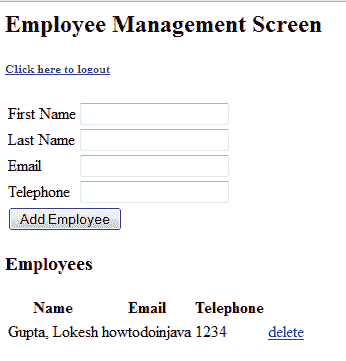
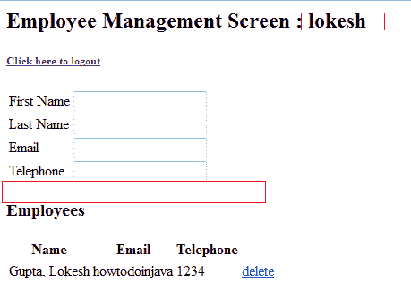

# 使用 JSP Taglibs 的 Spring 视图层安全

> 原文： [https://howtodoinjava.com/spring-security/spring-security-at-view-layer-using-jsp-taglibs/](https://howtodoinjava.com/spring-security/spring-security-at-view-layer-using-jsp-taglibs/)

到目前为止，在先前的教程中，我们已经了解了如何在[登录表单](https://howtodoinjava.com/spring/spring-security/login-form-based-spring-3-security-example/)，[自定义用户详细信息服务](https://howtodoinjava.com/spring/spring-security/custom-userdetailsservice-example-for-spring-3-security/)甚至[方法级安全性](https://howtodoinjava.com/spring/spring-security/spring-3-method-level-security-example-using-preauthorize-and-secured/)之后保护您的应用程序的安全。 所有这些安全性实现都在 MVC 的控制器或模型层上。 是时候在视图层中添加安全性了。 当我们要根据用户的角色隐藏某些链接或按钮以使他将无法访问该功能时，通常需要使用该功能。

## **Taglib 声明**

为了确保以后查看应用程序的安全，spring Security 拥有自己的 taglib，它为访问安全信息和在 JSP 中应用安全约束提供了基本支持。 要在 jsp 文件中使用安全功能，需要添加以下标记库声明：

```java
<%@ taglib uri="http://www.springframework.org/security/tags" prefix="security" %>
```

您可以选择自己的前缀，并且需要在 jsp 文件中使用该前缀。

## **安全标签**

Spring 基本上提供了 3 个标签来保护视图层信息，即

*   授权标签
*   验证标签
*   `accesscontrollist`标签

让我们一一看。

**1）授权标签：**

该标签用于确定是否应评估其内容。 此标记具有两种形式，即根据用户角色保护信息或根据用户访问特定 URL 的权限保护信息。

用法示例如下所示：

```java
<security:authorize ifAnyGranted="ROLE_ADMIN">
    <tr>
        <td colspan="2">
            <input type="submit" value="<spring:message code="label.add"/>"/>
        </td>
    </tr>
</security:authorize>

OR

<security:authorize url="/admin">
    <tr>
        <td colspan="2">
            <input type="submit" value="<spring:message code="label.add"/>"/>
        </td>
    </tr>
</security:authorize>

```

**2）验证标签**

此标记允许访问存储在安全上下文中的当前身份验证对象。 它直接在 JSP 中呈现对象的属性。 因此，例如，如果`Authentication`的主体属性是 Spring Security 的`UserDetails`对象的实例，则使用 `<sec:authentication property="principal.username"></sec:authentication>`将呈现当前用户的名称。

此标记不是直接出于安全目的，而是可用于访问可用于视图层安全性的信息。

```java
<security:authentication property="principal.username" />
```

**3）`accesscontrollist`标记**

该标签仅在与 Spring Security 的 ACL 模块一起使用时才有效。 它检查以逗号分隔的指定域对象的所需权限列表。 如果当前用户具有这些权限中的任何一个，则将评估标签正文。 如果他们不这样做，它将被跳过。

```java
<sec:accesscontrollist hasPermission="1,2" domainObject="someObject">
	This will be shown if the user has either of the permissions
	represented by the values "1" or "2" on the given object.
</sec:accesscontrollist>

```

来源：[http://static.springsource.org/spring-security/site/docs/3.0.x/reference/taglibs.html](http://static.springsource.org/spring-security/site/docs/3.0.x/reference/taglibs.html)

## **应用程序**中的使用示例

我们已经在 [**Spring Security 登录表单教程**](https://howtodoinjava.com/spring/spring-security/login-form-based-spring-3-security-example/)的基础上开发了一个员工管理应用程序。 在此应用程序中，经过身份验证的用户可以添加/删除/列出员工。 现在，让我们修改应用程序，以便任何没有`ROLE_ADMIN`权限的用户都看不到“添加”按钮。

以下是我在应用程序中所做的代码更改：

```java
< %@ taglib uri="http://www.springframework.org/tags" prefix="spring" %>
< %@ taglib uri="http://www.springframework.org/tags/form" prefix="form" %>
< %@ taglib uri="http://java.sun.com/jsp/jstl/core" prefix="c" %>
< %@ taglib uri="http://www.springframework.org/security/tags" prefix="security" %>
<html>
<head>
    <title>Spring 3 hibernate integration example on www.howtodoinjava.com</title>
</head>
<body>

<h2>Employee Management Screen : <security:authentication property="principal.username"></security:authentication></h2>
 <h6><a href="<c:url value='j_spring_security_logout'></a>">Click here to logout</h6>
<form:form method="post" action="add" commandName="employee">

    <table>
    <tr>
        <td><form:label path="firstname"><spring:message code="label.firstname"></spring:message></form:label></td>
        <td><form:input path="firstname"></form:input></td>
    </tr>
    <tr>
        <td><form:label path="lastname"><spring:message code="label.lastname"></spring:message></form:label></td>
        <td><form:input path="lastname"></form:input></td>
    </tr>
    <tr>
        <td><form:label path="email"><spring:message code="label.email"></spring:message></form:label></td>
        <td><form:input path="email"></form:input></td>
    </tr>
    <tr>
        <td><form:label path="telephone"><spring:message code="label.telephone"></spring:message></form:label></td>
        <td><form:input path="telephone"></form:input></td>
    </tr>
    <security:authorize ifAnyGranted="ROLE_ADMIN">
    <tr>
        <td colspan="2">
            <input type="submit" value="<spring:message code="label.add"/>"/>
        </td>
    </tr>
    </security:authorize>
</table>
</form:form>

<h3>Employees</h3>
<c:if test="${!empty employeeList}">
<table class="data">
<tr>
    <th>Name</th>
    <th>Email</th>
    <th>Telephone</th>
    <th></th>
</tr>
<c:foreach items="${employeeList}" var="emp">
    <tr>
        <td>${emp.lastname}, ${emp.firstname} </td>
        <td>${emp.email}</td>
        <td>${emp.telephone}</td>
        <td>delete</td>
    </tr>
</c:foreach>
</table>
</c:if>

</body>
</html>

```

以下是上述浏览器屏幕更改的结果。



员工管理界面

应用安全标签后，“添加”按钮将消失，并在屏幕上显示登录的用户名“ lokesh”。


Screen after applying security tags in JSP

让我知道是否仍然不清楚。

**祝您学习愉快！**