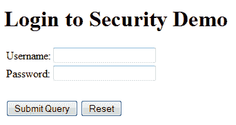
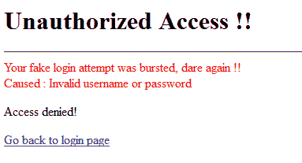

# Spring Security UserDetailsS​​ervice 示例

> 原文： [https://howtodoinjava.com/spring-security/custom-userdetailsservice-example-for-spring-3-security/](https://howtodoinjava.com/spring-security/custom-userdetailsservice-example-for-spring-3-security/)

学习在 Spring 应用程序的`authentication-provider`中自定义`UserDetailsService`实现，以获取自定义`User`对象，以及如何在应用程序中使用它。

## Spring UserDetailsS​​ervice 接口

[`UserDetailsService`](http://static.springsource.org/spring-security/site/docs/3.0.x/apidocs/org/springframework/security/core/userdetails/UserDetailsService.html "UserDetailsService") 界面用于为任何给定用户查找用户名，密码和 [`GrantedAuthorities`](http://static.springsource.org/spring-security/site/docs/3.0.x/apidocs/org/springframework/security/core/GrantedAuthority.html "GrantedAuthority") 。

此接口仅提供实现类需要实现的一种方法-

`UserDetailsService.java`

```java
UserDetails loadUserByUsername(String username) throws UsernameNotFoundException;

```

这里 [`UserDetails`](http://static.springsource.org/spring-security/site/docs/3.0.x/apidocs/org/springframework/security/core/userdetails/UserDetails.html "UserDetails") 是核心用户信息的容器。 根据文档，出于安全目的，Spring Security 不会直接使用其实现。 它们只是存储用户信息，这些信息随后封装到 [`Authentication`](http://static.springsource.org/spring-security/site/docs/3.0.x/apidocs/org/springframework/security/core/Authentication.html "interface in org.springframework.security.core") 对象中。 这允许将与安全无关的用户信息（例如电子邮件地址，电话号码等）存储在方便的位置。 一个非常好的示例实现可以类似于 [`User`](http://static.springsource.org/spring-security/site/docs/3.0.x/apidocs/org/springframework/security/core/userdetails/User.html "User") 类。

> 在此示例中， [`AuthenticationProvider`](http://static.springsource.org/spring-security/site/docs/3.0.x/apidocs/org/springframework/security/authentication/AuthenticationProvider.html "AuthenticationProvider") 只需通过将 [`UsernamePasswordAuthenticationToken`](http://static.springsource.org/spring-security/site/docs/3.0.x/apidocs/org/springframework/security/authentication/UsernamePasswordAuthenticationToken.html "UsernamePasswordAuthenticationToken") 中提交的密码与`UserDetailsService`加载的密码进行比较，即可对用户进行身份验证。

## UserDetailsS​​ervice 实施

#### 1）配置身份验证提供者

我正在提出[基于 Spring 登录表单的安全性](//howtodoinjava.com/spring/spring-security/login-form-based-spring-3-security-example/ "Login form based spring 3 security example")中编写的代码库。 在`application-security.xml`文件中，我将更新配置以将`EmployeeDao`用作自定义用户详细信息服务。

`application-security.xml`

```java
< ?xml version="1.0" encoding="UTF-8"?>
<beans:beans xmlns="http://www.springframework.org/schema/security"
	xmlns:beans="http://www.springframework.org/schema/beans"
	xmlns:xsi="http://www.w3.org/2001/XMLSchema-instance"
	xsi:schemaLocation="http://www.springframework.org/schema/beans
	http://www.springframework.org/schema/beans/spring-beans-3.0.xsd
	http://www.springframework.org/schema/security
	http://www.springframework.org/schema/security/spring-security-3.0.3.xsd">

	<http auto-config="true"  use-expressions="true">
		<intercept-url pattern="/login" access="permitAll"></intercept-url>
		<intercept-url pattern="/logout" access="permitAll"></intercept-url>
		<intercept-url pattern="/accessdenied" access="permitAll"></intercept-url>
		<intercept-url pattern="/**" access="hasRole('ROLE_USER')"></intercept-url>
		<form-login login-page="/login" default-target-url="/list" authentication-failure-url="/accessdenied"></form-login>
		<logout logout-success-url="/logout"></logout>
	</http>

	<authentication-manager alias="authenticationManager">
		<authentication-provider user-service-ref="employeeDAO" />
	</authentication-manager>

</beans:beans>

```

#### 2）配置数据源

另外，完整的`employee-servlet.xml`文件如下所示：

`employee-servlet.xml`

```java
< ?xml  version="1.0" encoding="UTF-8"?>
<beans xmlns="http://www.springframework.org/schema/beans"
    xmlns:xsi="http://www.w3.org/2001/XMLSchema-instance"
    xmlns:aop="http://www.springframework.org/schema/aop"
    xmlns:context="http://www.springframework.org/schema/context"
    xmlns:jee="http://www.springframework.org/schema/jee"
    xmlns:lang="http://www.springframework.org/schema/lang"
    xmlns:p="http://www.springframework.org/schema/p"
    xmlns:tx="http://www.springframework.org/schema/tx"
    xmlns:util="http://www.springframework.org/schema/util"
    xsi:schemaLocation="http://www.springframework.org/schema/beans http://www.springframework.org/schema/beans/spring-beans.xsd
        http://www.springframework.org/schema/aop/ http://www.springframework.org/schema/aop/spring-aop.xsd
        http://www.springframework.org/schema/context/ http://www.springframework.org/schema/context/spring-context.xsd
        http://www.springframework.org/schema/jee/ http://www.springframework.org/schema/jee/spring-jee.xsd
        http://www.springframework.org/schema/lang/ http://www.springframework.org/schema/lang/spring-lang.xsd
        http://www.springframework.org/schema/tx/ http://www.springframework.org/schema/tx/spring-tx.xsd
        http://www.springframework.org/schema/util/ http://www.springframework.org/schema/util/spring-util.xsd">

    <context:annotation-config />
    <context:component-scan base-package="com.howtodoinjava.controller" />

    <bean id="jspViewResolver"
        class="org.springframework.web.servlet.view.InternalResourceViewResolver">
        <property name="viewClass"
            value="org.springframework.web.servlet.view.JstlView"></property>
        <property name="prefix" value="/WEB-INF/view/"></property>
        <property name="suffix" value=".jsp"></property>
    </bean>

    <bean id="messageSource"
        class="org.springframework.context.support.ReloadableResourceBundleMessageSource">
        <property name="basename" value="classpath:messages"></property>
        <property name="defaultEncoding" value="UTF-8"></property>
    </bean>

    <bean id="propertyConfigurer"
        class="org.springframework.beans.factory.config.PropertyPlaceholderConfigurer"
        p:location="/WEB-INF/jdbc.properties"></bean>

    <bean id="dataSource"
        class="org.apache.commons.dbcp.BasicDataSource" destroy-method="close"
        p:driverClassName="${jdbc.driverClassName}"
        p:url="${jdbc.databaseurl}" p:username="${jdbc.username}"
        p:password="${jdbc.password}"></bean>

    <bean id="sessionFactory"
        class="org.springframework.orm.hibernate3.LocalSessionFactoryBean">
        <property name="dataSource" ref="dataSource"></property>
        <property name="configLocation">
            <value>classpath:hibernate.cfg.xml</value>
        </property>
        <property name="configurationClass">
            <value>org.hibernate.cfg.AnnotationConfiguration</value>
        </property>
        <property name="hibernateProperties">
           <value>
            hibernate.connection.provider_class=org.hibernate.connection.C3P0ConnectionProvider
            hibernate.dialect=org.hibernate.dialect.SQLServer2008Dialect
            hibernate.default_schema=dbo
            hibernate.show_sql=true
       		</value>
        </property>
    </bean>

    <bean id="employeeDAO" class="com.howtodoinjava.dao.EmployeeDaoImpl"></bean>
    <bean id="employeeManager" class="com.howtodoinjava.service.EmployeeManagerImpl"></bean>

    <tx:annotation-driven />
    <bean id="transactionManager"
        class="org.springframework.orm.hibernate3.HibernateTransactionManager">
        <property name="sessionFactory" ref="sessionFactory"></property>
    </bean>

</beans>

```

#### 3）在 Dao 中实现 UserDetailsS​​ervice

现在，我们必须更新 EmployeeDaoImpl.java 以实现`UserDetailsService`接口和重写方法`loadUserByUsername()`。

**EmployeeDaoImpl.java**

`EmployeeDaoImpl.java`

```java
package com.howtodoinjava.dao;

import java.util.List;

import org.hibernate.SessionFactory;
import org.springframework.beans.factory.annotation.Autowired;
import org.springframework.dao.DataAccessException;
import org.springframework.security.core.GrantedAuthority;
import org.springframework.security.core.authority.GrantedAuthorityImpl;
import org.springframework.security.core.userdetails.User;
import org.springframework.security.core.userdetails.UserDetails;
import org.springframework.security.core.userdetails.UserDetailsService;
import org.springframework.security.core.userdetails.UsernameNotFoundException;
import org.springframework.stereotype.Repository;

import com.howtodoinjava.entity.EmployeeEntity;

@Repository
public class EmployeeDaoImpl implements EmployeeDAO, UserDetailsService  {

	@Autowired
    private SessionFactory sessionFactory;

	@Override
	public void addEmployee(EmployeeEntity employee) {
		this.sessionFactory.getCurrentSession().save(employee);
	}

	@SuppressWarnings("unchecked")
	@Override
	public List<EmployeeEntity> getAllEmployees() {
		return this.sessionFactory.getCurrentSession().createQuery("from Employee").list();
	}

	@Override
	public void deleteEmployee(Integer employeeId) {
		EmployeeEntity employee = (EmployeeEntity) sessionFactory.getCurrentSession().load(
				EmployeeEntity.class, employeeId);
        if (null != employee) {
        	this.sessionFactory.getCurrentSession().delete(employee);
        }
	}

	@SuppressWarnings("deprecation")
	@Override
	public UserDetails loadUserByUsername(String username)
			throws UsernameNotFoundException, DataAccessException
	{
		System.out.println("Getting access details from employee dao !!");

		// Ideally it should be fetched from database and populated instance of
		// #org.springframework.security.core.userdetails.User should be returned from this method
		UserDetails user = new User(username, "password", true, true, true, true, new GrantedAuthority[]{ new GrantedAuthorityImpl("ROLE_USER") });
		return user;
	}
}

```

在上面的 Dao 中，我使用了最少的代码来演示所涉及的类的用法，并且在企业应用程序中，应该对数据库进行适当的访问，并且应该设置用户的密码及其角色。

整个想法是用方法内部的填充值返回`User`实例。 如果您还有其他要求，那么您也可以自由实现`UserDetails`接口，并且 spring 不会阻止您使用它。

## 演示版

要测试该应用程序，只需在浏览器窗口中单击 URL“ `http://localhost:8080/Spring3HibernateIntegration`”。 一个登录框将如下所示：

[](https://howtodoinjava.files.wordpress.com/2013/04/default-login-screen-spring-security.png)

现在，使用正确的用户名和密码（即`lokesh`和`password`）登录，您可以进入应用程序，并出现员工管理屏幕。 否则，访问被拒绝的页面将显示如下：

[](https://howtodoinjava.files.wordpress.com/2013/04/unauthorized-access-spring-security.png)

[Download Source Code](https://drive.google.com/file/d/0B7yo2HclmjI4MGtCNEJVYnVRMEU/edit?usp=sharing "download link")

学习愉快！