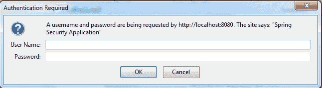
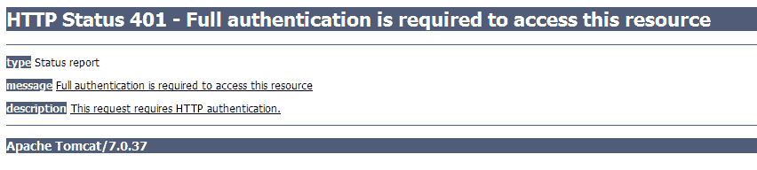

# Spring Security 基本身份验证示例

> 原文： [https://howtodoinjava.com/spring-security/http-basic-authentication-example-using-spring-3/](https://howtodoinjava.com/spring-security/http-basic-authentication-example-using-spring-3/)

[基本身份验证](https://en.wikipedia.org/wiki/Basic_access_authentication)通常用于无状态客户端，该客户端在每个请求上传递其凭据。 通常将其与基于表单的身份验证结合使用，在这种情况下，既可以通过基于浏览器的用户界面也可以通过网络服务来使用应用程序。 但是，基本身份验证以纯文本形式传输密码，因此，仅应在诸如 HTTPS 之类的加密传输层上实际使用该密码。

由于必须随每个 HTTP 请求一起发送基本身份验证标头，因此 Web 浏览器需要在合理的时间内缓存凭据，以避免不断提示用户输入用户名和密码。 缓存策略因浏览器而异。

## Spring Security 中的`BasicAuth`

实现基本 http 身份验证的最简单解决方案是在 Spring Security配置文件中使用“ `http-basic`”标签，如下所示：

```java
<http>
	<intercept-url pattern="/**" access="ROLE_USER" />
	<http-basic />
</http>

```

应用程序中的上述设置将强制用户验证应用程序中的任何网页或任何其他资源。 有趣的是，您无需创建任何登录页面或会话管理机制。 浏览器将在用户代表您之前显示一个登录框。 并且因为每个请求都包含 http 无状态机制中的身份验证信息，所以您也不需要维护会话。

## 基本身份验证演示

#### 在 Spring Security配置中配置`basic-auth`

在基于[ Spring 登录表单的安全示例](//howtodoinjava.com/spring/spring-security/login-form-based-spring-3-security-example/)中创建的员工管理应用程序中，我们手动创建了登录表单并将其配置为各种 URL 模式。

让我们对其进行修改以使用 http 基本身份验证。 我们修改后的`application-security.xml`现在看起来像这样。

`application-security.xml`

```java
< ?xml version="1.0" encoding="UTF-8"?>
xmlns="http://www.springframework.org/schema/security"
	xmlns:beans="http://www.springframework.org/schema/beans"
	xmlns:xsi="http://www.w3.org/2001/XMLSchema-instance"
	xsi:schemaLocation="http://www.springframework.org/schema/beans
	http://www.springframework.org/schema/beans/spring-beans-3.0.xsd
	http://www.springframework.org/schema/security
	http://www.springframework.org/schema/security/spring-security-3.0.3.xsd">

	<http auto-config="true"  use-expressions="true">
		<intercept-url pattern="/login" access="permitAll" />
		<intercept-url pattern="/logout" access="permitAll" />
		<intercept-url pattern="/accessdenied" access="permitAll" />
		<intercept-url pattern="/**" access="hasRole('ROLE_USER')" />
		<logout logout-success-url="/logout" />
		<http-basic />
	</http>

	<authentication-manager alias="authenticationManager">
		<authentication-provider>
			<user-service>
				<user lokesh" password="password" authorities="ROLE_USER" />
			</user-service>
		</authentication-provider>
	</authentication-manager>

```

#### 验证`BasicAuth`

现在，让我们再次构建应用程序，然后在应用程序服务器中运行它。

**1）在浏览器**中点击网址`http://localhost:8080/Spring3HibernateIntegration`

出现登录窗口。 请注意，这是浏览器生成的登录框，应用程序仅向浏览器提供了相关的标头。

[](https://howtodoinjava.files.wordpress.com/2013/04/http-basic-authenication.png)

HTTP 基本认证窗口

**2）输入错误的用户名和密码**

这将使浏览器再次显示清除的登录框，或者在某些情况下将显示错误页面。

[](https://howtodoinjava.files.wordpress.com/2013/04/http-basic-authetication-error.png)

HTTP 基本认证中的登录错误

**3）输入正确的用户名和密码**

正确的用户名和密码：“`lokesh`”和“`password`”。 当您输入上述凭证时，员工管理屏幕将出现在浏览器屏幕中。

[](https://howtodoinjava.files.wordpress.com/2013/04/employee-management-screen.png)

员工管理界面

如果您在运行上述配置时发现任何问题，请告诉我。

学习愉快！