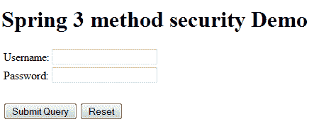
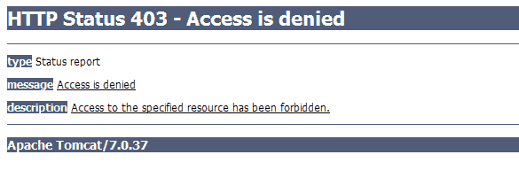

# 使用`@PreAuthorize`和`@Secured`的 Spring 方法安全性

> 原文： [https://howtodoinjava.com/spring-security/spring-3-method-level-security-example-using-preauthorize-and-secured/](https://howtodoinjava.com/spring-security/spring-3-method-level-security-example-using-preauthorize-and-secured/)

Spring 框架使保护您的应用程序变得非常容易，您只需要正确地使用一些基本配置即可！ 此安全性可以应用于 Web 应用程序中的多个级别。 Spring 对这些级别的基本支持：

*   网址级别的安全性
*   方法级别的安全性
*   实体或对象级别的安全性

在此 Spring Security 教程中，学习使用诸如`@PreAuthorize`和`@Secured`之类的注解来应用方法安全性。

## 启用`@Secured`和`@PreAuthorize`

方法级别安全性的核心是配置元素`< global-method-security / >`。 这需要在 spring 的配置文件中定义。 此元素用于在应用程序中启用基于注解的安全性（通过在元素上设置适当的属性）。 您只应声明一个`<global-method-security/>`元素。 例如

```java
<global-method-security pre-post-annotations="enabled" />
```

以上配置将在代码中启用 [`@PreAuthorize`](http://static.springsource.org/spring-security/site/docs/3.0.x/apidocs/org/springframework/security/access/prepost/PreAuthorize.html) 和 [`@PostAuthorize`](http://static.springsource.org/spring-security/site/docs/3.0.x/apidocs/org/springframework/security/access/prepost/PostAuthorize.html) 注解。

//要么

上述配置的另一种变化是：

```java
<global-method-security secured-annotations="enabled" />
```

这将在您的代码中启用 [`@Secured`](http://static.springsource.org/spring-security/site/docs/3.0.x/apidocs/org/springframework/security/access/annotation/Secured.html) 注解。

这些注解采用一个字符串参数，该参数可以是`role-name`或**表达式**，并且取决于您对`<http>`元素的`use-expression`值的配置使用。

如果`use-expression`设置为 true，则应在注解内使用表达式，否则应直接使用角色名称。

如果您需要定义简单的规则，而不是根据用户的权限列表检查角色名称，则基于表达式的注解是一个不错的选择。 您可以在同一应用程序中启用一种以上类型的注解，但应避免在同一接口或类中混合使用多种注解类型，以免造成混淆。

## 测试安全性注解

为了在运行的应用程序中测试以上注解，我使用的是先前教程的代码库，该代码库与 [**基于登录表单的安全性**](//howtodoinjava.com/spring/spring-security/login-form-based-spring-3-security-example/) 相关。

此应用程序已经过 URL 级别安全保护。 现在，我们还将添加对方法级别安全性的支持。

#### 修改`application-security.xml`配置

为了启用对**方法级别安全性**的支持，我将使用`<global-method-security>`标记更新`application-security.xml`文件，如下所示：

`application-security.xml`

```java
<?xml version="1.0" encoding="UTF-8"?>
<beans:beans xmlns="http://www.springframework.org/schema/security"
	xmlns:beans="http://www.springframework.org/schema/beans" 
	xmlns:xsi="http://www.w3.org/2001/XMLSchema-instance"
	xsi:schemaLocation="http://www.springframework.org/schema/beans
	http://www.springframework.org/schema/beans/spring-beans-3.0.xsd
	http://www.springframework.org/schema/security
	http://www.springframework.org/schema/security/spring-security-3.0.3.xsd">

	<global-method-security pre-post-annotations="enabled" />

	<http auto-config="false"  use-expressions="true">
		<intercept-url pattern="/login" access="permitAll" />
		<intercept-url pattern="/logout" access="permitAll" />
		<intercept-url pattern="/accessdenied" access="permitAll" />
		<intercept-url pattern="/**" access="hasRole('ROLE_USER')" />
		<form-login login-page="/login" default-target-url="/list" authentication-failure-url="/accessdenied" />
		<logout logout-success-url="/logout" />
	</http>

	<authentication-manager alias="authenticationManager">
        <authentication-provider>
            <user-service>
                <user name="lokesh" password="password" authorities="ROLE_USER" />
                <user name="admin" password="password" authorities="ROLE_USER,ROLE_ADMIN" />
            </user-service>
        </authentication-provider>
    </authentication-manager>

    <beans:bean id="employeeDAO" class="com.howtodoinjava.dao.EmployeeDaoImpl" />
    <beans:bean id="employeeManager" class="com.howtodoinjava.service.EmployeeManagerImpl" />

</beans:beans>

```

其余所有代码与以前的教程相同。

## 注解方法以确保安全

在本教程中，我希望具有角色 admin 的用户只能将员工添加到员工集合。 像以前一样允许其他操作。 为此，我将在 EmployeeDaoImpl.java 中注解 add 方法，如下所示：

`EmployeeDaoImpl.java`

```java
package com.howtodoinjava.dao;

import java.util.List;

import org.hibernate.SessionFactory;
import org.springframework.beans.factory.annotation.Autowired;
import org.springframework.security.access.prepost.PreAuthorize;
import org.springframework.stereotype.Repository;

import com.howtodoinjava.entity.EmployeeEntity;

@Repository
public class EmployeeDaoImpl implements EmployeeDAO  {

	@Autowired
    private SessionFactory sessionFactory;

	@PreAuthorize("hasRole('ROLE_ADMIN')")
	@Override
	public void addEmployee(EmployeeEntity employee) {
		//System.out.println(((User)SecurityContextHolder.getContext().getAuthentication().getPrincipal()).getAuthorities());
		this.sessionFactory.getCurrentSession().save(employee);
	}

	@SuppressWarnings("unchecked")
	@Override
	public List<EmployeeEntity> getAllEmployees() {
		return this.sessionFactory.getCurrentSession().createQuery("from Employee").list();
	}

	@Override
	public void deleteEmployee(Integer employeeId) {
		EmployeeEntity employee = (EmployeeEntity) sessionFactory.getCurrentSession().load(
				EmployeeEntity.class, employeeId);
        if (null != employee) {
        	this.sessionFactory.getCurrentSession().delete(employee);
        }
	}
}

```

`@PreAuthorize`注解将测试使用的登录帐户是否具有“ `ROLE_ADMIN`”授权。 如果用户没有此权限，将抛出拒​​绝访问的异常。

#### 示例

我们的应用程序已配置完毕，可以部署了。 所以，让我们做吧！

**1）在浏览器窗口**中点击网址“ `http://localhost:8080/Spring3HibernateIntegration/login`”

[](https://howtodoinjava.files.wordpress.com/2013/04/spring-3-security-login-window.png)

Login window

由于所有 URL 均受保护，因此将出现一个登录窗口。

**2）使用用户名“ `lokesh`”和密码“ `password`”登录，然后尝试添加员工**

[](https://howtodoinjava.files.wordpress.com/2013/04/access-denied.png)

Access denied message

由于 lokesh 没有管理员权限，将引发拒绝访问的异常。

**3）使用用户名“ `admin`”和密码“ `password`”登录，然后尝试添加员工**

[](https://howtodoinjava.files.wordpress.com/2013/04/employee-management-screen.png)

Employee management screen

管理员可以添加员工，因为已为其分配了“ `ROLE_ADMIN`”。

如果您在运行该应用程序时遇到任何问题，请告诉我。

学习愉快！

[Download sourcecode](https://docs.google.com/file/d/0B7yo2HclmjI4czRJWWRucFBtdkU/edit?usp=sharing)