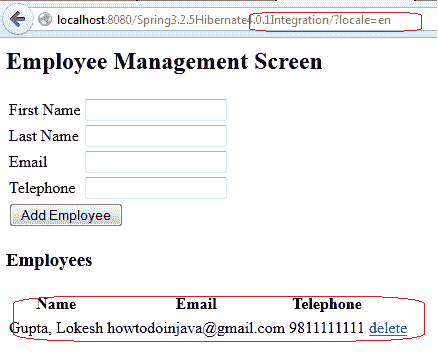
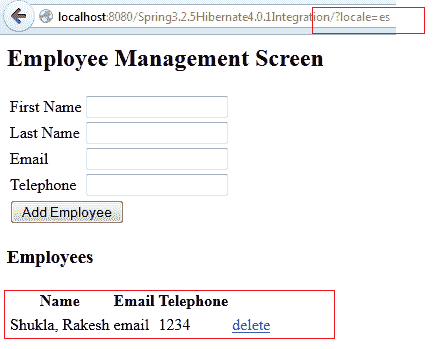

# Spring 3.2.5 AbstractRoutingDataSource 示例

> 原文： [https://howtodoinjava.com/spring-orm/spring-3-2-5-abstractroutingdatasource-example/](https://howtodoinjava.com/spring-orm/spring-3-2-5-abstractroutingdatasource-example/)

[`AbstractRoutingDataSource`](https://docs.spring.io/spring/docs/3.2.5.RELEASE/javadoc-api/org/springframework/jdbc/datasource/lookup/AbstractRoutingDataSource.html) 是 [**Spring 框架**](//howtodoinjava.com) 中非常有用的功能，如果您确实设计**允许基于某些条件的多个数据库， 可能会针对每个用户请求**更改。 一个例子可以是数据库的使用。 当用户属于某个语言环境时，可以使用特定的数据库；如果用户属于另一个语言环境，则可以切换到另一个语言环境。

根据定义，`AbstractRoutingDataSource`是一种抽象数据源实现，它基于查找键将`getConnection()`调用路由到各种目标 DataSource 之一。 后者通常（但不是必须）通过某些线程绑定的事务上下文来确定。

在这篇文章中，我将提供此功能的示例。 我正在为**使用路由数据源，根据用户的语言环境**为用户选择适当的数据源。 在此示例中，我仅配置了两个语言环境“ en”和“ es”。 您可以配置任意多个。 此外，语言环境不仅是更改数据源的唯一标准。 如果您有其他要求，请随时添加自己的逻辑。

还请注意，我使用的是开发的源代码，例如[在 Hibernate 4 和 Spring 3.2.5 之间集成](//howtodoinjava.com/spring/spring-orm/spring-3-2-5-release-and-hibernate-4-integration-example-tutorial/)。

[Download source code](https://drive.google.com/file/d/0B7yo2HclmjI4cVhBdElUTXBIYjA/edit?usp=sharing)

## **生成示例应用程序**

**步骤 1）扩展 AbstractRoutingDataSource 类**

这是必需的，因为在这里您将决定要使用的数据源。

```java
package com.howtodoinjava.controller;

import org.springframework.context.i18n.LocaleContextHolder;
import org.springframework.jdbc.datasource.lookup.AbstractRoutingDataSource;

public class MyRoutingDataSource extends AbstractRoutingDataSource{
	@Override
	protected Object determineCurrentLookupKey() {
		String language = LocaleContextHolder.getLocale().getLanguage();
		System.out.println("Language obtained: "+ language);
		return language;
	}
}

```

**步骤 2）在 jdbc.properties 中配置两个数据源**

这不是必需的，在您的实现中可能不是必需的。

```java
jdbc.databaseurlOne=jdbc:mysql://127.0.0.1:3306/test
jdbc.databaseurlTwo=jdbc:mysql://127.0.0.1:3306/testTwo

```

**步骤 3）在 spring config 文件**中配置多种类型的数据源

首先配置各种数据源，而不必担心如何访问它们。

```java
<bean id="abstractDataSource" class="org.apache.commons.dbcp.BasicDataSource" 
	destroy-method="close"
	p:driverClassName="${jdbc.driverClassName}"
	p:username="${jdbc.username}"
	p:password="${jdbc.password}" />

<bean id="concreteDataSourceOne"
	parent="abstractDataSource"
	p:url="${jdbc.databaseurlOne}"/>

 <bean id="concreteDataSourceTwo"
	parent="abstractDataSource"
	p:url="${jdbc.databaseurlTwo}"/>

```

**步骤 4）设置数据源**的路由

在这里，您实际上将在上述步骤中为所有配置的数据源定义键值对`targetDataSources`。 该值将是数据源 bean 名称，而键将是来自`MyRoutingDataSource`中的`defineCurrentLookupKey()`方法的结果。

如果对于任何用户请求都找不到任何内容，那么您还可以提及默认数据源。 如果将是默认值，并防止出现异常。

```java
<bean id="dataSource" class="com.howtodoinjava.controller.MyRoutingDataSource">
   <property name="targetDataSources">
	  <map key-type="java.lang.String">
		 <entry key="en" value-ref="concreteDataSourceOne"/>
		 <entry key="es" value-ref="concreteDataSourceTwo"/>
	  </map>
   </property>
   <!-- <property name="defaultTargetDataSource" ref="concreteDataSourceOne"/> -->
</bean>

```

**步骤 5）现在使用数据源**

这简单。 对？

```java
<bean id="sessionFactory"
	class="org.springframework.orm.hibernate4.LocalSessionFactoryBean">
	<property name="dataSource" ref="dataSource" /> <!-- HERE -->
	<property name="configLocation">
		<value>classpath:hibernate.cfg.xml</value>
	</property>
	<property name="hibernateProperties">
		<props>
			<prop key="hibernate.dialect">${jdbc.dialect}</prop>
			<prop key="hibernate.show_sql">true</prop>
		</props>
	</property>
</bean>

```

完成所有更改后，您的 spring 配置将如下所示：

```java
<?xml  version="1.0" encoding="UTF-8"?>
<beans xmlns="http://www.springframework.org/schema/beans"
    xmlns:xsi="http://www.w3.org/2001/XMLSchema-instance"
    xmlns:aop="http://www.springframework.org/schema/aop"
    xmlns:context="http://www.springframework.org/schema/context"
    xmlns:jee="http://www.springframework.org/schema/jee"
    xmlns:lang="http://www.springframework.org/schema/lang"
    xmlns:mvc="http://www.springframework.org/schema/mvc"
    xmlns:p="http://www.springframework.org/schema/p"
    xmlns:tx="http://www.springframework.org/schema/tx"
    xmlns:util="http://www.springframework.org/schema/util"
    xsi:schemaLocation="http://www.springframework.org/schema/beans http://www.springframework.org/schema/beans/spring-beans.xsd
        http://www.springframework.org/schema/aop http://www.springframework.org/schema/aop/spring-aop.xsd
        http://www.springframework.org/schema/context http://www.springframework.org/schema/context/spring-context.xsd
        http://www.springframework.org/schema/jee http://www.springframework.org/schema/jee/spring-jee.xsd
        http://www.springframework.org/schema/lang http://www.springframework.org/schema/lang/spring-lang.xsd
        http://www.springframework.org/schema/tx http://www.springframework.org/schema/tx/spring-tx.xsd
        http://www.springframework.org/schema/mvc http://www.springframework.org/schema/mvc/spring-mvc-3.1.xsd
        http://www.springframework.org/schema/util http://www.springframework.org/schema/util/spring-util.xsd">

    <context:annotation-config />
    <context:component-scan base-package="com.howtodoinjava.controller" />

    <bean id="jspViewResolver"
        class="org.springframework.web.servlet.view.InternalResourceViewResolver">
        <property name="viewClass"
            value="org.springframework.web.servlet.view.JstlView" />
        <property name="prefix" value="/WEB-INF/view/" />
        <property name="suffix" value=".jsp" />
    </bean>

    <bean id="propertyConfigurer"
        class="org.springframework.beans.factory.config.PropertyPlaceholderConfigurer"
        p:location="/WEB-INF/jdbc.properties" />

    <!-- Step 3 -->

	 <bean id="abstractDataSource" class="org.apache.commons.dbcp.BasicDataSource" 
        destroy-method="close"
        p:driverClassName="${jdbc.driverClassName}"
        p:username="${jdbc.username}"
        p:password="${jdbc.password}" />

    <bean id="concreteDataSourceOne"
       	parent="abstractDataSource"
        p:url="${jdbc.databaseurlOne}"/>

     <bean id="concreteDataSourceTwo"
       	parent="abstractDataSource"
        p:url="${jdbc.databaseurlTwo}"/>

      <!-- Step 4 -->

     <bean id="dataSource" class="com.howtodoinjava.controller.MyRoutingDataSource">
	   <property name="targetDataSources">
	      <map key-type="java.lang.String">
	         <entry key="en" value-ref="concreteDataSourceOne"/>
	         <entry key="es" value-ref="concreteDataSourceTwo"/>
	      </map>
	   </property>
	   <!-- <property name="defaultTargetDataSource" ref="concreteDataSourceOne"/> -->
	</bean>

     <bean id="messageSource" class="org.springframework.context.support.ResourceBundleMessageSource"
	      p:basenames="messages" />

	<!-- Declare the Interceptor -->
	<mvc:interceptors>    
	    <bean class="org.springframework.web.servlet.i18n.LocaleChangeInterceptor"
	          p:paramName="locale" />
	</mvc:interceptors>

	<!-- Declare the Resolver -->
	<bean id="localeResolver" class="org.springframework.web.servlet.i18n.SessionLocaleResolver" />

    <bean id="sessionFactory"
        class="org.springframework.orm.hibernate4.LocalSessionFactoryBean">
        <property name="dataSource" ref="dataSource" />
        <property name="configLocation">
            <value>classpath:hibernate.cfg.xml</value>
        </property>
        <property name="hibernateProperties">
            <props>
                <prop key="hibernate.dialect">${jdbc.dialect}</prop>
                <prop key="hibernate.show_sql">true</prop>
            </props>
        </property>
    </bean>

    <bean id="employeeDAO" class="com.howtodoinjava.dao.EmployeeDaoImpl"></bean>
    <bean id="employeeManager" class="com.howtodoinjava.service.EmployeeManagerImpl"></bean>

    <tx:annotation-driven transaction-manager="transactionManager"/>
    <bean id="transactionManager"
        class="org.springframework.orm.hibernate4.HibernateTransactionManager">
        <property name="sessionFactory" ref="sessionFactory" />
    </bean>

</beans>

```

## **测试应用程序**

在测试应用程序之前，我已经在其中创建了两个数据库模式和两个相似的表。 除了其中的数据外，这两个表完全相同。 我有意让它保持不变，以证明两个不同的请求实际上正在访问不同的数据库。

```java
delimiter $$

CREATE DATABASE 'test' /*!40100 DEFAULT CHARACTER SET latin1 */$$

USE test$$

CREATE TABLE 'employee' (
  'ID' int(11) NOT NULL AUTO_INCREMENT,
  'FIRSTNAME' varchar(30) DEFAULT NULL,
  'LASTNAME' varchar(30) DEFAULT NULL,
  'TELEPHONE' varchar(15) DEFAULT NULL,
  'EMAIL' varchar(30) DEFAULT NULL,
  'CREATED' timestamp NOT NULL DEFAULT CURRENT_TIMESTAMP,
  PRIMARY KEY ('ID')
) ENGINE=InnoDB AUTO_INCREMENT=5 DEFAULT CHARSET=latin1$$

INSERT INTO 'test'.'employee' ('ID','FIRSTNAME','LASTNAME','TELEPHONE','EMAIL','CREATED') 
VALUES (4,'Lokesh','Gupta','9811111111','howtodoinjava@gmail.com',CURRENT_TIMESTAMP);

CREATE DATABASE 'testtwo' /*!40100 DEFAULT CHARACTER SET latin1 */$$

USE testtwo$$

CREATE TABLE 'employee' (
  'ID' int(11) NOT NULL AUTO_INCREMENT,
  'FIRSTNAME' varchar(30) DEFAULT NULL,
  'LASTNAME' varchar(30) DEFAULT NULL,
  'TELEPHONE' varchar(15) DEFAULT NULL,
  'EMAIL' varchar(30) DEFAULT NULL,
  'CREATED' timestamp NOT NULL DEFAULT CURRENT_TIMESTAMP,
  PRIMARY KEY ('ID')
) ENGINE=InnoDB AUTO_INCREMENT=5 DEFAULT CHARSET=latin1$$

INSERT INTO 'testtwo'.'employee' ('ID','FIRSTNAME','LASTNAME','TELEPHONE','EMAIL','CREATED') 
VALUES (1,'Rakesh','Shukla','1234','email',CURRENT_TIMESTAMP);

```

**1）按下网址：`http://localhost:8080/Spring3.2.5Hibernate4.0.1Integration/?locale=zh-CN`**



**2）点击网址：`http://localhost:8080/Spring3.2.5Hibernate4.0.1Integration/?locale=es`**



**3）点击网址：`http://localhost:8080/Spring3.2.5Hibernate4.0.1Integration/?locale=fr`**

这将导致异常，因为我们既没有为此语言环境设置任何数据源，也没有任何默认数据源[注释行]。

```java
HTTP Status 500 - Request processing failed; nested exception is org.springframework.transaction.CannotCreateTransactionException: Could not open Hibernate Session for transaction; nested exception is java.lang.IllegalStateException: Cannot determine target DataSource for lookup key [fr]

type Exception report

message Request processing failed; nested exception is org.springframework.transaction.CannotCreateTransactionException: Could not open Hibernate Session for transaction; nested exception is java.lang.IllegalStateException: Cannot determine target DataSource for lookup key [fr]

```

[Download source code](https://drive.google.com/file/d/0B7yo2HclmjI4cVhBdElUTXBIYjA/edit?usp=sharing)

如果需要更多说明，请给我评论。

学习愉快！