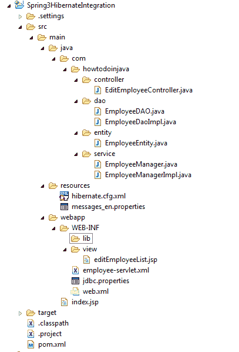

# Spring Hibernate 集成示例

> 原文： [https://howtodoinjava.com/spring-orm/spring-hibernate-integration-example/](https://howtodoinjava.com/spring-orm/spring-hibernate-integration-example/)

此 **Spring Hibernate 集成**教程重点介绍 **[Hibernate](//howtodoinjava.com/hibernate-tutorials/ "hibernate")** 与 [**Spring**](//howtodoinjava.com) 框架的结合使用。 我将展示这种集成的结果，一个基本的端到端应用程序流看起来如何。

## 1.开发环境

*   [Eclipse Juno IDE](https://www.eclipse.org/downloads/packages/eclipse-ide-java-ee-developers/junosr1 "eclipse juno download page")
*   [JDK 1.7](http://www.oracle.com/technetwork/java/javase/downloads/jdk7-downloads-1880260.html "java 7 downloads")
*   [JBoss 7](http://jbossas.jboss.org/downloads "jboss 7 downloads")
*   [Maven](https://maven.apache.org/download.cgi "maven download")
*   [Spring 3.0.5](//howtodoinjava.com/java-spring-framework-tutorials/)
*   [休眠 3.6.3](//howtodoinjava.com/hibernate-tutorials/)

For those, who are not using maven for dependency management and are relying on downloaded jar files. I have created another project with all required jar files included in source code to download. Also, I have done integration using Spring 3.2.5 and hibernate 4.

因此，如果您属于以上两个类别中的任何一个，请阅读以下链接文章，以防出现任何问题。 [**Spring + Hibernate 4 集成教程，包含所有 jar 文件**](//howtodoinjava.com/spring/spring-orm/spring-3-2-5-release-and-hibernate-4-integration-example-tutorial/ "Spring 3.2.5.RELEASE and Hibernate 4 Integration Example Tutorial")

要构建此示例项目，我将逐步指导您 。 通过这种方式，我们还可以遍历一些概念。

## 2.创建 Maven Web 项目

在命令提示符下使用以下命令创建 [maven Web 项目](https://howtodoinjava.com/maven/maven-web-project-in-eclipse/ "How to create a eclipse web application using maven")。

```java
$ mvn archetype:generate -DgroupId=com.howtodoinjava.app 
							-DartifactId=Spring3HibernateIntegration
							-DarchetypeArtifactId=maven-archetype-webapp 
							-DinteractiveMode=false

```

现在，使用下面的 maven 命令将此 Web 项目转换为 eclipse 动态 Web 项目。

```java
$ cd Spring3HibernateIntegration
$ mvn eclipse:eclipse -Dwtpversion=2.0

```

## 3\. Maven 依赖

更新 **pom.xml** 文件以包含 spring 和 hibernate 依赖项。 它还将包括在项目参考中添加的 mysql 驱动程序。

`pom.xml`

```java
<project xmlns="http://maven.apache.org/POM/4.0.0" xmlns:xsi="http://www.w3.org/2001/XMLSchema-instance"
  xsi:schemaLocation="http://maven.apache.org/POM/4.0.0 http://maven.apache.org/maven-v4_0_0.xsd">
  <modelVersion>4.0.0</modelVersion>
  <groupId>com.howtodoinjava.app</groupId>
  <artifactId>Spring3HibernateIntegration</artifactId>
  <packaging>war</packaging>
  <version>1.0-SNAPSHOT</version>
  <name>Spring3HibernateIntegration Maven Webapp</name>
  <url>http://maven.apache.org</url>
  <!-- JBoss repository for Hibernate -->
	<repositories>
		<repository>
			<id>JBoss repository</id>
			<url>http://repository.jboss.org/nexus/content/groups/public/</url>
		</repository>
	</repositories>
  <properties>
    <org.springframework.version>3.0.5.RELEASE</org.springframework.version>
  </properties>
  <dependencies>

  	<dependency>
	  <groupId>org.springframework</groupId>
	  <artifactId>spring-core</artifactId>
	  <version>${org.springframework.version}</version>
	</dependency>

	<dependency>
	  <groupId>org.springframework</groupId>
	  <artifactId>spring-expression</artifactId>
	  <version>${org.springframework.version}</version>
	</dependency>

	<dependency>
	  <groupId>org.springframework</groupId>
	  <artifactId>spring-beans</artifactId>
	  <version>${org.springframework.version}</version>
	</dependency>

	<dependency>
	  <groupId>org.springframework</groupId>
	  <artifactId>spring-context</artifactId>
	  <version>${org.springframework.version}</version>
	</dependency>

	<dependency>
	  <groupId>org.springframework</groupId>
	  <artifactId>spring-context-support</artifactId>
	  <version>${org.springframework.version}</version>
	</dependency>

	<dependency>
	  <groupId>org.springframework</groupId>
	  <artifactId>spring-jdbc</artifactId>
	  <version>${org.springframework.version}</version>
	</dependency>

	<dependency>
	  <groupId>org.springframework</groupId>
	  <artifactId>spring-orm</artifactId>
	  <version>${org.springframework.version}</version>
	</dependency>

	<dependency>
	  <groupId>org.springframework</groupId>
	  <artifactId>spring-web</artifactId>
	  <version>${org.springframework.version}</version>
	</dependency>

	<dependency>
	  <groupId>org.springframework</groupId>
	  <artifactId>spring-webmvc</artifactId>
	  <version>${org.springframework.version}</version>
	</dependency>

	<dependency>  
       <groupId>log4j</groupId>  
       <artifactId>log4j</artifactId>  
       <version>1.2.15</version>  
       <scope>runtime</scope>  
     </dependency>  

	<dependency>
		<groupId>org.hibernate</groupId>
		<artifactId>hibernate-core</artifactId>
		<version>3.6.3.Final</version>
	</dependency>

	<dependency>
		<groupId>javassist</groupId>
		<artifactId>javassist</artifactId>
		<version>3.12.1.GA</version>
	</dependency>

 	<dependency>
		<groupId>javax.servlet</groupId>
		<artifactId>jstl</artifactId>
		<version>1.2</version>
		<scope>runtime</scope>
	</dependency>

	<dependency>
		<groupId>taglibs</groupId>
		<artifactId>standard</artifactId>
		<version>1.1.2</version>
		<scope>runtime</scope>
	</dependency>

	<dependency>
	  <groupId>commons-dbcp</groupId>
	  <artifactId>commons-dbcp</artifactId>
	  <version>1.4</version>
	</dependency>

   <dependency>
	    <groupId>mysql</groupId>
	    <artifactId>mysql-connector-java</artifactId>
	    <version>5.1.9</version>
	</dependency>

  </dependencies>
  <build>
    <finalName>Spring3HibernateIntegration</finalName>
  </build>
</project>

```

## 4.创建数据库架构

现在让我们决定**数据库架构**结构，因为在下一步中编写实体类时将需要它。

```java
CREATE TABLE EMPLOYEE
(
    ID          INT PRIMARY KEY AUTO_INCREMENT,
    FIRSTNAME   VARCHAR(30),
    LASTNAME    VARCHAR(30),
    TELEPHONE   VARCHAR(15),
    EMAIL       VARCHAR(30),
    CREATED     TIMESTAMP DEFAULT NOW()
);

```

## 5.编写休眠实体类

现在该写`EmployeeEntity`了。 此类将使用休眠模式映射到数据库中的`Employee`表。 JPA 将在持久性管理设置中包括任何用 [`@Entity`](https://docs.oracle.com/javaee/5/api/javax/persistence/Entity.html "@Entity annotation") 注释的类。 如果您使用注释，则不需要`persistence.xml`。

```java
package com.howtodoinjava.entity;

import javax.persistence.Column;
import javax.persistence.Entity;
import javax.persistence.GeneratedValue;
import javax.persistence.Id;
import javax.persistence.Table;

@Entity
@Table(name="EMPLOYEE")
public class EmployeeEntity 
{
    @Id
    @Column(name="ID")
    @GeneratedValue
    private Integer id;

    @Column(name="FIRSTNAME")
    private String firstname;

    @Column(name="LASTNAME")
    private String lastname;

    @Column(name="EMAIL")
    private String email;

    @Column(name="TELEPHONE")
    private String telephone;

    //Setters and getters
}

```

## 6.编写数据访问代码

让我们编写将与数据库交互负责的 DAO 类。 此类实际上将使用休眠会话工厂进行数据库交互。 会话工厂实现将在运行时使用 [**spring IoC 功能**](https://howtodoinjava.com/spring-core/inversion-of-control-ioc-and-dependency-injection-di-patterns-in-spring-framework-and-related-interview-questions/ "Inversion of control (IoC) and dependency injection (DI) patterns in spring framework and related interview questions") 注入参考变量。

`EmployeeDao.java`

```java
package com.howtodoinjava.dao;

import java.util.List;
import com.howtodoinjava.entity.EmployeeEntity;

public interface EmployeeDAO
{
    public void addEmployee(EmployeeEntity employee);
    public List<EmployeeEntity> getAllEmployees();
    public void deleteEmployee(Integer employeeId);
}

```

`EmployeeDaoImpl.java`

```java
package com.howtodoinjava.dao;

import java.util.List;

import org.hibernate.SessionFactory;
import org.springframework.beans.factory.annotation.Autowired;
import org.springframework.stereotype.Repository;

import com.howtodoinjava.entity.EmployeeEntity;

@Repository
public class EmployeeDaoImpl implements EmployeeDAO
{
    @Autowired
    private SessionFactory sessionFactory;
    @Override
    public void addEmployee(EmployeeEntity employee) {
        this.sessionFactory.getCurrentSession().save(employee);
    }
    @SuppressWarnings("unchecked")
    @Override
    public List<EmployeeEntity> getAllEmployees() {
        return this.sessionFactory.getCurrentSession().createQuery("from EmployeeEntity").list();
    }
    @Override
    public void deleteEmployee(Integer employeeId) {
        EmployeeEntity employee = (EmployeeEntity) sessionFactory.getCurrentSession().load(
                EmployeeEntity.class, employeeId);
        if (null != employee) {
            this.sessionFactory.getCurrentSession().delete(employee);
        }
    }
}

```

我已经写了一个管理层，由于较少的复杂性，它在本演示中似乎是多余的，但是如果您编写此层，它通常会被视为 **[最佳实践](//howtodoinjava.com/category/best-practices/ "java best practices")** 。 该层将仅接收来自控制器的调用，并将此调用传递到 dao 层。

`EmployeeManager.java`

```java
package com.howtodoinjava.service;

import java.util.List;

import com.howtodoinjava.entity.EmployeeEntity;

public interface EmployeeManager {
    public void addEmployee(EmployeeEntity employee);
    public List<EmployeeEntity> getAllEmployees();
    public void deleteEmployee(Integer employeeId);
}

```

`EmployeeManagerImpl.java`

```java
package com.howtodoinjava.service;

import java.util.List;

import org.springframework.beans.factory.annotation.Autowired;
import org.springframework.stereotype.Service;
import org.springframework.transaction.annotation.Transactional;

import com.howtodoinjava.dao.EmployeeDAO;
import com.howtodoinjava.entity.EmployeeEntity;

@Service
public class EmployeeManagerImpl implements EmployeeManager 
{
    @Autowired
    private EmployeeDAO employeeDAO;
    @Override
    @Transactional
    public void addEmployee(EmployeeEntity employee) {
        employeeDAO.addEmployee(employee);
    }
    @Override
    @Transactional
    public List<EmployeeEntity> getAllEmployees() {
        return employeeDAO.getAllEmployees();
    }
    @Override
    @Transactional
    public void deleteEmployee(Integer employeeId) {
        employeeDAO.deleteEmployee(employeeId);
    }
    public void setEmployeeDAO(EmployeeDAO employeeDAO) {
        this.employeeDAO = employeeDAO;
    }
}

```

## 7\. Spring 控制器和查看文件

现在是时候编写 spring 控制器和处理程序方法了，这些实际上将由 spring 框架的调度程序 servlet 调用以处理实际的应用程序逻辑。

`EditEmployeeController.java`

```java
package com.howtodoinjava.controller;

import org.springframework.beans.factory.annotation.Autowired;
import org.springframework.stereotype.Controller;
import org.springframework.ui.ModelMap;
import org.springframework.validation.BindingResult;
import org.springframework.web.bind.annotation.ModelAttribute;
import org.springframework.web.bind.annotation.PathVariable;
import org.springframework.web.bind.annotation.RequestMapping;
import org.springframework.web.bind.annotation.RequestMethod;
import org.springframework.web.bind.annotation.RequestParam;

import com.howtodoinjava.entity.EmployeeEntity;
import com.howtodoinjava.service.EmployeeManager;

@Controller
public class EditEmployeeController 
{
    @Autowired
    private EmployeeManager employeeManager;
    @RequestMapping(value = "/", method = RequestMethod.GET)
    public String listEmployees(ModelMap map)
    {
        map.addAttribute("employee", new EmployeeEntity());
        map.addAttribute("employeeList", employeeManager.getAllEmployees());
        return "editEmployeeList";
    }
    @RequestMapping(value = "/add", method = RequestMethod.POST)
    public String addEmployee(@ModelAttribute(value="employee") EmployeeEntity employee, BindingResult result)
    {
        employeeManager.addEmployee(employee);
        return "redirect:/";
    }
    @RequestMapping("/delete/{employeeId}")
    public String deleteEmplyee(@PathVariable("employeeId") Integer employeeId)
    {
        employeeManager.deleteEmployee(employeeId);
        return "redirect:/";
    }
    public void setEmployeeManager(EmployeeManager employeeManager) {
        this.employeeManager = employeeManager;
    }
}

```

现在，我们将编写应用程序的视图层，该视图层实际上是 **.jsp** 文件。

`editEmployeeList.jsp`

```java
<%@taglib uri="http://www.springframework.org/tags" prefix="spring"%>
<%@taglib uri="http://www.springframework.org/tags/form" prefix="form"%>
<%@taglib uri="http://java.sun.com/jsp/jstl/core" prefix="c"%>
<html>
    <head>
        <title>Spring 3 hibernate integration example on www.howtodoinjava.com</title>
    </head>
    <body>
    <h2>Employee Management Screen : Spring 3 hibernate integration example on www.howtodoinjava.com</h2>
    <form:form method="post" action="add" commandName="employee">
        <table>
        <tr>
            <td><form:label path="firstname"><spring:message code="label.firstname"/></form:label></td>
            <td><form:input path="firstname" /></td>
        </tr>
        <tr>
            <td><form:label path="lastname"><spring:message code="label.lastname"/></form:label></td>
            <td><form:input path="lastname" /></td>
        </tr>
        <tr>
            <td><form:label path="email"><spring:message code="label.email"/></form:label></td>
            <td><form:input path="email" /></td>
        </tr>
        <tr>
            <td><form:label path="telephone"><spring:message code="label.telephone"/></form:label></td>
            <td><form:input path="telephone" /></td>
        </tr>
        <tr>
            <td colspan="2">
                <input type="submit" value="<spring:message code="label.add"/>"/>
            </td>
        </tr>
    </table> 
    </form:form>
    <h3>Employees</h3>
    <c:if  test="${!empty employeeList}">
    <table class="data">
    <tr>
        <th>Name</th>
        <th>Email</th>
        <th>Telephone</th>
        <th>Action</th>
    </tr>
    <c:forEach items="${employeeList}" var="emp">
        <tr>
            <td>${emp.lastname}, ${emp.firstname} </td>
            <td>${emp.email}</td>
            <td>${emp.telephone}</td>
            <td>delete</td>
        </tr>
    </c:forEach>
    </table>
    </c:if>
    </body>
</html>

```

#### 8\. Spring 分派器 Servlet

我们的 Java 代码已经完成，现在可以配置应用程序了。 让我们从`web.xml`开始。 在`web.xml`中，我们将为 spring 框架配置[前控制器](https://en.wikipedia.org/wiki/Front_Controller_pattern "Front_Controller_pattern")，即 [DispatcherServlet](https://docs.spring.io/spring/docs/3.1.x/javadoc-api/org/springframework/web/servlet/DispatcherServlet.html "DispatcherServlet") 。

```java
<?xml version="1.0" encoding="UTF-8"?>

<web-app xmlns:xsi="http://www.w3.org/2001/XMLSchema-instance"
    xmlns="http://java.sun.com/xml/ns/javaee"
    xmlns:web="http://java.sun.com/xml/ns/javaee/web-app_2_5.xsd"
    xsi:schemaLocation="http://java.sun.com/xml/ns/javaee http://java.sun.com/xml/ns/javaee/web-app_2_5.xsd"
    id="WebApp_ID" version="2.5">

<display-name>Archetype Created Web Application</display-name>
    <welcome-file-list>
        <welcome-file>/WEB-INF/index.jsp</welcome-file>
    </welcome-file-list>
    <servlet>
        <servlet-name>employee</servlet-name>
        <servlet-class>
            org.springframework.web.servlet.DispatcherServlet
        </servlet-class>
        <load-on-startup>1</load-on-startup>
    </servlet>
    <servlet-mapping>
        <servlet-name>employee</servlet-name>
        <url-pattern>/</url-pattern>
    </servlet-mapping>
    <context-param>
        <param-name>contextConfigLocation</param-name>
        <param-value>/WEB-INF/employee-servlet.xml</param-value>
    </context-param>
    <listener>
        <listener-class>org.springframework.web.context.ContextLoaderListener</listener-class>
    </listener>
</web-app>

```

## 9\. Spring Hibernate 集成配置

让我们为休眠**数据源**，**消息资源**，**视图解析器**和其他此类对象配置 spring 框架。

`employee-servlet.xml`

```java
<?xml  version="1.0" encoding="UTF-8"?>
<beans xmlns="http://www.springframework.org/schema/beans"
    xmlns:xsi="http://www.w3.org/2001/XMLSchema-instance"
    xmlns:aop="http://www.springframework.org/schema/aop"
    xmlns:context="http://www.springframework.org/schema/context"
    xmlns:jee="http://www.springframework.org/schema/jee"
    xmlns:lang="http://www.springframework.org/schema/lang"
    xmlns:p="http://www.springframework.org/schema/p"
    xmlns:tx="http://www.springframework.org/schema/tx"
    xmlns:util="http://www.springframework.org/schema/util"
    xsi:schemaLocation="http://www.springframework.org/schema/beans http://www.springframework.org/schema/beans/spring-beans.xsd
        http://www.springframework.org/schema/aop/ http://www.springframework.org/schema/aop/spring-aop.xsd
        http://www.springframework.org/schema/context/ http://www.springframework.org/schema/context/spring-context.xsd
        http://www.springframework.org/schema/jee/ http://www.springframework.org/schema/jee/spring-jee.xsd
        http://www.springframework.org/schema/lang/ http://www.springframework.org/schema/lang/spring-lang.xsd
        http://www.springframework.org/schema/tx/ http://www.springframework.org/schema/tx/spring-tx.xsd
        http://www.springframework.org/schema/util/ http://www.springframework.org/schema/util/spring-util.xsd">
    <context:annotation-config />
    <context:component-scan base-package="com.howtodoinjava.controller" />
    <bean id="jspViewResolver"
        class="org.springframework.web.servlet.view.InternalResourceViewResolver">
        <property name="viewClass"
            value="org.springframework.web.servlet.view.JstlView"></property>
        <property name="prefix" value="/WEB-INF/view/"></property>
        <property name="suffix" value=".jsp"></property>
    </bean>
    <bean id="messageSource"
        class="org.springframework.context.support.ReloadableResourceBundleMessageSource">
        <property name="basename" value="classpath:messages"></property>
        <property name="defaultEncoding" value="UTF-8"></property>
    </bean>
    <bean id="propertyConfigurer"
        class="org.springframework.beans.factory.config.PropertyPlaceholderConfigurer"
        p:location="/WEB-INF/jdbc.properties"></bean>
    <bean id="dataSource"
        class="org.apache.commons.dbcp.BasicDataSource" destroy-method="close"
        p:driverClassName="${jdbc.driverClassName}"
        p:url="${jdbc.databaseurl}" p:username="${jdbc.username}"
        p:password="${jdbc.password}"></bean>
    <bean id="sessionFactory"
        class="org.springframework.orm.hibernate3.LocalSessionFactoryBean">
        <property name="dataSource" ref="dataSource"></property>
        <property name="configLocation">
            <value>classpath:hibernate.cfg.xml</value>
        </property>
        <property name="configurationClass">
            <value>org.hibernate.cfg.AnnotationConfiguration</value>
        </property>
        <property name="hibernateProperties">
            <props>
                <prop key="hibernate.dialect">${jdbc.dialect}</prop>
                <prop key="hibernate.show_sql">true</prop>
            </props>
        </property>
    </bean>
    <bean id="employeeDAO" class="com.howtodoinjava.dao.EmployeeDaoImpl"></bean>
    <bean id="employeeManager" class="com.howtodoinjava.service.EmployeeManagerImpl"></bean>
    <tx:annotation-driven />
    <bean id="transactionManager"
        class="org.springframework.orm.hibernate3.HibernateTransactionManager">
        <property name="sessionFactory" ref="sessionFactory"></property>
    </bean>
</beans>

```

使用注释时，Hibernate 配置变得简单。

`hibernate.cfg.xml`

```java
<?xml version='1.0' encoding='utf-8'?>
<!DOCTYPE hibernate-configuration PUBLIC
    "-//Hibernate/Hibernate Configuration DTD//EN"
    "http://hibernate.sourceforge.net/hibernate-configuration-3.0.dtd">

<hibernate-configuration>
    <session-factory>
        <mapping class="com.howtodoinjava.entity.EmployeeEntity"></mapping>
    </session-factory>
</hibernate-configuration>

```

## 10\. JDBC 属性

让我们提到 jdbc 连接属性和消息资源属性。

`jdbc.properties`

```java
jdbc.driverClassName=com.mysql.jdbc.Driver
jdbc.dialect=org.hibernate.dialect.MySQLDialect
jdbc.databaseurl=jdbc:mysql://127.0.0.1:3306/test
jdbc.username=root
jdbc.password=password

```

`messages_en.properties`

```java
label.firstname=First Name
label.lastname=Last Name
label.email=Email
label.telephone=Telephone
label.add=Add Employee

label.menu=Actions
label.title=Employee Form
label.footer=www.HowToDoInJava.com

```

而已。 您的应用程序已准备好部署在您选择的服务器上。 最后，您的项目结构应如下所示。



Spring + hibernate integration project structure

如果您在 Eclipse 逐步中发现构建或运行此 spring hibernate 集成示例时遇到任何问题，请发表评论，我将尽力帮助您。

**[Download source code](//howtodoinjava.com/wp-content/uploads/2013/03/Spring3HibernateIntegration.zip "download source code")**

**更新：**

If you are facing issue :: `java.lang.NoClassDefFoundError: Lorg/hibernate/cache/CacheProvider`
Possible Solution: Please try changing org.springframework.orm.hibernate3.LocalSessionFactoryBean to org.springframework.orm.hibernate4.LocalSessionFactoryBean
===hibernate3 to hibernate4===

更多参考：

http://stackoverflow.com/questions/7528862/exception-noclassdeffounderror-for-cacheprovider
https://code.google.com/archive/p/jgk-spring-recipes/wikis/Migrating_Spring31_Hibernate4.wiki

**java.lang.NoClassDefFoundError: org/aopalliance/intercept/MethodInterceptor**
Possible Solution: Download and add com.springsource.org.aopalliance-1.0.0.jar to your classpath

参考：

http://forum.spring.io/forum/spring-projects/aop/74011-java-lang-noclassdeffounderror-org-aopalliance-intercept-methodinterceptor

**[Download source code](https://docs.google.com/file/d/0B7yo2HclmjI4clZVT0VxeGNERFk/edit?usp=sharing "download source code")**

学习愉快！