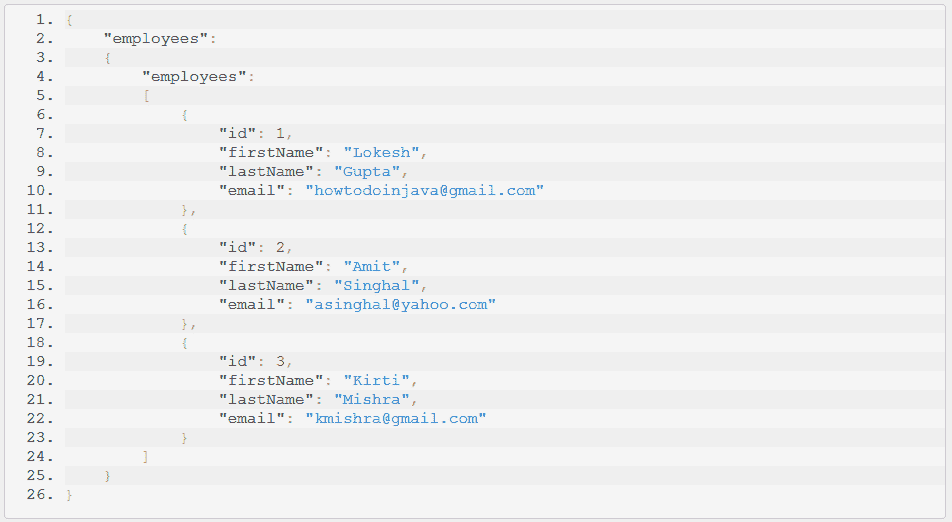
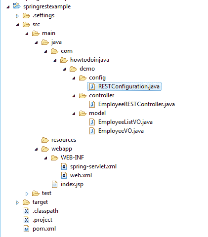

# Spring REST JSON 响应示例

> 原文： [https://howtodoinjava.com/spring-restful/spring-rest-hello-world-json-example/](https://howtodoinjava.com/spring-restful/spring-rest-hello-world-json-example/)

在 **Spring REST JSON 示例**中，我们将学习编写能够返回资源的 JSON 表示形式的[ RESTful Web 服务](https://howtodoinjava.com/restful-web-service/)。 我们将使用`MappingJackson2JsonView`将视图解析为 JSON 正文。

> 阅读更多： [Spring REST XML 教程](https://howtodoinjava.com/spring/spring-restful/spring-rest-hello-world-xml-example/)

## 1\. Spring REST JSON – `@ResponseBody`注解

此**首要技术**简单易行。 我们只需要在应用程序的类路径中包含 **jackson** 依赖项，spring 就会自动将`Jackson2JsonMessageConverter`类注册到上下文中。 每当我们从 REST API 请求资源并提供 http 标头`accept: application/json`时，我们都将取回资源的 json 表示形式。

#### 1.1. JSON 运行时依赖

`pom.xml`

```java
<!-- Jackson JSON Processor -->
<dependency>
	<groupId>com.fasterxml.jackson.core</groupId>
	<artifactId>jackson-databind</artifactId>
	<version>2.4.1</version>
</dependency>

```

#### 1.2. `@ResponseBody`支持

> 这里`@RestController = @Controller + @ResponseBody`

`EmployeeRESTController.java`

```java
@RestController
public class EmployeeRESTController
{
    @RequestMapping(value = "/employees")
    public EmployeeListVO getAllEmployees()
    {
        EmployeeListVO employees = new EmployeeListVO();

        EmployeeVO empOne = new EmployeeVO(1,"Lokesh","Gupta","howtodoinjava@gmail.com");
        EmployeeVO empTwo = new EmployeeVO(2,"Amit","Singhal","asinghal@yahoo.com");
        EmployeeVO empThree = new EmployeeVO(3,"Kirti","Mishra","kmishra@gmail.com");

        employees.getEmployees().add(empOne);
        employees.getEmployees().add(empTwo);
        employees.getEmployees().add(empThree);

        return employees;
    }

    @RequestMapping(value = "/employees/{id}")
    public ResponseEntity<EmployeeVO> getEmployeeById (@PathVariable("id") int id)
    {
        if (id <= 3) {
            EmployeeVO employee = new EmployeeVO(1,"Lokesh","Gupta","howtodoinjava@gmail.com");
            return new ResponseEntity<EmployeeVO>(employee, HttpStatus.OK);
        }
        return new ResponseEntity(HttpStatus.NOT_FOUND);
    }
}

```

## 2\. Spring REST JSON – `MappingJackson2JsonView`支持

这是**第二技术**。 `MappingJackson2JsonView`类还取决于类路径中 **Jackson** JSON 处理器库的存在，因此您无需添加任何其他内容。 完整的`pom.xml`看起来像这样。

#### 2.1. Maven 依赖

`pom.xml`

```java
<project xmlns="http://maven.apache.org/POM/4.0.0" xmlns:xsi="http://www.w3.org/2001/XMLSchema-instance"
  xsi:schemaLocation="http://maven.apache.org/POM/4.0.0 http://maven.apache.org/maven-v4_0_0.xsd">
  <modelVersion>4.0.0</modelVersion>
  <groupId>com.howtodoinjava.demo</groupId>
  <artifactId>springrestexample</artifactId>
  <packaging>war</packaging>
  <version>0.0.1-SNAPSHOT</version>
  <name>springrestexample Maven Webapp</name>
  <url>http://maven.apache.org</url>
  <dependencies>
    <dependency>
      <groupId>junit</groupId>
      <artifactId>junit</artifactId>
      <version>4.12</version>
      <scope>test</scope>
    </dependency>

    <!-- Spring MVC support -->

	<dependency>
		<groupId>org.springframework</groupId>
		<artifactId>spring-webmvc</artifactId>
		<version>4.1.4.RELEASE</version>
	</dependency>

	<dependency>
		<groupId>org.springframework</groupId>
		<artifactId>spring-web</artifactId>
		<version>4.1.4.RELEASE</version>
	</dependency>

	<dependency>
		<groupId>org.springframework</groupId>
		<artifactId>spring-core</artifactId>
		<version>4.1.4.RELEASE</version>
	</dependency>

	<!-- Jackson JSON Processor -->
	<dependency>
		<groupId>com.fasterxml.jackson.core</groupId>
		<artifactId>jackson-databind</artifactId>
		<version>2.4.1</version>
	</dependency>

  </dependencies>
  <build>
    <finalName>springrestexample</finalName>
  </build>
</project>

```

#### 2.2. 添加`MappingJackson2JsonView`视图

使用`MappingJackson2JsonView`类时，您将需要返回`MappingJackson2JsonView`类型的视图名称。 因此，您将需要更改两个位置。

##### 2.2.1. 控制器变更

您将需要从控制器方法返回视图名称。在我们的例子中，视图名称是`jsonTemplate`。

```java
package com.howtodoinjava.demo.controller;

import org.springframework.http.HttpStatus;
import org.springframework.http.MediaType;
import org.springframework.http.ResponseEntity;
import org.springframework.stereotype.Controller;
import org.springframework.ui.Model;
import org.springframework.web.bind.annotation.PathVariable;
import org.springframework.web.bind.annotation.RequestMapping;

import com.howtodoinjava.demo.model.EmployeeListVO;
import com.howtodoinjava.demo.model.EmployeeVO;

@Controller
public class EmployeeRESTController 
{

	private EmployeeListVO getEmployeesCollection()
	{
		EmployeeListVO employees = new EmployeeListVO();

		EmployeeVO empOne = new EmployeeVO(1,"Lokesh","Gupta","howtodoinjava@gmail.com");
		EmployeeVO empTwo = new EmployeeVO(2,"Amit","Singhal","asinghal@yahoo.com");
		EmployeeVO empThree = new EmployeeVO(3,"Kirti","Mishra","kmishra@gmail.com");

		employees.getEmployees().add(empOne);
		employees.getEmployees().add(empTwo);
		employees.getEmployees().add(empThree);

		return employees;
	}

	@RequestMapping(value = "/employees")
	public String getAllEmployeesJSON(Model model) 
	{
		model.addAttribute("employees", getEmployeesCollection());
	    return "jsonTemplate";
	}
}

```

##### 2.2.2. 配置变更

您将需要将视图名称`jsonTemplate`配置为类型为`MappingJackson2JsonView`的 bean。 并且您将需要配置类型为`BeanNameViewResolver`的视图解析器。 这样，视图名称`jsonTemplate`将与`MappingJackson2JsonView`匹配，并且将已解析的 JSON 响应返回给客户端。

`RESTConfiguration.java`

```java
@Configuration
public class RESTConfiguration 
{
    @Bean
    public View jsonTemplate() {
        MappingJackson2JsonView view = new MappingJackson2JsonView();
        view.setPrettyPrint(true);
        return view;
    }

    @Bean
    public ViewResolver viewResolver() {
        return new BeanNameViewResolver();
    }
}

```

与上述 java 配置等效的 XML 配置如下。

`spring-servlet.xml`

```java
<beans xmlns="http://www.springframework.org/schema/beans"
	xmlns:xsi="http://www.w3.org/2001/XMLSchema-instance" xmlns:context="http://www.springframework.org/schema/context"
	xmlns:mvc="http://www.springframework.org/schema/mvc" 
	xsi:schemaLocation="http://www.springframework.org/schema/beans http://www.springframework.org/schema/beans/spring-beans.xsd
    http://www.springframework.org/schema/context/ http://www.springframework.org/schema/context/spring-context.xsd
    http://www.springframework.org/schema/mvc http://www.springframework.org/schema/mvc/spring-mvc.xsd">

	<context:component-scan base-package="com.howtodoinjava.demo" />
	<mvc:annotation-driven />

	<!-- JSON Support -->
	<bean name="viewResolver" class="org.springframework.web.servlet.view.BeanNameViewResolver"/>
	<bean name="jsonTemplate" class="org.springframework.web.servlet.view.json.MappingJackson2JsonView"/>

</beans>

```

**3\. Spring REST JSON 示例 – 演示**

现在，当您点击 URL：`http://localhost:8080/springrestexample/employees`时，您将得到此结果。



Spring REST JSON 示例

## 4\. Spring REST JSON 示例 – 项目结构



Spring REST JSON 示例 – 项目结构

这就是带有 spring mvc 的 **spring restful web 服务 json** 简单示例的全部内容。 将您的问题留在我的评论中。

学习愉快！