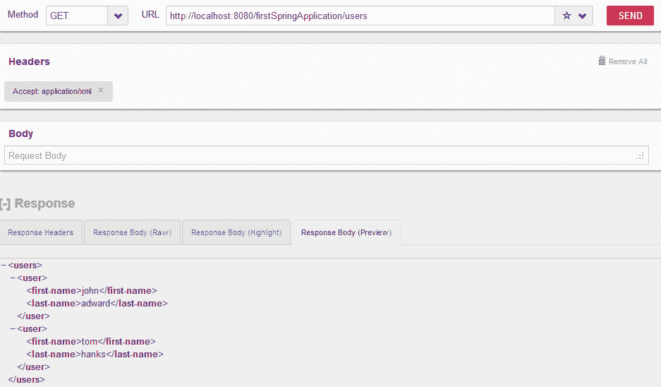
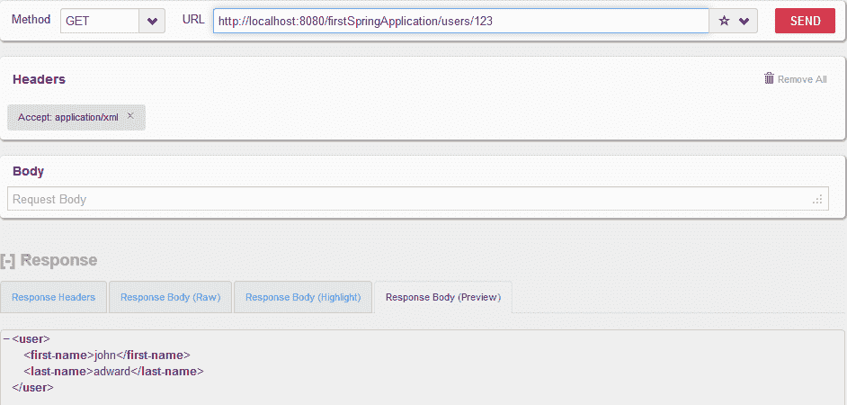

# Spring REST 控制器示例

> 原文： [https://howtodoinjava.com/spring-restful/how-to-write-restful-webservices-using-spring-3-mvc/](https://howtodoinjava.com/spring-restful/how-to-write-restful-webservices-using-spring-3-mvc/)

学习创建 **Spring REST 控制器**，该控制器可以处理任何 [Spring MVC](https://howtodoinjava.com/spring-mvc-tutorial/) 应用程序中的 REST API 调用。 它邀请添加 **@Controller** 和 **@RequestMapping** 批注。

为了编写此应用程序，我正在修改 [Spring MVC 示例](//howtodoinjava.com/jstl/spring-3-mvc-hello-world-application-with-maven-and-jstl/)中编写的源代码。 因此，如果需要，您可以从给定的链接下载源代码。

## 1\. 更新 Maven 依赖项

更新`pom.xml`以添加对 [JAXB](https://howtodoinjava.com/jaxb/read-xml-to-java-object/) 和 Jackson 的支持（适用于 **xml** 和 **json** 格式）。

```java
<dependency>
  <groupid>org.codehaus.jackson</groupid>
  <artifactid>jackson-mapper-asl</artifactid>
  <version>${jackson-mapper-asl.version}</version>
  <scope>runtime</scope>
</dependency>

<dependency>
  <groupid>javax.xml.bind</groupid>
  <artifactid>jaxb-api</artifactid>
  <version>${jaxb-api.version}</version>
  <scope>runtime</scope>
</dependency>

```

## 2\. 添加 ContentNegotiatingViewResolver

更新视图解析器的 bean 配置文件，并添加`ContentNegotiatingViewResolver`。

```java
<mvc:annotation-driven />

<context:component-scan  base-package="com.howtodoinjava.web" />

<bean class="org.springframework.web.servlet.view.ContentNegotiatingViewResolver">
    <property name="mediaTypes">
      <map>
          <entry key="html" value="text/html"></entry>
          <entry key="json" value="application/json"></entry>
          <entry key="xml"  value="application/xml"></entry>
      </map>
    </property>
     <property name="viewResolvers">
        <list>
          <bean class="org.springframework.web.servlet.view.UrlBasedViewResolver">
            <property name="viewClass" value="org.springframework.web.servlet.view.JstlView"></property>
            <property name="prefix" value="/WEB-INF/jsp/"></property>
            <property name="suffix" value=".jsp"></property>
          </bean>
        </list>
    </property>
</bean>

```

## 3\. 在模型类中添加 JAXB 批注

我正在编写 2 个类，即`Users.java`和`User.jav` a。 这些类将具有 **JAXB 批注**，marshaller 将使用它们将其转换为适当的 xml 或 json 格式。

它们仅作为示例，您可以编写自己的类。

`Users.java`

```java
package com.howtodoinjava.model;

import java.util.Collection;

import javax.xml.bind.annotation.XmlAccessType;
import javax.xml.bind.annotation.XmlAccessorType;
import javax.xml.bind.annotation.XmlElement;
import javax.xml.bind.annotation.XmlRootElement;

@XmlRootElement(name="users")
@XmlAccessorType(XmlAccessType.NONE)
public class Users
{
    @XmlElement(name="user")
    private Collection<User> users;

    public Collection<User> getUsers() {
        return users;
    }

    public void setUsers(Collection<User> users) {
        this.users = users;
    }
}

```

`User.java`

```java
package com.howtodoinjava.model;

import javax.xml.bind.annotation.XmlAccessType;
import javax.xml.bind.annotation.XmlAccessorType;
import javax.xml.bind.annotation.XmlElement;
import javax.xml.bind.annotation.XmlRootElement;

@XmlRootElement(name="user")
@XmlAccessorType(XmlAccessType.NONE)
public class User {

    @XmlElement(name="first-name")
    private String firstName;

    @XmlElement(name="last-name")
    private String lastName;

    public String getFirstName() {
        return firstName;
    }
    public void setFirstName(String firstName) {
        this.firstName = firstName;
    }
    public String getLastName() {
        return lastName;
    }
    public void setLastName(String lastName) {
        this.lastName = lastName;
    }
}

```

## 4\. 创建 REST 控制器

DemoController.java 具有 REST 专用注释，用于请求参数映射中的路径映射。 另外，我们将为请求和响应指定头属性。

`DemoController.java`

```java
@Controller
@RequestMapping("/users")
public class DemoController
{
    @RequestMapping(method = RequestMethod.GET, value="/{id}", headers="Accept=*/*")
    public @ResponseBody User getUserById(@PathVariable String id)
    {
        User user = new User();
        user.setFirstName("john");
        user.setLastName("adward");
        return user;
    }

    @RequestMapping(method = RequestMethod.GET,  headers="Accept=*/*")
    public @ResponseBody Users getAllUsers()
    {
        User user1 = new User();
        user1.setFirstName("john");
        user1.setLastName("adward");

        User user2 = new User();
        user2.setFirstName("tom");
        user2.setLastName("hanks");

        Users users = new Users();
        users.setUsers(new ArrayList<User>());
        users.getUsers().add(user1);
        users.getUsers().add(user2);

        return users;
    }
}

```

## 5\. 弹簧托示例的演示

现在，让我们在 tomcat 上重新部署应用程序，并在任何 REST 客户端上访问 URL。 我正在使用[`RESTClient`](https://addons.mozilla.org/en-US/firefox/addon/restclient/)。 这是一个用于测试 RESTful Web 服务的 firefox 插件。

*   **URL : http://localhost:8080/firstSpringApplication/users**

    

*   **URL : http://localhost:8080/firstSpringApplication/users/123**

    

[Download source code](https://drive.google.com/file/d/0B7yo2HclmjI4aGMxOF9aVTNkR1E/view?usp=drive_web)

如果确实有帮助，请给我评论，或者您有任何疑问。

快乐的学习！