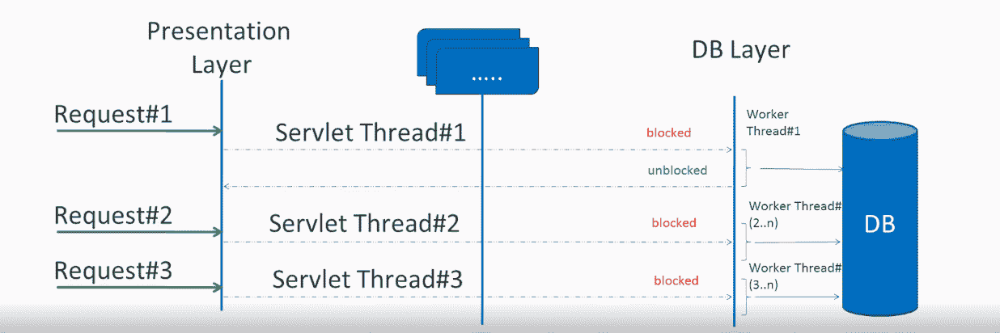
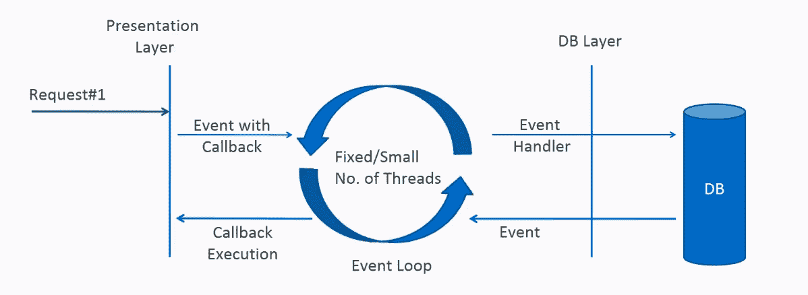
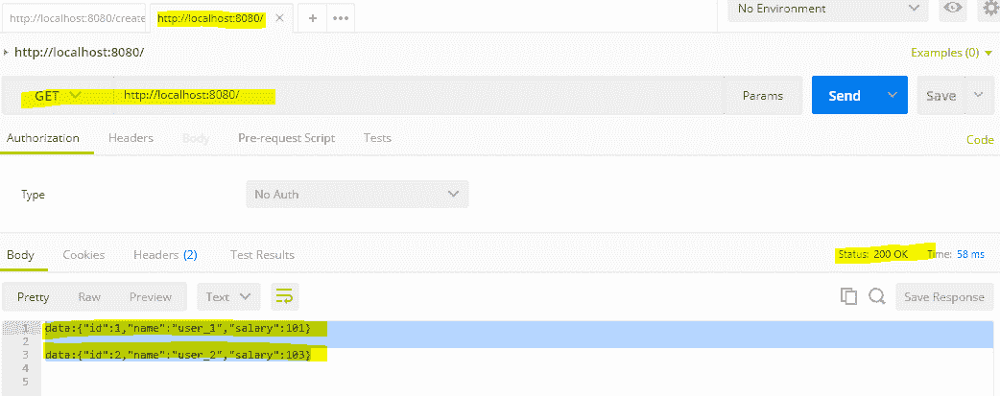
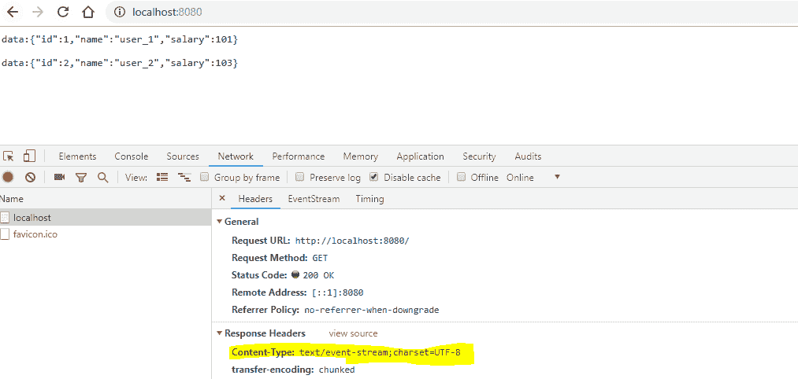

# Spring WebFlux 教程

> 原文： [https://howtodoinjava.com/spring-webflux/spring-webflux-tutorial/](https://howtodoinjava.com/spring-webflux/spring-webflux-tutorial/)

Spring 5.0 添加了反应堆 Web 框架 **Spring WebFlux** 。 它是完全无阻塞的，支持[响应式](http://www.reactive-streams.org/)背压，并在 Netty，Undertow 和 Servlet 3.1+ 容器等服务器上运行。 在这个 **spring webflux 教程**中，我们将学习响应式编程，webflux api 和功能齐全的 hello world 示例背后的基本概念。

## 1\. 响应式编程

响应式编程是一种编程示例，可促进异步，非阻塞，事件驱动的数据处理方法。 响应式编程涉及将数据和事件建模为可观察的数据流，并实现数据处理例程以对这些流中的更改做出反应。

在深入研究响应式世界之前，首先要了解阻塞与非阻塞请求处理之间的区别。

#### 1.1. 阻塞与非阻塞（异步）请求处理

###### 1.1.1. 阻塞请求处理

在传统的 MVC 应用程序中，当请求到达服务器时，将创建一个 servlet 线程。 它将请求委托给工作线程进行 I/O 操作（例如数据库访问等）。在工作线程忙时，servlet 线程（请求线程）保持等待状态，因此被阻塞。 也称为**同步请求处理**。



阻塞请求处理

由于服务器可以有一定数量的请求线程，因此限制了服务器在最大服务器负载下处理该数量请求的能力。 它可能会影响性能并限制服务器功能的完全利用。

###### 1.1.2. 非阻塞请求处理

在非阻塞或异步请求处理中，没有线程处于等待状态。 通常只有一个请求线程接收该请求。

所有传入的请求都带有事件处理器和回调信息。 请求线程将传入的请求委托给线程池（通常为少量线程），该线程池将请求委托给其处理函数，并立即开始处理来自请求线程的其他传入请求。

处理器功能完成后，池中的线程之一将收集响应并将其传递给回调函数。



非阻塞请求处理

线程的非阻塞性质有助于扩展应用程序的性能。 线程数量少意味着内存利用率较低，上下文切换也较少。

#### 1.2. 什么是响应式编程？

术语“响应式”是指围绕响应变化而构建的编程模型。 它是基于发布者-订阅者模式（[观察者模式](https://howtodoinjava.com/design-patterns/behavioral/observer-design-pattern/)）构建的。 在响应式编程中，我们请求资源并开始执行其他事情。 当数据可用时，我们会收到通知以及回调函数的数据通知。 在回调函数中，我们根据应用程序/用户需求处理响应。

要记住的重要一件事是背压。 在非阻塞代码中，**控制事件的速率**变得很重要，这样快速生成器就不会淹没其目的地。

响应式 Web 编程非常适合具有流数据的应用程序以及使用该数据并将其流传输给用户的客户端。 这对开发传统的 CRUD 应用程序不是很好。 如果您要开发具有大量数据的下一个 Facebook 或 Twitter ，那么响应式 API 可能正是您想要的。

## 2\. 响应式流 API

新的响应式流式 API 由 Netflix，Pivotal，Lightbend，RedHat，Twitter 和 Oracle 等工程师创建，现已成为 Java 9 的一部分。它定义了四个接口：

*   [`Publisher`](https://github.com/reactive-streams/reactive-streams-jvm/blob/v1.0.2/api/src/main/java/org/reactivestreams/Publisher.java): 根据从订阅者收到的需求向订阅者发出一系列事件。 一个发布者可以为多个订阅者提供服务。

    它只有一个方法：

    `Publisher.java`

    ```java
    public interface Publisher<T> 
    {
    	public void subscribe(Subscriber<? super T> s);
    }

    ```

*   [`Subscriber`](https://github.com/reactive-streams/reactive-streams-jvm/blob/v1.0.2/api/src/main/java/org/reactivestreams/Subscriber.java): 接收和处理发布者发出的事件。 请注意，在调用`Subscription#request(long)`发出信号表示需求之前，不会收到任何通知。

    它有四种方法来处理收到的各种响应。

    `Subscriber.java`

    ```java
    public interface Subscriber<T> 
    {
    	public void onSubscribe(Subscription s);
    	public void onNext(T t);
    	public void onError(Throwable t);
    	public void onComplete();
    }

    ```

*   [`Subscription`](https://github.com/reactive-streams/reactive-streams-jvm/blob/v1.0.2/api/src/main/java/org/reactivestreams/Subscription.java): 定义“发布者”和“订阅者”之间的一对一关系。 只能由单个“订阅者”使用一次。 它既用于表示对数据的需求，又用于取消需求（并允许清除资源）。

    `Subscription.java`

    ```java
    public interface Subscription<T> 
    {
    	public void request(long n);
    	public void cancel();
    }

    ```

*   [`Processor`](https://github.com/reactive-streams/reactive-streams-jvm/blob/v1.0.2/api/src/main/java/org/reactivestreams/Processor.java): 表示由“订阅者”和“发布者”组成的处理阶段，并服从两者的契约。

    `Processor.java`

    ```java
    public interface Processor<T, R> extends Subscriber<T>, Publisher<R> 
    {
    }

    ```

> 响应式的两种流行实现是 [**RxJava**](https://howtodoinjava.com/rxjava/rxjava-tutorial/)（<https://github.com/ReactiveX/RxJava>）和 **Project Reactor**（<https://projectreactor.io/>）。

## 3\. 什么是 Spring WebFlux？

Spring WebFlux 是 [Spring MVC](https://howtodoinjava.com/spring-mvc-tutorial/) 的并行版本，并支持完全无阻塞的响应式。 它支持背压概念，并使用 [**Netty**](https://netty.io/) 作为内置服务器来运行响应式应用程序。 如果您熟悉 Spring MVC 编程风格，则也可以轻松地使用 webflux。

Spring Webflux 使用项目反应器作为反应库。 Reactor 是 Reactive Streams 库，因此，它的所有运算符都支持无阻塞背压。 它是与 Spring 紧密合作开发的。

Spring WebFlux 大量使用两个发布者：

*   `Mono`：返回 0 或 1 个元素。

    ```java
    Mono<String> mono = Mono.just("Alex");
    Mono<String> mono = Mono.empty();

    ```

*   `Flux`：返回`0…N`个元素。 `Flux`可以是无穷无尽的，这意味着它可以永远保持发光。 它还可以返回一系列元素，然后在返回所有元素后发送完成通知。

    ```java
    Flux<String> flux = Flux.just("A", "B", "C");
    Flux<String> flux = Flux.fromArray(new String[]{"A", "B", "C"});
    Flux<String> flux = Flux.fromIterable(Arrays.asList("A", "B", "C"));

    //To subscribe call method

    flux.subscribe();

    ```

在 Spring WebFlux 中，我们称为响应式 API /函数，它们返回 mono 和 flux，而您的控制器将返回 mono 和 flux。 当您调用返回单声道或流量的 API 时，它将立即返回。 当它们可用时，函数调用的结果将通过单声道或磁通传递给您。

> 要构建真正的非阻塞应用程序，我们必须致力于将其所有组件创建/使用为非阻塞程序，即客户端，控制器，中间服务甚至数据库。 如果其中之一阻止了请求，我们的目标将会失败。

## 4\. Spring Boot WebFlux 示例

在此 [**Spring Boot 2**](https://howtodoinjava.com/spring-boot-tutorials/) 应用程序中，我正在创建员工管理系统。 我选择它是因为在学习时，您可以将其与传统的 MVC 风格的应用程序进行比较。 为了使其完全无阻塞，我使用 **mongodb** 作为后端数据库。

#### 4.1. Maven 依赖

包括`spring-boot-starter-webflux`，`spring-boot-starter-data-mongodb-reactive`，`spring-boot-starter-test`和`reactor-test`依赖项。

`pom.xml`

```java
<project xmlns="http://maven.apache.org/POM/4.0.0"
	xmlns:xsi="http://www.w3.org/2001/XMLSchema-instance"
	xsi:schemaLocation="http://maven.apache.org/POM/4.0.0 http://maven.apache.org/xsd/maven-4.0.0.xsd">
	<modelVersion>4.0.0</modelVersion>

	<parent>
		<groupId>org.springframework.boot</groupId>
		<artifactId>spring-boot-starter-parent</artifactId>
		<version>2.1.1.RELEASE</version>
		<relativePath /> <!-- lookup parent from repository -->
	</parent>

	<groupId>com.howtodoinjava</groupId>
	<artifactId>spring-webflux-demo</artifactId>
	<version>0.0.1-SNAPSHOT</version>
	<packaging>jar</packaging>

	<name>spring-webflux-demo</name>
	<url>http://maven.apache.org</url>

	<properties>
		<project.build.sourceEncoding>UTF-8</project.build.sourceEncoding>
		<java.version>1.8</java.version>
	</properties>

	<dependencies>
		<dependency>
			<groupId>org.springframework.boot</groupId>
			<artifactId>spring-boot-starter-webflux</artifactId>
		</dependency>
		<dependency>
			<groupId>org.springframework.boot</groupId>
			<artifactId>spring-boot-starter-data-mongodb-reactive</artifactId>
		</dependency>
		<dependency>
			<groupId>org.springframework.boot</groupId>
			<artifactId>spring-boot-starter-test</artifactId>
			<scope>test</scope>
		</dependency>
		<dependency>
			<groupId>io.projectreactor</groupId>
			<artifactId>reactor-test</artifactId>
			<scope>test</scope>
		</dependency>

		<dependency>
			<groupId>javax.xml.bind</groupId>
			<artifactId>jaxb-api</artifactId>
			<version>2.3.0</version>
		</dependency>
		<dependency>
			<groupId>javax.servlet</groupId>
			<artifactId>javax.servlet-api</artifactId>
			<version>3.1.0</version>
			<scope>provided</scope>
		</dependency>
	</dependencies>

</project>

```

#### 4.2. 配置

**Webflux 配置**

`WebFluxConfig.java`

```java
import org.springframework.context.annotation.Configuration;

@Configuration
@EnableWebFlux
public class WebFluxConfig implements WebFluxConfigurer 
{	
}

```

**MongoDb 配置**

`MongoConfig.java`

```java
import org.springframework.beans.factory.annotation.Value;
import org.springframework.context.annotation.Bean;
import org.springframework.context.annotation.Configuration;
import org.springframework.data.mongodb.config.AbstractReactiveMongoConfiguration;
import org.springframework.data.mongodb.core.ReactiveMongoTemplate;
import org.springframework.data.mongodb.repository.config.EnableReactiveMongoRepositories;

import com.mongodb.reactivestreams.client.MongoClient;
import com.mongodb.reactivestreams.client.MongoClients;

@Configuration
@EnableReactiveMongoRepositories(basePackages = "com.howtodoinjava.demo.dao")
public class MongoConfig extends AbstractReactiveMongoConfiguration 
{	
	@Value("${port}")
	private String port;

	@Value("${dbname}")
	private String dbName;

	@Override
	public MongoClient reactiveMongoClient() {
		return MongoClients.create();
	}

	@Override
	protected String getDatabaseName() {
		return dbName;
	}

	@Bean
	public ReactiveMongoTemplate reactiveMongoTemplate() {
		return new ReactiveMongoTemplate(reactiveMongoClient(), getDatabaseName());
	}
}

```

**应用程序配置**

`AppConfig.java`

```java
import org.springframework.beans.factory.config.PropertyPlaceholderConfigurer;
import org.springframework.context.annotation.Bean;
import org.springframework.context.annotation.Configuration;
import org.springframework.core.io.ClassPathResource;

@Configuration
public class AppConfig 
{
	@Bean
	public static PropertyPlaceholderConfigurer getPropertyPlaceholderConfigurer() 
	{
		PropertyPlaceholderConfigurer ppc = new PropertyPlaceholderConfigurer();
		ppc.setLocation(new ClassPathResource("application.properties"));
		ppc.setIgnoreUnresolvablePlaceholders(true);
		return ppc;
	}
}

```

**属性文件**

`application.properties`

```java
port=27017
dbname=testdb

```

**日志配置**

`logback.xml`

```java
<configuration>

	<appender name="STDOUT"
		class="ch.qos.logback.core.ConsoleAppender">
		<encoder>
			<pattern>%d{HH:mm:ss.SSS} [%thread] %-5level %logger{5} - %msg%n
			</pattern>
		</encoder>
	</appender>

	<logger name="org.springframework" level="DEBUG"
		additivity="false">
		<appender-ref ref="STDOUT" />
	</logger>

	<root level="ERROR">
		<appender-ref ref="STDOUT" />
	</root>

</configuration>

```

**Spring Boot 应用程序**

`WebfluxFunctionalApp.java`

```java
import org.springframework.boot.SpringApplication;
import org.springframework.boot.autoconfigure.SpringBootApplication;

@SpringBootApplication
public class WebfluxFunctionalApp {

	public static void main(String[] args) {
		SpringApplication.run(WebfluxFunctionalApp.class, args);
	}
}

```

#### 4.3. REST 控制器

`EmployeeController.java`

```java
import org.springframework.beans.factory.annotation.Autowired;
import org.springframework.http.HttpStatus;
import org.springframework.http.MediaType;
import org.springframework.http.ResponseEntity;
import org.springframework.web.bind.annotation.PathVariable;
import org.springframework.web.bind.annotation.RequestBody;
import org.springframework.web.bind.annotation.RequestMapping;
import org.springframework.web.bind.annotation.RequestMethod;
import org.springframework.web.bind.annotation.ResponseBody;
import org.springframework.web.bind.annotation.ResponseStatus;
import org.springframework.web.bind.annotation.RestController;

import com.howtodoinjava.demo.model.Employee;
import com.howtodoinjava.demo.service.EmployeeService;

import reactor.core.publisher.Flux;
import reactor.core.publisher.Mono;

@RestController
public class EmployeeController {
	@Autowired
	private EmployeeService employeeService;

	@RequestMapping(value = { "/create", "/" }, method = RequestMethod.POST)
	@ResponseStatus(HttpStatus.CREATED)
	@ResponseBody
	public void create(@RequestBody Employee e) {
		employeeService.create(e);
	}

	@RequestMapping(value = "/{id}", method = RequestMethod.GET)
	@ResponseBody
	public ResponseEntity<Mono<Employee>> findById(@PathVariable("id") Integer id) {
		Mono<Employee> e = employeeService.findById(id);
		HttpStatus status = e != null ? HttpStatus.OK : HttpStatus.NOT_FOUND;
		return new ResponseEntity<Mono<Employee>>(e, status);
	}

	@RequestMapping(value = "/name/{name}", method = RequestMethod.GET)
	@ResponseBody
	public Flux<Employee> findByName(@PathVariable("name") String name) {
		return employeeService.findByName(name);
	}

	@RequestMapping(method = RequestMethod.GET, produces = MediaType.TEXT_EVENT_STREAM_VALUE)
	@ResponseBody
	public Flux<Employee> findAll() {
		Flux<Employee> emps = employeeService.findAll();
		return emps;
	}

	@RequestMapping(value = "/update", method = RequestMethod.PUT)
	@ResponseStatus(HttpStatus.OK)
	public Mono<Employee> update(@RequestBody Employee e) {
		return employeeService.update(e);
	}

	@RequestMapping(value = "/delete/{id}", method = RequestMethod.DELETE)
	@ResponseStatus(HttpStatus.OK)
	public void delete(@PathVariable("id") Integer id) {
		employeeService.delete(id).subscribe();
	}

}

```

#### 4.4. 服务类

`IEmployeeService.java`

```java
import com.howtodoinjava.demo.model.Employee;

import reactor.core.publisher.Flux;
import reactor.core.publisher.Mono;

public interface IEmployeeService 
{
	void create(Employee e);

	Mono<Employee> findById(Integer id);

	Flux<Employee> findByName(String name);

	Flux<Employee> findAll();

	Mono<Employee> update(Employee e);

	Mono<Void> delete(Integer id);
}

```

`EmployeeService.java`

```java
import org.springframework.beans.factory.annotation.Autowired;
import org.springframework.stereotype.Service;

import com.howtodoinjava.demo.dao.EmployeeRepository;
import com.howtodoinjava.demo.model.Employee;

import reactor.core.publisher.Flux;
import reactor.core.publisher.Mono;

@Service
public class EmployeeService implements IEmployeeService {

	@Autowired
	EmployeeRepository employeeRepo;

	public void create(Employee e) {
		employeeRepo.save(e).subscribe();
	}

	public Mono<Employee> findById(Integer id) {
		return employeeRepo.findById(id);
	}

	public Flux<Employee> findByName(String name) {
		return employeeRepo.findByName(name);
	}

	public Flux<Employee> findAll() {
		return employeeRepo.findAll();
	}

	public Mono<Employee> update(Employee e) {
		return employeeRepo.save(e);
	}

	public Mono<Void> delete(Integer id) {
		return employeeRepo.deleteById(id);
	}

}

```

#### 4.5. DAO 存储库

`EmployeeRepository.java`

```java
import org.springframework.data.mongodb.repository.Query;
import org.springframework.data.mongodb.repository.ReactiveMongoRepository;

import com.howtodoinjava.demo.model.Employee;

import reactor.core.publisher.Flux;

public interface EmployeeRepository extends ReactiveMongoRepository<Employee, Integer> {
	@Query("{ 'name': ?0 }")
	Flux<Employee> findByName(final String name);
}

```

#### 4.6. 模型

`Employee.java`

```java
import org.springframework.context.annotation.Scope;
import org.springframework.context.annotation.ScopedProxyMode;
import org.springframework.data.annotation.Id;
import org.springframework.data.mongodb.core.mapping.Document;

@Scope(scopeName = "request", proxyMode = ScopedProxyMode.TARGET_CLASS)
@Document
public class Employee {

	@Id
	int id;
	String name;
	long salary;

	//Getters and setters

	@Override
	public String toString() {
		return "Employee [id=" + id + ", name=" + name + ", salary=" + salary + "]";
	}
}

```

## 5\. 演示

启动应用程序并检查请求和响应。

*   HTTP POST `http://localhost:8080/create`

`API 请求 1`

```java
{
	"id":1,
	"name":"user_1",
	"salary":101
}

```

`API 请求 2`

```java
{
	"id":2,
	"name":"user_2",
	"salary":102
}

```

*   HTTP PUT `http://localhost:8080/update`

`API 请求`

```java
{
	"id":2,
	"name":"user_2",
	"salary":103
}

```

*   HTTP GET `http://localhost:8080/`

`API 响应`

```java
data:{"id":1,"name":"user_1","salary":101}

data:{"id":2,"name":"user_2","salary":102}

```



Spring WebFlux 演示

请注意，我正在使用 **Postman chrome 浏览器扩展**（是阻止客户端）测试 API。 仅当它已经收集了两个员工的响应时，才会显示结果。

要验证非阻塞响应功能，请直接在 chrome 浏览器中点击 URL。 结果将以事件的形式（**文本/事件流**）一一出现。 为了更好地查看结果，请考虑向控制器 API 添加延迟。



Spring WebFlux 示例 – 事件流

## 6\. Spring WebFlux 教程 – 总结

Spring MVC 和 Spring WebFlux 都支持客户端-服务器体系结构，但是[并发](https://howtodoinjava.com/java-concurrency-tutorial/)模型和用于阻止自然和线程的默认行为存在关键差异。 在 Spring MVC 中，假定应用程序可以阻止当前线程，而在 webflux 中，默认情况下线程是非阻止的。 这是 **spring webflux 与 mvc** 之间的主要区别。

反应和非阻塞通常不会使应用程序运行得更快。 响应式和非阻塞性的预期好处是能够以较少的固定数量的线程和较少的内存需求来扩展应用程序。 它使应用程序在负载下更具弹性，因为它们以更可预测的方式扩展。

请把关于这个 **spring boot webflux 教程**的问题交给我。

学习愉快！

[下载源码](https://howtodoinjava.com/wp-content/downloads/spring-webflux-demo.zip)